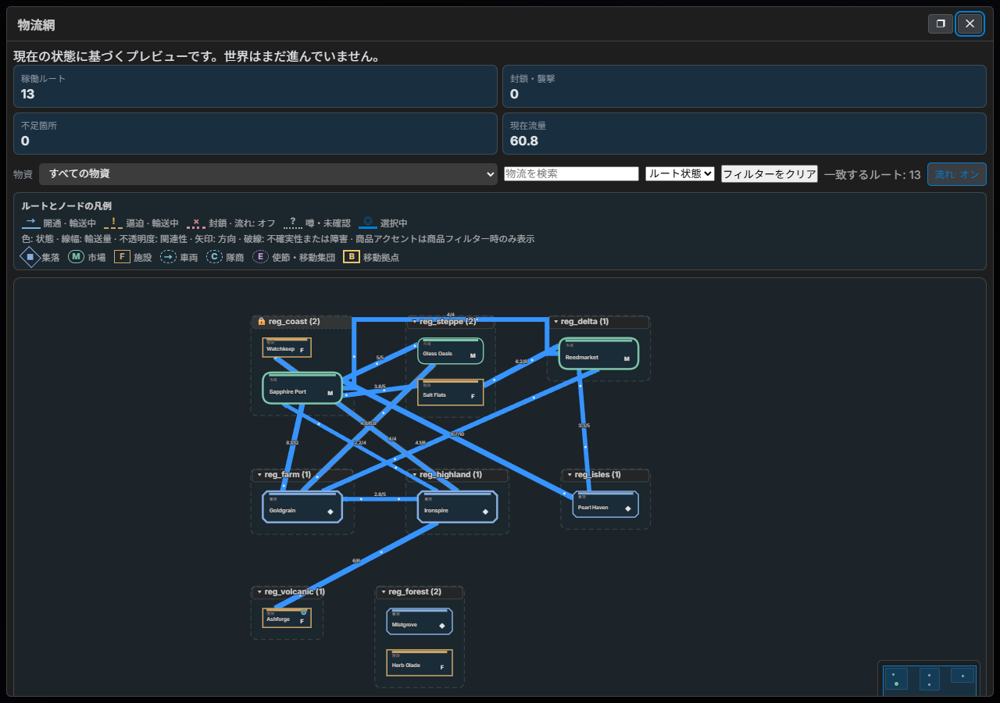

# LoreRelay - Local-first AI Game Master UI 🎲

[English](README_en.md) | [日本語](README.md) | [简体中文](README_zh-CN.md) | [繁體中文](README_zh-TW.md)

[](https://opensource.org/licenses/MIT)
[](https://github.com/GGF1sh/LoreRelay/actions/workflows/ci.yml)
[](https://github.com/GGF1sh/LoreRelay/releases)
[](https://github.com/GGF1sh/LoreRelay)

**Local-first AI Game Master UI**

**Antigravity（無料）× LoreRelay × ComfyUI——APIキー不要・追加コストゼロで、フロンティアモデルがGMを務めるフルオートRPG環境。**

既存のAIサブスクリプションを最大限活用し、SillyTavernのようなバックエンドの自由度と、Saga & Seekerのような本格的なCRPG体験を統合したVSCode拡張機能です。
手動のコピペ（またはローカルエージェントによる自動化）でJSONを受け渡し、あなた自身の環境を自由にハックして遊べる「Hacker Edition」のUIレイヤーを提供します。

> 💡 **Notice:** もしこの拡張機能が気に入ったら、ぜひ[コーヒーを一杯奢ってください ☕](https://ko-fi.com/promptpalette)

---

## 🌟 Features

- 💸 **No Extra API Costs (by default):** ローカルLLM・Grok CLI・手動コピペ運用なら従量課金APIキーは不要。OpenRouter を使う場合のみ API キーが必要です。
- 🧩 **Agent Bridge:** Grok Build などのローカル実行可能AIなら、Webviewの選択肢・自由入力をそのままGMに送信できます。
- 🎨 **Glassmorphism UI:** 半透明のチャットUI、世界観テーマ切り替え、画像ギャラリーを備えたリッチな表示装飾。
- ⚔️ **CRPG Character Sheet:** Saga & Seeker 等にインスパイアされた、HP/MPプログレスバー、スキル、インベントリを視覚的に管理できるステータスパネル。
- 🖼️ **Local Image Generation & World Integration (v1.3+):** ComfyUIと連携し、AIが描写した情景をその場で生成。さらに World System と連動し、ロケーション移動時の自動背景生成にも対応。
- 🎵 **Adaptive BGM & SFX:** `bgm.json` / `sfx.json` に登録した音源を、GMが自動制御し、クロスフェード再生します。
- 📦 **Scenario Packs:** `scenario.json` を含むフォルダを読み込むだけで、開始シーン・テーマ・専用BGM/SEをまとめて適用できます。
- 🎲 **Built-in Dice Roller & Calculator:** TRPGライクな判定に必要なダイスロール（NdX）と数式電卓を内蔵。
- 💾 **Persistent Adventure Log:** `game_history.json` に冒険ログを保存し、VSCode再起動後も履歴を復元できます。
- 🔍 **Turn Inspector:** ダイス台帳・statePatch・発火ロアをターンごとに可視化。
- 📖 **Lorebook & Memory UI:** ST互換ロアブックの閲覧/編集、Memory 検索プレビュー、ピン留め常時注入。
- 🎬 **Scenario & Party Director:** `scenario.json` / `party_director.json` と `game_state` ランタイム連動。
- 📱 **Remote Play (v0.7+):** LAN 参加用 URL（コピー共有）、player / spectator ロール。WebSocket 認証・入力クランプ・**署名付き `/media` URL**（short-TTL HMAC、v1.6.2+）。
- 🌍 **Living World System (v1.3+):** `world_forge.json` に基づく動的な地域・派閥・NPC自動生成（World Forge）、Emergent Simulation、World タブの Mermaid 図（biome 色・pan/zoom、v1.6.3+）。
- 🗺️ **Cartography / Parchment Map (v1.7+、任意・上級者向け):** Region の `x/y/biome` からレイアウト PNG → ComfyUI ControlNet で羊皮紙古地図 → Webview に 📍 ピンオーバーレイ。ComfyUI + SDXL Canny が必要。レイアウトのみなら Python だけで可。
- ⚙️ **Emergent Simulation:** 毎ターンの経過に伴う資源消費・パワーバランス・NPCの好感度や恐怖が自動計算・進行する自律シミュレーターを内蔵。
- 🛡️ **Robust State Management:** 巨大なデータによるUIクラッシュを防ぐ上限クランプ処理、不正IDのパージ、安全な状態マイグレーションなど、堅牢なセーフティ機構を搭載。
- 👁️ **Visual Memory / Soulgaze (v1.5+):** VLM が生成画像を分析し `visual_memory.json` に蓄積。次ターン以降の GM プロンプトへ情景コンテキストを自動注入。
- 🔒 **Audit Wave Hardening (v1.6):** State / GM Bridge / World / ST Import / Webview / Remote Play / Extension Hub を7トラックで監査。pure 検証モジュールと回帰テストを大幅追加。
- 📜 **Chronicle & Campaign Tools (v1.10+):** Quest Board、Git Timeline、Agentic GM（Referee/Narrator 2段階）、Adaptive TTS / NPC 個別音声。
- 🧭 **Fable5 Layer (v1.19+):** Chronicle あらすじ注入、Pacing Director、派閥レピュテーション、旅路エンカウント、Replay Export。
- 🛒 **Living World Economy (v1.23+、experimental):** 貿易・相場・輸送、Commerce UI（Buy/Sell）、NPC Agency、信頼連動の所在、NPC↔NPC / プレイヤー↔NPC の絆（LW3）、盟友の交易還元（v1.33+）。
- 🏰 **Domain Mode (v1.39+、experimental):** 領地運営（太閤立志伝風月次方針）— `enableDomainMode` 既定 OFF · F7–F10 engine + World タブ UI（v1.40.0）· compact GM プロンプト。
- ⚔️ **Guild Master (v1.41–1.44、experimental):** 冒険者ギルド / 依頼掲示板 — `enableGuildMode` 既定 OFF · G1 週次コミット · G2 依頼裁定 · G3 パーティ派遣 · G4 留守ドリフト + Since-last-visit。
- 🏘️ **Settlement Mode (v1.69–1.73):** 集落シミュレーション — 等角 Webview レイアウト、レイヤー展開、Three.js ビジュアル（任意）。
- 🚗 **Vehicle & Mobile Base (v1.74–1.75):** `vehicle_state.json` フリート管理、ガレージ UI、移動拠点（MB1–MB5）と World Intent 連携。
- 🧭 **State Orchestrator (SO1–SO2):** 台帳記述子インベントリと GM ターン transaction planning gate（読み取り専用レポート）。
- 🔎 **Context Engine P0 (v1.58+):** Prompt Inspector にチャンク lifecycle トレース（included / truncated / evicted 等）。
- ✨ **Genesis Guide:** Start Hub の「世界を作りはじめる」から、世界観・遊び方・危険度・管理量・主人公作成方法・画像生成有無を選択肢だけで決める段階式ウィザード。有効になる主要システムと画像生成プロンプトをその場プレビューし、「この設定で始める」で `game_rules.json` に安全パッチとして実際に反映されます。主人公作成方法に応じて、適用後そのままキャラクター作成 / SillyTavern カード読込みへ進めます。ComfyUI が使えない場合もプロンプトコピーで自然にフォールバック。設計: [`docs/RULES_PROFILE_ONBOARDING_DESIGN.md`](docs/RULES_PROFILE_ONBOARDING_DESIGN.md)
- 🧰 **Campaign Kit(v1.45+):** ジャンル非依存の「拠点→依頼/噂→探索地→発見物→鑑定/サービス→世界反応」ループ。7ジャンルプリセット（王道ファンタジーギルド・終末スカベンジャー・宇宙辺境・東洋幻想・サイバーパンク配達人・現代オカルト・サバイバルホラー）、発見物台帳・鑑定状態機・キャンペーン資源を搭載。
- 📊 **World Observatory(v1.53+、experimental):** 「変わりゆく世界を見守る」観測ダッシュボード。市場価格履歴スパークライン・年代記タイムライン、watch（無コスト）/ advance（資源消費）2モード。
- 🕸️ **Logistics Graph Canvas(v1.84+):** 交易ネットワークを地図でなくグラフとして可視化。ノードドラッグ・地域折りたたみ・セマンティックズーム・ミニマップ・商品/ルート状態フィルタ、稼働ルート/流量をリアルタイム表示する拡大ビュー対応。
- 📐 **Responsive Webview Shell(v1.84.16+):** 960px以上=2カラム、720〜959px=オーバーレイドロワー、720px未満=ナロードロワーの3段階レイアウトで、VSCode分割エディタの狭幅表示でもチャットが圧殺されない。

### 🎭 Parlor モード（SillyTavern 風 1対1 RP）

**シンプルな 1対1 チャット（Parlor）** と **本格 CRPG（Campaign）** をヘッダーの 🎭/⚔️ で切り替えられます。ST キャラカード・ロアブックをそのまま使えます（[完全互換クライアントではありません](docs/PARLOR_MODE_DESIGN.md)）。

| バックエンド | 用途 |
|:---|:---|
| **vscode-lm**（推奨） | Copilot / Claude Code 等の月額 — API キー不要 |
| **clipboard** | Antigravity Gemini 等 — 手動ペースト |

**3ステップ:** キャラインポート → Start Hub「キャラと話す」→ 必要なら Campaign に昇格（Phase C 予定）。設計: [`docs/PARLOR_MODE_DESIGN.md`](docs/PARLOR_MODE_DESIGN.md)

**初めての方:** [`docs/LIVING_WORLD_QUICKSTART.md`](docs/LIVING_WORLD_QUICKSTART.md)（5分）· [`docs/USER_GUIDE.md`](docs/USER_GUIDE.md)（3分スタート・タブの見方）  
詳細なアーキテクチャ解説: [`docs/WORLD_AND_VISUAL_MEMORY.md`](docs/WORLD_AND_VISUAL_MEMORY.md)

### 必要なものと任意機能

| 区分 | 内容 |
|------|------|
| **必須（コアプレイ）** | VSCode 1.85+、Python、`TextAdventureGMSkill`（`SKILL.md`） |
| **推奨** | GM Bridge（Grok / Ollama / clipboard 等）または手動コピペ運用 |
| **任意 — 画像** | ComfyUI（API モード）— シーン背景・羊皮紙地図の生成 |
| **任意 — 視覚記憶** | VLM（Ollama `llava` や OpenRouter 多模態）— Soulgaze |
| **任意 — マルチプレイ** | Remote Play（同一 LAN） |
| **任意 — 地図** | Cartography — レイアウト PNG のみなら Python だけで可。イラスト地図は ComfyUI + SDXL Canny |

### データフロー（Persist-Before-Narrate）

GM は毎ターン **`turn_result.json`** を書き込むのが正規契約です（`statePatch` + `narration` + `gmEntry` + `turnId`）。拡張機能がパッチを検証・適用し **`game_state.json`** にマージし、`state_journal.ndjson` に監査ログを追記します。

`game_state.json` の直書きは **緊急フォールバック**（手動コピペやレガシー GM）。この場合も `turnResultFallback` が `turn_result.json` を合成し、Inspector・ジャーナル・MediaAgent を同じ経路に揃えます。

**Cartography パイプライン（任意）:** `world_forge.json`（Region の `x` / `y` / `biome`）→ レイアウト PNG（`world_map.layout.png`）→ （任意）ComfyUI ControlNet → `world_map.png` → World タブの 📍 ピン overlay

---

## 📸 Screenshots & Demo

<p align="center">
  
</p>

<p align="center">
  
</p>

<p align="center">
  <br />
  <sub>Turn Inspector — ダイス台帳・statePatch・Debug Trace をターンごとに可視化</sub>
</p>

| Remote Play | ComfyUI |
|:---:|:---:|
|  |  |
| スマホ・タブレットから LAN 参加、player/spectator URL とクライアント一覧 | GM の描写をその場で画像化し、チャットにインライン表示 |

| Party Director | Lorebook |
|:---:|:---:|
|  |  |
| NPC の発言量・沈黙・強制発言・関係値を調整 | ST 互換ロアブックの閲覧・編集・ピン留め |

### 🗺️ World Map — 生きているキャンペーン世界

<p align="center">
  
  
</p>
<p align="center"><sub>都市・遺跡・ダンジョン・港・山脈・危険地帯・未探索領域・勢力圏・交易路を1枚の地図に。ピンをクリックすると種別・危険度・所属勢力の詳細と行動ボタンが開きます。背景はComfyUI（Illustrious + ControlNet）で生成、ピン・ラベル・交易路・霧（Fog of War）はWebviewが実データから描画します。</sub></p>

### 🕸️ Logistics — 交易ネットワークをグラフで読む

<p align="center">
  
</p>
<p align="center"><sub>拠点・市場・施設・車両拠点をノード、交易路を稼働/逼迫/封鎖で色分けしたエッジとして可視化。ノードドラッグでの地域再配置、商品/ルート状態フィルタ、セマンティックズーム、ミニマップ操作に対応。地図とは別に「今どこで何がどれだけ流れているか」を一目で把握できます。</sub></p>

すべて実機の Webview（`webview/index.html` + `script.js` + `style.css`）から撮影した実スクリーンショットです。差し替え手順は [`DEMO.md`](DEMO.md) を参照してください。

---

## 🚀 How to Play

### はじめての方（Start Hub・約15分）

1. 空のプレイ用フォルダを開き `LoreRelay: Open Game UI`
2. **Start Hub** の **🎮 お試しデモを始める**（同梱 `harbor-mist`、設定不要）
3. 選択肢を1つ送って GM 応答を確認

自分で世界観から決めたい場合は、Start Hub 上部の **🌟 世界を作りはじめる**（Genesis Guide）から、選択肢だけで世界観・遊び方・危険度・管理量・主人公作成方法を選べます。「この設定で始める」を押すと `game_rules.json` に反映され、選んだ主人公作成方法にそのまま進めます（設計: [`docs/RULES_PROFILE_ONBOARDING_DESIGN.md`](docs/RULES_PROFILE_ONBOARDING_DESIGN.md)）。

詳しい30分ガイド: [`docs/FIRST_SESSION.md`](docs/FIRST_SESSION.md)

### まず遊ぶなら（地図デモ・3分）

1. `LoreRelay: Load Scenario Pack` → `sample-scenarios/lost-catacombs`（または Start Hub の **🗺️ 地図デモ**）
2. `LoreRelay: Open Game UI` → Game Rules で **World Forge** を有効化
3. **World** タブ → **Parchment** で同梱 `world_map.layout.png` とピンを確認（ComfyUI 不要）
4. 選択肢を1ターン送って GM 応答を見る

羊皮紙の**イラスト地図**まで試す場合のみ: ComfyUI 起動後 `LoreRelay: Generate World Map Image`。詳細は [`docs/CARTOGRAPHY_COMFYUI.md`](docs/CARTOGRAPHY_COMFYUI.md)（**Optional / 上級**）。

### 音声（TTS）

まず Game UI の **🔊 → 有効化** だけで十分です。edge-tts / OpenAI は任意。段階ガイド: [`docs/TTS_QUICKSTART.md`](docs/TTS_QUICKSTART.md)

この拡張機能は、AI が書き出す `turn_result.json`（正規）または `game_state.json`（フォールバック）を監視して UI をレンダリングする疎結合な仕組みを採用しています。あなたの環境に合わせて2通りの遊び方があります。

### Mode A: 自動連携モード (Recommended)
**対象:** Antigravity, Grok CLI, VSCode Copilot (Cursor) などの**ローカルファイル書き込みが可能なエージェントAI**を使っている場合。

1. AIに同梱の `SKILL.md` を読み込ませ、「このスキルに従ってゲームマスターを開始して」と指示します。
2. 以降、あなたはAIとチャットするだけです。AIが自動でダイスを振り、ComfyUIで画像を生成し、`game_state.json` を更新します。
3. VSCode上でこの拡張機能を開いておけば、UIがリアルタイムに更新されます！

> **Antigravity をお使いの方:** Webviewの選択肢クリック → クリップボードへコピー → Antigravityチャットに貼り付け → 自動更新、という手軽な運用が可能です。詳細は [`ANTIGRAVITY_GUIDE.md`](ANTIGRAVITY_GUIDE.md) を参照してください。

> **Codex / OpenAI ChatGPT 拡張をお使いの方:** VSCode Marketplace の **Codex - OpenAI's coding agent** は VSCode 内で動作し、ファイルを読んだり `turn_result.json` を書いたりできます。ただし、`LoreRelay: List Available VS Code LM Models` にモデルが表示されない場合、LoreRelay の `vscode-lm` プロバイダから直接呼び出すことはできません。その場合は、Codex/ChatGPT を「LoreRelay の横で動くGMエージェント」として使い、`C:\AITest` などのプレイ用ワークスペースに `turn_result.json` を書き込ませてください。

Codex/ChatGPT 拡張に渡す最初の指示例:

```text
C:\AITest をLoreRelayのプレイ用ワークスペースとして使います。
AI_HANDOVER.md と SKILL.md を読んで、LoreRelayのGMとして進行してください。
私の行動ごとに turn_result.json を Persist-Before-Narrate 方式で書き込んでください。
```

### Mode B: 手動コピペモード
**対象:** 通常のブラウザ版 ChatGPT, Claude, Gemini を使っている場合。

1. ブラウザのAIに `SKILL.md` のテキストをコピペし、「この指示に従ってGMをして」と伝えます。
2. AIが返してくるJSONコードブロックをコピーし、VSCode上の `game_state.json` に手動で上書き保存します。
3. 保存した瞬間にVSCodeのUIが切り替わります。（画像生成やダイスロールは手動で行うか、ブラウザAIの機能で代用してください）

---

## 🛠️ Setup & Installation

### 1. Prerequisites
- **VSCode** (v1.85+) — 必須
- **Python** — 必須（ダイス・レイアウト地図・GM ブリッジ用スクリプト）
- **TextAdventureGMSkill** — 必須（`SKILL.md` と `scripts/`。拡張リポジトリの隣に配置）
- **ComfyUI** — *任意*（シーン画像・羊皮紙地図を生成する場合のみ。API モードで起動）
- **VLM** — *任意*（Visual Memory / Soulgaze。Ollama または OpenRouter）

### 2. Quick setup (recommended)

`TextAdventureGMSkill` を `text-adventure-vsce` の隣（例: `C:\AI\` 配下）に置いた状態で:

**Windows (PowerShell):**
```powershell
cd text-adventure-vsce
.\scripts\setup.ps1
```

**macOS / Linux:**
```bash
cd text-adventure-vsce
chmod +x scripts/setup.sh
./scripts/setup.sh
```

スクリプトが行うこと:
- GM スキルパス自動検出 → `my-adventure/.vscode/settings.json` 生成
- `npm install` / `compile` / `test`
- （任意）VSIX パッケージ → `code --install-extension`
- `text-adventure.code-workspace` 生成（Game + Skill + Extension の 3 ルート）

オプション例: `-Locale en` `-GmProvider clipboard` `-SkipVsix`

### 3. Manual extension installation
1. このリポジトリをクローンまたはダウンロードします。
2. VSCodeでフォルダを開き、ターミナルで `npm install` を実行します。
3. `F5` キーを押して、拡張機能をデバッグ起動するか、`npx @vscode/vsce package` で VSIX をインストールします。
4. コマンドパレット (`Ctrl+Shift+P`) から `LoreRelay: Open Game UI` を実行するとパネルが開きます。

### 4. Configuration
VSCodeの設定画面（Settings）から `textAdventure.skillPath` を検索し、同梱の `comfyui_generate.py` スクリプトの絶対パスを指定してください。

主な設定:

- `textAdventure.skillPath` — `comfyui_generate.py` の絶対パス
- `textAdventure.locale` — UI / エラー / GM プロンプトの言語（`ja` / `en` / `zh-CN` / `zh-TW`）。Webview ヘッダーの 🌐 からも変更可
- `textAdventure.gmBridge.provider` — `grok` / `vscode-lm` / `ollama` / `koboldcpp` / `clipboard` / `command` / `openrouter`（詳細は `GM_BRIDGE_PRESETS.md`）
- `textAdventure.grokBridge.*` — Grok Build 自動送信の有効化、CLIパス、フォールバック設定
- `textAdventure.promptBudget.*` — GM プロンプトに注入する Lorebook / Memory / Saga / Party / Vision 文脈の量を `auto` / `compact` / `balanced` / `expanded` で調整
- `textAdventure.imageGen.*` — ComfyUI / Stability Matrix の URL、checkpoint、workflow、生成サイズ
- `textAdventure.imageGen.controlNet` — Cartography 用 SDXL Canny モデル名（任意）
- `textAdventure.modelScan.roots` — Stability Matrix / ComfyUI / モデル置き場をスキャンして `.safetensors` / `.gguf` 等を一覧化するフォルダ
- `textAdventure.vlm.*` — Soulgaze 用 VLM（`provider` / `model` / `endpoint`）
- `textAdventure.mediaAgent.*` — バックグラウンド画像キュー、GM ストリームからの早期 BGM/SFX
- `textAdventure.remotePlay.*` — ポート、`bindAddress`、`mediaUrlTtlSec`（署名メディア URL の TTL）ほか
- `textAdventure.bgm.*` — BGMマニフェストと音量
- `textAdventure.sfx.*` — SEマニフェストと音量

### 5. コマンドパレット（主要）

| コマンド | 用途 |
|---------|------|
| `LoreRelay: Open Game UI` | メイン Webview を開く |
| `LoreRelay: Load Scenario Pack` | `scenario.json` を含むフォルダを読み込み |
| `LoreRelay: Generate World Forge` | `world_forge.json` を procedural 生成 |
| `LoreRelay: Generate World Map Image` | 羊皮紙地図を ComfyUI で生成（任意） |
| `LoreRelay: Start Remote Play (LAN)` | LAN 参加用 URL を発行 |
| `LoreRelay: List Image Models` | ComfyUI の checkpoint 一覧 |
| `LoreRelay: Scan Local Model Files` | `modelScan.roots` 配下の `.safetensors` / `.gguf` / `.ckpt` 等を一覧 |
| `LoreRelay: Import SillyTavern Character Card` | ST キャラカード取り込み |
| `LoreRelay: Import SillyTavern Lorebook` | ST ロアブック取り込み |
| `LoreRelay: Export Scenario Pack (Workshop ZIP)` | 配布用 ZIP を書き出し |
| `LoreRelay: Validate Scenario Pack` | パック構造の検証 |

### 6. ワークスペースの主要ファイル

| ファイル | 役割 |
|---------|------|
| `game_state.json` | UI が描画する統合ゲーム状態 |
| `turn_result.json` | 毎ターンの GM 出力（正規の永続化先） |
| `state_journal.ndjson` | statePatch の監査ジャーナル |
| `world_forge.json` | 静的ワールド設計（地域・派閥・NPC 種） |
| `world_state.json` | 動的シミュレーション（訪問済み・派閥資源など） |
| `visual_memory.json` | VLM が蓄積した情景記憶 |
| `game_history.json` | 冒険ログ（再起動後も復元） |
| `world_map.layout.png` / `world_map.png` | Cartography レイアウト / 羊皮紙画像 |
| `npc_registry.json` | NPC 認識・関係性 |

### 7. Scenario Packs
コマンドパレットから `LoreRelay: Load Scenario Pack` を実行し、`scenario.json` を含むフォルダを選択すると、開始状態・テーマ・専用BGM/SEを読み込めます。

**同梱サンプル（3本）** — 拡張リポジトリの `sample-scenarios/`:

| フォルダ | ジャンル | テーマ | 備考 |
|---------|---------|--------|------|
| `lost-catacombs` | 王道ダンジョン探索 | fantasy | **Cartography デモ**（`world_forge.json` + `world_map.layout.png`） |
| `neon-rain` | サイバーパンク・ノワール | cyberpunk | |
| `harbor-mist` | 港町ミステリー | modern | |

GM スキル側にも同じパックがあります: `TextAdventureGMSkill/scenarios/`。

### 8. SillyTavern 互換 & Workshop

- ST キャラ / ロアブックのインポートは上記コマンドまたは Webview から。詳細は [`SILLYTAVERN_COMPAT.md`](SILLYTAVERN_COMPAT.md)
- シナリオパックの書き出し・検証で Workshop 配布用 ZIP を作成可能（マーケット公開は検討中）

### 9. Model & ComfyUI presets
- 推奨 GM / 画像設定: [`MODEL_PRESETS.md`](MODEL_PRESETS.md)（`presets/` の JSON をコピー）
- ComfyUI ワークフロー: [`COMFYUI_WORKFLOWS.md`](COMFYUI_WORKFLOWS.md)（シーン用 + Cartography 用）
- Cartography（任意）: [`docs/CARTOGRAPHY_COMFYUI.md`](docs/CARTOGRAPHY_COMFYUI.md) · [`docs/CARTOGRAPHY_RECOMMENDED_LORAS.md`](docs/CARTOGRAPHY_RECOMMENDED_LORAS.md)（ComfyUI 推奨 LoRA） · [`docs/CARTOGRAPHY_WORKFLOW_CONTRACT.md`](docs/CARTOGRAPHY_WORKFLOW_CONTRACT.md) · [`docs/CARTOGRAPHY_DESIGN.md`](docs/CARTOGRAPHY_DESIGN.md)
- デモ手順: [`sample-scenarios/lost-catacombs/CARTOGRAPHY_DEMO.md`](sample-scenarios/lost-catacombs/CARTOGRAPHY_DEMO.md)

### 10. ドキュメント索引

| ドキュメント | 内容 |
|-------------|------|
| [`AI_HANDOVER.md`](AI_HANDOVER.md) | 他 AI への引き継ぎ・全体像 |
| [`CHANGELOG.md`](CHANGELOG.md) | バージョン履歴 |
| [`GM_BRIDGE_PRESETS.md`](GM_BRIDGE_PRESETS.md) | Ollama / KoboldCPP プリセット |
| [`ANTIGRAVITY_GUIDE.md`](ANTIGRAVITY_GUIDE.md) | Antigravity 連携の手順 |
| [`SILLYTAVERN_COMPAT.md`](SILLYTAVERN_COMPAT.md) | SillyTavern 互換仕様 |
| [`docs/WORLD_AND_VISUAL_MEMORY.md`](docs/WORLD_AND_VISUAL_MEMORY.md) | World / Visual Memory アーキテクチャ |
| [`DEMO.md`](DEMO.md) | スクリーンショット・デモ GIF の差し替え手順 |

---

## 🗺️ Roadmap

> **版の正本:** `package.json`（バッジ参照）· [`CHANGELOG.md`](CHANGELOG.md) · [`docs/VERSION_TRUTH.md`](docs/VERSION_TRUTH.md) · タスク黒板は [`AI_ROADMAP.md`](AI_ROADMAP.md)。マルチAIリレー運用で版はほぼ毎日進むため、この表は世代の要約であり最新パッチ単位の一覧ではありません。

**実装済み（要約）**

| 世代 | 主な内容 |
|------|----------|
| **v1.3–1.7** | World Forge / Emergent Sim / Visual Memory / Audit Wave / Cartography（羊皮紙地図・FoW 基盤） |
| **v1.10–1.11** | Quest Board（Event-to-Quest）· Agentic GM · Git Timeline · Adaptive TTS |
| **v1.13–1.18** | Tile Overmap · Cartography C8/C9（地図アイテム）· Debug sandbox · 世界時間経過 |
| **v1.19–1.21** | Chronicle · Pacing Director · 派閥レピュテーション · 旅路エンカウント · Replay Export |
| **v1.23–1.33** | Living World 経済（Commerce / Agency）· Commerce UI · trust 所在 · **LW3 絆**（NPC↔NPC / プレイヤー↔NPC / 交易波及） |
| **v1.34** | Parlor Mode（1対1 RP）· ST カード互換 |
| **v1.39–1.40** | Domain Mode（D1–D5）· D3 World タブ UI · F7 謁見 / F8 隣国 / F9 派遣 / F10 合戦 |
| **v1.41–1.44** | Guild Master G1–G4（週次コミット · 依頼板 · パーティ派遣 · 留守ドリフト） |
| **v1.45–1.52** | Campaign Kit Phase A–G（7ジャンルプリセット · 発見物台帳 · 鑑定状態機 · キャンペーン資源） |
| **v1.53** | World Observatory（市場価格履歴 · 年代記タイムライン） |
| **v1.58+** | Context Engine P0（Prompt Inspector のチャンク lifecycle トレース） |
| **v1.69–1.75** | Settlement Mode（等角/ジオラマ表示）· Vehicle & Mobile Base（フリート管理・移動拠点） |
| **v1.77–1.78** | Debug Trace / Inspector Phase B · MEDIA-M1 互換ゲート · ComfyUI ジョブ寿命管理 |
| **v1.79–1.83** | NOAI Play（決定論的な旅・経済処理）· 資源別5ティア経済難易度（abundant→barren） |
| **v1.84** | Logistics Graph Canvas（交易ネットワークのインタラクティブ可視化）· Responsive 3段階 Webview シェル |

体験の入口: [`docs/FEATURE_MATRIX.md`](docs/FEATURE_MATRIX.md)（stable / experimental）· `sample-scenarios/trade-routes`

**今後の候補**

- Overmap の画像タイルセット、 hazard 1 行 GM 注入
- Prompt budget の優先度スライディング（長セッション向け）
- Workshop / マーケットプレイス公開の検討

---

## 🤝 Contributing & Support
このプロジェクトは、AI時代の「新しいテキストアドベンチャーの遊び場」を目指す実験的OSSです。
バグ報告やプルリクエストは大歓迎です！

もしこのプロジェクトにワクワクしてくれたなら……
👉 **[Buy me a coffee ☕](https://ko-fi.com/promptpalette)**

---
**Enjoy your adventure!**
