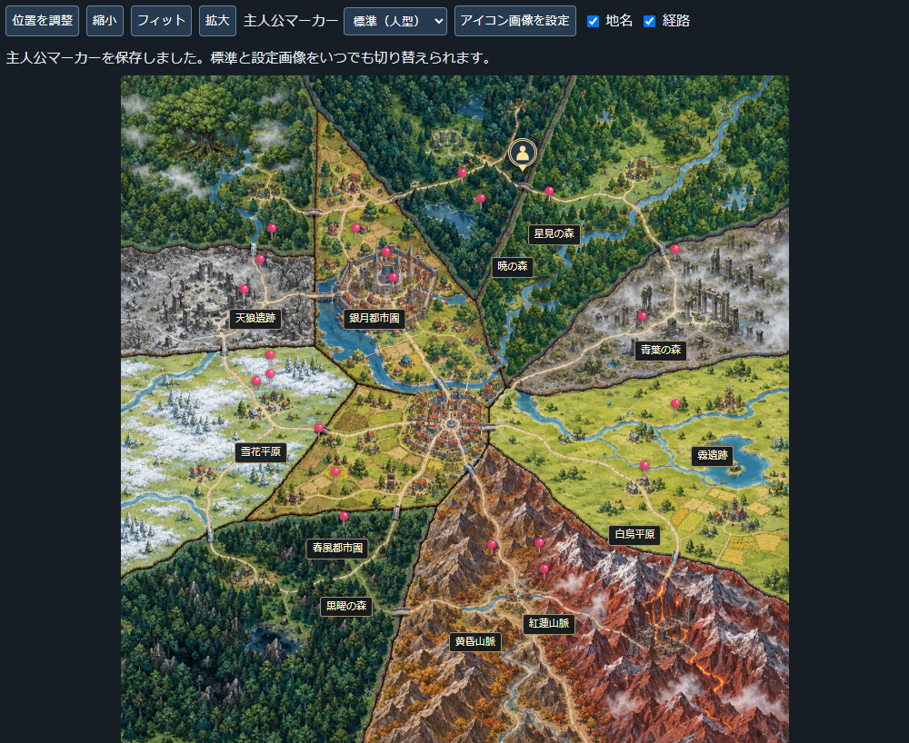
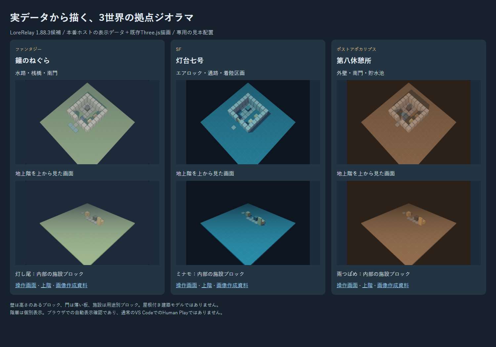
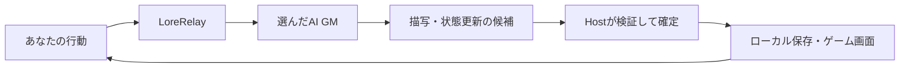

<h1 align="center">LoreRelay</h1>
<p align="center"><strong>旅に出る。誰かと出会う。自分の言葉で、その先へ。</strong><br /><sub>Bring your AI. Keep your world.</sub></p>

<p align="center"><a href="README.md">日本語</a> · <a href="README_en.md">English</a> · <a href="README_zh-CN.md">简体中文</a> · <a href="README_zh-TW.md">繁體中文</a></p>

霧の港町で謎を追う。地図を頼りに地下迷宮を探る。荒廃した世界で資源を集め、拠点へ持ち帰る。冒険を休んで、気に入ったキャラクターとの会話を楽しむ夜があってもいい。

**LoreRelayは、あなたの言葉で行動を決め、AIのゲームマスターと物語を進めるロールプレイRPGです。** 一人の人物との会話から、仲間との旅、交易や拠点運営を含むキャンペーンまで。遊びたい世界と、関わりたい人物から始められます。

VS Codeで動く、開発中のオープンソース作品です。対応するAIをGMに選び、キャラクター・世界設定・冒険の記録を自分のPCに保存して遊びます。

[どんな遊びができる？](#onboarding) · [最初の冒険を始める](#how-to-play) · [もっと画面を見る](#screenshots) · [使えるAI・料金](#ai-connections) · [インストール](#setup)

<p align="center"><a href="docs/assets/gameplay-v1.89.3/south-map.png"></a></p>

<p align="center"><sub>1.89.3候補のAIによる実機プレイ。同梱の交易世界と主人公ハルカで、小麦の購入・南港への移動・売却・帰還を確認。左側の導入文は同梱データで、新しいGM応答ではありません。</sub></p>

**500 → 489 → 505 credits。** 売買した荷物と残高を画面で確かめ、日送り・依頼受注・保存再開へ進みました。この1.89.3の確認ではGrok Buildの再ログインが必要で、新規GM会話は未実施でした。[実際の操作・生成prompt・確認範囲](docs/GAMEPLAY_PLAYCHECK.md)

**1.89.4候補では同じ冒険をCodex GMで継続。** 実応答24件・採用23ターンで、売買、依頼完了、再起動後の会話と約束の再供給を確認しました。AI操作の記録で、別枠の依頼報酬は未確認、人物名の一貫性には課題が残ります。[実送信prompt・失敗例・確認限界](docs/REAL_GM_PLAYCHECK.md)

**1.89.5候補ではCodex GMによるAI操作を継続し、** 長期再会で誤名が出た後、修正・Host再起動後の同じ質問に、答えを入力せず29ターン前の履歴を再供給してトーマスの名前と約束を正しく答えることを確認しました。別の既存fixtureでは信頼50→60・記憶1件と、再起動／同一候補の再送後の重複なしを確認しました。報酬は金銭ではなく信頼で、物品の自動達成判定や人物の自動登録は行いません。[実送信履歴・失敗から修正後の確認・制限](docs/NPC_IDENTITY_PLAYCHECK.md)

**1.89.6候補では公開地点と実際の移動UIの候補をGMへ供給し、** AI実機確認で訓練場・詰所などの未確認地点を既存の移動先として扱わないことを確かめました。過去の購入は既存UI取引記録（小麦10個・90 credits支出）に基づいて回答し、残高608・空の積荷は変化させませんでしたが、この記録はGMの全取引を網羅せず、記録がないことだけで未実行とは判断しません。GM段落の文字列 `\n\n` は表示だけ補正し、原文は保持します。[地点・購入履歴の根拠と確認範囲](docs/GM_GROUNDING_PLAYCHECK.md)

**1.89.7候補の訂正・復元：** Undo／巻き戻しは会話を戻し、現在の資産・現在地・クエストなどは維持します。ゲーム全体を戻す場合は、行動前に保存した完全チェックポイントを復元してください。Campaignや世界・資産などのゲーム状態を持つセーブでは、同じ行動の二重実行を防ぐため「再生成」を停止しています。描写はメッセージの編集で直せます。

作者メモは次の応答だけの指示です。継続したい設定・GM方針はLorebookにピン留めして保存してください。キーワードなしでも保存でき、無効化・削除まで継続用の指示として扱います。編集履歴を優先してGMへ渡しても、返答への反映は保証しません。AIによる実Host操作では、訂正した「真鍮の風鈴」を送信しても「縄」と誤答する例が残りました。人間の試遊とは区別して記録しています。[操作手順・再起動／Undoの証拠と限界](docs/RECOVERY_PLAYCHECK_2026-09-20.md)

**1.89.8候補では、全履歴を復元したときに削除済みの要約・背景・立ち絵が画面に残る問題を修正。** 空になった要約を編集しても古い内容を再送しません。通常の部分更新は表示を維持します。会話Undoとゲーム全体の復元の区別は変わりません。

| 商いを終えて、次の日へ | 旅先の風景を残す |
| :---: | :---: |
| <a href="docs/assets/gameplay-v1.89.3/trade-return.png"></a> | <a href="docs/assets/gameplay-v1.89.3/south-port.png"></a> |

<p align="center"><sub>左はAI操作の実画面。右はComfyUI生成の場所画像で、地形や建物の正確な再現を示すものではありません。南港の候補として保存し、移動・Host再起動後の再表示を確認しました。人間のHuman Playとは区別します。</sub></p>

**[▶ 以前の1.85.3の実演を75秒で見る](docs/PUBLIC_LAUNCH_MEDIA.md)** — GMと話す → 市場で買う → 画面を開き直す。動作確認用のサンプル世界で収録し、待ち時間を短縮した映像です。

### 川から海へ、船に合う航路を選ぶ

新しく作る地上の世界には水系を生成します。拡大すると支流まで見え、小舟なら通れる川、大きくても浅喫水なら通れる大河、船高が制限される橋を表現します。「航路・渡河」では安全な迂回と危険な近道を比較し、損傷する場合は出発前に船体HPの変化を確認できます。[使い方・家族向けデモと確認範囲](docs/WATER_NAVIGATION.md)

### 自分で作った地図を、冒険の舞台に

ChatGPTなどで作った地図を取り込み、地名・地点・現在地を重ねて使えます。ピンと地名はドラッグで位置合わせ。主人公は標準の人型マーカーで表示し、好きなアイコン画像を後から設定して、いつでも切り替えられます。[イラスト地図の使い方](docs/ILLUSTRATED_MAPS.md)

<p align="center"><a href="docs/assets/illustrated-map-v1/map-with-player-marker.png"></a></p>

<p align="center"><sub>提供されたChatGPT生成地図を、現行の地図表示コンポーネントで描画した確認画像です。現在地と位置合わせは表示テスト用で、ゲーム進行を収録した画面ではありません。</sub></p>

<a id="onboarding"></a>

## 次の一手は、あなたの言葉で

「港で話を聞く」「遺跡を調べる」「今日は街に戻る」。用意された選択肢を選ぶだけでなく、自分がしたい行動を文章で伝えられます。

**場面を読む → 行動する → GMの描写と結果を確かめる → 次の一手を考える。**

会話を楽しみたいときは、人物とのやり取りに集中する。冒険を進めたいときは、地図やクエストを開く。交易を使う世界なら、所持金や積載量を見ながら買うものを決める。文章を読む時間と、ゲームの中で考える時間を、自分のペースで行き来できます。

### 謎を追う旅も、廃墟から持ち帰る旅も

最初から世界設定を全部書く必要はありません。同梱シナリオには、こんな入口があります。

| 今夜、遊びたいのは | シナリオ |
| --- | --- |
| **霧の港町のミステリー。** 人物との会話や調査から、謎を追う物語へ。 | `harbor-mist` |
| **地下迷宮の探索。** 地図を見ながら、まだ知らない場所へ踏み込む。 | `lost-catacombs` |
| **終末世界の回収屋暮らし。** 廃墟を探索し、見つけた資源を持ち帰って、拠点と交易のある生活へ。 | `scrapbound-settlement` |
| **サイバーパンクの物語。** ネオンの世界を舞台にロールプレイする。 | `neon-rain` |
| **商いを軸にした旅。** 市場を訪ね、価格・在庫・運べる量を見ながら取引する。 | `trade-routes` |

自分の舞台を作りたいなら、Start Hubの「世界を作りはじめる」から、世界の種類・規模・つながりを選び、プレビューして「この世界を使う」へ進めます。既存のキャラクターや世界設定も持ち込めます。SillyTavernのキャラカード・ロアブックにも対応しています。

### 一人とじっくり話す？　それとも、世界へ出る？

| 遊びたいこと | 選ぶモード |
| --- | --- |
| **気に入ったキャラクターと、じっくり話したい。** 一対一の会話やロールプレイから始める。 | **Parlor** |
| **その世界の住人として会話したい。** 世界設定を背景に、人物とのやり取りを楽しむ。 | **In-World** |
| **仲間と旅をし、探索や暮らしを進めたい。** クエスト、資源、交易など、有効にした仕組みを使う。 | **Campaign** |

最初から全部の仕組みを使う必要はありません。世界の進み方も、**安定した暮らし・変化のある世界・手強い経営**から選び、経済や食料需要、紛争、関係の進行を調整できます。交易・拠点・世界シミュレーションには試験的な機能が含まれ、使える範囲はシナリオと設定によって変わります。[機能ごとの対応状況](docs/FEATURE_MATRIX.md)

### 気に入った場面を、旅の一枚に

壁・門・水場・施設の位置は、既存の簡易3Dジオラマでも確認できます。以下はファンタジー・SF・ポストアポカリプスの専用見本を、本番の表示データとWebviewで描いた画面です。施設は簡易ブロック、階層は切り替え表示です。生成イラストや通常アプリでの人間の実プレイ記録ではありません。[確認範囲と制約](docs/THREE_WORLD_DIORAMA_DEMO.md)



拠点や車両も画像にできます。「この拠点を絵にする」「この車両を絵にする」から、説明文と階層別の設計図・斜め上の参考画像を外部画像AIへ渡し、完成画像を外観や内装として取り込めます。[拠点・車両の画像作成ガイド](docs/STRUCTURE_ART.md)

文章で読んだ風景や、心に残ったやり取りを絵にしたくなったら、**「この場面を絵にする」**へ。描きたい内容を編集し、ChatGPT・Gemini・Grokなどへプロンプトをコピーして、作った画像をLoreRelayへ戻せます。気に入った一枚は、その場面の挿絵や背景に。

プロンプト作成と画像取込には、追加のAI接続やAPIキーは不要です。外部サービスでの生成条件・利用枠はサービス側に従います。ComfyUIによる自動生成は別の任意機能です。[場面の画像化ガイド](docs/VISUAL_COMPOSER_V1.md)

冒険の続きは、保存した世界から。会話履歴やロアブック、年代記を振り返り、Markdown／HTMLでリプレイとして残すこともできます。

<a id="how-to-play"></a>

## 最初の冒険を始める

1. **遊ぶ準備をする。** [インストール](#setup)を済ませ、専用のプレイ用フォルダを開きます。新しい機能を試す場合は現行ソースから起動します。
2. **GMを選ぶ。** コマンドパレットから `LoreRelay: AI接続`（英語UIでは `LoreRelay: AI Connections`）を開き、使いたい接続のログインと設定を済ませます。[接続先と料金の違い](#ai-connections)
3. **舞台とキャラクターを選ぶ。** `LoreRelay: Open Game UI` → Start Hubの「世界を作りはじめる」で世界生成セットアップを開き、プレビュー後に「この世界を使う」。採用後の「主人公を作る」から作成するか、既存キャラクターを選びます。「ほかの始め方」→「主人公を新規作成」も使えます。デモ群や `LoreRelay: Load Scenario Pack` から同梱シナリオも選べます。保存済みの世界は「続ける」へ。
4. **最初の一言を送る。** 選択肢か自由入力で行動し、GMの描写と結果を確かめます。交易を有効にした世界では、共通の「行動」から取引・市場移動・日送りへ進めます。

シナリオの初期画面は、AIを接続する前にも表示できます。そこからGMと物語を進めるには接続準備が必要です。接続で迷ったら [AI Connections](docs/AI_CONNECTIONS.md) を参照してください。

### 以前の1.89.2で確認した画像と航路

1.89.2の隔離した拡張Host／実Webviewで、同じ航路デモ世界と主人公ハルカを使って確認しています。情景・人物・地図はローカルComfyUIで生成。導入文は検証用の固定文で、AI GMとの実会話や人間プレイの収録ではありません。 [生成設定・実測・確認範囲](docs/COMFYUI_LOCAL_PLAYCHECK.md)

| 場面の挿絵 | 人物の立ち絵 |
| :---: | :---: |
|  |  |


地図は生成・取込・表示の確認例です。河川や海岸の絵としては不十分で、正確な地形再現を確認した例ではありません。地点・航路は重ねたゲームデータを参照します。

<a id="screenshots"></a>

## 冒険の先には、こんな場面も

ここからは、遊び方を広げる機能のギャラリーです。地図UI・物流・場面画像・仲間・ロアブック・戦闘には以前の紹介画像を使っており、現在の画面と配置が異なる場合があります。画像はクリックで拡大できます。

### 物語に浸る日も、世界を見渡す日も

物語を読みたいときは**物語表示**、資源や地図を見たいときは**管理表示**、背景や立ち絵を楽しみたいときは**演出表示**。遊び方や世界のルールはそのままに、見せ方を変えられます。画像なしでも遊べます。

| 明るい画面で、会話を追う | 落ち着いた画面で、物語を読む |
| :---: | :---: |
| <a href="docs/assets/readme-light-v1.85.2.png"></a> | <a href="docs/assets/readme-story-v1.85.2.png"></a> |

<p align="center"><sub>1.85.2で、同じ保存済みサンプル会話を表示。テーマを変えても会話の内容は変わりません。</sub></p>

### 地図を開けば、行ってみたい場所がある

平野の先の街、森を抜ける街道、まだ調べていない遺跡。生成した地図背景に地点や未探索領域を重ね、行き先の情報を開きながら旅を進めます。

<p align="center"><a href="docs/assets/worldmap-showcase-fixture/world_map.png"></a></p>

<p align="center"><sub>ComfyUIで作った同梱の地図背景例。地点・霧・交易路は、ゲーム画面で別に重ねて表示します。</sub></p>

| 地図上で、次の行き先を探す | 遺跡を開き、旅の準備を考える |
| :---: | :---: |
| <a href="docs/assets/screenshot-world-map.png"></a> | <a href="docs/assets/screenshot-world-map-detail.png"></a> |

### 拾ったものを売る。次の旅に備える。

資源を手に入れたら、何を売り、何を残すか。市場では価格・在庫・所持金・積載量を見ながら取引できます。探索だけで終わらず、持ち帰ったものを次の暮らしや旅につなげる遊び方です。

<p align="center"><a href="docs/assets/public-launch-v1.85.3/trade-committed.jpg"></a></p>

<p align="center"><sub>1.85.3の購入結果。所持金20→11、小麦0→1。買ったものと支払った金額を確認できます。</sub></p>

さらに経営寄りに遊ぶなら、市場や集落、施設を結ぶ物流網へ。領地・ギルド・車両拠点など、設定で選べる実験的なシステムもあります。会話だけで遊ぶ場合は、これらを使う必要はありません。

<p align="center"><a href="docs/assets/screenshot-logistics.png"></a></p>

<p align="center"><sub>拠点同士のつながりを見渡す物流画面。以前の機能紹介画像で、現在状態のプレビューです。</sub></p>

### 景色を残し、仲間との会話を楽しむ

地下回廊の灯り、旅先で見た景色。場面画像を添えると、会話ログを読み返す楽しみも増えます。下は既存のComfyUI連携で作ったシーン画像の例です。

<p align="center"><a href="docs/assets/screenshot-comfyui.png"></a></p>

仲間との会話では、発言量や人物間の関係を調整できます。キャラクターや世界の設定はロアブックへ。場面画像、立ち絵、BGM／SE、読み上げも、楽しみたいものだけ追加できます。画像生成・音声などの外部ツールやモデルは別途準備します。

| 誰の話を、もっと聞きたい？ | 人物や世界の設定を手元に |
| :---: | :---: |
| <a href="docs/assets/screenshot-party-director.png"></a> | <a href="docs/assets/screenshot-lorebook.png"></a> |

<p align="center"><a href="docs/assets/hero-ui.jpg"></a></p>

<p align="center"><sub>冒険の雰囲気を表したイメージイラストです。実際の操作画面ではありません。 <a href="docs/assets/README.md">画像の出典</a></sub></p>

<a id="combat"></a>

### 部隊の動きを組み立てる（実験中）

戦闘シミュレーターとBattle Viewでは、味方・敵のHP、ガンビット、移動命令、戦闘ログを確認できます。会話や経営とは別に、戦闘を試すための実験的な機能です。

<p align="center"><a href="docs/assets/screenshot-battle-view.png"></a></p>

**現状はコマンドから開始します。** GMが物語から自動的に戦闘を開始する導線と、単体アバターの直接操作UIは未提供です。[機能の対応状況](docs/FEATURE_MATRIX.md) · [戦闘の設計と制約](docs/COMBAT_SYSTEM_DESIGN.md)

LANの**Remote Play**で、参加・観戦する遊び方もあります。インターネット公開を前提とした機能ではありません。

<a id="ai-connections"></a>

## 冒険を任せるGMも、自分で選ぶ

LoreRelayのGMには、対応する月額サービスの公式クライアント、従量課金API、ローカルLLMを選べます。すでに使っているAIが対応していれば、その利用枠を使う道もあります。

**サブスク利用枠は、無料・無制限を意味しません。** 利用できるモデルや枠、課金方式は接続先とアカウントに依存します。

| サービス | LoreRelayのGM接続経路 | 利用枠・課金 | 実サービス確認 |
| --- | --- | --- | --- |
| **ChatGPT / Codex** | 公式Codex App Server | ChatGPTアカウントのCodex利用枠 | 確認済み |
| **Grok** | Grok Build / ACP | 公式クライアントのアカウント利用枠 | 確認済み |
| **Gemini / Antigravity** | Antigravity CLI | 公式クライアントのアカウント利用枠 | 確認済み |
| **Claude** | Claude Code | 対応するClaudeサブスク認証 | 機能実装済み・未確認 |
| **DeepSeek** | OpenAI互換API | APIキー・従量課金 | 機能実装済み・未確認 |

確認範囲は**2026-09-08時点の1.85.2**。上の3社は、隔離した実Host／WebviewでCampaign・会話専用それぞれ3ターンと停止を確認しています。すべてのモデル・環境を保証するものではありません。[モデル・クライアント版と接続手順](docs/AI_CONNECTIONS.md)

接続メニューでは、Codex／Claude Codeは「GMとして使う」、Google／Grokは「Antigravity CLI — GM」／「Grok Build — GM」を選びます。公式ログインと送信同意を済ませ、モデルを設定してください。候補一覧が取得できる接続では選択式、必要なら手入力も使えます。

既存の**VS Code LM、Ollama、KoboldCPP、OpenRouter、clipboard／手動連携**も利用できます。VS Code LMはVS Codeが公開するモデルだけを使います。通常のWebチャット契約をAPIキーへ転用する機能ではありません。[従来のBridge設定](GM_BRIDGE_PRESETS.md)

<details>
<summary>AIに送る情報と、ゲームの結果を保存する仕組み</summary>

AI Connection V2では、AIにゲームの正本ファイルを直接編集させません。Hostが既存のAccepted Turn経路で候補を検証し、確定した内容を保存します。応答途中の文章は未確定です。


```mermaid
flowchart LR
    Human["あなたの行動"] --> Host["LoreRelay"]
    Host --> AI["選んだAI GM"]
    AI --> Candidate["描写・状態更新の候補"]
    Candidate --> Accept["Hostが検証して確定"]
    Accept --> Local["ローカル保存・ゲーム画面"]
    Local --> Human
```

初回接続時に送信対象を確認します。GMには入力・会話履歴に加え、必要な非公開世界設定が送られる場合があります。**API課金への自動切替、モデルの自動変更、自動再送は行いません。** 接続準備完了と実際の応答成功も区別します。

NOAIでは、対応する世界処理や取引・市場移動・日送りをAI呼出しなしで進められます。自由な物語を生成するGMの代替ではありません。

人間向けGM接続とは別に、AI Playerへの操作委譲、隔離したQA、明示的な操作録画もあります。Playerの対象は**取引・市場移動・日送り**の3操作。QAの内部情報とPlayerの公開情報を別セッションに分けます。AIによる検査を人間のプレイ確認とは扱いません。[Player Lab／QAと記録](docs/AI_CONNECTION_V2_PLAYER_LAB.md)

</details>

<a id="setup"></a>

## インストール

**このREADMEはmainの機能を説明しています。配布VSIXに同じ機能が含まれるとは限りません。** 新しい接続や場面画像機能を試す場合は、現行ソースから起動してください。[配布ファイル](https://github.com/GGF1sh/LoreRelay/releases) · [バージョンの正本](docs/VERSION_TRUTH.md)

### 現行ソースから起動

VS Code **1.93以上**、Node.js／npm、Gitを用意します。

```sh
git clone https://github.com/GGF1sh/LoreRelay.git
cd LoreRelay
npm ci
npm run compile
```

VS Codeでこのフォルダを開いて **F5**。起動したExtension Development Hostでプレイ用フォルダを開きます。VSIXにする場合は `npx @vscode/vsce package` を実行し、VS Codeの「VSIXからのインストール」を使います。

AI Connection V2には選んだ公式クライアントの導入と専用ログイン、またはDeepSeek APIキーが必要です。Python／`TextAdventureGMSkill`は従来のスクリプト連携、ダイス・地図など利用する機能に応じて準備します。`textAdventure.skillPath`はスキル側の `scripts/comfyui_generate.py` の絶対パスです。

従来のスキル連携をまとめて設定する場合は、隣に `TextAdventureGMSkill` を置き、Windowsでは `.\scripts\setup.ps1`、macOS／Linuxでは `bash scripts/setup.sh`。依存導入・コンパイル・テストを行うセットアップです。ComfyUIやVLMは任意です。

## 対応状況・詳しいガイド

LoreRelayは開発中のOSSです。会話から世界運営までの入口がありますが、機能ごとに完成度は異なります。まずは気になった遊び方を一つ選んで試してください。

| もっと知りたいこと | ガイド |
| --- | --- |
| キャラクターや世界設定を持ち込みたい | [SillyTavern互換](SILLYTAVERN_COMPAT.md) |
| 探索・回収のキャンペーンを遊びたい | [Campaign Kit](docs/CAMPAIGN_KIT_QUICKSTART.md) |
| 場面を絵にして、挿絵や背景にしたい | [場面プロンプト・画像取込](docs/VISUAL_COMPOSER_V1.md) |
| 画像・地図・音声を追加したい | [ComfyUI](COMFYUI_WORKFLOWS.md) · [Cartography](docs/CARTOGRAPHY_COMFYUI.md) · [TTS](docs/TTS_QUICKSTART.md) |
| GM接続・ログイン・利用枠を確認したい | [AI Connections](docs/AI_CONNECTIONS.md) |
| ローカル／API／手動GMを設定したい | [Bridge設定](GM_BRIDGE_PRESETS.md) · [従来のAntigravity連携](ANTIGRAVITY_GUIDE.md) |
| 使える機能と変更履歴を確認したい | [機能一覧](docs/FEATURE_MATRIX.md) · [CHANGELOG](CHANGELOG.md) · [Roadmap](AI_ROADMAP.md) |
| 開発やテストに参加したい | [開発手順](docs/AI_WORKFLOW.md) · [Test Console](docs/TEST_CONSOLE.md) |

<details>
<summary>動作確認の範囲・掲載画像について</summary>

AI接続の確認は、有限のテスト用シナリオでの実サービス動作を示すものです。任意の世界での長期プレイ品質やバランスを保証するものではありません。

場面プロンプト作成 → 外部AIで画像生成 → LoreRelayへ取込 → 採用 → 閉じて再表示、の一往復については、ユーザーから実機での実施報告があります。これは場面画像V1の確認であり、キャンペーン全体の長期Human Play完了を意味しません。

冒頭の実演と1.85.2の会話画面には、動作確認用の合成fixtureを使っています。実演の待ち時間は短縮しており、再表示はパネルを開き直した確認です。OS再起動の実演ではありません。地図・物流・仲間・ロアブック・戦闘などの以前の紹介画像と、操作画面ではないイメージイラストも区別しています。[実演・画像の記録](docs/PUBLIC_LAUNCH_MEDIA.md) · [画像の出典](docs/assets/README.md)

開発・検証用の同梱シナリオには `debug-sandbox` もあります。`npm run test:console` または `LoreRelay_Test_Console.bat` で、変更ファイルから関連テストを選ぶダッシュボードを開けます。すべての修正に全体テストを繰り返す運用ではありません。

</details>

<p align="center">
  <a href="LICENSE"></a>
  <a href="https://github.com/GGF1sh/LoreRelay/actions/workflows/ci.yml"></a>
  <a href="docs/VERSION_TRUTH.md"></a>
</p>

[不具合報告・提案](https://github.com/GGF1sh/LoreRelay/issues) · [MIT License](LICENSE) · [開発を応援する ☕](https://ko-fi.com/promptpalette)
