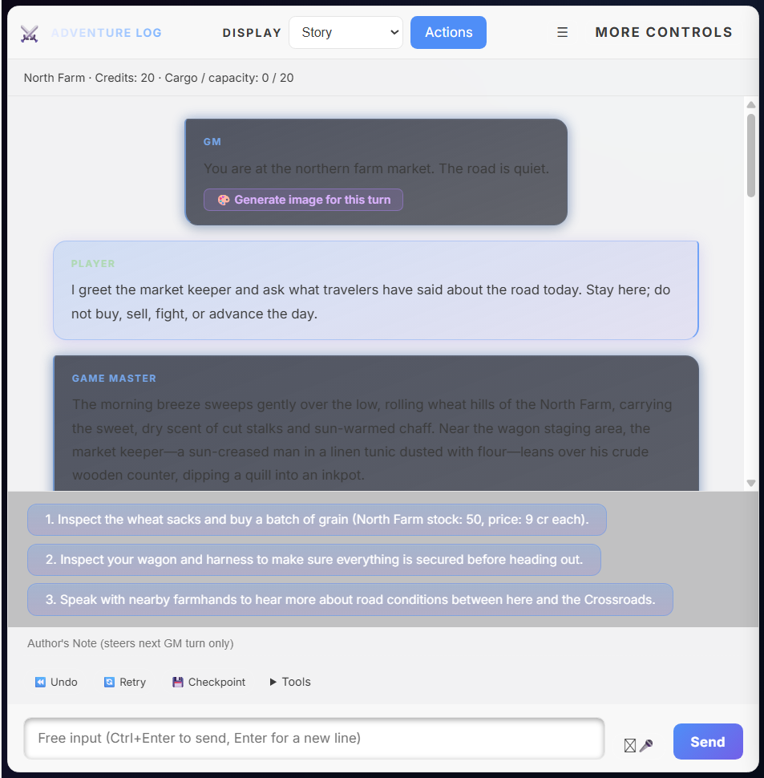
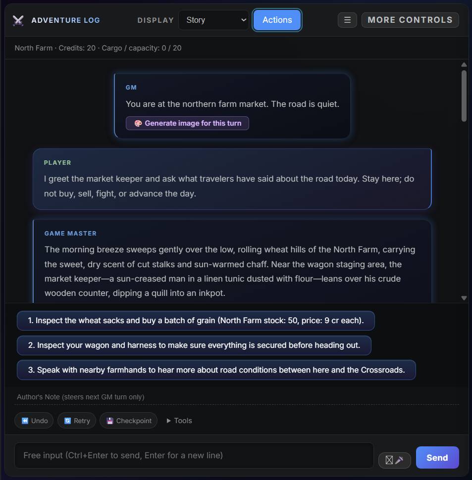
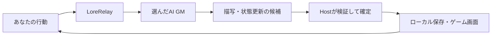
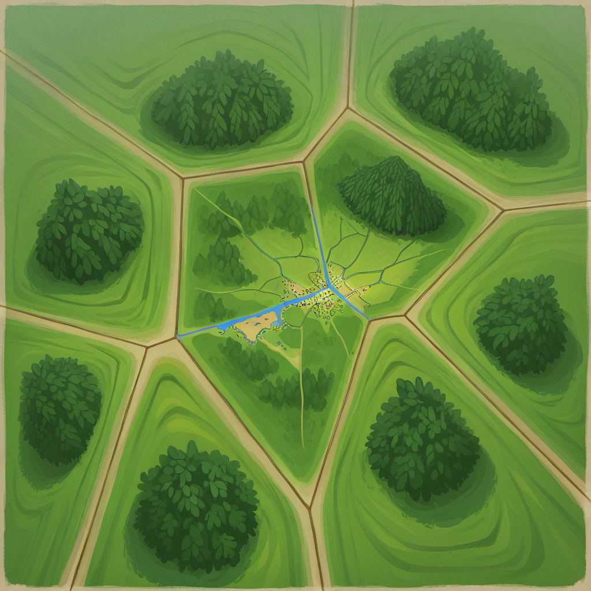
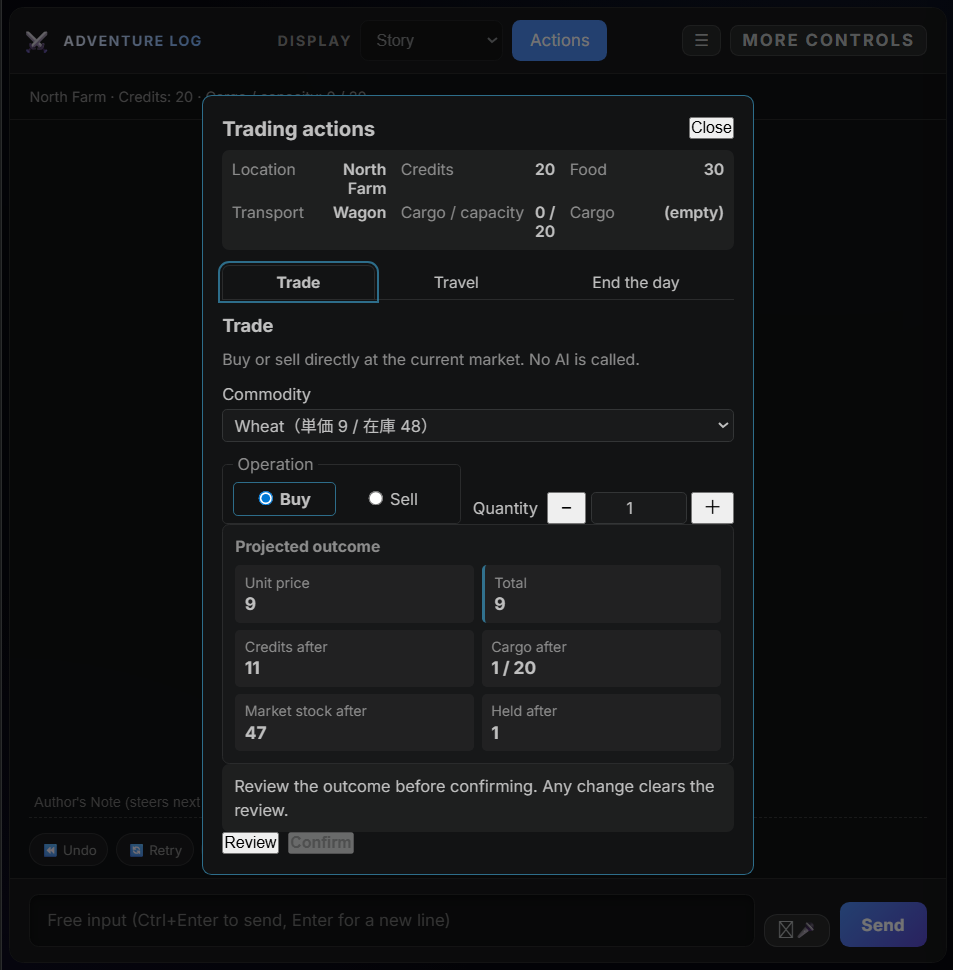

<h1 align="center">LoreRelay</h1>
<p align="center"><strong>Bring your AI. Keep your world.</strong></p>

<p align="center"><a href="README.md">日本語</a> · <a href="README_en.md">English</a> · <a href="README_zh-CN.md">简体中文</a> · <a href="README_zh-TW.md">繁體中文</a></p>

<p align="center">
  <a href="LICENSE"></a>
  <a href="https://github.com/GGF1sh/LoreRelay/actions/workflows/ci.yml"></a>
  <a href="docs/VERSION_TRUTH.md"></a>
</p>

**あなたが遊び、AIがゲームマスターになる。世界は、あなたの手元に残る。**

LoreRelayは、VS Codeで遊ぶロールプレイ／永続世界RPGです。キャラクターとの会話から、仲間との冒険、交易や拠点運営まで。対応する公式AIクライアントをGMとして接続し、ゲーム画面から行動を送れます。

**AI Connection V2**では、Codex・Grok・Antigravityの実サービスGM動作を確認済み。Claude・DeepSeekも接続機能を実装していますが、実サービス確認は未実施です。利用枠・課金方式は接続ごとに異なります。

[始める](#how-to-play) · [AIを接続する](#ai-connections) · [画面を見る](#screenshots) · [インストール](#setup)

<p align="center"></p>

<p align="center"><sub>冒険の雰囲気を表したイメージイラストです。実際の操作画面は下で紹介します。 <a href="docs/assets/README.md">画像の出典</a></sub></p>

<a id="onboarding"></a>

## どんな遊び方にする？

| 遊び方 | できること |
| --- | --- |
| **Parlor：会話から** | キャラクターと1対1でロールプレイ。SillyTavernのキャラカードやロアブックを持ち込めます。 |
| **In-World：世界の住人として** | 世界の文脈を使って会話。設定を背景に、人物とのやり取りを楽しめます。 |
| **Campaign：冒険と世界の変化** | 仲間、探索、クエスト、資源や交易。有効にしたゲームシステムを使って進めます。 |

画面は**物語・管理・演出**から選べます。文章を読む、状態を見渡す、背景や立ち絵を楽しむための表示設定で、遊び方や世界のルールは変更しません。画像なしでも遊べます。

「世界の進み方」も別に選べます。**安定した暮らし・変化のある世界・手強い経営**を入口に、経済、食料需要、紛争、関係の進行を個別調整できます。NOAIでは対応する世界処理や取引・市場移動・日送りをAI呼出しなしで進められます。自由な物語を生成するGMの代替ではありません。

| 明るい画面で読む | 落ち着いた画面で読む |
| :---: | :---: |
|  |  |

同じ保存済みの合成fixture会話を表示した1.85.2の実画面。テーマを変えても会話の内容は変わりません。

<a id="ai-connections"></a>

## 契約中のAIを、GMに

月額サービスの対応クライアント、従量課金API、ローカルLLMから接続方法を選びます。**サブスク利用枠は無料・無制限を意味しません。** 利用できるモデルや枠はアカウントと公式クライアントに依存します。

| サービス | LoreRelayのGM接続経路 | 利用枠・課金 | 実サービス確認 |
| --- | --- | --- | --- |
| **ChatGPT / Codex** | 公式Codex App Server | ChatGPTアカウントのCodex利用枠 | 確認済み |
| **Grok** | Grok Build / ACP | 公式クライアントのアカウント利用枠 | 確認済み |
| **Gemini / Antigravity** | Antigravity CLI | 公式クライアントのアカウント利用枠 | 確認済み |
| **Claude** | Claude Code | 対応するClaudeサブスク認証 | 機能実装済み・未確認 |
| **DeepSeek** | OpenAI互換API | APIキー・従量課金 | 機能実装済み・未確認 |

確認範囲は**2026-09-08時点の1.85.2**。上の3社は、隔離した実Host／WebviewでCampaign・会話専用それぞれ3ターンと停止を確認しています。すべてのモデル・環境を保証するものではありません。[モデル・クライアント版と接続手順](docs/AI_CONNECTIONS.md)

既存の**VS Code LM、Ollama、KoboldCPP、OpenRouter、clipboard／手動連携**も利用できます。VS Code LMはVS Codeが公開するモデルだけを使います。通常のWebチャット契約をAPIキーへ転用する機能ではありません。[従来のBridge設定](GM_BRIDGE_PRESETS.md)

### AIの文章と、ゲームの確定状態を分ける


```mermaid
flowchart LR
    Human["あなたの行動"] --> Host["LoreRelay"]
    Host --> AI["選んだAI GM"]
    AI --> Candidate["描写・状態更新の候補"]
    Candidate --> Accept["Hostが検証して確定"]
    Accept --> Local["ローカル保存・ゲーム画面"]
    Local --> Human
```

AI Connection V2では、AIにゲームの正本ファイルを直接編集させません。Hostが既存のAccepted Turn経路で候補を検証し、確定した内容を保存します。応答途中の文章は未確定です。

初回接続時に送信対象を確認します。GMには入力・会話履歴に加え、必要な非公開世界設定が送られる場合があります。**API課金への自動切替、モデルの自動変更、自動再送は行いません。** 接続準備完了と実際の応答成功も区別します。

<a id="how-to-play"></a>

## 最初の冒険を始める

1. **拡張を用意する。** 新接続を試す場合は[下のソース起動手順](#setup)を使い、専用のプレイ用フォルダを開きます。
2. **AIを選ぶ。** コマンドパレットから `LoreRelay: AI接続`（英語UIでは `LoreRelay: AI Connections`）。Codex／Claude Codeでは「GMとして使う」、Google／Grokでは「Antigravity CLI — GM」／「Grok Build — GM」を選択。公式ログインと送信同意を済ませ、モデルを設定します。候補一覧が取得できる接続では選択式、必要なら手入力も使えます。
3. **ゲームを開く。** `LoreRelay: Open Game UI` → Start Hubで「質問に答えて始める」または「既存キャラ・世界を使う」。保存済みの世界は「続ける」から再開できます。
4. **一つ行動する。** 選択肢か自由入力を送り、GMの描写と確定結果を確認します。Commerceを有効にした世界では、共通の「行動」から取引・市場移動・日送りへ進めます。

デモから触るなら、Start Hubのデモ群、または `LoreRelay: Load Scenario Pack` で同梱パックを選択します。**初期画面の表示と、その後のAI応答に必要な接続準備は別です。**

| 同梱シナリオ | 入口 |
| --- | --- |
| `harbor-mist` | 港町のミステリー |
| `lost-catacombs` | ダンジョン探索と地図 |
| `scrapbound-settlement` | 終末世界の回収・拠点・交易 |
| `neon-rain` / `trade-routes` | サイバーパンク／交易世界 |
| `debug-sandbox` | 開発・検証用 |

<a id="screenshots"></a>

## 会話の先にあるもの

地図UI・物流・場面画像・仲間・ロアブック・戦闘は以前の機能紹介画像です。現在の画面と配置が異なる場合があります。クリックで画像を拡大できます。

### 生成した地図が、冒険の舞台になる

地域のレイアウトからComfyUIで作った地図背景。緑の平野、森、街道を眺め、ゲーム画面では地点・交易路・未探索領域を重ねて世界を探索します。

<p align="center"></p>

<p align="center"><sub>同梱の生成例。地図画像そのものと、ゲームが重ねる地点・霧・交易路は別の層です。</sub></p>

| 地図上で行き先を探す | 地点の情報を開く |
| :---: | :---: |
|  |  |

### 市場で売買し、拠点を交易路で結ぶ

手元の売買から、地域をまたぐ物流まで。購入前に価格・在庫・所持金・積載量を確認し、物流網では市場や集落、施設を結ぶルートを見渡せます。

<p align="center"></p>

<p align="center"><sub>現行1.85.2のAction Hub。購入前の見積りで、実行済みの結果ではありません。</sub></p>

<p align="center"></p>

<p align="center"><sub>拠点ごとのつながりをグラフで確認。既存の機能紹介画像で、表示しているのは現在状態のプレビューです。</sub></p>

### 描写を絵にし、仲間との会話を育てる

場面画像を会話ログに添えたり、仲間の発言量や関係を調整したり。キャラクターや世界の設定はロアブックで整理できます。画像生成には別途ComfyUIなどの準備が必要です。

<p align="center"></p>

<p align="center"><sub>文章で進んだ先の風景を、場面画像として残す。既存のシーン画像連携の紹介です。</sub></p>

| 仲間の会話と関係 | 人物と世界の設定 |
| :---: | :---: |
|  |  |

- **世界を育てる：** World Forge、経済・勢力・NPC関係、集落・領地・ギルド・車両拠点。必要な機能だけ有効にできます。
- **物語を残す：** 会話履歴、記憶、ロアブック、年代記、チェックポイント、Markdown／HTMLのリプレイ出力。
- **演出を足す：** ComfyUIのシーン画像・地図、立ち絵、BGM／SE、TTS、VLMによる視覚記憶。外部ツールやモデルは別途準備します。
- **一緒に遊ぶ：** LANのRemote Playで参加・観戦。インターネット公開を前提としません。

<a id="combat"></a>

<p align="center"></p>

戦闘シミュレーター／Battle Viewもありますが**experimental**です。現状の開始入口はコマンドで、GMが物語から自動的に戦闘を開始する導線や、単体アバターの直接操作UIは未提供です。[機能の対応状況](docs/FEATURE_MATRIX.md) · [戦闘の設計と制約](docs/COMBAT_SYSTEM_DESIGN.md)

### AIにプレイや調査を任せる場合

人間向けGM接続とは別に、Playerの操作委譲、実Extension Hostの隔離QA、明示的な操作録画を用意しています。Playerの対象は**取引・市場移動・日送り**の3操作。QAの内部情報とPlayerの公開情報を別セッションに分けます。AIによる検査をHuman Playとは扱いません。[Player Lab／QAと記録](docs/AI_CONNECTION_V2_PLAYER_LAB.md)

<a id="setup"></a>

## インストール

**コード版と配布VSIXの版は別です。** 2026-09-08の確認では、ソースは1.85.2、最新GitHub Releaseはv1.71.0でした。AI Connection V2を試す場合、古いReleaseを入れるだけでは利用できません。[配布ファイル](https://github.com/GGF1sh/LoreRelay/releases) · [バージョンの正本](docs/VERSION_TRUTH.md)

### 現行ソースから起動

VS Code **1.93以上**、Node.js／npm、Gitを用意します。

```sh
git clone https://github.com/GGF1sh/LoreRelay.git
cd LoreRelay
npm ci
npm run compile
```

VS Codeでこのフォルダを開いて **F5**。起動したExtension Development Hostでプレイ用フォルダを開きます。VSIXにする場合は `npx @vscode/vsce package` を実行し、VS Codeの「VSIXからのインストール」を使います。

AI Connection V2には選んだ公式クライアントの導入と専用ログイン、またはDeepSeek APIキーが必要です。Python／`TextAdventureGMSkill`は従来のスクリプト連携、ダイス・地図など利用する機能に応じて準備します。`textAdventure.skillPath`はスキル側の `scripts/comfyui_generate.py` の絶対パスです。

従来のスキル連携をまとめて設定する場合は、隣に `TextAdventureGMSkill` を置き、Windowsでは `.\scripts\setup.ps1`、macOS／Linuxでは `bash scripts/setup.sh`。依存導入・コンパイル・テストを行うセットアップです。ComfyUIやVLMは任意です。

## 詳しく知る・開発に参加する

| 目的 | ドキュメント |
| --- | --- |
| 新しいGM接続・ログイン・利用枠 | [AI Connections](docs/AI_CONNECTIONS.md) |
| キャラ・世界設定の持ち込み | [SillyTavern互換](SILLYTAVERN_COMPAT.md) |
| 画像・地図・音声 | [ComfyUI](COMFYUI_WORKFLOWS.md) · [Cartography](docs/CARTOGRAPHY_COMFYUI.md) · [TTS](docs/TTS_QUICKSTART.md) |
| 既存のローカル／API／手動GM | [Bridge設定](GM_BRIDGE_PRESETS.md) · [従来のAntigravity連携](ANTIGRAVITY_GUIDE.md) |
| 現在地・変更履歴 | [機能一覧](docs/FEATURE_MATRIX.md) · [CHANGELOG](CHANGELOG.md) · [Roadmap](AI_ROADMAP.md) |
| 開発・変更に応じたテスト | [開発手順](docs/AI_WORKFLOW.md) · [Test Console](docs/TEST_CONSOLE.md) |

`npm run test:console` または `LoreRelay_Test_Console.bat` で、変更ファイルから関連テストを選ぶダッシュボードを開けます。すべての修正に全体テストを繰り返す運用ではありません。

LoreRelayは実験的なOSSです。AI接続の有限fixture確認は、任意の世界の品質・バランス保証ではありません。**Human Playは未実施・未代替です。**

[不具合報告・提案](https://github.com/GGF1sh/LoreRelay/issues) · [MIT License](LICENSE) · [開発を応援する ☕](https://ko-fi.com/promptpalette)
