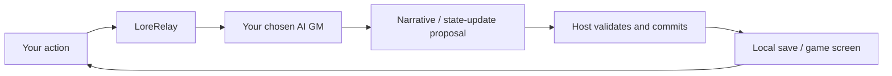

<h1 align="center">LoreRelay</h1>
<p align="center"><strong>Set out. Meet someone. Decide what comes next in your own words.</strong><br /><sub>Bring your AI. Keep your world.</sub></p>

<p align="center"><a href="README.md">日本語</a> · <a href="README_en.md">English</a> · <a href="README_zh-CN.md">简体中文</a> · <a href="README_zh-TW.md">繁體中文</a></p>

Chase a mystery through a fogbound harbor. Use a map to push deeper into a buried labyrinth. Scavenge a ruined world, then carry what you found back to your settlement. Or take a night off from adventuring and simply talk with a character you like.

**LoreRelay is a role-playing RPG where you decide what to do in your own words and an AI game master carries the story forward.** Start with a conversation, travel with companions, or grow into a campaign with exploration, trade and settlement management. Begin with the world you want to visit and the people you want to meet.

It is an open-source work in progress that runs in VS Code. Choose a supported AI as your GM, while your characters, world data and adventure records stay on your own PC.

[What can I do?](#onboarding) · [Start your first adventure](#how-to-play) · [See more of the game](#screenshots) · [AI options & pricing](#ai-connections) · [Install](#setup)

<p align="center"><a href="docs/assets/public-launch-v1.85.3/management-map.png"></a></p>

<p align="center"><sub>An actual 1.85.3 screen: follow an adventure through conversation, map and trade.</sub></p>

**[▶ Watch a 75-second slice of an adventure](docs/PUBLIC_LAUNCH_MEDIA.md)** — Talk to the GM → buy at the market → reopen the panel and check that the state is still there. Recorded in a sample world used for verification, with waits shortened.

| Where should I go next? | What should I buy—and bring home? |
| :---: | :---: |
| <a href="docs/assets/screenshot-world-map.png"></a> | <a href="docs/assets/public-launch-v1.85.3/trade-committed.jpg"></a> |

<p align="center"><sub>The map is an earlier feature showcase; the trade screen shows a completed purchase in 1.85.3. Click an image to open it full-size.</sub></p>

<a id="onboarding"></a>

## Your next move, in your own words

“Ask around the harbor.” “Search the ruins.” “Head back to town for the day.” You can pick a suggested action, but you can also simply write what you want to do.

**Read the scene → act → see the GM's narration and the committed result → decide what to do next.**

When you want conversation, stay with the characters. When you want adventure, open the map or follow a quest. In a trading world, watch your money and carrying capacity before deciding what to buy. Move between reading a story and making game decisions at your own pace.

### Chase mysteries—or make a living bringing things back from the ruins

You do not have to write an entire world before you can play. The included scenarios give you different ways in.

| What do you feel like playing tonight? | Scenario |
| --- | --- |
| **A mystery in a fogbound harbor.** Talk, investigate and follow the clues into a story. | `harbor-mist` |
| **A descent into underground ruins.** Read the map and step into places you have not seen yet. | `lost-catacombs` |
| **A scavenger's life after the end.** Explore ruins, haul resources home, then live with a settlement and trade network around you. | `scrapbound-settlement` |
| **A cyberpunk story.** Role-play beneath the neon glow. | `neon-rain` |
| **A journey built around trade.** Visit markets and weigh price, stock and carrying capacity before you deal. | `trade-routes` |

If you want your own setting, answer the Start Hub questions or bring an existing character and world. SillyTavern character cards and lorebooks are supported too.

### Stay with one character—or step out into the world?

| What do you want to do? | Mode |
| --- | --- |
| **Spend time with a character you like.** Start with one-to-one conversation and role-play. | **Parlor** |
| **Talk as someone who belongs in that world.** Let the setting inform your conversations with its people. | **In-World** |
| **Travel with companions and build a life through exploration.** Use quests, resources, trade and whichever systems you enable. | **Campaign** |

You do not need every system turned on. World pacing can begin with **a stable life, a changing world, or challenging management**, then tune economy, food demand, conflict and relationship progression separately. Trade, settlements and world simulation include experimental features; what is available depends on the scenario and settings. [Feature status](docs/FEATURE_MATRIX.md)

### Keep a favorite moment as part of the journey

When a landscape you read about—or a conversation you want to remember—deserves an image, open **Illustrate this scene**. Edit the art direction, copy the prompt to ChatGPT, Gemini, Grok or another image tool, then bring the result back into LoreRelay. A favorite image can become that turn's illustration or the current background.

Prompt composition and image import do not require another AI connection or API key. Generation limits and terms depend on the external service you use. Automatic ComfyUI generation remains a separate optional feature. [Scene illustration guide](docs/VISUAL_COMPOSER_V1.md)

Continue from the world you saved. Revisit conversation history, lorebooks and chronicles, or export the journey as a Markdown / HTML replay.

<a id="how-to-play"></a>

## Start your first adventure

1. **Get ready to play.** Follow [Installation](#setup), then open a dedicated play folder. To try the newest features, run the current source tree.
2. **Choose your GM.** Open `LoreRelay: AI Connections` from the command palette and complete the login and setup for the connection you want. [AI options and pricing](#ai-connections)
3. **Choose a world and character.** Run `LoreRelay: Open Game UI` → in Start Hub, answer the setup questions or use an existing character/world. You can also pick an included scenario from the demo group or `LoreRelay: Load Scenario Pack`. Use Continue for a saved world.
4. **Send the first line.** Choose an option or write your own action, then see the GM's narration and committed result. In worlds with Commerce enabled, the shared Actions entry opens trade, market travel and end day.

A scenario's opening screen can appear before an AI is connected. Continuing the story with a GM requires a ready connection. If setup is unclear, see [AI Connections](docs/AI_CONNECTIONS.md).

<a id="screenshots"></a>

## And beyond the first adventure…

This is a gallery of features that can broaden the way you play. The map UI, logistics, scene images, party tools, lorebook and battle view include older showcase captures, so their layout may differ from the current UI. Click an image to enlarge it.

### Some days you read the story. Some days you look over the whole world.

Use **Story** when you want prose, **Management** when you want resources and maps, or **Cinematic** when you want backgrounds and portraits. These change presentation, not the experience rules or world rules. Images are optional.

| Follow the conversation in a bright layout | Settle into the story in a darker layout |
| :---: | :---: |
| <a href="docs/assets/readme-light-v1.85.2.png"></a> | <a href="docs/assets/readme-story-v1.85.2.png"></a> |

<p align="center"><sub>The same saved sample conversation in 1.85.2. Changing the theme does not change the conversation.</sub></p>

### Open the map and find somewhere you want to go

A town beyond the plains. A road through the woods. A ruin you have not searched yet. LoreRelay can overlay locations and unexplored areas on a generated map background, so you can open a destination, see what you know, and decide where to travel.

<p align="center"><a href="docs/assets/worldmap-showcase-fixture/world_map.png"></a></p>

<p align="center"><sub>An included ComfyUI-generated map-background example. Locations, fog and trade routes are separate overlays in the game UI.</sub></p>

| Look for the next destination | Open a ruin and think about the trip |
| :---: | :---: |
| <a href="docs/assets/screenshot-world-map.png"></a> | <a href="docs/assets/screenshot-world-map-detail.png"></a> |

### Sell what you found. Prepare for the next trip.

Once you have resources, decide what to sell and what to keep. Markets let you check price, stock, money and carrying capacity before you trade. Exploration can feed back into how you live and what you can afford to do next.

<p align="center"><a href="docs/assets/public-launch-v1.85.3/trade-committed.jpg"></a></p>

<p align="center"><sub>A completed 1.85.3 purchase: credits 20→11, wheat 0→1. The UI shows what you bought and what it cost.</sub></p>

If you want to lean further into management, open the logistics network and connect markets, settlements and facilities. Domain, guild and vehicle-base systems also exist as opt-in experimental features. If you just want conversation, you do not need any of them.

<p align="center"><a href="docs/assets/screenshot-logistics.png"></a></p>

<p align="center"><sub>A logistics view of connections between locations. This is an older feature showcase showing a preview of current state.</sub></p>

### Keep the scenery—and spend time with your companions

A lantern in an underground corridor. A view from somewhere far from home. Adding scene images gives you another reason to look back through the conversation log. Below is an example created through the existing ComfyUI integration.

<p align="center"><a href="docs/assets/screenshot-comfyui.png"></a></p>

For companion conversations, you can tune how often people speak and how they relate to one another. Keep character and world information in the lorebook. Add scene art, portraits, BGM / SFX or TTS only if you want them. External image/audio tools and models require their own setup.

| Whose voice do you want to hear more often? | Keep people and world facts close at hand |
| :---: | :---: |
| <a href="docs/assets/screenshot-party-director.png"></a> | <a href="docs/assets/screenshot-lorebook.png"></a> |

<p align="center"><a href="docs/assets/hero-ui.jpg"></a></p>

<p align="center"><sub>A mood illustration for the adventure, not an actual gameplay screen. <a href="docs/assets/README.md">Image provenance</a></sub></p>

<a id="combat"></a>

### Plan how your party moves (experimental)

The combat simulator and Battle View show ally/enemy HP, gambits, movement orders and combat logs. It is an experimental space for trying combat alongside—rather than inside—the conversation and management loops.

<p align="center"><a href="docs/assets/screenshot-battle-view.png"></a></p>

**Combat currently starts from a command.** The GM does not yet transition automatically from narrative into combat, and there is no direct-control UI for a single avatar. [Feature status](docs/FEATURE_MATRIX.md) · [Combat design and constraints](docs/COMBAT_SYSTEM_DESIGN.md)

You can also join or spectate over LAN with **Remote Play**. It is not designed around exposing the game directly to the public internet.

<a id="ai-connections"></a>

## Choose the GM for your adventure, too

LoreRelay can use supported subscription clients, metered APIs or local LLMs as the GM. If an AI you already use is supported, there may be a path that uses that account's existing allowance.

**A subscription allowance does not mean free or unlimited use.** Available models, quotas and billing depend on the provider and your account.

| Service | LoreRelay GM connection | Usage / billing | Real-service verification |
| --- | --- | --- | --- |
| **ChatGPT / Codex** | Official Codex App Server | Codex allowance on your ChatGPT account | Verified |
| **Grok** | Grok Build / ACP | Official client's account allowance | Verified |
| **Gemini / Antigravity** | Antigravity CLI | Official client's account allowance | Verified |
| **Claude** | Claude Code | Supported Claude subscription authentication | Implemented; unverified |
| **DeepSeek** | OpenAI-compatible API | API key; metered billing | Implemented; unverified |

The verification snapshot is **1.85.2 as of 2026-09-08**. The first three providers completed three turns plus a stop case in both Campaign and conversation-only play using an isolated real Host/Webview. This does not guarantee every model or environment. [Tested models, client versions and connection steps](docs/AI_CONNECTIONS.md)

In the connection menu, choose “GMとして使う” for Codex / Claude Code, and “Antigravity CLI — GM” / “Grok Build — GM” for Google / Grok. Complete the official login and sharing consent, then choose a model. Connections that expose a model catalog provide a picker; manual entry remains available where needed.

Existing **VS Code LM, Ollama, KoboldCPP, OpenRouter and clipboard/manual workflows** also remain available. VS Code LM can use only models exposed through the VS Code model API. LoreRelay does not turn an ordinary web-chat subscription into an API key. [Legacy bridge configuration](GM_BRIDGE_PRESETS.md)

<details>
<summary>What gets sent to AI, and how game results are committed</summary>

AI Connection V2 does not ask the AI to edit canonical game files directly. The Host validates candidates through the existing Accepted Turn path and saves accepted results. Streaming text is provisional.



The first connection shows what is about to be sent. GM context may include private world information as well as your input and conversation history. **LoreRelay does not automatically switch you to API billing, change models, or resend a request.** Connection readiness and an actual successful response are reported separately.

NOAI can advance supported world processing plus trade, market travel and end day without an AI call. It is not a replacement for a GM that generates open-ended stories.

Separate from the human-facing GM connection, LoreRelay also has delegated AI Player operations, isolated QA and explicit operation recording. Player currently covers **trade, market travel and end day**. QA's internal information is kept in a separate session from the Player's public information. AI-driven verification is not treated as human play. [Player Lab / QA and recordings](docs/AI_CONNECTION_V2_PLAYER_LAB.md)

</details>

<a id="setup"></a>

## Installation

**This README describes the features on `main`. A published VSIX may not contain the same feature set.** To try newer AI connections or the scene-illustration workflow, run the current source tree. [Releases](https://github.com/GGF1sh/LoreRelay/releases) · [Version source of truth](docs/VERSION_TRUTH.md)

### Run from current source

Prepare VS Code **1.93 or later**, Node.js / npm, and Git.

```sh
git clone https://github.com/GGF1sh/LoreRelay.git
cd LoreRelay
npm ci
npm run compile
```

Open the folder in VS Code and press **F5**. In the Extension Development Host that opens, select a play workspace. To package a VSIX, run `npx @vscode/vsce package` and install it through VS Code's “Install from VSIX...”.

AI Connection V2 requires the official client and its dedicated login for the provider you choose, or a DeepSeek API key. Python / `TextAdventureGMSkill` are used by legacy scripted integration and by optional features such as dice and maps. `textAdventure.skillPath` is the absolute path to the skill-side `scripts/comfyui_generate.py`.

For the legacy skill bundle, place `TextAdventureGMSkill` next to LoreRelay and run `.\scripts\setup.ps1` on Windows or `bash scripts/setup.sh` on macOS / Linux. That setup installs dependencies, compiles and runs tests. ComfyUI and VLM are optional.

## Status and deeper guides

LoreRelay is an open-source project in active development. It can take you from a character conversation into a simulated world, but different features are at different levels of maturity. Pick one style of play that sounds interesting and try that first.

| I want to… | Guide |
| --- | --- |
| Bring my own characters or world lore | [SillyTavern compatibility](SILLYTAVERN_COMPAT.md) |
| Play an exploration / salvage campaign | [Campaign Kit](docs/CAMPAIGN_KIT_QUICKSTART.md) |
| Turn scenes into illustrations or backgrounds | [Scene prompt & image import](docs/VISUAL_COMPOSER_V1.md) |
| Add images, maps or voice | [ComfyUI](COMFYUI_WORKFLOWS.md) · [Cartography](docs/CARTOGRAPHY_COMFYUI.md) · [TTS](docs/TTS_QUICKSTART.md) |
| Check GM connections, login and allowances | [AI Connections](docs/AI_CONNECTIONS.md) |
| Configure local / API / manual GM routes | [Bridge configuration](GM_BRIDGE_PRESETS.md) · [Legacy Antigravity guide](ANTIGRAVITY_GUIDE.md) |
| See feature status and changes | [Feature Matrix](docs/FEATURE_MATRIX.md) · [CHANGELOG](CHANGELOG.md) · [Roadmap](AI_ROADMAP.md) |
| Contribute or run development tests | [Development workflow](docs/AI_WORKFLOW.md) · [Test Console](docs/TEST_CONSOLE.md) |

<details>
<summary>Verification scope and the images shown here</summary>

AI-connection verification demonstrates real-service behavior in finite test scenarios. It does not guarantee long-campaign quality or balance in every possible world.

The user has reported completing one real-device round trip for Scene Composer V1: compose the scene prompt → generate an image with an external AI → import it into LoreRelay → adopt it → close and reopen. This is a scoped check of the scene-image workflow, not a claim that long-form Campaign human play has been completed.

The opening demo and 1.85.2 conversation screens use synthetic fixtures created for verification. Waits in the demo were shortened, and the persistence example reopens the panel rather than rebooting the operating system. Earlier showcase images for map, logistics, companions, lorebook and combat are kept distinct from the non-gameplay mood illustration. [Demo / media notes](docs/PUBLIC_LAUNCH_MEDIA.md) · [Image provenance](docs/assets/README.md)

The included `debug-sandbox` scenario is intended for development and verification. `npm run test:console` or `LoreRelay_Test_Console.bat` opens the dashboard that selects related tests from changed files. The project does not rerun the full suite for every small edit.

</details>

<p align="center">
  <a href="LICENSE"></a>
  <a href="https://github.com/GGF1sh/LoreRelay/actions/workflows/ci.yml"></a>
  <a href="docs/VERSION_TRUTH.md"></a>
</p>

[Report a bug or suggest an idea](https://github.com/GGF1sh/LoreRelay/issues) · [MIT License](LICENSE) · [Support development ☕](https://ko-fi.com/promptpalette)
