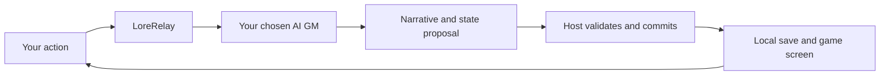

<h1 align="center">LoreRelay</h1>
<p align="center"><strong>Bring your AI. Keep your world.</strong></p>

<p align="center"><a href="README.md">日本語</a> · <a href="README_en.md">English</a> · <a href="README_zh-CN.md">简体中文</a> · <a href="README_zh-TW.md">繁體中文</a></p>

<p align="center">
  <a href="LICENSE"></a>
  <a href="https://github.com/GGF1sh/LoreRelay/actions/workflows/ci.yml"></a>
  <a href="docs/VERSION_TRUTH.md"></a>
</p>

**You play. Your AI is the game master. The world stays with you.**

LoreRelay is a roleplaying and persistent-world RPG extension for VS Code. Start with a character conversation, then explore party adventures, trade, or base management. Connect a supported official AI client as GM and send actions from the game screen.

**AI Connection V2** has real-service GM verification for Codex, Grok and Antigravity. Claude and DeepSeek adapters are implemented, but their real-service checks have not been performed. Usage allowances and billing depend on the connection.

[Start playing](#how-to-play) · [Connect your AI](#ai-connections) · [See the UI](#screenshots) · [Install](#setup)

<p align="center"><a href="docs/assets/hero-ui.jpg"></a></p>

<p align="center"><sub>An illustration of the adventure's atmosphere. Actual game screens appear below. <a href="docs/assets/README.md">Image provenance</a></sub></p>

<a id="onboarding"></a>

## Choose how you play

| Experience | What it offers |
| --- | --- |
| **Parlor: start with conversation** | One-to-one character roleplay. Bring SillyTavern character cards and lorebooks. |
| **In-World: be part of the setting** | Character conversations informed by the world's context. |
| **Campaign: adventure and a changing world** | Companions, exploration, quests, resources and trade, using the systems you enable. |

Choose a **Story, Management or Cinematic** display to focus on prose, status, or backgrounds and portraits. These are presentation settings: switching them does not change your experience or world rules. Images are optional.

World pacing is a separate choice. **Stable living, a changing world and challenging management** offer starting points, with individual economy, food demand, conflict and relationship controls. NOAI supports world processing and trade, market travel and end day without model calls. It does not replace a GM that generates open-ended stories.

| Read in a light theme | Read in a dark theme |
| :---: | :---: |
| <a href="docs/assets/readme-light-v1.85.2.png"></a> | <a href="docs/assets/readme-story-v1.85.2.png"></a> |

Real 1.85.2 screens displaying the same saved synthetic fixture conversation. Changing the theme does not change the conversation.

<a id="ai-connections"></a>

## Bring the AI you already use

Choose a supported subscription client, a metered API, or a local LLM. **Subscription access does not mean free or unlimited usage.** Available models and allowances depend on your account and the official client.

| Service | LoreRelay GM connection | Usage / billing | Real-service verification |
| --- | --- | --- | --- |
| **ChatGPT / Codex** | Official Codex App Server | Codex allowance on your ChatGPT account | Verified |
| **Grok** | Grok Build / ACP | Official client's account allowance | Verified |
| **Gemini / Antigravity** | Antigravity CLI | Official client's account allowance | Verified |
| **Claude** | Claude Code | Supported Claude subscription authentication | Implemented; unverified |
| **DeepSeek** | OpenAI-compatible API | API key; metered billing | Implemented; unverified |

This is a **2026-09-08 snapshot of 1.85.2**. Each verified provider completed three turns and a stop case in both Campaign and conversation-only play, using an isolated real Host/Webview. This is not a guarantee for every model or environment. [Tested models, client versions and connection steps](docs/AI_CONNECTIONS.md)

Existing **VS Code LM, Ollama, KoboldCPP, OpenRouter and clipboard/manual workflows** remain available. VS Code LM can use only models exposed through VS Code's model API. A normal web-chat subscription is not converted into an API key. [Legacy bridge configuration](GM_BRIDGE_PRESETS.md)

### AI proposes; LoreRelay commits



AI Connection V2 does not ask the AI to edit canonical game files directly. The Host validates candidates through the existing Accepted Turn pipeline and saves accepted results. Streaming text is provisional.

The first connection shows what will be sent. GM context may include private world information as well as your input and conversation history. **No automatic switch to API billing, model change or resend.** Connection readiness and a successful model response are reported separately.

<a id="how-to-play"></a>

## Start your first adventure

1. **Prepare the extension.** To try the new connections, use the [source setup below](#setup) and open a dedicated play folder.
2. **Choose your AI.** Run `LoreRelay: AI Connections` from the command palette (`LoreRelay: AI接続` in Japanese). For Codex/Claude Code, choose “GMとして使う” (use as GM); for Google/Grok, choose “Antigravity CLI — GM” / “Grok Build — GM”. Complete the official login, review the data-sharing consent, and select a model. Connections with a model catalog offer a picker; manual IDs remain available where needed.
3. **Open the game.** Run `LoreRelay: Open Game UI`. In Start Hub, answer the setup questions or use an existing character/world. Choose Continue for a saved world.
4. **Take one action.** Send a choice or free-text action, then check the GM narration and committed result. With Commerce enabled, the shared Actions entry opens trade, market travel and end day.

To explore a demo, use Start Hub's demo group or `LoreRelay: Load Scenario Pack`. **Displaying a scenario's opening does not mean its AI connection is ready for subsequent turns.**

| Included scenario | Starting point |
| --- | --- |
| `harbor-mist` | Harbor mystery |
| `lost-catacombs` | Dungeon exploration and maps |
| `scrapbound-settlement` | Post-apocalyptic salvage, settlement and trade |
| `neon-rain` / `trade-routes` | Cyberpunk / a trading world |
| `debug-sandbox` | Development and verification |

<a id="screenshots"></a>

## Beyond the conversation

The map UI, logistics, scene image, party, lorebook and battle captures are earlier feature showcases; their layout may differ from the current UI. Click an image to enlarge it.

### A generated map becomes your adventure's setting

A ComfyUI map background built from a regional layout: green plains, forests and roads. In the game, locations, trade routes and unexplored areas are overlaid for exploration.

<p align="center"><a href="docs/assets/worldmap-showcase-fixture/world_map.png"></a></p>

<p align="center"><sub>An included generation example. The artwork and the game's location, fog and route overlays are separate layers.</sub></p>

| Find your next destination | Inspect a location |
| :---: | :---: |
| <a href="docs/assets/screenshot-world-map.png"></a> | <a href="docs/assets/screenshot-world-map-detail.png"></a> |

### Trade at markets and connect your bases

From a single purchase to regional logistics: check price, stock, credits and cargo before buying, then inspect the routes connecting markets, settlements and facilities.

<p align="center"><a href="docs/assets/readme-commerce-v1.85.2.png"></a></p>

<p align="center"><sub>Current 1.85.2 Action Hub. A purchase estimate, not an executed trade.</sub></p>

<p align="center"><a href="docs/assets/screenshot-logistics.png"></a></p>

<p align="center"><sub>See how bases connect. Earlier feature screenshot showing a preview of the current state.</sub></p>

### Picture the scene and shape your party's conversations

Add scene images to the adventure log, adjust companions' speaking frequency and relationships, and organize characters and world lore in a lorebook. Image generation needs separate setup such as ComfyUI.

<p align="center"><a href="docs/assets/screenshot-comfyui.png"></a></p>

<p align="center"><sub>Keep an image of the place your story has reached. Earlier scene-image integration showcase.</sub></p>

| Party conversations and relationships | Character and world lore |
| :---: | :---: |
| <a href="docs/assets/screenshot-party-director.png"></a> | <a href="docs/assets/screenshot-lorebook.png"></a> |

- **Build a living world:** World Forge, economy, factions, NPC relationships, settlements, domains, guilds and vehicle bases. Enable the systems you want.
- **Keep your story:** Conversation history, memories, lorebooks, chronicles, checkpoints and Markdown/HTML replay export.
- **Add atmosphere:** ComfyUI scene images and maps, portraits, BGM/SFX, TTS and VLM visual memory. External tools and models need separate setup.
- **Play together:** LAN Remote Play for participants and spectators. Internet exposure is not required.

<a id="combat"></a>

<p align="center"><a href="docs/assets/screenshot-battle-view.png"></a></p>

The combat simulator and Battle View are **experimental**. Combat currently starts through commands; automatic story-driven GM initiation and a directly controlled single-avatar UI are not provided. [Feature status](docs/FEATURE_MATRIX.md) · [Combat design and limitations](docs/COMBAT_SYSTEM_DESIGN.md)

### Letting AI play or investigate

Separate from the human-facing GM connection, LoreRelay offers Player delegation, isolated real Extension Host QA and explicit action recording. Player actions are limited to **trade, market travel and end day**. QA's internal information and Player's public information stay in separate sessions. Automated checks are not Human Play. [Player Lab, QA and recording](docs/AI_CONNECTION_V2_PLAYER_LAB.md)

<a id="setup"></a>

## Install

**Source and distributed VSIX versions are separate.** On 2026-09-08, source was 1.85.2 and the latest GitHub Release was v1.71.0. Installing that older release alone will not provide AI Connection V2. [Downloads](https://github.com/GGF1sh/LoreRelay/releases) · [Version source of truth](docs/VERSION_TRUTH.md)

### Run the current source

Install VS Code **1.93+**, Node.js/npm and Git.

```sh
git clone https://github.com/GGF1sh/LoreRelay.git
cd LoreRelay
npm ci
npm run compile
```

Open this folder in VS Code and press **F5**. In the launched Extension Development Host, open your play folder. To package a VSIX, run `npx @vscode/vsce package`, then use VS Code's “Install from VSIX”.

AI Connection V2 needs the selected official client and a dedicated login, or a DeepSeek API key. Prepare Python/`TextAdventureGMSkill` for the legacy script integration and features that use it, such as dice and maps. `textAdventure.skillPath` points to the skill's `scripts/comfyui_generate.py` by absolute path.

For the legacy skill setup, place `TextAdventureGMSkill` beside the repository and run `.\scripts\setup.ps1` on Windows or `bash scripts/setup.sh` on macOS/Linux. This setup installs dependencies, compiles and runs tests. ComfyUI and VLM are optional.

## Learn more and contribute

| Goal | Documentation |
| --- | --- |
| New GM connections, login and allowances | [AI Connections](docs/AI_CONNECTIONS.md) |
| Import characters and world lore | [SillyTavern compatibility](SILLYTAVERN_COMPAT.md) |
| Images, maps and voice | [ComfyUI](COMFYUI_WORKFLOWS.md) · [Cartography](docs/CARTOGRAPHY_COMFYUI.md) · [TTS](docs/TTS_QUICKSTART.md) |
| Existing local/API/manual GM routes | [Bridge settings](GM_BRIDGE_PRESETS.md) · [Legacy Antigravity workflow](ANTIGRAVITY_GUIDE.md) |
| Current status and changes | [Feature matrix](docs/FEATURE_MATRIX.md) · [CHANGELOG](CHANGELOG.md) · [Roadmap](AI_ROADMAP.md) |
| Development and change-related tests | [Workflow](docs/AI_WORKFLOW.md) · [Test Console](docs/TEST_CONSOLE.md) |

`npm run test:console` or `LoreRelay_Test_Console.bat` opens the dashboard that selects related tests from changed files. Every small change does not require another full-suite run.

LoreRelay is experimental open source. Finite AI-connection fixture checks do not guarantee quality or balance in arbitrary worlds. **Human Play remains unperformed and unreplaced.**

[Report a bug or suggest an idea](https://github.com/GGF1sh/LoreRelay/issues) · [MIT License](LICENSE) · [Support development ☕](https://ko-fi.com/promptpalette)
