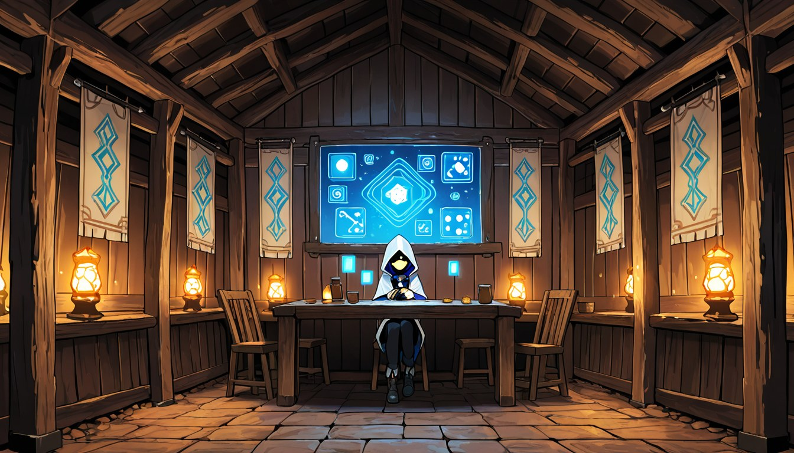
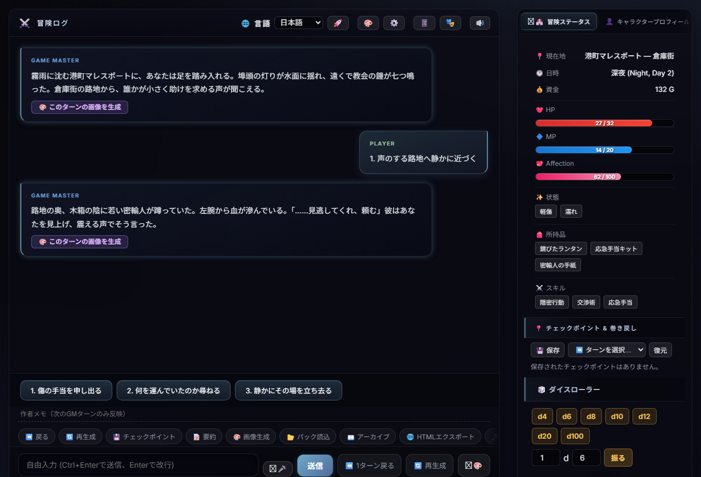
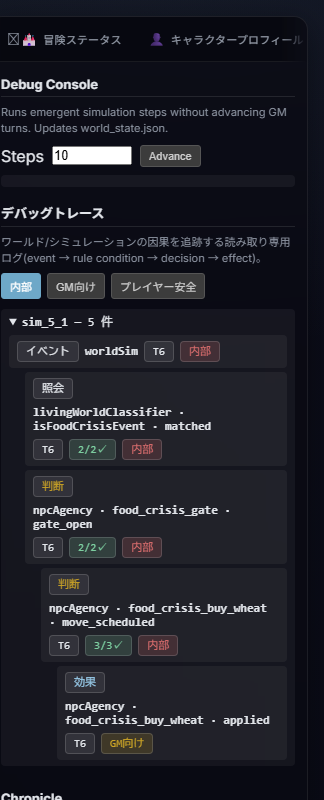
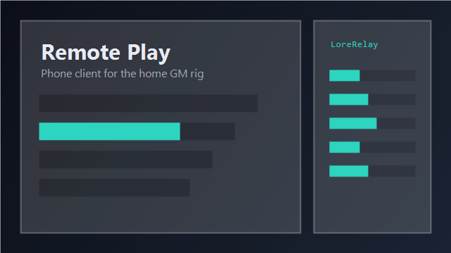
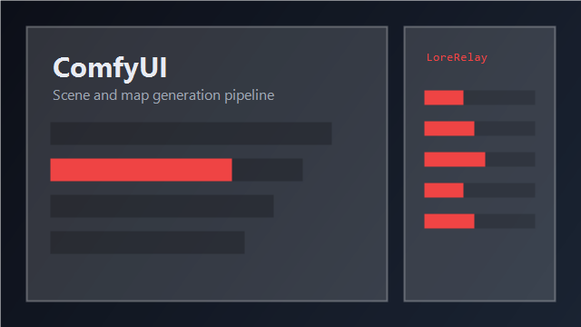
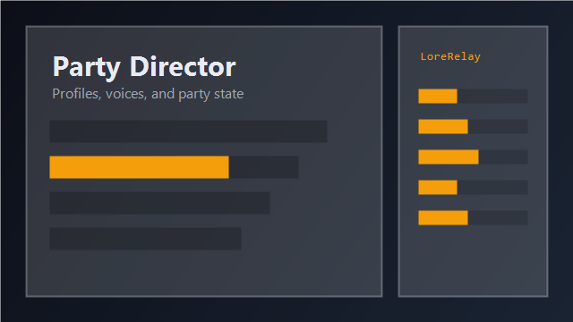
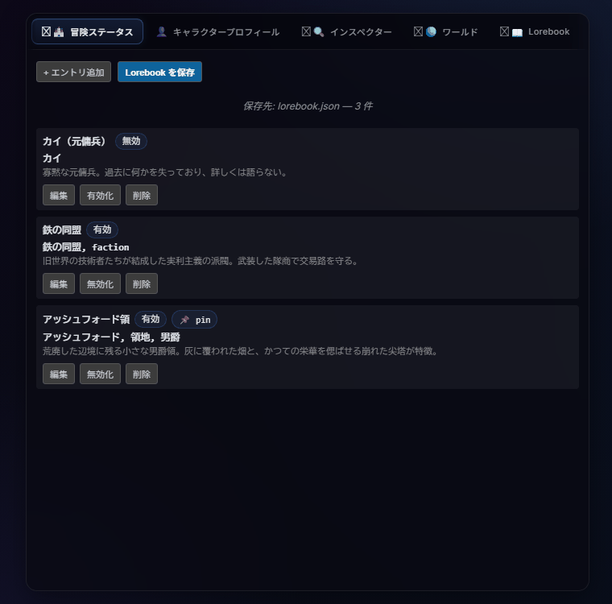
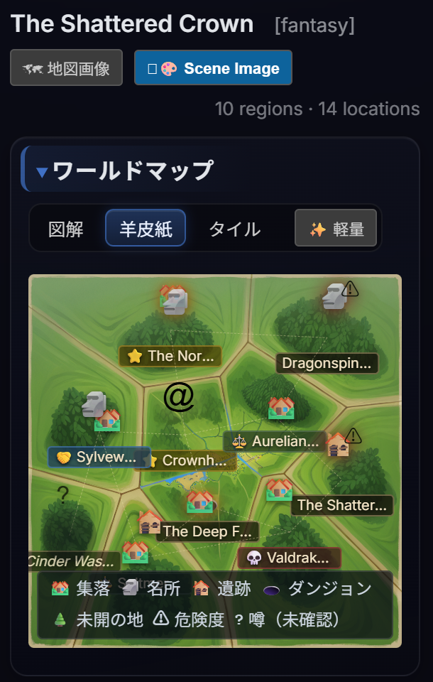
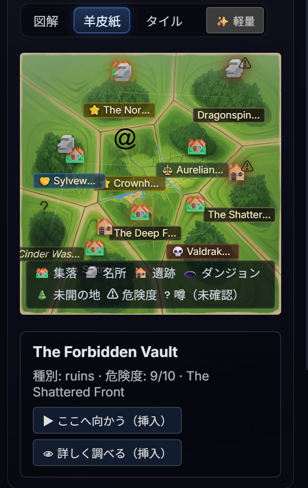

# LoreRelay - Local-first AI Game Master UI 🎲

[English](README_en.md) | [日本語](README.md) | [简体中文](README_zh-CN.md) | [繁體中文](README_zh-TW.md)

[](https://opensource.org/licenses/MIT)
[](https://github.com/GGF1sh/LoreRelay/releases)
[](https://github.com/GGF1sh/LoreRelay)

**Local-first AI Game Master UI**

**Antigravity (免费) × LoreRelay × ComfyUI —— 由前沿大模型担任 GM 的全自动 RPG 环境，无需 API 密钥，零额外成本。**

这是一个最大化利用您现有 AI 订阅的 VSCode 扩展，它结合了像 SillyTavern 一样的后端自由度，以及像 Saga & Seeker 一样硬核的 CRPG 体验。
通过手动复制粘贴（或通过本地代理自动执行）传递 JSON，它提供了一个完全开放且可改造的“Hacker Edition” UI 层，让您可以自由地在自己的环境中进行 Hack。

> 💡 **Notice:** 如果您喜欢这个扩展，请考虑[请我喝杯咖啡 ☕](https://ko-fi.com/promptpalette)

---

## 🌟 Features

- 💸 **No Extra API Costs (by default):** 本地 LLM、Grok CLI 或手动复制粘贴操作无需按量计费的 API 密钥。仅在使用 OpenRouter 时需要 API 密钥。
- 🧩 **Agent Bridge:** 如果使用 Grok Build 等可在本地执行的 AI，您可以直接将 Webview 的选项和自由输入发送给 GM。
- 🎨 **Glassmorphism UI:** 包含半透明聊天 UI、世界观主题切换和图像画廊的丰富显示界面。
- ⚔️ **CRPG Character Sheet:** 受 Saga & Seeker 等启发的视觉状态面板，可管理 HP/MP 进度条、技能和物品栏。
- 🖼️ **Local Image Generation & World Integration (v1.3+):** 与 ComfyUI 配合，在本地即时生成 AI 描绘的场景画面；并与 World System 联动，支持地点移动时的自动背景生成。
- 🎵 **Adaptive BGM & SFX:** 根据 GM 的指示，自动控制并交叉淡入淡出在 `bgm.json` / `sfx.json` 中注册的音源。
- 📦 **Scenario Packs:** 只需加载包含 `scenario.json` 的文件夹，即可一次性应用初始场景、主题和专用 BGM/音效。
- 🎲 **Built-in Dice Roller & Calculator:** 内置 TRPG 判定必不可少的掷骰子（NdX）和数学计算器。
- 💾 **Persistent Adventure Log:** 将冒险日志保存到 `game_history.json`，即使重启 VSCode 也能恢复历史记录。
- 🔍 **回合检查器（Turn Inspector）：** 每回合骰子台账、状态补丁、触发 lore 可视化。
- 📖 **Lorebook & Memory UI:** ST 兼容 lorebook 编辑、记忆搜索预览、置顶 lore 注入。
- 🎬 **Scenario & Party Director:** `scenario.json` / `party_director.json` 与 `game_state` 运行时联动。
- 📱 **Remote Play (v0.7+):** LAN 加入 URL（复制分享）、玩家 / 观战角色。WebSocket 认证、输入限制、**签名 `/media` URL**（short-TTL HMAC，v1.6.2+）。
- 🌍 **Living World System (v1.3+):** `world_forge.json`（World Forge）、涌现模拟、World 标签页 Mermaid 地图（biome 配色与平移缩放，v1.6.3+）。
- 🗺️ **Cartography / 羊皮纸地图（v1.7+，可选高级功能）：** Region `x/y/biome` → 布局 PNG → ComfyUI ControlNet 羊皮纸地图 → Webview 图钉叠加。需 ComfyUI + SDXL Canny；仅布局可用 Python 单独生成。
- ⚙️ **Emergent Simulation:** 内置自律模拟器，随每回合推进自动计算资源消耗、势力平衡、NPC 好感度与恐惧等。
- 🛡️ **Robust State Management:** 上限钳制、非法 ID 清理、安全状态迁移等机制，防止庞大数据导致 UI 崩溃。
- 👁️ **Visual Memory / Soulgaze (v1.5+):** VLM 分析生成图像并写入 `visual_memory.json`，在后续 GM 提示中自动注入视觉上下文。
- 🔒 **Audit Wave Hardening (v1.6):** 对 State / GM Bridge / World / ST Import / Webview / Remote Play / Extension Hub 进行 7 轨道审计，新增 pure 验证模块与大量回归测试。
- 🏘️ **Settlement Mode (v1.69–1.73):** 聚落模拟 — 等距 Webview 布局、层展开持久化、可选 Three.js 视觉。
- 🚗 **Vehicle & Mobile Base (v1.74–1.75):** `vehicle_state.json` 车队管理、车库面板、移动基地（MB1–MB5）与 World Intent 桥接。
- 🧭 **State Orchestrator (SO1–SO2):** 台账描述符清单与 GM 回合只读 transaction planning gate。
- 🔎 **Context Engine P0 (v1.58+):** Prompt Inspector 中的 chunk 生命周期追踪（included / truncated / evicted 等）。
- ✨ **Genesis Guide (Unreleased):** 从 Start Hub 的「开始创建世界」进入的分步向导——只需点选即可决定世界观、玩法、危险度、管理深度、主角创建方式以及是否需要生成图像。实时预览将启用的系统与图像生成提示词，点击「以此设置开始」后安全地写入 `game_rules.json`。根据所选的主角创建方式，可直接跳转到角色创建或 SillyTavern 卡片导入。ComfyUI 不可用时会自然回退为复制提示词。设计文档：[`docs/RULES_PROFILE_ONBOARDING_DESIGN.md`](docs/RULES_PROFILE_ONBOARDING_DESIGN.md)

架构详解：[`docs/WORLD_AND_VISUAL_MEMORY.md`](docs/WORLD_AND_VISUAL_MEMORY.md)

### 所需环境与可选功能

| 层级 | 内容 |
|------|------|
| **必需（核心游玩）** | VSCode 1.85+、Python、`TextAdventureGMSkill`（`SKILL.md`） |
| **推荐** | GM Bridge（Grok / Ollama / 剪贴板等）或手动复制粘贴 |
| **可选 — 图像** | ComfyUI（API 模式）— 场景背景与羊皮纸地图 |
| **可选 — 视觉记忆** | VLM（Ollama `llava` 或 OpenRouter 多模态）— Soulgaze |
| **可选 — 多人** | Remote Play（同一局域网） |
| **可选 — 地图** | Cartography — 仅布局 PNG 只需 Python；插画羊皮纸需 ComfyUI + SDXL Canny |

### 数据流（Persist-Before-Narrate）

GM 每回合应写入 **`turn_result.json`**（`statePatch` + `narration` + `gmEntry` + `turnId`）。扩展验证补丁后合并到 **`game_state.json`**，并向 `state_journal.ndjson` 追加审计记录。

直接覆盖 **`game_state.json`** 为**紧急回退**（手动粘贴或旧版 GM）。此时 `turnResultFallback` 会合成 `turn_result.json`，使检查器、日志与 MediaAgent 走同一路径。

**Cartography 流水线（可选）：** `world_forge.json`（Region 的 `x` / `y` / `biome`）→ 布局 PNG（`world_map.layout.png`）→（可选）ComfyUI ControlNet → `world_map.png` → World 标签页 📍 图钉叠加

---

## 📸 Screenshots & Demo

<p align="center">
  
</p>

<p align="center">
  
</p>

<p align="center">
  <br />
  <sub>Turn Inspector — 按回合可视化骰子台账、statePatch 与 Debug Trace</sub>
</p>

| Remote Play | ComfyUI |
|:---:|:---:|
|  |  |
| 通过局域网从手机/平板加入，玩家/观战者链接与已连接客户端列表 | GM 描写即时生成场景图像，直接显示在聊天中 |

| Party Director | Lorebook |
|:---:|:---:|
|  |  |
| 调整 NPC 发言量、静音/强制发言与关系值 | 浏览、编辑并置顶 ST 兼容的 Lorebook 条目 |

### 🗺️ World Map — 有生命的战役世界

<p align="center">
  
  
</p>
<p align="center"><sub>城市、遗迹、地下城、港口、山脉、危险地带、未探索边疆、势力领地与贸易路线，尽在一张地图上。点击图钉即可打开该地点的类型/危险度/所属势力详情卡片与快捷操作。背景由 ComfyUI（Illustrious + ControlNet）生成，图钉、标签、贸易路线与战争迷雾（Fog of War）均由 Webview 依据真实世界数据绘制。</sub></p>

替换为真实截图或 GIF 的步骤见 [`DEMO.md`](DEMO.md)。

---

## 🚀 How to Play

### 快速开始（约 3 分钟）

1. `LoreRelay: Load Scenario Pack` → `sample-scenarios/lost-catacombs`
2. `LoreRelay: Open Game UI` → 在 Game Rules 中启用 **World Forge**
3. **World** 标签页 → **Parchment** 查看同捆的 `world_map.layout.png` 与图钉（无需 ComfyUI）
4. 进行一回合，查看 GM 响应

完整插画羊皮纸地图：启动 ComfyUI 后执行 `LoreRelay: Generate World Map Image`。详见 [`docs/CARTOGRAPHY_COMFYUI.md`](docs/CARTOGRAPHY_COMFYUI.md)（**可选 / 高级**）。

该扩展使用松散耦合机制，监听 AI 导出的 `turn_result.json`（规范）或 `game_state.json`（回退）并渲染 UI。根据您的环境，有两种游玩方式。

### Mode A: 自动同步模式 (Recommended)
**适用对象：** 使用**可写入本地文件的代理 AI**（如 Antigravity, Grok CLI, VSCode Copilot (Cursor)）的用户。

1. 让 AI 读取包含的 `SKILL.md`，并指示“按照此技能开始担任游戏主持（GM）”。
2. 之后，您只需与 AI 聊天即可。AI 会自动掷骰子、使用 ComfyUI 生成图像并更新 `game_state.json`。
3. 在 VSCode 中保持此扩展打开，UI 将实时更新！

> **对于 Antigravity 用户：** 您可以轻松操作：点击 Webview 中的选项 → 复制到剪贴板 → 粘贴到 Antigravity 聊天中 → 自动更新。详情请参阅 [`ANTIGRAVITY_GUIDE.md`](ANTIGRAVITY_GUIDE.md)。

### Mode B: 手动复制粘贴模式
**适用对象：** 使用标准网页版 ChatGPT, Claude, 或 Gemini 的用户。

1. 将 `SKILL.md` 的文本复制并粘贴到网页版 AI 中，并说：“请按照这些指示担任 GM。”
2. 复制 AI 返回的 JSON 代码块，并手动在 VSCode 中覆盖保存 `game_state.json`。
3. 保存的瞬间，VSCode UI 会自动切换。（图像生成和掷骰子需手动执行，或使用网页版 AI 的功能代替）。

---

## 🛠️ Setup & Installation

### 1. Prerequisites
- **VSCode** (v1.85+) — 必需
- **Python** — 必需（掷骰、布局地图、GM 桥接脚本）
- **TextAdventureGMSkill** — 必需（`SKILL.md` 与 `scripts/`，放在本仓库旁）
- **ComfyUI** — *可选*（仅场景图与羊皮纸地图；需 API 模式启动）
- **VLM** — *可选*（Visual Memory / Soulgaze，Ollama 或 OpenRouter）

### 2. Quick setup (recommended)

将 `TextAdventureGMSkill` 放在 `text-adventure-vsce` 旁边（例如：在 `C:\AI\` 目录下）：

**Windows (PowerShell):**
```powershell
cd text-adventure-vsce
.\scripts\setup.ps1
```

**macOS / Linux:**
```bash
cd text-adventure-vsce
chmod +x scripts/setup.sh
./scripts/setup.sh
```

脚本将执行：
- 自动检测 GM 技能路径 → 生成 `my-adventure/.vscode/settings.json`
- `npm install` / `compile` / `test`
- (可选) VSIX 打包 → `code --install-extension`
- 生成 `text-adventure.code-workspace`（3 个根目录：Game + Skill + Extension）

选项示例：`-Locale en` `-GmProvider clipboard` `-SkipVsix`

### 3. Manual extension installation
1. 克隆或下载此代码库。
2. 在 VSCode 中打开文件夹，并在终端中运行 `npm install`。
3. 按 `F5` 键开始调试扩展，或使用 `npx @vscode/vsce package` 安装 VSIX。
4. 从命令面板 (`Ctrl+Shift+P`) 运行 `LoreRelay: Open Game UI` 以打开面板。

### 4. Configuration
在 VSCode 设置中搜索 `textAdventure.skillPath`，并指定随附的 `comfyui_generate.py` 脚本的绝对路径。

主要设置：

- `textAdventure.skillPath` — `comfyui_generate.py` 的绝对路径
- `textAdventure.locale` — UI / 错误 / GM 提示的语言（`ja` / `en` / `zh-CN` / `zh-TW`）。也可以从 Webview 标题栏的 🌐 更改。
- `textAdventure.gmBridge.provider` — `grok` / `ollama` / `koboldcpp` / `clipboard` / `command` (详情见 `GM_BRIDGE_PRESETS.md`)
- `textAdventure.grokBridge.*` — 启用 Grok Build 自动发送、CLI 路径、后备设置
- `textAdventure.imageGen.*` — ComfyUI / Stability Matrix URL、checkpoint、workflow、生成尺寸
- `textAdventure.imageGen.controlNet` — Cartography 用 SDXL Canny 模型名（可选）
- `textAdventure.vlm.*` — Soulgaze 用 VLM（`provider` / `model` / `endpoint`）
- `textAdventure.mediaAgent.*` — 后台图像队列、GM 流式早期 BGM/SFX
- `textAdventure.remotePlay.*` — 端口、`bindAddress`、`mediaUrlTtlSec`（签名媒体 URL 有效期）等
- `textAdventure.bgm.*` — BGM 配置文件和音量
- `textAdventure.sfx.*` — SFX 配置文件和音量

### 5. 命令面板（主要命令）

| 命令 | 用途 |
|------|------|
| `LoreRelay: Open Game UI` | 打开主 Webview |
| `LoreRelay: Load Scenario Pack` | 加载含 `scenario.json` 的文件夹 |
| `LoreRelay: Generate World Forge` | 程序化生成 `world_forge.json` |
| `LoreRelay: Generate World Map Image` | 通过 ComfyUI 生成羊皮纸地图（可选） |
| `LoreRelay: Start Remote Play (LAN)` | 发布局域网加入 URL |
| `LoreRelay: List Image Models` | 列出 ComfyUI checkpoint |
| `LoreRelay: Import SillyTavern Character Card` | 导入 ST 角色卡 |
| `LoreRelay: Import SillyTavern Lorebook` | 导入 ST lorebook |
| `LoreRelay: Export Scenario Pack (Workshop ZIP)` | 导出分发用 ZIP |
| `LoreRelay: Validate Scenario Pack` | 验证包结构 |

### 6. 工作区主要文件

| 文件 | 作用 |
|------|------|
| `game_state.json` | UI 渲染的合并游戏状态 |
| `turn_result.json` | 每回合 GM 输出（规范持久化） |
| `state_journal.ndjson` | statePatch 审计日志 |
| `world_forge.json` | 静态世界设计（区域、派系、NPC 种子） |
| `world_state.json` | 动态模拟（已访问、派系资源等） |
| `visual_memory.json` | VLM 情景记忆 |
| `game_history.json` | 冒险日志（重启后恢复） |
| `world_map.layout.png` / `world_map.png` | Cartography 布局 / 羊皮纸图 |
| `npc_registry.json` | NPC 认知与关系 |

### 7. Scenario Packs
从命令面板运行 `LoreRelay: Load Scenario Pack` 并选择包含 `scenario.json` 的文件夹。

**同捆示例（3 本）** — `sample-scenarios/`：

| 文件夹 | 类型 | 主题 | 备注 |
|--------|------|------|------|
| `lost-catacombs` | 经典地牢探索 | fantasy | **Cartography 演示**（`world_forge.json` + `world_map.layout.png`） |
| `neon-rain` | 赛博朋克黑色电影 | cyberpunk | |
| `harbor-mist` | 港口悬疑 | modern | |

GM 技能端：`TextAdventureGMSkill/scenarios/`。

### 8. SillyTavern 兼容与 Workshop

- 通过上述命令或 Webview 导入 ST 角色与 lorebook。详见 [`SILLYTAVERN_COMPAT.md`](SILLYTAVERN_COMPAT.md)
- 导出并验证场景包可生成 Workshop 用 ZIP（市场发布调研中）

### 9. 模型与 ComfyUI 预设
- [`MODEL_PRESETS.md`](MODEL_PRESETS.md) — 从 `presets/` 复制 JSON
- [`COMFYUI_WORKFLOWS.md`](COMFYUI_WORKFLOWS.md) — 场景与 Cartography 工作流
- Cartography（可选）：[`docs/CARTOGRAPHY_COMFYUI.md`](docs/CARTOGRAPHY_COMFYUI.md) · [`docs/CARTOGRAPHY_WORKFLOW_CONTRACT.md`](docs/CARTOGRAPHY_WORKFLOW_CONTRACT.md) · [`docs/CARTOGRAPHY_DESIGN.md`](docs/CARTOGRAPHY_DESIGN.md)
- 演示步骤：[`sample-scenarios/lost-catacombs/CARTOGRAPHY_DEMO.md`](sample-scenarios/lost-catacombs/CARTOGRAPHY_DEMO.md)

### 10. 文档索引

| 文档 | 内容 |
|------|------|
| [`AI_HANDOVER.md`](AI_HANDOVER.md) | 面向其他 AI 的交接说明 |
| [`CHANGELOG.md`](CHANGELOG.md) | 版本历史 |
| [`GM_BRIDGE_PRESETS.md`](GM_BRIDGE_PRESETS.md) | Ollama / KoboldCPP 预设 |
| [`ANTIGRAVITY_GUIDE.md`](ANTIGRAVITY_GUIDE.md) | Antigravity 工作流 |
| [`SILLYTAVERN_COMPAT.md`](SILLYTAVERN_COMPAT.md) | SillyTavern 兼容规格 |
| [`docs/WORLD_AND_VISUAL_MEMORY.md`](docs/WORLD_AND_VISUAL_MEMORY.md) | World / Visual Memory 架构 |
| [`DEMO.md`](DEMO.md) | 替换截图与演示 GIF |

---

## 🗺️ Roadmap

> **版本正本：** `package.json`（当前 **1.52.0**）· [`CHANGELOG.md`](CHANGELOG.md) · [`docs/VERSION_TRUTH.md`](docs/VERSION_TRUTH.md) · 任务看板 [`AI_ROADMAP.md`](AI_ROADMAP.md)

**已实现（v1.33.0 摘要）**

| 世代 | 主要内容 |
|------|----------|
| **v1.3–1.7** | World Forge / 涌现模拟 / Visual Memory / Audit Wave / Cartography |
| **v1.10–1.11** | Quest Board（Event-to-Quest）· Agentic GM · Git Timeline · Adaptive TTS |
| **v1.13–1.18** | Tile Overmap · Cartography C8/C9 · Debug sandbox · 世界时间推进 |
| **v1.19–1.21** | Chronicle · Pacing Director · 派系声望 · 旅途遭遇 · Replay Export |
| **v1.23–1.33** | Living World 经济（Commerce / Agency）· Commerce UI · 信任联动位置 · **LW3 羁绊** |

详见 [`docs/FEATURE_MATRIX.md`](docs/FEATURE_MATRIX.md) 与 `sample-scenarios/trade-routes`。

**计划中**

- README / DEMO 截图与 GIF 更新
- Overmap 图像瓦片、hazard 单行 GM 注入
- Prompt budget 优先级滑动（长会话）
- Workshop / 市场发布调研

---

## 🤝 Contributing & Support
该项目是一个实验性的 OSS，旨在成为 AI 时代的“文字冒险新游乐场”。
非常欢迎提交错误报告和请求（PR）！

如果这个项目让您感到兴奋......
👉 **[Buy me a coffee ☕](https://ko-fi.com/promptpalette)**

---
**Enjoy your adventure!**
