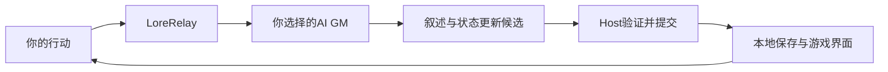

<h1 align="center">LoreRelay</h1>
<p align="center"><strong>Bring your AI. Keep your world.</strong></p>

<p align="center"><a href="README.md">日本語</a> · <a href="README_en.md">English</a> · <a href="README_zh-CN.md">简体中文</a> · <a href="README_zh-TW.md">繁體中文</a></p>

<p align="center">
  <a href="LICENSE"></a>
  <a href="https://github.com/GGF1sh/LoreRelay/actions/workflows/ci.yml"></a>
  <a href="docs/VERSION_TRUTH.md"></a>
</p>

**你来游玩，AI担任游戏主持人，世界保存在你手中。**

LoreRelay是一款在VS Code中运行的角色扮演／持久世界RPG扩展。从角色对话，到队伍冒险、交易与据点经营，你可以连接受支持的官方AI客户端作为GM，直接从游戏界面发送行动。

**AI Connection V2**已完成Codex、Grok和Antigravity的真实服务GM验证。Claude与DeepSeek也已实现连接功能，但尚未验证真实服务。使用额度和计费方式因连接而异。

[开始游玩](#how-to-play) · [连接AI](#ai-connections) · [查看界面](#screenshots) · [安装](#setup)

<p align="center"></p>

<p align="center"><sub>表现冒险氛围的插画。实际游戏界面见下方。 <a href="docs/assets/README.md">图片来源</a></sub></p>

<a id="onboarding"></a>

## 选择你的玩法

| 玩法 | 内容 |
| --- | --- |
| **Parlor：从对话开始** | 一对一角色扮演，可导入SillyTavern角色卡与世界书。 |
| **In-World：成为世界中的居民** | 结合世界背景与角色交流。 |
| **Campaign：冒险与世界变化** | 同伴、探索、任务、资源与交易，使用你启用的游戏系统。 |

界面可选择**故事、管理、演出**，分别突出文字、状态或背景与立绘。这些是显示设置，不会改变玩法或世界规则。没有图片也能游玩。

世界推进方式是另一项设置。以**安定生活、变化的世界、艰难经营**为起点，可分别调整经济、食物需求、冲突与关系进展。NOAI支持无需调用模型的世界处理，以及交易、市场移动和结束一天。它不替代生成开放式故事的GM。

| 在明亮界面中阅读 | 在深色界面中阅读 |
| :---: | :---: |
|  |  |

1.85.2真实界面，展示同一段已保存的合成测试对话。切换主题不会改变对话内容。

<a id="ai-connections"></a>

## 让你正在使用的AI担任GM

可选择受支持的订阅客户端、按量计费API或本地LLM。**订阅额度不等于免费或无限使用。** 可用模型与额度取决于账户及官方客户端。

| 服务 | LoreRelay的GM连接方式 | 额度／计费 | 真实服务验证 |
| --- | --- | --- | --- |
| **ChatGPT / Codex** | 官方Codex App Server | ChatGPT账户的Codex额度 | 已验证 |
| **Grok** | Grok Build / ACP | 官方客户端的账户额度 | 已验证 |
| **Gemini / Antigravity** | Antigravity CLI | 官方客户端的账户额度 | 已验证 |
| **Claude** | Claude Code | 受支持的Claude订阅认证 | 已实现，未验证 |
| **DeepSeek** | OpenAI兼容API | API密钥，按量计费 | 已实现，未验证 |

以上为**2026-09-08、1.85.2版本**的验证快照。已验证的三家服务分别在隔离的真实Host／Webview中完成了Campaign与纯对话各三个回合，以及停止操作。并非对所有模型、环境的保证。[测试模型、客户端版本与连接步骤](docs/AI_CONNECTIONS.md)

原有的**VS Code LM、Ollama、KoboldCPP、OpenRouter及剪贴板／手动连接**仍可使用。VS Code LM只能使用VS Code模型API公开的模型。此功能不会把普通网页聊天订阅转换成API密钥。[原有Bridge设置](GM_BRIDGE_PRESETS.md)

### AI提出候选，LoreRelay验证并保存


```mermaid
flowchart LR
    Human["你的行动"] --> Host["LoreRelay"]
    Host --> AI["你选择的AI GM"]
    AI --> Candidate["叙述与状态更新候选"]
    Candidate --> Accept["Host验证并提交"]
    Accept --> Local["本地保存与游戏界面"]
    Local --> Human
```

AI Connection V2不会要求AI直接编辑游戏的权威状态文件。Host通过现有Accepted Turn流程验证候选，保存已确认的结果。流式输出中的文字尚未确定。

首次连接会展示发送内容。GM上下文可能包含输入、对话历史及必要的非公开世界设定。**不会自动切换到API计费、自动更换模型或自动重发。** 连接就绪与实际模型回复成功也会分别显示。

<a id="how-to-play"></a>

## 开始第一场冒险

1. **准备扩展。** 若要体验新连接，请使用[下方的源码启动步骤](#setup)，并打开专用游玩文件夹。
2. **选择AI。** 在命令面板运行 `LoreRelay: AI Connections`（日文界面为 `LoreRelay: AI接続`）。Codex／Claude Code选择“GMとして使う”（作为GM）；Google／Grok选择“Antigravity CLI — GM”／“Grok Build — GM”。完成官方登录、确认发送内容并选择模型。可获取模型列表的连接提供选择器，需要时也可手动输入ID。
3. **打开游戏。** 运行 `LoreRelay: Open Game UI`，在Start Hub回答创建问题，或使用已有角色／世界。已有存档可以选择继续。
4. **采取一个行动。** 发送选项或自由输入，确认GM叙述与已提交的结果。启用Commerce后，可从共用行动入口进入交易、市场移动和结束一天。

想先试演示，可使用Start Hub的演示分组或 `LoreRelay: Load Scenario Pack`。**显示场景开篇，不代表后续回合所需的AI连接已经就绪。**

| 内置场景 | 起点 |
| --- | --- |
| `harbor-mist` | 港口谜案 |
| `lost-catacombs` | 地牢探索与地图 |
| `scrapbound-settlement` | 末世回收、据点与交易 |
| `neon-rain` / `trade-routes` | 赛博朋克／交易世界 |
| `debug-sandbox` | 开发与验证 |

<a id="screenshots"></a>

## 不止是对话

地图UI、物流、场景图、同伴、世界书和战斗截图为较早的功能展示，布局可能与当前界面不同。点击图片可放大。

### 让生成的地图成为冒险舞台

从区域布局通过ComfyUI生成地图背景：绿色平原、森林与道路。在游戏中叠加地点、贸易路线与未探索区域，寻找下一站。

<p align="center"></p>

<p align="center"><sub>内置生成示例。地图插画与游戏叠加的地点、迷雾、路线是不同图层。</sub></p>

| 寻找目的地 | 查看地点信息 |
| :---: | :---: |
|  |  |

### 在市场交易，用路线连接据点

从一次买卖到跨区域物流：购买前查看价格、库存、资金和载货量，再通过物流网络观察市场、聚落与设施之间的联系。

<p align="center"></p>

<p align="center"><sub>当前1.85.2的Action Hub。这是购买估算，并非已执行交易。</sub></p>

<p align="center"></p>

<p align="center"><sub>通过网络图查看据点之间的联系。较早的功能截图，展示当前状态预览。</sub></p>

### 把叙述变成画面，让同伴参与对话

为冒险日志添加场景图，调整同伴发言频率与关系，并通过世界书整理角色与背景。图片生成需要另行配置ComfyUI等工具。

<p align="center"></p>

<p align="center"><sub>把故事抵达的风景留成图片。较早的场景图片连接示例。</sub></p>

| 同伴对话与关系 | 人物与世界设定 |
| :---: | :---: |
|  |  |

- **构建世界：** World Forge、经济、势力、NPC关系、聚落、领地、公会和载具据点，按需启用。
- **留下故事：** 对话历史、记忆、世界书、编年史、检查点与Markdown／HTML回放导出。
- **增添氛围：** ComfyUI场景图和地图、立绘、BGM／音效、TTS、VLM视觉记忆。外部工具与模型需另行配置。
- **一起游玩：** 通过局域网Remote Play参与或旁观，无需以公开到互联网为前提。

<a id="combat"></a>

<p align="center"></p>

战斗模拟器与Battle View属于**实验性功能**。目前通过命令启动；尚未提供GM根据故事自动发起战斗的流程，也未提供单个角色的直接操控UI。[功能状态](docs/FEATURE_MATRIX.md) · [战斗设计与限制](docs/COMBAT_SYSTEM_DESIGN.md)

### 让AI游玩或调查问题

面向人类玩家的GM连接之外，还提供Player操作委托、隔离的真实Extension Host QA和显式操作录制。Player仅支持**交易、市场移动和结束一天**。QA内部信息与Player公开信息使用不同会话。自动检查不等于Human Play。[Player Lab、QA与记录](docs/AI_CONNECTION_V2_PLAYER_LAB.md)

<a id="setup"></a>

## 安装

**源码版本与发行VSIX版本不同。** 2026-09-08确认的源码为1.85.2，最新GitHub Release为v1.71.0。仅安装旧Release无法使用AI Connection V2。[下载](https://github.com/GGF1sh/LoreRelay/releases) · [版本权威记录](docs/VERSION_TRUTH.md)

### 从当前源码启动

准备VS Code **1.93以上**、Node.js／npm和Git。

```sh
git clone https://github.com/GGF1sh/LoreRelay.git
cd LoreRelay
npm ci
npm run compile
```

在VS Code打开此文件夹并按 **F5**。在启动的Extension Development Host中打开游玩文件夹。需要VSIX时运行 `npx @vscode/vsce package`，再使用VS Code的“从VSIX安装”。

AI Connection V2需要所选官方客户端与专用登录，或DeepSeek API密钥。原有脚本连接、骰子、地图等功能按需准备Python／`TextAdventureGMSkill`。`textAdventure.skillPath`应填写技能中 `scripts/comfyui_generate.py` 的绝对路径。

如需集中配置原有技能连接，把 `TextAdventureGMSkill` 放在仓库旁；Windows运行 `.\scripts\setup.ps1`，macOS／Linux运行 `bash scripts/setup.sh`。该安装流程会安装依赖、编译并运行测试。ComfyUI与VLM均为可选。

## 文档与参与开发

| 目的 | 文档 |
| --- | --- |
| 新GM连接、登录与额度 | [AI Connections](docs/AI_CONNECTIONS.md) |
| 导入角色与世界设定 | [SillyTavern兼容](SILLYTAVERN_COMPAT.md) |
| 图片、地图与语音 | [ComfyUI](COMFYUI_WORKFLOWS.md) · [Cartography](docs/CARTOGRAPHY_COMFYUI.md) · [TTS](docs/TTS_QUICKSTART.md) |
| 原有本地／API／手动GM | [Bridge设置](GM_BRIDGE_PRESETS.md) · [旧Antigravity流程](ANTIGRAVITY_GUIDE.md) |
| 当前状态与更新 | [功能表](docs/FEATURE_MATRIX.md) · [CHANGELOG](CHANGELOG.md) · [Roadmap](AI_ROADMAP.md) |
| 开发与相关测试 | [开发流程](docs/AI_WORKFLOW.md) · [Test Console](docs/TEST_CONSOLE.md) |

`npm run test:console` 或 `LoreRelay_Test_Console.bat` 可打开根据修改文件选择相关测试的面板，无需每次小修改都重复全套测试。

LoreRelay是实验性开源项目。有限的AI连接测试场景不代表任意世界的品质或平衡保证。**Human Play尚未进行，也未被自动化替代。**

[报告问题或提出建议](https://github.com/GGF1sh/LoreRelay/issues) · [MIT License](LICENSE) · [支持开发 ☕](https://ko-fi.com/promptpalette)
