<h1 align="center">LoreRelay 🎲</h1>
<h3 align="center">面向 VS Code 的本地优先 AI 游戏主持人界面</h3>

<p align="center"><strong>让 AI 故事成为不会消失的“游戏世界”。</strong><br />
通过本地 JSON 状态，将聊天、角色、世界地图、记忆、经济与图像生成连接为一个 AI RPG 前端。</p>

<p align="center"><a href="README_en.md">English</a> · <a href="README.md">日本語</a> · <a href="README_zh-CN.md">简体中文</a> · <a href="README_zh-TW.md">繁體中文</a></p>

<p align="center">
  <a href="https://opensource.org/licenses/MIT"></a>
  <a href="https://github.com/GGF1sh/LoreRelay/actions/workflows/ci.yml"></a>
  <a href="https://github.com/GGF1sh/LoreRelay/releases"></a>
  <a href="https://github.com/GGF1sh/LoreRelay"></a>
</p>

<p align="center">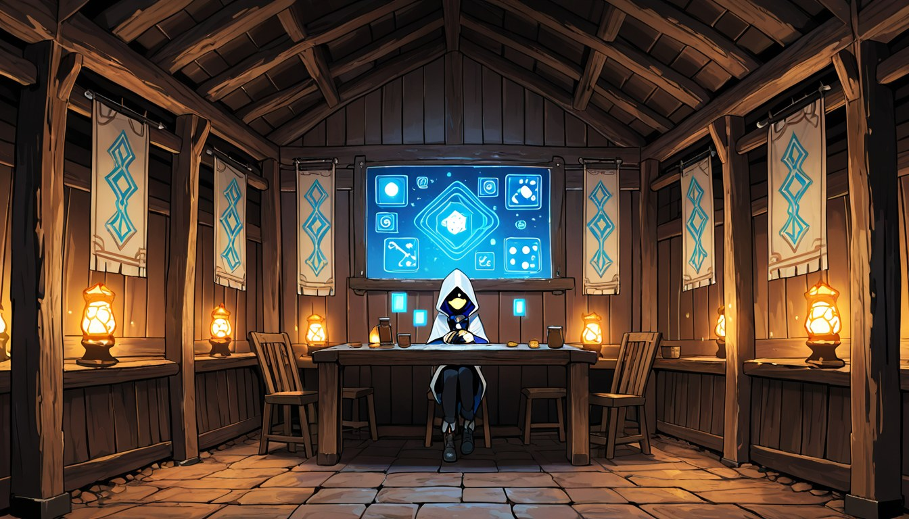</p>

<p align="center"><sub>可使用本地 AI、现有 AI 订阅或手动复制粘贴开始。ComfyUI、VLM 与 Remote Play 均为可选。</sub></p>

<p align="center">
  <a href="#onboarding"><strong>从聊天开始</strong></a> ·
  <a href="#how-to-play"><strong>15 分钟试玩</strong></a> ·
  <a href="#setup"><strong>安装</strong></a> ·
  <a href="#screenshots"><strong>查看界面</strong></a> ·
  <a href="docs/FIRST_SESSION.md"><strong>首次游玩指南</strong></a>
</p>

<p align="center">
  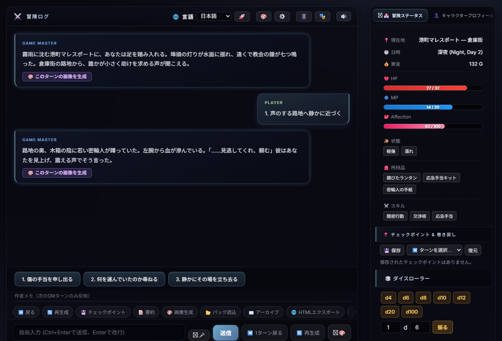
</p>

LoreRelay 本身不是 LLM 服务，而是一个**将您选择的 AI 连接为游戏主持人的本地优先 UI 与状态层**。它不会丢弃每次回复，而会把世界状态、历史、lore 与媒体保存为文件，让长期战役能够跨会话继续。

| 游玩方式 | 可获得的体验 | 最低需求 |
|:---|:---|:---|
| 🎭 **Parlor** | SillyTavern 风格的一对一 RP、角色卡与 lorebook | VS Code + AI |
| 🌐 **In-World Chat** | 以已有世界、领地和当前局势为背景，以居民身份交谈 | 世界数据 + 角色 |
| ⚔️ **Campaign** | 多角色、骰子、持久世界、任务与经济 | VS Code + Python + AI |
| 📱 **Remote Play** | 同一局域网内用手机或平板加入、观战 | Campaign 环境 + Remote Play |

> 无需 ComfyUI 即可游玩核心内容。启用图像生成后，可加入场景图、插画世界地图与 Visual Memory。

> 💡 喜欢这个项目？可以[请我喝杯咖啡支持开发 ☕](https://ko-fi.com/promptpalette)

---

<a id="onboarding"></a>

## 🪜 先从对话开始，再成长为一个世界

无需先配置庞大的 CRPG 才能享受 LoreRelay。主要的新手路线是：**先与您已有的角色对话，再把这段对话发展为自己的世界**。

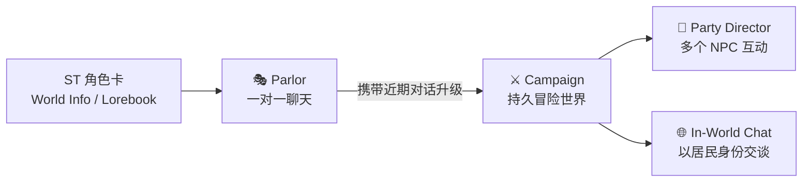
```mermaid
flowchart LR
    ST["ST 角色卡<br/>World Info / Lorebook"] --> Parlor["🎭 Parlor<br/>一对一聊天"]
    Parlor -->|携带近期对话升级| Campaign["⚔️ Campaign<br/>持久冒险世界"]
    Campaign --> Party["👥 Party Director<br/>多个 NPC 互动"]
    Campaign --> InWorld["🌐 In-World Chat<br/>以居民身份交谈"]
```

<p align="center">
  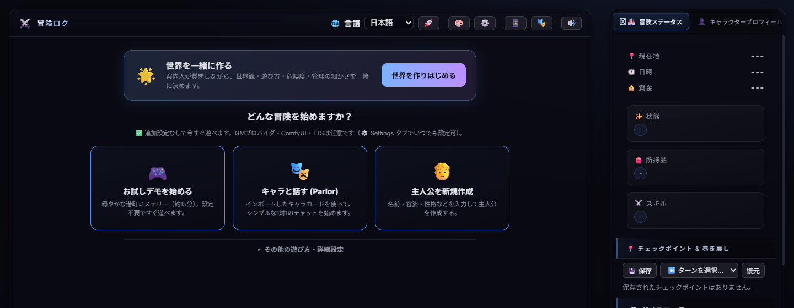
</p>

1. **带入主要 SillyTavern 资产** — 可导入角色卡（PNG/JSON）、World Info / Lorebook，以及卡片内的立绘。LoreRelay 并非完全兼容的 ST 客户端，但能复用对话所需的主要资产（[兼容指南](SILLYTAVERN_COMPAT.md)）。
2. **先进行一对一对话** — 在 Start Hub 选择 **「与角色对话（Parlor）」**，无需骰子或经济管理即可开始轻量 RP。
3. **把对话升级为冒险** — 在 Parlor 设置中选择 **「与此角色开始冒险」**，创建继承近期对话的场景与游戏状态；之后也可返回 Parlor。
4. **观看多个角色互动** — 在 Campaign 中将角色加入队伍，再用 Party Director 调整发言量、静音/强制发言与关系。GM 会分别扮演多个 NPC，生成自然的 NPC 间对话。
5. **在自己创建的世界中交谈** — **In-World Chat** 会把已有世界、领地与当前局势作为只读上下文。可用于酒馆闲聊或向居民打听消息，而不会推进或修改模拟。

> **关于“AI 与 AI 对话”：** 当前是由一个已连接的 GM 模型按照 Party Director 设置扮演多个角色，并非同时运行多个独立 AI 代理。

---

## 🌟 可以做什么

| RPG 前端 | 活着的世界 | 连接您选择的 AI |
|:---|:---|:---|
| 聊天、选项、自由输入、HP/MP、物品、技能、骰子与自适应音频 | 持久化地域、势力、NPC、贸易与时间，并逐回合模拟 | 支持本地代理、VS Code LM、手动复制粘贴与 OpenRouter |
| **记忆与检查** | **图像与地图** | **可自由改造** |
| Lorebook、Memory、Turn Inspector 与审计日志 | ComfyUI 场景、羊皮纸地图与 VLM Visual Memory | 直接编辑基于 JSON 的场景、规则与状态 |

<details>
<summary><strong>展开完整功能列表与版本亮点</strong></summary>


- 💸 **No Extra API Costs (by default):** 本地 LLM、Grok CLI 或手动复制粘贴操作无需按量计费的 API 密钥。仅在使用 OpenRouter 时需要 API 密钥。
- 🧩 **Agent Bridge:** 如果使用 Grok Build 等可在本地执行的 AI，您可以直接将 Webview 的选项和自由输入发送给 GM。
- 🎨 **Glassmorphism UI:** 包含半透明聊天 UI、世界观主题切换和图像画廊的丰富显示界面。
- ⚔️ **CRPG Character Sheet:** 受 Saga & Seeker 等启发的视觉状态面板，可管理 HP/MP 进度条、技能和物品栏。
- 🖼️ **Local Image Generation & World Integration (v1.3+):** 与 ComfyUI 配合，在本地即时生成 AI 描绘的场景画面；并与 World System 联动，支持地点移动时的自动背景生成。
- 🎵 **Adaptive BGM & SFX:** 根据 GM 的指示，自动控制并交叉淡入淡出在 `bgm.json` / `sfx.json` 中注册的音源。
- 📦 **Scenario Packs:** 只需加载包含 `scenario.json` 的文件夹，即可一次性应用初始场景、主题和专用 BGM/音效。
- 🎲 **Built-in Dice Roller & Calculator:** 内置 TRPG 判定必不可少的掷骰子（NdX）和数学计算器。
- 💾 **Persistent Adventure Log:** 将冒险日志保存到 `game_history.json`，即使重启 VSCode 也能恢复历史记录。
- 🔍 **回合检查器（Turn Inspector）：** 每回合骰子台账、状态补丁、触发 lore 可视化。
- 📖 **Lorebook & Memory UI:** ST 兼容 lorebook 编辑、记忆搜索预览、置顶 lore 注入。
- 🎬 **Scenario & Party Director:** `scenario.json` / `party_director.json` 与 `game_state` 运行时联动。
- 📱 **Remote Play (v0.7+):** LAN 加入 URL（复制分享）、玩家 / 观战角色。WebSocket 认证、输入限制、**签名 `/media` URL**（short-TTL HMAC，v1.6.2+）。
- 🌍 **Living World System (v1.3+):** `world_forge.json`（World Forge）、涌现模拟、World 标签页 Mermaid 地图（biome 配色与平移缩放，v1.6.3+）。
- 🗺️ **Cartography / 羊皮纸地图（v1.7+，可选高级功能）：** Region `x/y/biome` → 布局 PNG → ComfyUI ControlNet 羊皮纸地图 → Webview 图钉叠加。需 ComfyUI + SDXL Canny；仅布局可用 Python 单独生成。
- ⚙️ **Emergent Simulation:** 内置自律模拟器，随每回合推进自动计算资源消耗、势力平衡、NPC 好感度与恐惧等。
- 🛡️ **Robust State Management:** 上限钳制、非法 ID 清理、安全状态迁移等机制，防止庞大数据导致 UI 崩溃。
- 👁️ **Visual Memory / Soulgaze (v1.5+):** VLM 分析生成图像并写入 `visual_memory.json`，在后续 GM 提示中自动注入视觉上下文。
- 🔒 **Audit Wave Hardening (v1.6):** 对 State / GM Bridge / World / ST Import / Webview / Remote Play / Extension Hub 进行 7 轨道审计，新增 pure 验证模块与大量回归测试。
- 🏘️ **Settlement Mode (v1.69–1.73):** 聚落模拟 — 等距 Webview 布局、层展开持久化、可选 Three.js 视觉。
- 🚗 **Vehicle & Mobile Base (v1.74–1.75):** `vehicle_state.json` 车队管理、车库面板、移动基地（MB1–MB5）与 World Intent 桥接。
- 🧭 **State Orchestrator (SO1–SO2):** 台账描述符清单与 GM 回合只读 transaction planning gate。
- 🔎 **Context Engine P0 (v1.58+):** Prompt Inspector 中的 chunk 生命周期追踪（included / truncated / evicted 等）。
- ✨ **Genesis Guide:** 从 Start Hub 的「开始创建世界」进入的分步向导——只需点选即可决定世界观、玩法、危险度、管理深度、主角创建方式以及是否需要生成图像。实时预览将启用的系统与图像生成提示词，点击「以此设置开始」后安全地写入 `game_rules.json`。根据所选的主角创建方式，可直接跳转到角色创建或 SillyTavern 卡片导入。ComfyUI 不可用时会自然回退为复制提示词。设计文档：[`docs/RULES_PROFILE_ONBOARDING_DESIGN.md`](docs/RULES_PROFILE_ONBOARDING_DESIGN.md)
- 🧰 **Campaign Kit (v1.45+):** 与题材无关的「据点 → 委托/传闻 → 探索地 → 发现物 → 鉴定/服务 → 世界反应」循环。7 种题材预设（王道奇幻公会、末日拾荒者、太空边境、东方幻想、赛博朋克快递员、现代都市怪谈、生存恐怖），内置发现物台账、鉴定状态机与战役资源。
- 📊 **World Observatory (v1.53+，experimental):** 「守望变化中的世界」观测面板——市场价格历史迷你图、编年史时间线，watch（免费）/ advance（消耗资源）两种模式。
- 🕸️ **Logistics Graph Canvas (v1.84+):** 以图论视角而非地图可视化贸易网络——节点拖拽、区域折叠、语义缩放、小地图、商品/路线状态过滤，并提供带实时流量的放大视图。
- 📐 **Responsive Webview Shell (v1.84.16+):** 三段式响应式布局——960px 以上为双栏、720–959px 为覆盖式抽屉、720px 以下为窄屏抽屉，即使在 VSCode 分屏窄视图下聊天区也不会被挤压。
- ⚔️ **Tactical Combat / Battle View (v1.84.17+，experimental):** 单位依据 gambit（自动行动规则）作战，玩家可随时以 RTS 惯例的命令介入——移动、攻击、攻击移动、停止、恢复 gambit。专用面板 **Battle View**（`LoreRelay: Open Battle View`）以真实数据呈现战况、HP、输出/承伤、闪避与击杀。战斗结果会作为**回执**仅一次写入 `game_state.json`，并作为 `combatConsequence` 区块交给下一个 GM 回合——AI 只能描述既成事实，无法改写胜负。详见[下文](#combat)。
- 🌱 **Genre World Presets (v1.84.31+):** 题材世界生成预设已正式化为**冻结且带版本管理的注册表**（`fantasy-dungeon` / `fantasy-dark` / `fantasy-oriental` / `cyberpunk-sprawl` / `scifi-frontier` / `postapoc-wasteland` / `steampunk-industrial` / `horror-cosmic` / `zombie-suburban` 等）。区域构成、biome、灾害规则与地名词条移入预设并附带生成 provenance，**相同种子 + 相同预设版本即可复现同一个世界**。既有生成行为保持不变。

</details>

架构详解：[`docs/WORLD_AND_VISUAL_MEMORY.md`](docs/WORLD_AND_VISUAL_MEMORY.md)

### 所需环境与可选功能

| 层级 | 内容 |
|------|------|
| **必需（核心游玩）** | VS Code 1.93+、Python、`TextAdventureGMSkill`（`SKILL.md`） |
| **推荐** | GM Bridge（Grok / Ollama / 剪贴板等）或手动复制粘贴 |
| **可选 — 图像** | ComfyUI（API 模式）— 场景背景与羊皮纸地图 |
| **可选 — 视觉记忆** | VLM（Ollama `llava` 或 OpenRouter 多模态）— Soulgaze |
| **可选 — 多人** | Remote Play（同一局域网） |
| **可选 — 地图** | Cartography — 仅布局 PNG 只需 Python；插画羊皮纸需 ComfyUI + SDXL Canny |

### 数据流（Persist-Before-Narrate）

GM 每回合应写入 **`turn_result.json`**（`statePatch` + `narration` + `gmEntry` + `turnId`）。扩展验证补丁后合并到 **`game_state.json`**，并向 `state_journal.ndjson` 追加审计记录。

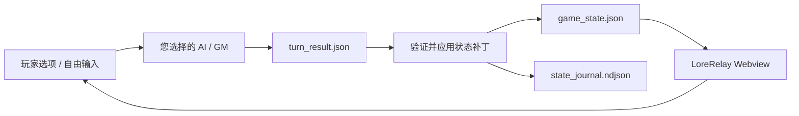
```mermaid
flowchart LR
    Player["玩家选项 / 自由输入"] --> GM["您选择的 AI / GM"]
    GM --> Turn["turn_result.json"]
    Turn --> Gate["验证并应用状态补丁"]
    Gate --> State["game_state.json"]
    Gate --> Journal["state_journal.ndjson"]
    State --> UI["LoreRelay Webview"]
    UI --> Player
```

直接覆盖 **`game_state.json`** 为**紧急回退**（手动粘贴或旧版 GM）。此时 `turnResultFallback` 会合成 `turn_result.json`，使检查器、日志与 MediaAgent 走同一路径。

**Cartography 流水线（可选）：** `world_forge.json`（Region 的 `x` / `y` / `biome`）→ 布局 PNG（`world_map.layout.png`）→（可选）ComfyUI ControlNet → `world_map.png` → World 标签页 📍 图钉叠加

---

<a id="screenshots"></a>

## 📸 Screenshots & Demo

上方主界面与以下所有图像均截取自真实 Webview。

<p align="center">
  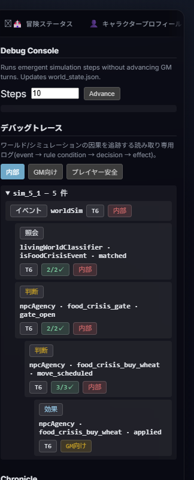<br />
  <sub>Turn Inspector — 按回合可视化骰子台账、statePatch 与 Debug Trace</sub>
</p>

| Remote Play | ComfyUI |
|:---:|:---:|
| 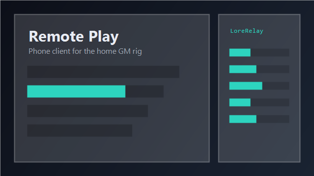 | 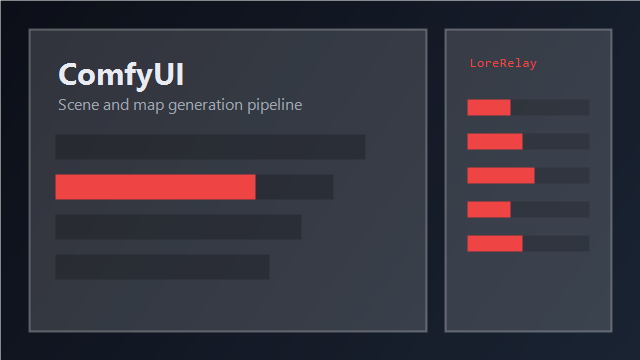 |
| 通过局域网从手机/平板加入，玩家/观战者链接与已连接客户端列表 | GM 描写即时生成场景图像，直接显示在聊天中 |

| Party Director | Lorebook |
|:---:|:---:|
| 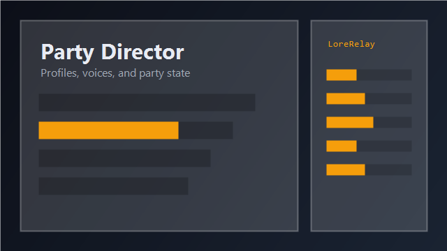 | 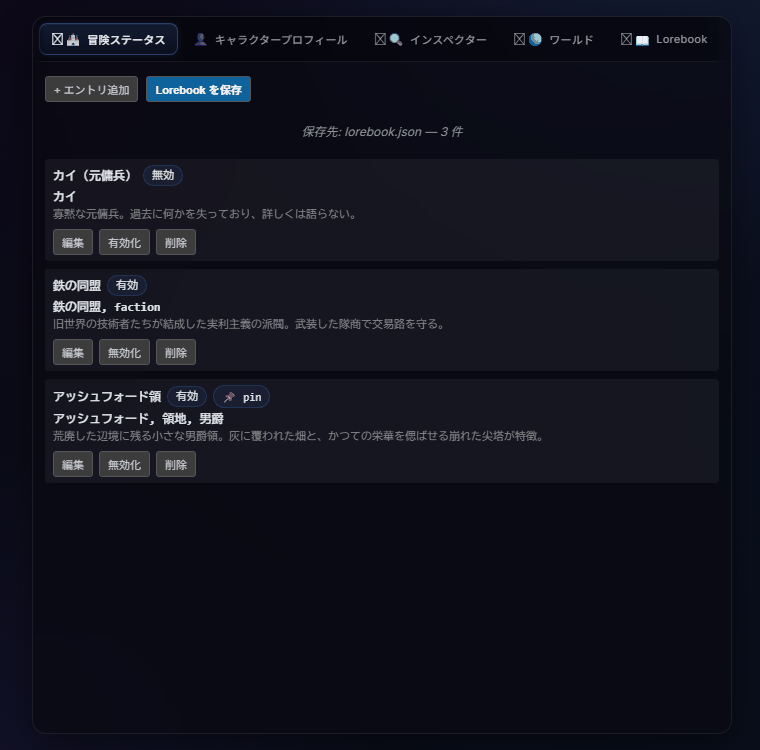 |
| 调整 NPC 发言量、静音/强制发言与关系值 | 浏览、编辑并置顶 ST 兼容的 Lorebook 条目 |

### 🗺️ World Map — 有生命的战役世界

<p align="center">
  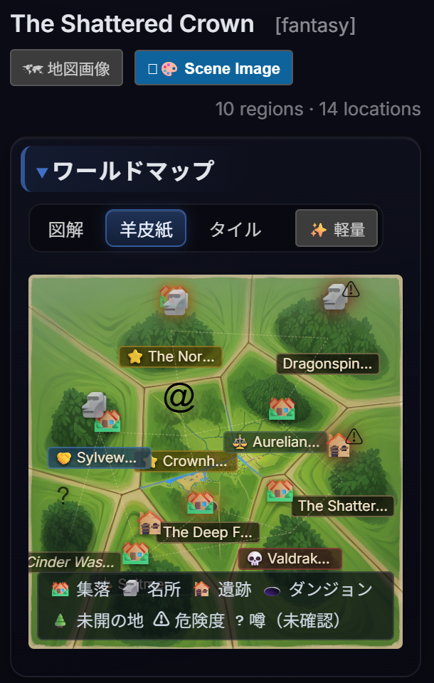
  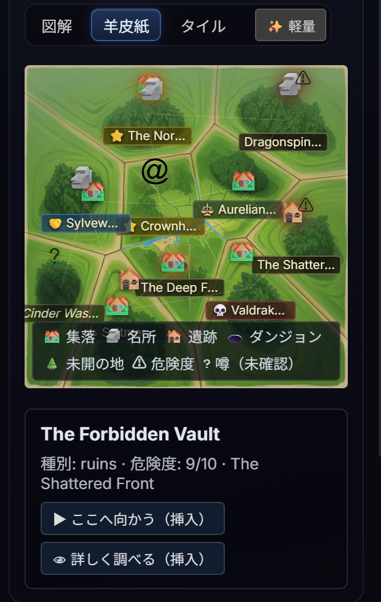
</p>
<p align="center"><sub>城市、遗迹、地下城、港口、山脉、危险地带、未探索边疆、势力领地与贸易路线，尽在一张地图上。点击图钉即可打开该地点的类型/危险度/所属势力详情卡片与快捷操作。背景由 ComfyUI（Illustrious + ControlNet）生成，图钉、标签、贸易路线与战争迷雾（Fog of War）均由 Webview 依据真实世界数据绘制。</sub></p>

### 🕸️ Logistics — 以图论视角阅读贸易网络

<p align="center">
  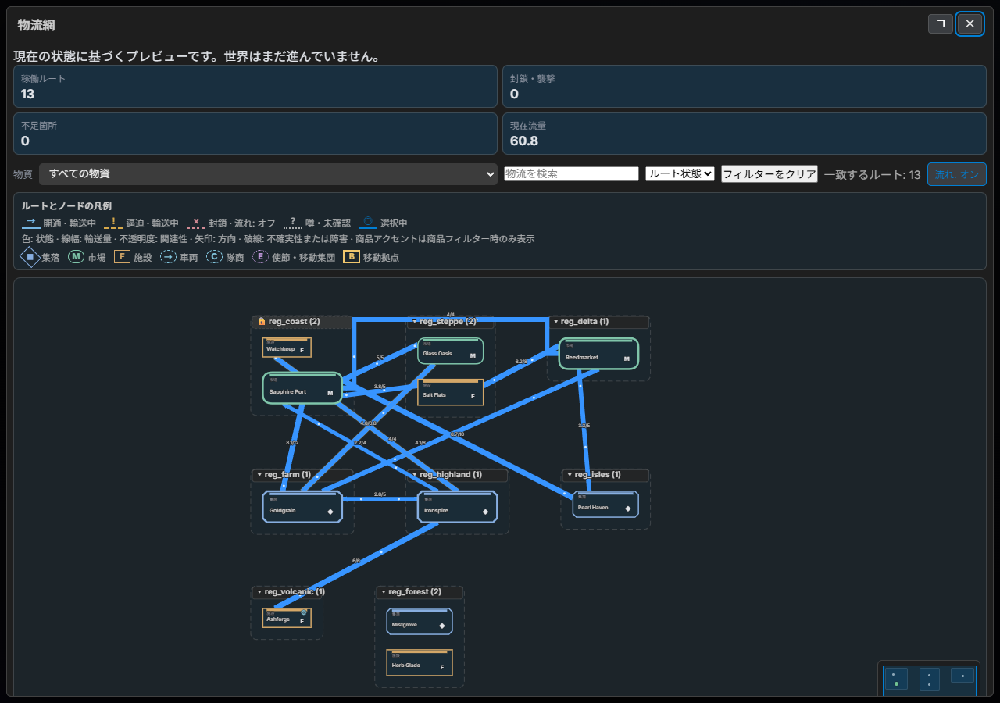
</p>
<p align="center"><sub>据点、市场、设施、移动基地以节点呈现，贸易路线按畅通/紧张/封锁着色为边。可拖拽节点重新排布区域、按商品或路线状态过滤、语义缩放并通过小地图导航——与地图互补，一眼看清货物当下的流向。</sub></p>

<a id="combat"></a>

### ⚔️ Battle View — 战斗是「真相引擎」（experimental）

<p align="center">
  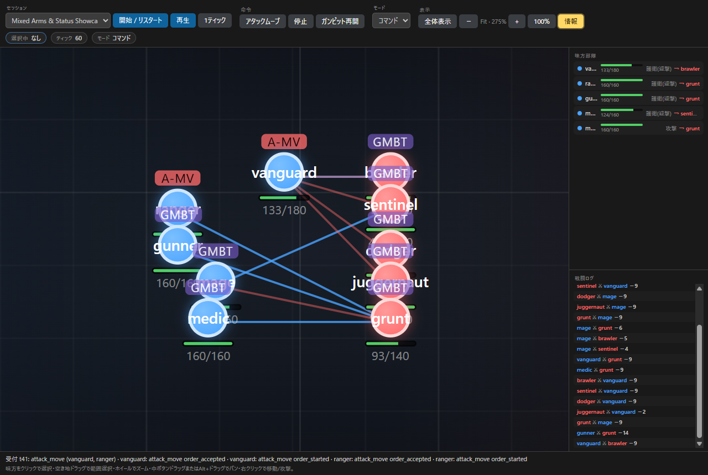
</p>
<p align="center"><sub>紫色 <code>GMBT</code> 表示 gambit（单位按自身规则自动作战），红色 <code>A-MV</code> 表示玩家介入下达的攻击移动命令。右侧为我方部队当前判断与 HP，下方是伤害、治疗与击杀的战斗日志，以及所发出命令的受理回执。</sub></p>

设计上的根本约束是：**玩家透过 GM 的文字体验战斗，而不是盯着一屏移动的圆点**（[`docs/COMBAT_SYSTEM_DESIGN.md`](docs/COMBAT_SYSTEM_DESIGN.md)）。模拟器的价值不在于被观看，而在于产出可供 GM 演绎的确定性事实。

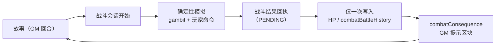
```mermaid
flowchart LR
    Story["故事（GM 回合）"] --> Start["战斗会话开始"]
    Start --> Sim["确定性模拟<br/>gambit + 玩家命令"]
    Sim --> Receipt["战斗结果回执<br/>（PENDING）"]
    Receipt --> Apply["仅一次写入<br/>HP / combatBattleHistory"]
    Apply --> Fact["combatConsequence<br/>GM 提示区块"]
    Fact --> Story
```

- **命令遵循 RTS 惯例** — 左键点选、拖拽框选、右键移动或攻击。未下达命令的单位继续按 gambit 作战，随时可用 `恢复 gambit` 交还自动控制。
- **结果不可篡改** — 回执经校验后仅一次写入 `game_state.json`，并以持久化标记防止重复应用。AI 可以演绎事实，但无法更改胜负、HP 或终止代码。
- **当前可用与尚未实现** — 目前入口为命令（`Open Battle View` / `Start Campaign Combat (Debug)`）。**GM 尚无法在故事推进中自动发起战斗**；单体角色的直接操作（闪避／耐力）已有经测试的逻辑但没有 UI。

所有截图均来自真实 Webview（`webview/index.html` + `script.js` + `style.css`；Battle View 位于 `webview/battle-view/`）的实机截图，替换步骤见 [`DEMO.md`](DEMO.md)。

---

<a id="how-to-play"></a>

## 🚀 How to Play

### 快速开始（约 3 分钟）

1. `LoreRelay: Load Scenario Pack` → `sample-scenarios/lost-catacombs`
2. `LoreRelay: Open Game UI` → 在 Game Rules 中启用 **World Forge**
3. **World** 标签页 → **Parchment** 查看同捆的 `world_map.layout.png` 与图钉（无需 ComfyUI）
4. 进行一回合，查看 GM 响应

完整插画羊皮纸地图：启动 ComfyUI 后执行 `LoreRelay: Generate World Map Image`。详见 [`docs/CARTOGRAPHY_COMFYUI.md`](docs/CARTOGRAPHY_COMFYUI.md)（**可选 / 高级**）。

该扩展使用松散耦合机制，监听 AI 导出的 `turn_result.json`（规范）或 `game_state.json`（回退）并渲染 UI。根据您的环境，有两种游玩方式。

### Mode A: 自动同步模式 (Recommended)
**适用对象：** 使用**可写入本地文件的代理 AI**（如 Antigravity, Grok CLI, VSCode Copilot (Cursor)）的用户。

1. 让 AI 读取包含的 `SKILL.md`，并指示“按照此技能开始担任游戏主持（GM）”。
2. 之后，您只需与 AI 聊天即可。AI 会自动掷骰子、使用 ComfyUI 生成图像并更新 `game_state.json`。
3. 在 VSCode 中保持此扩展打开，UI 将实时更新！

> **对于 Antigravity 用户：** 您可以轻松操作：点击 Webview 中的选项 → 复制到剪贴板 → 粘贴到 Antigravity 聊天中 → 自动更新。详情请参阅 [`ANTIGRAVITY_GUIDE.md`](ANTIGRAVITY_GUIDE.md)。

### Mode B: 手动复制粘贴模式
**适用对象：** 使用标准网页版 ChatGPT, Claude, 或 Gemini 的用户。

1. 将 `SKILL.md` 的文本复制并粘贴到网页版 AI 中，并说：“请按照这些指示担任 GM。”
2. 复制 AI 返回的 JSON 代码块，并手动在 VSCode 中覆盖保存 `game_state.json`。
3. 保存的瞬间，VSCode UI 会自动切换。（图像生成和掷骰子需手动执行，或使用网页版 AI 的功能代替）。

---

<a id="setup"></a>

## 🛠️ Setup & Installation

### 1. Prerequisites
- **VS Code** (v1.93+) — 必需
- **Python** — 必需（掷骰、布局地图、GM 桥接脚本）
- **TextAdventureGMSkill** — 必需（`SKILL.md` 与 `scripts/`，放在本仓库旁）
- **ComfyUI** — *可选*（仅场景图与羊皮纸地图；需 API 模式启动）
- **VLM** — *可选*（Visual Memory / Soulgaze，Ollama 或 OpenRouter）

### 2. Quick setup (recommended)

将 `TextAdventureGMSkill` 放在 `text-adventure-vsce` 旁边（例如：在 `C:\AI\` 目录下）：

**Windows (PowerShell):**
```powershell
cd text-adventure-vsce
.\scripts\setup.ps1
```

**macOS / Linux:**
```bash
cd text-adventure-vsce
chmod +x scripts/setup.sh
./scripts/setup.sh
```

脚本将执行：
- 自动检测 GM 技能路径 → 生成 `my-adventure/.vscode/settings.json`
- `npm install` / `compile` / `test`
- (可选) VSIX 打包 → `code --install-extension`
- 生成 `text-adventure.code-workspace`（3 个根目录：Game + Skill + Extension）

选项示例：`-Locale en` `-GmProvider clipboard` `-SkipVsix`

### 3. Manual extension installation
1. 克隆或下载此代码库。
2. 在 VSCode 中打开文件夹，并在终端中运行 `npm install`。
3. 按 `F5` 键开始调试扩展，或使用 `npx @vscode/vsce package` 安装 VSIX。
4. 从命令面板 (`Ctrl+Shift+P`) 运行 `LoreRelay: Open Game UI` 以打开面板。

### 4. Configuration
在 VSCode 设置中搜索 `textAdventure.skillPath`，并指定随附的 `comfyui_generate.py` 脚本的绝对路径。

主要设置：

- `textAdventure.skillPath` — `comfyui_generate.py` 的绝对路径
- `textAdventure.locale` — UI / 错误 / GM 提示的语言（`ja` / `en` / `zh-CN` / `zh-TW`）。也可以从 Webview 标题栏的 🌐 更改。
- `textAdventure.gmBridge.provider` — `grok` / `ollama` / `koboldcpp` / `clipboard` / `command` (详情见 `GM_BRIDGE_PRESETS.md`)
- `textAdventure.grokBridge.*` — 启用 Grok Build 自动发送、CLI 路径、后备设置
- `textAdventure.imageGen.*` — ComfyUI / Stability Matrix URL、checkpoint、workflow、生成尺寸
- `textAdventure.imageGen.controlNet` — Cartography 用 SDXL Canny 模型名（可选）
- `textAdventure.vlm.*` — Soulgaze 用 VLM（`provider` / `model` / `endpoint`）
- `textAdventure.mediaAgent.*` — 后台图像队列、GM 流式早期 BGM/SFX
- `textAdventure.remotePlay.*` — 端口、`bindAddress`、`mediaUrlTtlSec`（签名媒体 URL 有效期）等
- `textAdventure.bgm.*` — BGM 配置文件和音量
- `textAdventure.sfx.*` — SFX 配置文件和音量

### 5. 命令面板（主要命令）

| 命令 | 用途 |
|------|------|
| `LoreRelay: Open Game UI` | 打开主 Webview |
| `LoreRelay: Load Scenario Pack` | 加载含 `scenario.json` 的文件夹 |
| `LoreRelay: Generate World Forge` | 程序化生成 `world_forge.json` |
| `LoreRelay: Generate World Map Image` | 通过 ComfyUI 生成羊皮纸地图（可选） |
| `LoreRelay: Open Battle View` | 打开战斗面板（会接管进行中的会话） |
| `LoreRelay: Start Campaign Combat (Debug)` | 从战役开始战斗会话（当前入口） |
| `LoreRelay: Apply Pending Combat Outcomes` | 将待处理的战斗回执写入 `game_state.json` |
| `LoreRelay: Abort Campaign Combat` | 中止进行中的战役战斗 |
| `LoreRelay: Start an adventure with this character` | 把 Parlor 对话升级为 Campaign |
| `LoreRelay: Start Remote Play (LAN)` | 发布局域网加入 URL |
| `LoreRelay: Export Replay (Markdown/HTML)` | 将冒险日志导出为可阅读文档 |
| `LoreRelay: Run Workspace Sanity Check` | 检查工作区状态文件 |
| `LoreRelay: Check for Updates` | 检查更新的 VSIX 版本 |
| `LoreRelay: List Image Models` | 列出 ComfyUI checkpoint |
| `LoreRelay: Import SillyTavern Character Card` | 导入 ST 角色卡 |
| `LoreRelay: Import SillyTavern Lorebook` | 导入 ST lorebook |
| `LoreRelay: Export Scenario Pack (Workshop ZIP)` | 导出分发用 ZIP |
| `LoreRelay: Validate Scenario Pack` | 验证包结构 |

在命令面板输入 `LoreRelay:` 可查看全部 34 条命令。

### 6. 工作区主要文件

| 文件 | 作用 |
|------|------|
| `game_state.json` | UI 渲染的合并游戏状态 |
| `turn_result.json` | 每回合 GM 输出（规范持久化） |
| `state_journal.ndjson` | statePatch 审计日志 |
| `world_forge.json` | 静态世界设计（区域、派系、NPC 种子） |
| `world_state.json` | 动态模拟（已访问、派系资源等） |
| `visual_memory.json` | VLM 情景记忆 |
| `game_history.json` | 冒险日志（重启后恢复） |
| `world_map.layout.png` / `world_map.png` | Cartography 布局 / 羊皮纸图 |
| `npc_registry.json` | NPC 认知与关系 |
| `.text-adventure/combat/` | 战斗回执（`pending/` 未应用 · `applied/` 已应用标记 · `injected/` 已交给 GM 的记录）|

### 7. Scenario Packs
从命令面板运行 `LoreRelay: Load Scenario Pack` 并选择包含 `scenario.json` 的文件夹。

**同捆示例（6 本）** — `sample-scenarios/`：

| 文件夹 | 类型 | 主题 | 备注 |
|--------|------|------|------|
| `harbor-mist` | 港口悬疑 | modern | Start Hub **🎮 试玩演示**——无需设置，约 15 分钟 |
| `lost-catacombs` | 经典地牢探索 | fantasy | Start Hub **🗺️ 地图演示**——**Cartography 演示**（`world_forge.json` + `world_map.layout.png`） |
| `scrapbound-settlement` | 末日拾荒 | postapoc | Start Hub **🧰 拾荒者演示**——Campaign Kit + Commerce 主线循环 |
| `debug-sandbox` | 开发者工具 | — | Start Hub **🔧 调试沙盒**——用自然语言即时操作好感度、迷雾与世界回合（无需 GM） |
| `neon-rain` | 赛博朋克黑色电影 | cyberpunk | 手动加载 |
| `trade-routes` | Living World 贸易演示 | fantasy | 手动加载——Commerce / NPC Agency 展示 |

GM 技能端：`TextAdventureGMSkill/scenarios/`。

### 8. SillyTavern 兼容与 Workshop

- 通过上述命令或 Webview 导入 ST 角色与 lorebook。详见 [`SILLYTAVERN_COMPAT.md`](SILLYTAVERN_COMPAT.md)
- 导出并验证场景包可生成 Workshop 用 ZIP（市场发布调研中）

### 9. 模型与 ComfyUI 预设
- [`MODEL_PRESETS.md`](MODEL_PRESETS.md) — 从 `presets/` 复制 JSON
- [`COMFYUI_WORKFLOWS.md`](COMFYUI_WORKFLOWS.md) — 场景与 Cartography 工作流
- Cartography（可选）：[`docs/CARTOGRAPHY_COMFYUI.md`](docs/CARTOGRAPHY_COMFYUI.md) · [`docs/CARTOGRAPHY_WORKFLOW_CONTRACT.md`](docs/CARTOGRAPHY_WORKFLOW_CONTRACT.md) · [`docs/CARTOGRAPHY_DESIGN.md`](docs/CARTOGRAPHY_DESIGN.md)
- 演示步骤：[`sample-scenarios/lost-catacombs/CARTOGRAPHY_DEMO.md`](sample-scenarios/lost-catacombs/CARTOGRAPHY_DEMO.md)

### 10. 文档索引

| 文档 | 内容 |
|------|------|
| [`AI_HANDOVER.md`](AI_HANDOVER.md) | 面向其他 AI 的交接说明 |
| [`CHANGELOG.md`](CHANGELOG.md) | 版本历史 |
| [`GM_BRIDGE_PRESETS.md`](GM_BRIDGE_PRESETS.md) | Ollama / KoboldCPP 预设 |
| [`ANTIGRAVITY_GUIDE.md`](ANTIGRAVITY_GUIDE.md) | Antigravity 工作流 |
| [`SILLYTAVERN_COMPAT.md`](SILLYTAVERN_COMPAT.md) | SillyTavern 兼容规格 |
| [`docs/WORLD_AND_VISUAL_MEMORY.md`](docs/WORLD_AND_VISUAL_MEMORY.md) | World / Visual Memory 架构 |
| [`DEMO.md`](DEMO.md) | 替换截图与演示 GIF |

---

## 🗺️ Roadmap

> **版本正本：** `package.json`（见上方徽章）· [`CHANGELOG.md`](CHANGELOG.md) · [`docs/VERSION_TRUTH.md`](docs/VERSION_TRUTH.md) · 任务看板 [`AI_ROADMAP.md`](AI_ROADMAP.md)。多 AI 接力开发下版本几乎每天推进，此表为世代摘要，并非逐补丁清单。

**已实现（摘要）**

| 世代 | 主要内容 |
|------|----------|
| **v1.3–1.7** | World Forge / 涌现模拟 / Visual Memory / Audit Wave / Cartography |
| **v1.10–1.11** | Quest Board（Event-to-Quest）· Agentic GM · Git Timeline · Adaptive TTS |
| **v1.13–1.18** | Tile Overmap · Cartography C8/C9 · Debug sandbox · 世界时间推进 |
| **v1.19–1.21** | Chronicle · Pacing Director · 派系声望 · 旅途遭遇 · Replay Export |
| **v1.23–1.33** | Living World 经济（Commerce / Agency）· Commerce UI · 信任联动位置 · **LW3 羁绊**（NPC↔NPC / 玩家↔NPC / 贸易联动） |
| **v1.34** | Parlor Mode（1对1角色扮演）· ST 卡片导入 |
| **v1.39–1.40** | Domain Mode（D1–D5）· D3 World 标签页 UI · F7 谒见 / F8 邻国 / F9 派遣 / F10 合战 |
| **v1.41–1.44** | Guild Master G1–G4（每周结算 · 委托板 · 队伍派遣 · 离队漂移） |
| **v1.45–1.52** | Campaign Kit Phase A–G（7 种题材预设 · 发现物台账 · 鉴定状态机 · 战役资源） |
| **v1.53** | World Observatory（市场价格历史 · 编年史时间线） |
| **v1.58+** | Context Engine P0（Prompt Inspector 的 chunk 生命周期追踪） |
| **v1.69–1.75** | Settlement Mode（等距/立体模型视图）· Vehicle & Mobile Base（车队管理 · 移动基地） |
| **v1.77–1.78** | Debug Trace / Inspector Phase B · MEDIA-M1 兼容性关卡 · ComfyUI 任务生命周期修复 |
| **v1.79–1.83** | NOAI Play（确定性旅行/经济处理）· 按资源分级的 5 档经济难度（abundant→barren） |
| **v1.84.0–1.84.16** | Logistics Graph Canvas（交易网络交互式可视化）· 响应式三段式 Webview 外壳 |
| **v1.84.17–1.84.30** | **战斗系统** — Battle View · gambit + RTS 命令主干（移动 / 攻击 / 攻击移动 / 停止 / 恢复）· 确定性重放哈希 · 战斗分析 · Story⇄Combat Bridge V1-A/B/C（回执 → `game_state` → `combatConsequence` 提示） |
| **v1.84.31–1.84.32** | Genre World Presets（冻结且带版本管理的题材世界生成注册表，附 provenance 复现检查） |

详见 [`docs/FEATURE_MATRIX.md`](docs/FEATURE_MATRIX.md) 与 `sample-scenarios/trade-routes`。

**计划中**

- 战斗：让 GM 在故事推进中自然发起战斗（目前仅能由命令启动）
- 战斗：单体角色直接操作 UI（逻辑已完成，UI 尚未开始）
- 世界：biome / 水系地图基盘（设计关卡已通过，实现待启动）
- Overmap 图像瓦片、hazard 单行 GM 注入
- Prompt budget 优先级滑动（长会话）
- Workshop / 市场发布调研

---

## 🤝 Contributing & Support
该项目是一个实验性的 OSS，旨在成为 AI 时代的“文字冒险新游乐场”。
非常欢迎提交错误报告和请求（PR）！

如果这个项目让您感到兴奋......
👉 **[Buy me a coffee ☕](https://ko-fi.com/promptpalette)**

---
**Enjoy your adventure!**
