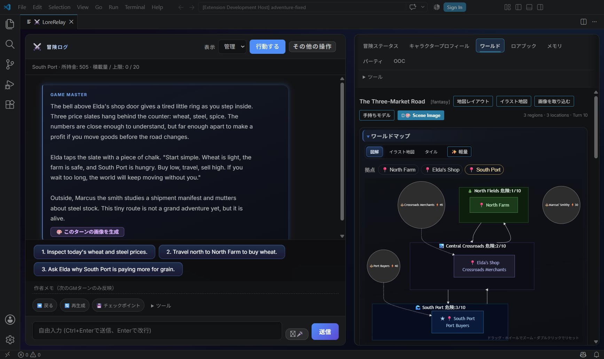
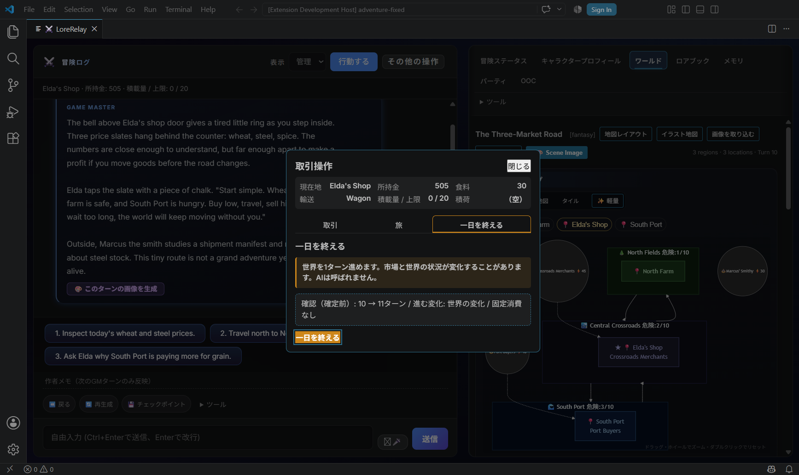
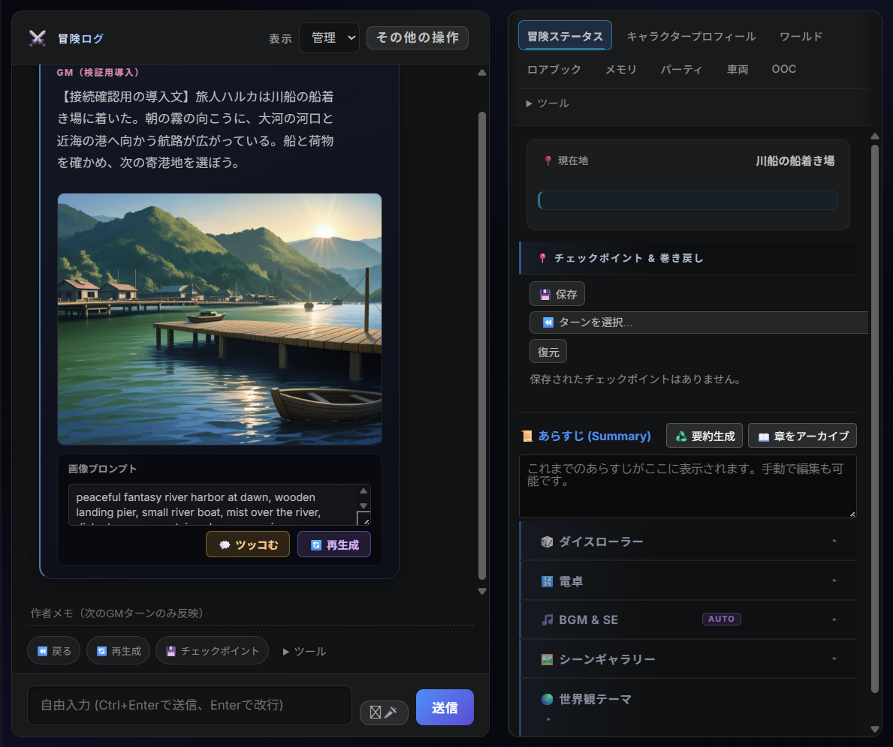
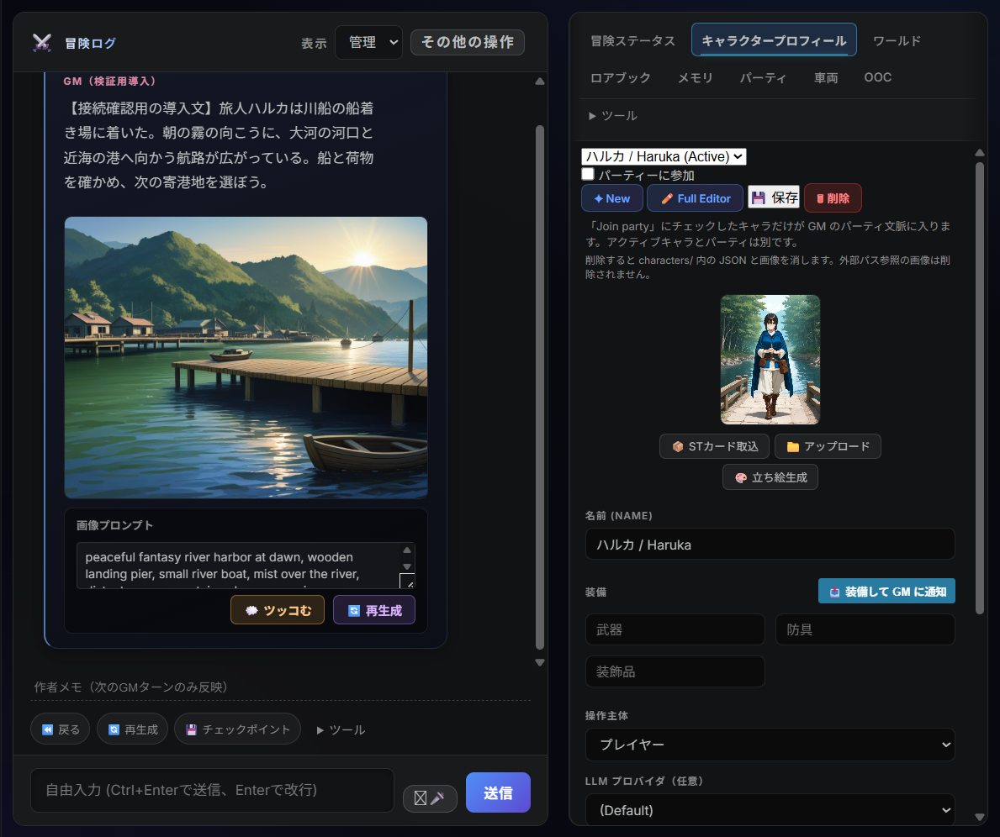
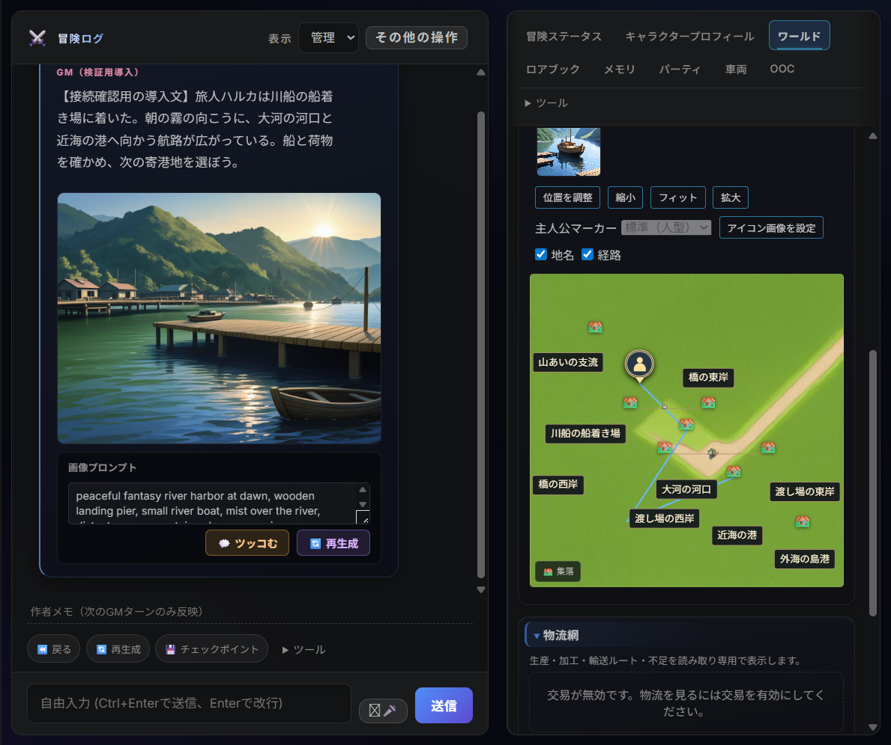
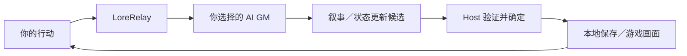

<h1 align="center">LoreRelay</h1>
<p align="center"><strong>踏上旅途。遇见谁。用自己的话，决定接下来怎么走。</strong><br /><sub>Bring your AI. Keep your world.</sub></p>

<p align="center"><a href="README.md">日本語</a> · <a href="README_en.md">English</a> · <a href="README_zh-CN.md">简体中文</a> · <a href="README_zh-TW.md">繁體中文</a></p>

在雾气笼罩的港镇追查谜团。看着地图深入地下迷宫。在荒废的世界里搜集物资，再把它们带回据点。也可以暂时放下冒险，和喜欢的角色好好聊上一晚。

**LoreRelay 是一款让你用自己的话决定行动、由 AI 游戏主持人继续推动故事的角色扮演 RPG。** 可以从和一个角色的对话开始，也可以和伙伴一起旅行，逐渐玩成包含探索、交易与据点经营的长期战役。先从你想去的世界、想认识的人开始就好。

这是一个运行在 VS Code 中、仍在开发的开源作品。你可以选择支持的 AI 来担任 GM，同时把角色、世界设定和冒险记录保存在自己的电脑上。

[能怎么玩？](#onboarding) · [开始第一场冒险](#how-to-play) · [看看更多画面](#screenshots) · [可用 AI 与费用](#ai-connections) · [安装](#setup)

<p align="center"><a href="docs/assets/gameplay-v1.89.3/south-map.png"></a></p>

<p align="center"><sub>由 AI 操作实际游戏的 1.89.3 候选版本游玩记录。在内置交易世界中，以主角 Haruka 购买小麦、前往南港、卖出并返回。左侧开场文字来自内置场景，并非新的 GM 回复。</sub></p>

**500 → 489 → 505 credits。** 在画面中核对货物与余额后，继续完成了日推进、接取任务、保存与恢复游戏。这次 1.89.3 检查中，Grok Build 需要重新登录，尚未进行新的 GM 对话。[实际操作、生成提示词与验证范围](docs/GAMEPLAY_PLAYCHECK.md)

**1.89.4 候选版通过 Codex GM 继续同一次冒险。** 记录了 24 次真实回复、23 个已接受回合，验证了交易、任务完成、重启后的对话，以及通过实际提示词重新提供过去的约定。这是 AI 操作的试玩；独立任务奖励尚未验证，人物姓名的一致性仍有问题。[实际提示词、失败记录与确认限制](docs/REAL_GM_PLAYCHECK.md)

**1.89.5 候选版继续由 AI 操作、使用 Codex GM：** 久别重逢时曾出现错误姓名，修复并重启 Host 后，以不包含答案的同一问题重新询问，通过再次提供 29 回合前的记录，正确回答了托马斯的姓名与约定。另一个基于既有数据的独立测试场景确认了信任值 50→60、1 条记忆，以及重启或重放同一候选结果后不会重复发放奖励。奖励是信任而非金钱；物品交付条件不会自动判定，人物也不会自动注册为 NPC。[实际提供的历史、失败与修复后的验证及限制](docs/NPC_IDENTITY_PLAYCHECK.md)

**1.89.6 候选版向 GM 提供公开地点与实际移动界面的目的地预览，** AI 在本机操作确认，GM 不会把训练场、岗哨等尚未确认的地点当作已有的移动目的地。对过去购买的回答依据既有界面交易记录（10 份小麦、支出 90 credits），余额仍为 608、货舱仍为空；但这些记录并不涵盖 GM 的所有交易，不能仅因没有记录就断定交易未发生。GM 段落中连续的字面字符 `\n\n` 仅在显示时修正，原文保持不变。[地点与购买历史的依据及验证范围](docs/GM_GROUNDING_PLAYCHECK.md)

**1.89.7 候选版的纠正与恢复：** Undo／回退只回退对话，保留当前资产、位置和任务等游戏状态。若要回退整个游戏，请恢复行动前保存的完整检查点。Campaign 或包含世界、资产等游戏状态的存档会阻止“重新生成”，以避免重复执行同一行动。可以通过编辑消息纠正叙述。

作者备注只适用于下一次回复。需要长期保留的设定或 GM 方针，请保存为置顶的 Lorebook 条目：无需关键词，在禁用或删除前作为持续指示使用。优先把编辑过的历史提供给 GM，并不保证回复会遵循它。在 AI 操作实际 Host 的检查中，即使已发送纠正后的“黄铜风铃”，GM 仍有回答“绳子”的情况。这些检查与人类试玩分开记录。[操作步骤、重启／Undo 证据及限制](docs/RECOVERY_PLAYCHECK_2026-09-20.md)

| 结束交易，迎接下一天 | 留下旅途中的风景 |
| :---: | :---: |
| <a href="docs/assets/gameplay-v1.89.3/trade-return.png"></a> | <a href="docs/assets/gameplay-v1.89.3/south-port.png"></a> |

<p align="center"><sub>左图是 AI 操作的实际游戏画面。右图是 ComfyUI 生成的地点图片，不代表准确还原了地形或建筑。图片保存为南港的候选图，并确认了移动及 Host 重启后的重新显示。这与人类亲自游玩的 Human Play 区分记录。</sub></p>

**[▶ 用 75 秒观看之前的 1.85.3 演示](docs/PUBLIC_LAUNCH_MEDIA.md)** — 和 GM 对话 → 在市场购买 → 重新打开面板。视频使用用于验证的示例世界录制，并缩短了等待时间。

<a id="onboarding"></a>

## 下一步，用你自己的话说出来

“去港口打听消息。”“调查遗迹。”“今天先回城。”你可以选择系统给出的行动，也可以直接写下自己真正想做的事。

**阅读场景 → 行动 → 看 GM 的描写与已经确定的结果 → 决定下一步。**

想聊天时，就把注意力放在人物之间的交流上。想冒险时，就打开地图或追踪任务。世界启用了交易时，可以看着资金和载重决定要买什么。阅读故事和做游戏里的判断，可以按自己的节奏来回切换。

### 可以追查谜团，也可以靠从废墟带回来的东西生活

不必一开始就把整个世界设定写完。内置场景提供了几种不同的入口。

| 今晚想玩什么？ | 场景 |
| --- | --- |
| **雾港里的谜团。** 从人物对话与调查开始，一步步追进故事深处。 | `harbor-mist` |
| **地下迷宫探索。** 看着地图，踏进还没有去过的地方。 | `lost-catacombs` |
| **末日后的拾荒生活。** 探索废墟，把找到的物资带回去，再在据点与交易网络中生活。 | `scrapbound-settlement` |
| **赛博朋克故事。** 在霓虹照亮的世界里进行角色扮演。 | `neon-rain` |
| **以经商为主轴的旅程。** 走访市场，在价格、库存和载重之间做交易选择。 | `trade-routes` |

想自己搭舞台，可以在 Start Hub 选择“开始建立世界”，设置世界类型、规模和连接密度，预览后选择“使用此世界”。也可以带入已有的角色和世界设定。也支持 SillyTavern 角色卡与 Lorebook。

### 想和一个角色慢慢聊，还是走进整个世界？

| 你想怎么玩 | 模式 |
| --- | --- |
| **和喜欢的角色好好聊。** 从一对一对话和角色扮演开始。 | **Parlor** |
| **以这个世界居民的身份交谈。** 让世界设定成为背景，与其中的人物互动。 | **In-World** |
| **和伙伴旅行，在探索中经营生活。** 使用任务、资源、交易，以及你启用的其他系统。 | **Campaign** |

不需要一开始就把所有系统都打开。世界推进方式也可以从**安稳生活、持续变化的世界、具有挑战性的经营**开始，再分别调整经济、食物需求、冲突和关系推进。交易、据点与世界模拟中包含实验性功能，可用范围会随场景与设置而变化。[各功能状态](docs/FEATURE_MATRIX.md)

### 把喜欢的场景留成旅途中的一张图

如果读到的风景、或某段让你想记住的对话值得画下来，就打开 **“Illustrate this scene / 将这个场景画出来”**。编辑画面指示，把提示词复制到 ChatGPT、Gemini、Grok 或其他图像工具，再把生成结果带回 LoreRelay。喜欢的图片可以设为该回合的插图或当前背景。

提示词生成与图片导入不需要额外的 AI 连接或 API Key。实际生成条件与使用额度取决于你使用的外部服务。ComfyUI 自动生成仍是另一项可选功能。[场景图像化指南](docs/VISUAL_COMPOSER_V1.md)

下一次继续冒险时，从保存下来的世界接着玩。也可以回看对话记录、Lorebook 与 Chronicle，或者把旅程导出为 Markdown / HTML 回放。

<a id="how-to-play"></a>

## 开始第一场冒险

1. **准备游玩环境。** 完成[安装](#setup)，然后打开一个专门用于游玩的文件夹。要体验最新功能，请从当前源码启动。
2. **选择 GM。** 从命令面板打开 `LoreRelay: AI Connections`（日文 UI 为 `LoreRelay: AI接続`），完成所需连接的登录和设置。[不同连接与费用](#ai-connections)
3. **选择舞台和角色。** 运行 `LoreRelay: Open Game UI` → Start Hub →“开始建立世界”，进入世界生成设置，预览后选择“使用此世界”。采用世界后，通过“创建主角”建立主角，或选择已有角色。也可以使用“其他开始方式”→“新建主角”。演示列表或 `LoreRelay: Load Scenario Pack` 提供内置场景。已有存档则选择 Continue。
4. **发出第一句话。** 选择行动或直接输入自己的做法，然后确认 GM 的描写和已经确定的结果。启用 Commerce 的世界里，可以从统一的 Actions 入口进行交易、市场移动和结束一天。

即使还没有连接 AI，也可以先显示场景的开场界面。要让 GM 继续推动故事，则需要先完成连接准备。不清楚设置方式时，请参阅 [AI Connections](docs/AI_CONNECTIONS.md)。

### 之前在 1.89.2 中验证的图片与航线

使用同一个航线演示世界和主角 Haruka，在隔离的 1.89.2 扩展 Host 与实际 Webview 中确认。场景、角色和地图由本地 ComfyUI 生成。开场文字是固定的验证素材，并非与 AI GM 的真实对话或人类游玩录像。 [设置、实测和验证范围](docs/COMFYUI_LOCAL_PLAYCHECK.md)

| 场景插图 | 角色立绘 |
| :---: | :---: |
|  |  |



这张地图用于确认生成、导入和显示流程。河流与海岸的描绘仍不充分，不能作为准确还原地形的验证案例。地点和航线以叠加的游戏数据为准。

<a id="screenshots"></a>

## 冒险继续下去，还会看到这些

下面是一些能够扩展玩法的功能画廊。地图 UI、物流、场景图片、伙伴、Lorebook 和战斗部分使用了较早的展示截图，因此布局可能与当前版本不同。点击图片可放大。

### 有时沉浸于故事，有时俯瞰整个世界

想读故事时用**故事显示**，想看资源与地图时用**管理显示**，想欣赏背景和立绘时用**演出显示**。这些只改变呈现方式，不改变玩法模式与世界规则。即使完全不用图片也能玩。

| 在明亮界面中跟进对话 | 在沉静界面中阅读故事 |
| :---: | :---: |
| <a href="docs/assets/readme-light-v1.85.2.png"></a> | <a href="docs/assets/readme-story-v1.85.2.png"></a> |

<p align="center"><sub>1.85.2 中显示同一段已保存的示例对话。更换主题不会改变对话内容。</sub></p>

### 打开地图，就会有想去的地方

平原尽头的城镇、穿过森林的道路、还没调查过的遗迹。生成的地图背景上可以叠加地点与未探索区域，让你打开目的地信息，再决定下一趟旅程去哪里。

<p align="center"><a href="docs/assets/worldmap-showcase-fixture/world_map.png"></a></p>

<p align="center"><sub>内置的 ComfyUI 地图背景示例。地点、迷雾与交易路线会在游戏画面中作为独立图层叠加。</sub></p>

| 在地图上寻找下一站 | 打开遗迹信息，考虑出发前的准备 |
| :---: | :---: |
| <a href="docs/assets/screenshot-world-map.png"></a> | <a href="docs/assets/screenshot-world-map-detail.png"></a> |

### 卖掉带回来的东西，为下一趟旅程做准备

有了物资之后，就要决定什么卖掉、什么留下。市场会在交易前显示价格、库存、资金和载重。探索并不只是抵达终点——带回来的东西也会影响之后的生活与下一趟旅程。

<p align="center"><a href="docs/assets/public-launch-v1.85.3/trade-committed.jpg"></a></p>

<p align="center"><sub>1.85.3 中实际完成一次购买后的结果：资金 20→11，小麦 0→1。界面会显示买了什么、花了多少钱。</sub></p>

如果想更偏经营一些，可以打开物流网络，把市场、聚落与设施连接起来。领地、行会、车辆据点等系统也作为可选的实验功能存在。如果你只想聊天，这些都不必启用。

<p align="center"><a href="docs/assets/screenshot-logistics.png"></a></p>

<p align="center"><sub>俯瞰地点之间连接关系的物流画面。这是较早的功能展示图，显示的是当前状态预览。</sub></p>

### 留下风景，也和伙伴多聊一会儿

地下回廊里的灯光、旅途中看见的远景。给场景配上图片，也会让人更想回头翻看曾经的对话。下面是现有 ComfyUI 联动生成的场景图片示例。

<p align="center"><a href="docs/assets/screenshot-comfyui.png"></a></p>

伙伴对话中，可以调整谁更常说话，以及人物之间的关系。角色和世界设定可以整理到 Lorebook。场景图、立绘、BGM／音效、TTS 也都只需要在你想用时添加。图像与音频等外部工具、模型需要另外准备。

| 想多听谁说一些？ | 把人物与世界设定放在手边 |
| :---: | :---: |
| <a href="docs/assets/screenshot-party-director.png"></a> | <a href="docs/assets/screenshot-lorebook.png"></a> |

<p align="center"><a href="docs/assets/hero-ui.jpg"></a></p>

<p align="center"><sub>表现冒险氛围的概念插图，并非实际操作画面。 <a href="docs/assets/README.md">图片来源</a></sub></p>

<a id="combat"></a>

### 安排队伍如何行动（实验中）

战斗模拟器与 Battle View 可以查看我方／敌方 HP、Gambit、移动命令与战斗日志。这是一项独立于对话和经营循环之外、用于尝试战斗玩法的实验功能。

<p align="center"><a href="docs/assets/screenshot-battle-view.png"></a></p>

**目前战斗需要从命令启动。** 尚未提供由 GM 从剧情自动切入战斗的流程，也没有直接控制单一角色的操作 UI。[功能状态](docs/FEATURE_MATRIX.md) · [战斗设计与限制](docs/COMBAT_SYSTEM_DESIGN.md)

还可以通过局域网 **Remote Play** 加入或旁观。它并不是以直接暴露到公网为前提设计的功能。

<a id="ai-connections"></a>

## 连这场冒险的 GM，也由你来选

LoreRelay 的 GM 可以来自支持的订阅制官方客户端、按量计费 API 或本地 LLM。如果你已经在使用某个支持的 AI，也可能直接利用该账号现有的使用额度。

**订阅额度不代表免费或无限使用。** 可用模型、额度和计费方式取决于连接服务与账号。

| 服务 | LoreRelay 的 GM 连接方式 | 使用额度／计费 | 真实服务验证 |
| --- | --- | --- | --- |
| **ChatGPT / Codex** | 官方 Codex App Server | ChatGPT 账号中的 Codex 使用额度 | 已验证 |
| **Grok** | Grok Build / ACP | 官方客户端账号的使用额度 | 已验证 |
| **Gemini / Antigravity** | Antigravity CLI | 官方客户端账号的使用额度 | 已验证 |
| **Claude** | Claude Code | 支持的 Claude 订阅认证 | 已实现；未验证 |
| **DeepSeek** | OpenAI 兼容 API | API Key；按量计费 | 已实现；未验证 |

验证范围是 **2026-09-08 时的 1.85.2**。前三种连接均在隔离的真实 Host／Webview 中，分别完成了 Campaign 与纯对话模式各 3 回合以及停止用例。这并不保证所有模型与环境都能得到同样结果。[已测试模型、客户端版本与连接步骤](docs/AI_CONNECTIONS.md)

在连接菜单中，Codex／Claude Code 选择“GMとして使う”，Google／Grok 选择“Antigravity CLI — GM”／“Grok Build — GM”。完成官方登录与发送同意后再设置模型。能够取得候选模型列表的连接会提供选择器，必要时也可以手动输入。

现有的 **VS Code LM、Ollama、KoboldCPP、OpenRouter、剪贴板／手动联动**也仍然可用。VS Code LM 只能使用 VS Code 模型 API 暴露的模型。LoreRelay 不会把普通 Web 聊天订阅转换成 API Key。[旧版 Bridge 设置](GM_BRIDGE_PRESETS.md)

<details>
<summary>会把什么发送给 AI，以及游戏结果如何确定并保存</summary>

AI Connection V2 不会让 AI 直接编辑游戏的权威数据文件。Host 会通过现有 Accepted Turn 流程验证候选结果，只保存已经确认的内容。流式输出中的文字仍然是未确定状态。


```mermaid
flowchart LR
    Human["你的行动"] --> Host["LoreRelay"]
    Host --> AI["你选择的 AI GM"]
    AI --> Candidate["叙事／状态更新候选"]
    Candidate --> Accept["Host 验证并确定"]
    Accept --> Local["本地保存／游戏画面"]
    Local --> Human
```

首次连接时会显示即将发送的内容。除你的输入和对话记录外，GM 上下文在必要时也可能包含非公开的世界设定。**LoreRelay 不会自动切换到 API 计费、自动更换模型或自动重发请求。** “连接已准备好”和“模型实际成功响应”也会分别报告。

NOAI 可以在不调用 AI 的情况下推进支持的世界处理，以及交易、市场移动和结束一天。它并不能替代能够自由生成剧情的 GM。

除了面向玩家的 GM 连接外，LoreRelay 还提供 AI Player 操作委托、隔离 QA 与明确的操作录制。Player 当前只覆盖**交易、市场移动、结束一天**三种操作。QA 的内部信息与 Player 可见的公开信息使用不同会话。AI 自动验证不会被当作真人试玩。[Player Lab／QA 与记录](docs/AI_CONNECTION_V2_PLAYER_LAB.md)

</details>

<a id="setup"></a>

## 安装

**本 README 描述的是 `main` 上的功能，已发布的 VSIX 不一定包含完全相同的功能。** 要尝试较新的 AI 连接或场景插图流程，请从当前源码启动。[发布文件](https://github.com/GGF1sh/LoreRelay/releases) · [版本事实来源](docs/VERSION_TRUTH.md)

### 从当前源码启动

请准备 VS Code **1.93 或更高版本**、Node.js／npm 和 Git。

```sh
git clone https://github.com/GGF1sh/LoreRelay.git
cd LoreRelay
npm ci
npm run compile
```

在 VS Code 中打开该文件夹并按 **F5**。在打开的 Extension Development Host 中选择用于游玩的工作区。需要打包 VSIX 时，运行 `npx @vscode/vsce package`，然后通过 VS Code 的“从 VSIX 安装...”进行安装。

AI Connection V2 需要所选服务的官方客户端和专用登录，或 DeepSeek API Key。Python／`TextAdventureGMSkill` 用于旧版脚本联动，以及骰子、地图等可选功能。`textAdventure.skillPath` 是 Skill 侧 `scripts/comfyui_generate.py` 的绝对路径。

如需一次配置旧版 Skill 联动，请把 `TextAdventureGMSkill` 放在 LoreRelay 旁边，并在 Windows 运行 `.\scripts\setup.ps1`，在 macOS／Linux 运行 `bash scripts/setup.sh`。该脚本会安装依赖、编译并运行测试。ComfyUI 与 VLM 都是可选项。

## 功能状态与详细指南

LoreRelay 是一个仍在持续开发的开源项目。它可以从人物对话一路扩展到世界经营，但不同功能的成熟度并不一致。先挑一个真正让你感兴趣的玩法试起来就好。

| 我想…… | 指南 |
| --- | --- |
| 带入自己的角色或世界设定 | [SillyTavern 兼容](SILLYTAVERN_COMPAT.md) |
| 玩探索／拾荒型战役 | [Campaign Kit](docs/CAMPAIGN_KIT_QUICKSTART.md) |
| 把场景变成插图或背景 | [场景提示词与图片导入](docs/VISUAL_COMPOSER_V1.md) |
| 添加图片、地图或语音 | [ComfyUI](COMFYUI_WORKFLOWS.md) · [Cartography](docs/CARTOGRAPHY_COMFYUI.md) · [TTS](docs/TTS_QUICKSTART.md) |
| 查看 GM 连接、登录和使用额度 | [AI Connections](docs/AI_CONNECTIONS.md) |
| 配置本地／API／手动 GM | [Bridge 设置](GM_BRIDGE_PRESETS.md) · [旧版 Antigravity 指南](ANTIGRAVITY_GUIDE.md) |
| 查看可用功能和变更记录 | [功能列表](docs/FEATURE_MATRIX.md) · [CHANGELOG](CHANGELOG.md) · [Roadmap](AI_ROADMAP.md) |
| 参与开发或运行测试 | [开发流程](docs/AI_WORKFLOW.md) · [Test Console](docs/TEST_CONSOLE.md) |

<details>
<summary>验证范围与本页图片说明</summary>

AI 连接验证只说明在有限的测试场景中真实服务确实工作过，并不保证任意世界下的长期游玩品质或平衡。

用户已报告在真实设备上完成一次 Scene Composer V1 完整往返：生成场景提示词 → 用外部 AI 生成图片 → 导入 LoreRelay → 采用 → 关闭后重新打开。这是场景图片 V1 的范围内确认，并不代表整个 Campaign 的长期真人试玩已经完成。

开头的演示和 1.85.2 对话画面使用了为验证而准备的合成 fixture。演示缩短了等待时间，持久化示例是重新打开面板，而不是重启操作系统。地图、物流、伙伴、Lorebook、战斗等较早的展示图，也与非游戏画面的氛围插图明确区分。[演示／媒体记录](docs/PUBLIC_LAUNCH_MEDIA.md) · [图片来源](docs/assets/README.md)

内置的 `debug-sandbox` 场景用于开发与验证。`npm run test:console` 或 `LoreRelay_Test_Console.bat` 会打开一个根据改动文件选择相关测试的仪表板。项目不会因为每一次小改动都重复运行完整测试套件。

</details>

<p align="center">
  <a href="LICENSE"></a>
  <a href="https://github.com/GGF1sh/LoreRelay/actions/workflows/ci.yml"></a>
  <a href="docs/VERSION_TRUTH.md"></a>
</p>

[报告问题或提出建议](https://github.com/GGF1sh/LoreRelay/issues) · [MIT License](LICENSE) · [支持开发 ☕](https://ko-fi.com/promptpalette)
