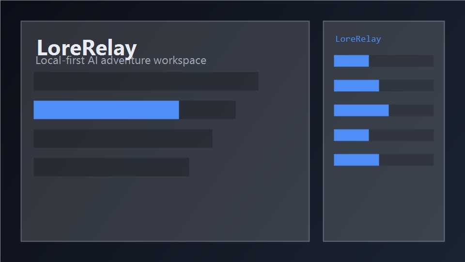

# LoreRelay - Local-first AI Game Master UI 🎲

[English](README_en.md) | [日本語](README.md) | [简体中文](README_zh-CN.md) | [繁體中文](README_zh-TW.md)

[](https://opensource.org/licenses/MIT)
[](https://github.com/GGF1sh/LoreRelay/releases)
[](https://github.com/GGF1sh/LoreRelay)

**Local-first AI Game Master UI**

**Antigravity (免費) × LoreRelay × ComfyUI —— 由前沿大模型擔任 GM 的全自動 RPG 環境，無需 API 金鑰，零額外成本。**

這是一個最大化利用您現有 AI 訂閱的 VSCode 擴充套件，它結合了像 SillyTavern 一樣的後端自由度，以及像 Saga & Seeker 一樣硬核的 CRPG 體驗。
透過手動複製貼上（或透過本地代理自動執行）傳遞 JSON，它提供了一個完全開放且可改造的「Hacker Edition」 UI 層，讓您可以自由地在自己的環境中進行 Hack。

> 💡 **Notice:** 如果您喜歡這個擴充套件，請考慮[請我喝杯咖啡 ☕](https://ko-fi.com/promptpalette)

---

## 🌟 Features

- 💸 **No Extra API Costs (by default):** 本機 LLM、Grok CLI 或手動複製貼上操作無需按量計費的 API 金鑰。僅在使用 OpenRouter 時需要 API 金鑰。
- 🧩 **Agent Bridge:** 如果使用 Grok Build 等可在本機執行的 AI，您可以直接將 Webview 的選項和自由輸入發送給 GM。
- 🎨 **Glassmorphism UI:** 包含半透明聊天 UI、世界觀主題切換和圖像畫廊的豐富顯示介面。
- ⚔️ **CRPG Character Sheet:** 受 Saga & Seeker 等啟發的視覺狀態面板，可管理 HP/MP 進度條、技能和物品欄。
- 🖼️ **Local Image Generation & World Integration (v1.3+):** 與 ComfyUI 配合，在本機即時生成 AI 描繪的場景畫面；並與 World System 聯動，支援地點移動時的自動背景生成。
- 🎵 **Adaptive BGM & SFX:** 根據 GM 的指示，自動控制並交叉淡入淡出在 `bgm.json` / `sfx.json` 中註冊的音源。
- 📦 **Scenario Packs:** 只需載入包含 `scenario.json` 的資料夾，即可一次性套用初始場景、主題和專用的 BGM/音效。
- 🎲 **Built-in Dice Roller & Calculator:** 內建 TRPG 判定必不可少的擲骰子（NdX）和數學計算器。
- 💾 **Persistent Adventure Log:** 將冒險日誌儲存到 `game_history.json`，即使重啟 VSCode 也能恢復歷史紀錄。
- 🔍 **回合檢查器（Turn Inspector）：** 每回合骰子台帳、狀態修補、觸發 lore 可視化。
- 📖 **Lorebook & Memory UI:** ST 相容 lorebook 編輯、記憶搜尋預覽、釘選 lore 注入。
- 🎬 **Scenario & Party Director:** `scenario.json` / `party_director.json` 與 `game_state` 執行時聯動。
- 📱 **Remote Play (v0.7+):** LAN 加入 URL（複製分享）、玩家 / 觀戰角色。WebSocket 認證、輸入限制、**簽章 `/media` URL**（short-TTL HMAC，v1.6.2+）。
- 🌍 **Living World System (v1.3+):** `world_forge.json`（World Forge）、湧現模擬、World 分頁 Mermaid 地圖（biome 配色與平移縮放，v1.6.3+）。
- 🗺️ **Cartography / 羊皮紙地圖（v1.7+，可選進階功能）：** Region `x/y/biome` → 版面 PNG → ComfyUI ControlNet 羊皮紙地圖 → Webview 圖釘疊加。需 ComfyUI + SDXL Canny；僅版面可用 Python 單獨產生。
- ⚙️ **Emergent Simulation:** 內建自律模擬器，隨每回合推進自動計算資源消耗、勢力平衡、NPC 好感度與恐懼等。
- 🛡️ **Robust State Management:** 上限鉗制、非法 ID 清理、安全狀態遷移等機制，防止龐大資料導致 UI 崩潰。
- 👁️ **Visual Memory / Soulgaze (v1.5+):** VLM 分析生成圖像並寫入 `visual_memory.json`，在後續 GM 提示中自動注入視覺上下文。
- 🔒 **Audit Wave Hardening (v1.6):** 對 State / GM Bridge / World / ST Import / Webview / Remote Play / Extension Hub 進行 7 軌道稽核，新增 pure 驗證模組與大量回歸測試。

架構詳解：[`docs/WORLD_AND_VISUAL_MEMORY.md`](docs/WORLD_AND_VISUAL_MEMORY.md)

### 所需環境與可選功能

| 層級 | 內容 |
|------|------|
| **必需（核心遊玩）** | VSCode 1.85+、Python、`TextAdventureGMSkill`（`SKILL.md`） |
| **推薦** | GM Bridge（Grok / Ollama / 剪貼簿等）或手動複製貼上 |
| **可選 — 圖像** | ComfyUI（API 模式）— 場景背景與羊皮紙地圖 |
| **可選 — 視覺記憶** | VLM（Ollama `llava` 或 OpenRouter 多模態）— Soulgaze |
| **可選 — 多人** | Remote Play（同一區域網路） |
| **可選 — 地圖** | Cartography — 僅版面 PNG 只需 Python；插畫羊皮紙需 ComfyUI + SDXL Canny |

### 資料流（Persist-Before-Narrate）

GM 每回合應寫入 **`turn_result.json`**（`statePatch` + `narration` + `gmEntry` + `turnId`）。擴充套件驗證修補後合併至 **`game_state.json`**，並向 `state_journal.ndjson` 追加稽核紀錄。

直接覆寫 **`game_state.json`** 為**緊急回退**（手動貼上或舊版 GM）。此時 `turnResultFallback` 會合成 `turn_result.json`，使檢查器、日誌與 MediaAgent 走同一路徑。

**Cartography 管線（可選）：** `world_forge.json`（Region 的 `x` / `y` / `biome`）→ 版面 PNG（`world_map.layout.png`）→（可選）ComfyUI ControlNet → `world_map.png` → World 分頁 📍 圖釘疊加

---

## 📸 Screenshots & Demo

<p align="center">
  
</p>

| Inspector | Remote Play | Party Director |
|:---:|:---:|:---:|
|  |  |  |

| Lorebook | ComfyUI | World Map |
|:---:|:---:|:---:|
|  |  |  |

替換為真實截圖或 GIF 的步驟見 [`DEMO.md`](DEMO.md)。

---

## 🚀 How to Play

### 快速開始（約 3 分鐘）

1. `LoreRelay: Load Scenario Pack` → `sample-scenarios/lost-catacombs`
2. `LoreRelay: Open Game UI` → 在 Game Rules 中啟用 **World Forge**
3. **World** 分頁 → **Parchment** 檢視同捆的 `world_map.layout.png` 與圖釘（無需 ComfyUI）
4. 進行一回合，查看 GM 回應

完整插畫羊皮紙地圖：啟動 ComfyUI 後執行 `LoreRelay: Generate World Map Image`。詳見 [`docs/CARTOGRAPHY_COMFYUI.md`](docs/CARTOGRAPHY_COMFYUI.md)（**可選 / 進階**）。

該擴充套件使用鬆散耦合機制，監聽 AI 匯出的 `turn_result.json`（規範）或 `game_state.json`（回退）並渲染 UI。根據您的環境，有兩種遊玩方式。

### Mode A: 自動同步模式 (Recommended)
**適用對象：** 使用**可寫入本機檔案的代理 AI**（如 Antigravity, Grok CLI, VSCode Copilot (Cursor)）的使用者。

1. 讓 AI 讀取包含的 `SKILL.md`，並指示「按照此技能開始擔任遊戲主持（GM）」。
2. 之後，您只需與 AI 聊天即可。AI 會自動擲骰子、使用 ComfyUI 生成圖像並更新 `game_state.json`。
3. 在 VSCode 中保持此擴充套件打開，UI 將即時更新！

> **對於 Antigravity 使用者：** 您可以輕鬆操作：點擊 Webview 中的選項 → 複製到剪貼簿 → 貼上到 Antigravity 聊天中 → 自動更新。詳情請參閱 [`ANTIGRAVITY_GUIDE.md`](ANTIGRAVITY_GUIDE.md)。

### Mode B: 手動複製貼上模式
**適用對象：** 使用標準網頁版 ChatGPT, Claude, 或 Gemini 的使用者。

1. 將 `SKILL.md` 的文字複製並貼上到網頁版 AI 中，並說：「請按照這些指示擔任 GM。」
2. 複製 AI 返回的 JSON 程式碼區塊，並手動在 VSCode 中覆寫儲存 `game_state.json`。
3. 儲存的瞬間，VSCode UI 會自動切換。（圖像生成和擲骰子需手動執行，或使用網頁版 AI 的功能代替）。

---

## 🛠️ Setup & Installation

### 1. Prerequisites
- **VSCode** (v1.85+) — 必需
- **Python** — 必需（擲骰、版面地圖、GM 橋接腳本）
- **TextAdventureGMSkill** — 必需（`SKILL.md` 與 `scripts/`，放在本儲存庫旁）
- **ComfyUI** — *可選*（僅場景圖與羊皮紙地圖；需 API 模式啟動）
- **VLM** — *可選*（Visual Memory / Soulgaze，Ollama 或 OpenRouter）

### 2. Quick setup (recommended)

將 `TextAdventureGMSkill` 放在 `text-adventure-vsce` 旁邊（例如：在 `C:\AI\` 目錄下）：

**Windows (PowerShell):**
```powershell
cd text-adventure-vsce
.\scripts\setup.ps1
```

**macOS / Linux:**
```bash
cd text-adventure-vsce
chmod +x scripts/setup.sh
./scripts/setup.sh
```

腳本將執行：
- 自動檢測 GM 技能路徑 → 生成 `my-adventure/.vscode/settings.json`
- `npm install` / `compile` / `test`
- (可選) VSIX 打包 → `code --install-extension`
- 生成 `text-adventure.code-workspace`（3 個根目錄：Game + Skill + Extension）

選項範例：`-Locale en` `-GmProvider clipboard` `-SkipVsix`

### 3. Manual extension installation
1. 複製（Clone）或下載此程式庫。
2. 在 VSCode 中打開資料夾，並在終端機中運行 `npm install`。
3. 按 `F5` 鍵開始偵錯擴充套件，或使用 `npx @vscode/vsce package` 安裝 VSIX。
4. 從命令面板 (`Ctrl+Shift+P`) 運行 `LoreRelay: Open Game UI` 以打開面板。

### 4. Configuration
在 VSCode 設定中搜尋 `textAdventure.skillPath`，並指定隨附的 `comfyui_generate.py` 腳本的絕對路徑。

主要設定：

- `textAdventure.skillPath` — `comfyui_generate.py` 的絕對路徑
- `textAdventure.locale` — UI / 錯誤 / GM 提示的語言（`ja` / `en` / `zh-CN` / `zh-TW`）。也可以從 Webview 標題列的 🌐 更改。
- `textAdventure.gmBridge.provider` — `grok` / `ollama` / `koboldcpp` / `clipboard` / `command` (詳情見 `GM_BRIDGE_PRESETS.md`)
- `textAdventure.grokBridge.*` — 啟用 Grok Build 自動發送、CLI 路徑、後備設定
- `textAdventure.imageGen.*` — ComfyUI / Stability Matrix URL、checkpoint、workflow、生成尺寸
- `textAdventure.imageGen.controlNet` — Cartography 用 SDXL Canny 模型名（可選）
- `textAdventure.vlm.*` — Soulgaze 用 VLM（`provider` / `model` / `endpoint`）
- `textAdventure.mediaAgent.*` — 背景圖像佇列、GM 串流早期 BGM/SFX
- `textAdventure.remotePlay.*` — 連接埠、`bindAddress`、`mediaUrlTtlSec`（簽章媒體 URL 有效期）等
- `textAdventure.bgm.*` — BGM 設定檔和音量
- `textAdventure.sfx.*` — SFX 設定檔和音量

### 5. 命令面板（主要命令）

| 命令 | 用途 |
|------|------|
| `LoreRelay: Open Game UI` | 開啟主 Webview |
| `LoreRelay: Load Scenario Pack` | 載入含 `scenario.json` 的資料夾 |
| `LoreRelay: Generate World Forge` | 程序化產生 `world_forge.json` |
| `LoreRelay: Generate World Map Image` | 透過 ComfyUI 產生羊皮紙地圖（可選） |
| `LoreRelay: Start Remote Play (LAN)` | 發布區域網路加入 URL |
| `LoreRelay: List Image Models` | 列出 ComfyUI checkpoint |
| `LoreRelay: Import SillyTavern Character Card` | 匯入 ST 角色卡 |
| `LoreRelay: Import SillyTavern Lorebook` | 匯入 ST lorebook |
| `LoreRelay: Export Scenario Pack (Workshop ZIP)` | 匯出分發用 ZIP |
| `LoreRelay: Validate Scenario Pack` | 驗證包結構 |

### 6. 工作區主要檔案

| 檔案 | 作用 |
|------|------|
| `game_state.json` | UI 渲染的合併遊戲狀態 |
| `turn_result.json` | 每回合 GM 輸出（規範持久化） |
| `state_journal.ndjson` | statePatch 稽核日誌 |
| `world_forge.json` | 靜態世界設計（區域、派系、NPC 種子） |
| `world_state.json` | 動態模擬（已造訪、派系資源等） |
| `visual_memory.json` | VLM 情景記憶 |
| `game_history.json` | 冒險日誌（重啟後恢復） |
| `world_map.layout.png` / `world_map.png` | Cartography 版面 / 羊皮紙圖 |
| `npc_registry.json` | NPC 認知與關係 |

### 7. Scenario Packs
從命令面板執行 `LoreRelay: Load Scenario Pack` 並選擇包含 `scenario.json` 的資料夾。

**同捆範例（3 本）** — `sample-scenarios/`：

| 資料夾 | 類型 | 主題 | 備註 |
|--------|------|------|------|
| `lost-catacombs` | 經典地牢探索 | fantasy | **Cartography 示範**（`world_forge.json` + `world_map.layout.png`） |
| `neon-rain` | 賽博龐克黑色電影 | cyberpunk | |
| `harbor-mist` | 港口懸疑 | modern | |

GM 技能端：`TextAdventureGMSkill/scenarios/`。

### 8. SillyTavern 相容與 Workshop

- 透過上述命令或 Webview 匯入 ST 角色與 lorebook。詳見 [`SILLYTAVERN_COMPAT.md`](SILLYTAVERN_COMPAT.md)
- 匯出並驗證場景包可產生 Workshop 用 ZIP（市集發布調研中）

### 9. 模型與 ComfyUI 預設
- [`MODEL_PRESETS.md`](MODEL_PRESETS.md) — 從 `presets/` 複製 JSON
- [`COMFYUI_WORKFLOWS.md`](COMFYUI_WORKFLOWS.md) — 場景與 Cartography 工作流程
- Cartography（可選）：[`docs/CARTOGRAPHY_COMFYUI.md`](docs/CARTOGRAPHY_COMFYUI.md) · [`docs/CARTOGRAPHY_WORKFLOW_CONTRACT.md`](docs/CARTOGRAPHY_WORKFLOW_CONTRACT.md) · [`docs/CARTOGRAPHY_DESIGN.md`](docs/CARTOGRAPHY_DESIGN.md)
- 示範步驟：[`sample-scenarios/lost-catacombs/CARTOGRAPHY_DEMO.md`](sample-scenarios/lost-catacombs/CARTOGRAPHY_DEMO.md)

### 10. 文件索引

| 文件 | 內容 |
|------|------|
| [`AI_HANDOVER.md`](AI_HANDOVER.md) | 面向其他 AI 的交接說明 |
| [`CHANGELOG.md`](CHANGELOG.md) | 版本歷史 |
| [`GM_BRIDGE_PRESETS.md`](GM_BRIDGE_PRESETS.md) | Ollama / KoboldCPP 預設 |
| [`ANTIGRAVITY_GUIDE.md`](ANTIGRAVITY_GUIDE.md) | Antigravity 工作流程 |
| [`SILLYTAVERN_COMPAT.md`](SILLYTAVERN_COMPAT.md) | SillyTavern 相容規格 |
| [`docs/WORLD_AND_VISUAL_MEMORY.md`](docs/WORLD_AND_VISUAL_MEMORY.md) | World / Visual Memory 架構 |
| [`DEMO.md`](DEMO.md) | 替換截圖與示範 GIF |

---

## 🗺️ Roadmap

> **版本正本：** `package.json`（目前 **1.44.2**）· [`CHANGELOG.md`](CHANGELOG.md) · [`docs/VERSION_TRUTH.md`](docs/VERSION_TRUTH.md) · 任務看板 [`AI_ROADMAP.md`](AI_ROADMAP.md)

**已實作（v1.33.0 摘要）**

| 世代 | 主要內容 |
|------|----------|
| **v1.3–1.7** | World Forge / 湧現模擬 / Visual Memory / Audit Wave / Cartography |
| **v1.10–1.11** | Quest Board（Event-to-Quest）· Agentic GM · Git Timeline · Adaptive TTS |
| **v1.13–1.18** | Tile Overmap · Cartography C8/C9 · Debug sandbox · 世界時間推進 |
| **v1.19–1.21** | Chronicle · Pacing Director · 派系聲望 · 旅途遭遇 · Replay Export |
| **v1.23–1.33** | Living World 經濟（Commerce / Agency）· Commerce UI · 信任聯動位置 · **LW3 羈絆** |

詳見 [`docs/FEATURE_MATRIX.md`](docs/FEATURE_MATRIX.md) 與 `sample-scenarios/trade-routes`。

**計畫中**

- README / DEMO 截圖與 GIF 更新
- Overmap 圖像圖塊、hazard 單行 GM 注入
- Prompt budget 優先度滑動（長會話）
- Workshop / 市集發布調研

---

## 🤝 Contributing & Support
該專案是一個實驗性的 OSS，旨在成為 AI 時代的「文字冒險新遊樂場」。
非常歡迎提交錯誤報告和請求（PR）！

如果這個專案讓您感到興奮......
👉 **[Buy me a coffee ☕](https://ko-fi.com/promptpalette)**

---
**Enjoy your adventure!**
