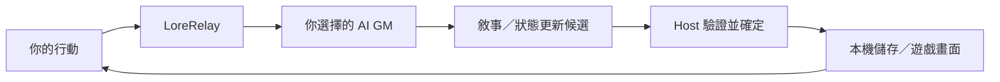

<h1 align="center">LoreRelay</h1>
<p align="center"><strong>踏上旅途。遇見誰。用自己的話，決定接下來怎麼走。</strong><br /><sub>Bring your AI. Keep your world.</sub></p>

<p align="center"><a href="README.md">日本語</a> · <a href="README_en.md">English</a> · <a href="README_zh-CN.md">简体中文</a> · <a href="README_zh-TW.md">繁體中文</a></p>

在霧氣籠罩的港鎮追查謎團。看著地圖深入地下迷宮。在荒廢的世界裡搜集物資，再把它們帶回據點。也可以暫時放下冒險，和喜歡的角色好好聊上一晚。

**LoreRelay 是一款讓你用自己的話決定行動、由 AI 遊戲主持人繼續推動故事的角色扮演 RPG。** 可以從和一個角色的對話開始，也可以和夥伴一起旅行，逐漸玩成包含探索、交易與據點經營的長期 Campaign。先從你想去的世界、想認識的人開始就好。

這是一個在 VS Code 上執行、仍在開發中的開源作品。你可以選擇支援的 AI 擔任 GM，同時把角色、世界設定和冒險紀錄保存在自己的電腦上。

[可以怎麼玩？](#onboarding) · [開始第一場冒險](#how-to-play) · [看看更多畫面](#screenshots) · [可用 AI 與費用](#ai-connections) · [安裝](#setup)

<p align="center"><a href="docs/assets/public-launch-v1.85.3/management-map.png"></a></p>

<p align="center"><sub>1.85.3 的實際畫面：用對話推進冒險，再從地圖與交易介面確認世界的變化。</sub></p>

**[▶ 用 75 秒看一段冒險](docs/PUBLIC_LAUNCH_MEDIA.md)** — 和 GM 對話 → 在市場購買 → 重新開啟面板確認狀態仍然保留。影片使用驗證用的範例世界錄製，並縮短了等待時間。

| 下一站，去哪裡？ | 買什麼，又要帶什麼回去？ |
| :---: | :---: |
| <a href="docs/assets/screenshot-world-map.png"></a> | <a href="docs/assets/public-launch-v1.85.3/trade-committed.jpg"></a> |

<p align="center"><sub>地圖來自較早的功能展示，交易畫面則是 1.85.3 中實際完成購買後的結果。點擊圖片可查看原始尺寸。</sub></p>

<a id="onboarding"></a>

## 下一步，用你自己的話說出來

「去港口打聽消息。」「調查遺跡。」「今天先回城。」你可以選擇系統提供的行動，也可以直接寫下自己真正想做的事。

**閱讀場景 → 行動 → 看 GM 的描寫與已經確定的結果 → 決定下一步。**

想聊天時，就把注意力放在人物之間的交流上。想冒險時，就打開地圖或追蹤任務。世界啟用了交易時，可以看著資金與載重決定要買什麼。閱讀故事和做遊戲裡的判斷，可以按照自己的節奏來回切換。

### 可以追查謎團，也可以靠從廢墟帶回來的東西生活

不必一開始就把整個世界設定寫完。內建場景提供了幾種不同的入口。

| 今晚想玩什麼？ | 場景 |
| --- | --- |
| **霧港裡的謎團。** 從人物對話與調查開始，一步步追進故事深處。 | `harbor-mist` |
| **地下迷宮探索。** 看著地圖，踏進還沒有去過的地方。 | `lost-catacombs` |
| **末日後的拾荒生活。** 探索廢墟，把找到的物資帶回去，再在據點與交易網路中生活。 | `scrapbound-settlement` |
| **賽博龐克故事。** 在霓虹照亮的世界裡進行角色扮演。 | `neon-rain` |
| **以經商為主軸的旅程。** 走訪市場，在價格、庫存與載重之間做交易選擇。 | `trade-routes` |

想自己搭舞台，也可以回答 Start Hub 的問題開始，或直接帶入已有的角色與世界設定。也支援 SillyTavern 角色卡與 Lorebook。

### 想和一個角色慢慢聊，還是走進整個世界？

| 你想怎麼玩 | 模式 |
| --- | --- |
| **和喜歡的角色好好聊。** 從一對一對話與角色扮演開始。 | **Parlor** |
| **以這個世界居民的身分交談。** 讓世界設定成為背景，與其中的人物互動。 | **In-World** |
| **和夥伴旅行，在探索中經營生活。** 使用任務、資源、交易，以及你啟用的其他系統。 | **Campaign** |

不需要一開始就把所有系統都打開。世界推進方式也可以從**安穩生活、持續變化的世界、具有挑戰性的經營**開始，再分別調整經濟、食物需求、衝突與關係推進。交易、據點與世界模擬中包含實驗性功能，可用範圍會隨場景與設定而變化。[各功能狀態](docs/FEATURE_MATRIX.md)

### 把喜歡的場景留成旅途中的一張圖

如果讀到的風景、或某段讓你想記住的對話值得畫下來，就打開 **「Illustrate this scene / 將這個場景畫出來」**。編輯畫面指示，把提示詞複製到 ChatGPT、Gemini、Grok 或其他圖像工具，再把生成結果帶回 LoreRelay。喜歡的圖片可以設成該回合的插圖或目前背景。

提示詞建立與圖片匯入不需要額外的 AI 連線或 API Key。實際生成條件與使用額度取決於你使用的外部服務。ComfyUI 自動生成仍是另一項可選功能。[場景圖像化指南](docs/VISUAL_COMPOSER_V1.md)

下一次繼續冒險時，從保存下來的世界接著玩。也可以回顧對話紀錄、Lorebook 與 Chronicle，或把旅程匯出成 Markdown / HTML 回放。

<a id="how-to-play"></a>

## 開始第一場冒險

1. **準備遊玩環境。** 完成[安裝](#setup)，然後打開一個專門用來遊玩的資料夾。要體驗最新功能，請從目前原始碼啟動。
2. **選擇 GM。** 從命令面板打開 `LoreRelay: AI Connections`（日文 UI 為 `LoreRelay: AI接続`），完成所需連線的登入與設定。[不同連線與費用](#ai-connections)
3. **選擇舞台與角色。** 執行 `LoreRelay: Open Game UI` → 在 Start Hub 回答問題開始，或使用已有角色／世界。也可以從 Demo 清單或 `LoreRelay: Load Scenario Pack` 選擇內建場景。已有存檔則選擇 Continue。
4. **送出第一句話。** 選擇行動或直接輸入自己的做法，再確認 GM 的描寫與已經確定的結果。啟用 Commerce 的世界裡，可以從統一的 Actions 入口進行交易、市場移動與結束一天。

即使還沒有連接 AI，也可以先顯示場景的開場畫面。要讓 GM 繼續推動故事，則需要先完成連線準備。不清楚設定方式時，請參閱 [AI Connections](docs/AI_CONNECTIONS.md)。

<a id="screenshots"></a>

## 冒險繼續下去，還會看到這些

下面是一些能夠擴充玩法的功能畫廊。地圖 UI、物流、場景圖片、夥伴、Lorebook 與戰鬥部分使用了較早的展示截圖，因此版面可能與目前版本不同。點擊圖片可放大。

### 有時沉浸於故事，有時俯瞰整個世界

想讀故事時用**故事顯示**，想看資源與地圖時用**管理顯示**，想欣賞背景與立繪時用**演出顯示**。這些只改變呈現方式，不改變玩法模式與世界規則。即使完全不用圖片也能玩。

| 在明亮介面中跟進對話 | 在沉靜介面中閱讀故事 |
| :---: | :---: |
| <a href="docs/assets/readme-light-v1.85.2.png"></a> | <a href="docs/assets/readme-story-v1.85.2.png"></a> |

<p align="center"><sub>1.85.2 中顯示同一段已儲存的範例對話。切換主題不會改變對話內容。</sub></p>

### 打開地圖，就會有想去的地方

平原盡頭的城鎮、穿過森林的道路、還沒調查過的遺跡。生成的地圖背景上可以疊加地點與未探索區域，讓你打開目的地資訊，再決定下一趟旅程要去哪裡。

<p align="center"><a href="docs/assets/worldmap-showcase-fixture/world_map.png"></a></p>

<p align="center"><sub>內建的 ComfyUI 地圖背景範例。地點、迷霧與交易路線會在遊戲畫面中作為獨立圖層疊加。</sub></p>

| 在地圖上尋找下一站 | 打開遺跡資訊，考慮出發前的準備 |
| :---: | :---: |
| <a href="docs/assets/screenshot-world-map.png"></a> | <a href="docs/assets/screenshot-world-map-detail.png"></a> |

### 賣掉帶回來的東西，為下一趟旅程做準備

有了物資之後，就要決定什麼賣掉、什麼留下。市場會在交易前顯示價格、庫存、資金與載重。探索不只是抵達終點——帶回來的東西也會影響之後的生活與下一趟旅程。

<p align="center"><a href="docs/assets/public-launch-v1.85.3/trade-committed.jpg"></a></p>

<p align="center"><sub>1.85.3 中實際完成一次購買後的結果：資金 20→11，小麥 0→1。介面會顯示買了什麼、花了多少。</sub></p>

如果想更偏經營一些，可以打開物流網路，把市場、聚落與設施連接起來。領地、行會、車輛據點等系統也作為可選的實驗功能存在。如果你只想聊天，這些都不必啟用。

<p align="center"><a href="docs/assets/screenshot-logistics.png"></a></p>

<p align="center"><sub>俯瞰地點之間連接關係的物流畫面。這是較早的功能展示圖，顯示的是目前狀態預覽。</sub></p>

### 留下風景，也和夥伴多聊一會兒

地下迴廊裡的燈光、旅途中看見的遠景。替場景加上圖片，也會讓人更想回頭翻看曾經的對話。下面是現有 ComfyUI 連動生成的場景圖片範例。

<p align="center"><a href="docs/assets/screenshot-comfyui.png"></a></p>

夥伴對話中，可以調整誰更常說話，以及人物之間的關係。角色與世界設定可以整理到 Lorebook。場景圖、立繪、BGM／音效、TTS 也都只需要在你想用時加入。圖像與音訊等外部工具、模型需要另外準備。

| 想多聽誰說一些？ | 把人物與世界設定放在手邊 |
| :---: | :---: |
| <a href="docs/assets/screenshot-party-director.png"></a> | <a href="docs/assets/screenshot-lorebook.png"></a> |

<p align="center"><a href="docs/assets/hero-ui.jpg"></a></p>

<p align="center"><sub>表現冒險氣氛的概念插圖，並非實際操作畫面。 <a href="docs/assets/README.md">圖片來源</a></sub></p>

<a id="combat"></a>

### 安排隊伍如何行動（實驗中）

戰鬥模擬器與 Battle View 可以查看我方／敵方 HP、Gambit、移動命令與戰鬥日誌。這是一項獨立於對話與經營循環之外、用來嘗試戰鬥玩法的實驗功能。

<p align="center"><a href="docs/assets/screenshot-battle-view.png"></a></p>

**目前戰鬥需要從命令啟動。** 尚未提供由 GM 從劇情自動切入戰鬥的流程，也沒有直接控制單一角色的操作 UI。[功能狀態](docs/FEATURE_MATRIX.md) · [戰鬥設計與限制](docs/COMBAT_SYSTEM_DESIGN.md)

還可以透過區域網路 **Remote Play** 加入或旁觀。它並不是以直接暴露到公網為前提設計的功能。

<a id="ai-connections"></a>

## 連這場冒險的 GM，也由你來選

LoreRelay 的 GM 可以來自支援的訂閱制官方客戶端、按量計費 API 或本地 LLM。如果你已經在使用某個支援的 AI，也可能直接利用該帳號既有的使用額度。

**訂閱額度不代表免費或無限使用。** 可用模型、額度與計費方式取決於連線服務與帳號。

| 服務 | LoreRelay 的 GM 連線方式 | 使用額度／計費 | 真實服務驗證 |
| --- | --- | --- | --- |
| **ChatGPT / Codex** | 官方 Codex App Server | ChatGPT 帳號中的 Codex 使用額度 | 已驗證 |
| **Grok** | Grok Build / ACP | 官方客戶端帳號的使用額度 | 已驗證 |
| **Gemini / Antigravity** | Antigravity CLI | 官方客戶端帳號的使用額度 | 已驗證 |
| **Claude** | Claude Code | 支援的 Claude 訂閱認證 | 已實作；未驗證 |
| **DeepSeek** | OpenAI 相容 API | API Key；按量計費 | 已實作；未驗證 |

驗證範圍是 **2026-09-08 時的 1.85.2**。前三種連線均在隔離的真實 Host／Webview 中，分別完成 Campaign 與純對話模式各 3 回合以及停止案例。這不保證所有模型與環境都能得到相同結果。[已測試模型、客戶端版本與連線步驟](docs/AI_CONNECTIONS.md)

在連線選單中，Codex／Claude Code 選擇「GMとして使う」，Google／Grok 選擇「Antigravity CLI — GM」／「Grok Build — GM」。完成官方登入與傳送同意後再設定模型。能夠取得候選模型清單的連線會提供選擇器，必要時也可以手動輸入。

既有的 **VS Code LM、Ollama、KoboldCPP、OpenRouter、剪貼簿／手動連動**也仍然可用。VS Code LM 只能使用 VS Code 模型 API 公開的模型。LoreRelay 不會把一般 Web 聊天訂閱轉換成 API Key。[舊版 Bridge 設定](GM_BRIDGE_PRESETS.md)

<details>
<summary>會把什麼傳送給 AI，以及遊戲結果如何確定並儲存</summary>

AI Connection V2 不會讓 AI 直接編輯遊戲的權威資料檔案。Host 會透過既有 Accepted Turn 流程驗證候選結果，只儲存已經確認的內容。串流輸出中的文字仍是未確定狀態。


```mermaid
flowchart LR
    Human["你的行動"] --> Host["LoreRelay"]
    Host --> AI["你選擇的 AI GM"]
    AI --> Candidate["敘事／狀態更新候選"]
    Candidate --> Accept["Host 驗證並確定"]
    Accept --> Local["本機儲存／遊戲畫面"]
    Local --> Human
```

首次連線時會顯示即將傳送的內容。除了你的輸入與對話紀錄外，GM 上下文在必要時也可能包含非公開的世界設定。**LoreRelay 不會自動切換到 API 計費、自動更換模型或自動重送請求。** 「連線已準備好」和「模型實際成功回應」也會分別回報。

NOAI 可以在不呼叫 AI 的情況下推進支援的世界處理，以及交易、市場移動與結束一天。它無法取代能自由生成劇情的 GM。

除了面向玩家的 GM 連線外，LoreRelay 也提供 AI Player 操作委派、隔離 QA 與明確的操作錄製。Player 目前只涵蓋**交易、市場移動、結束一天**三種操作。QA 的內部資訊與 Player 可見的公開資訊使用不同工作階段。AI 自動驗證不會被視為真人遊玩。[Player Lab／QA 與紀錄](docs/AI_CONNECTION_V2_PLAYER_LAB.md)

</details>

<a id="setup"></a>

## 安裝

**本 README 描述的是 `main` 上的功能，已發布的 VSIX 不一定包含完全相同的功能。** 要嘗試較新的 AI 連線或場景插圖流程，請從目前原始碼啟動。[發布檔案](https://github.com/GGF1sh/LoreRelay/releases) · [版本事實來源](docs/VERSION_TRUTH.md)

### 從目前原始碼啟動

請準備 VS Code **1.93 或更新版本**、Node.js／npm 和 Git。

```sh
git clone https://github.com/GGF1sh/LoreRelay.git
cd LoreRelay
npm ci
npm run compile
```

在 VS Code 中開啟此資料夾並按 **F5**。在開啟的 Extension Development Host 中選擇用來遊玩的工作區。需要打包 VSIX 時，執行 `npx @vscode/vsce package`，再透過 VS Code 的「Install from VSIX...」安裝。

AI Connection V2 需要所選服務的官方客戶端與專用登入，或 DeepSeek API Key。Python／`TextAdventureGMSkill` 用於舊版腳本連動，以及骰子、地圖等可選功能。`textAdventure.skillPath` 是 Skill 端 `scripts/comfyui_generate.py` 的絕對路徑。

如需一次設定舊版 Skill 連動，請把 `TextAdventureGMSkill` 放在 LoreRelay 旁邊，並在 Windows 執行 `.\scripts\setup.ps1`，在 macOS／Linux 執行 `bash scripts/setup.sh`。該腳本會安裝相依套件、編譯並執行測試。ComfyUI 與 VLM 都是可選項。

## 功能狀態與詳細指南

LoreRelay 是一個持續開發中的開源專案。它可以從人物對話一路擴展到世界經營，但不同功能的成熟度並不一致。先挑一種真正讓你感興趣的玩法試起來就好。

| 我想…… | 指南 |
| --- | --- |
| 帶入自己的角色或世界設定 | [SillyTavern 相容](SILLYTAVERN_COMPAT.md) |
| 玩探索／拾荒型 Campaign | [Campaign Kit](docs/CAMPAIGN_KIT_QUICKSTART.md) |
| 把場景變成插圖或背景 | [場景提示詞與圖片匯入](docs/VISUAL_COMPOSER_V1.md) |
| 加入圖片、地圖或語音 | [ComfyUI](COMFYUI_WORKFLOWS.md) · [Cartography](docs/CARTOGRAPHY_COMFYUI.md) · [TTS](docs/TTS_QUICKSTART.md) |
| 查看 GM 連線、登入與使用額度 | [AI Connections](docs/AI_CONNECTIONS.md) |
| 設定本地／API／手動 GM | [Bridge 設定](GM_BRIDGE_PRESETS.md) · [舊版 Antigravity 指南](ANTIGRAVITY_GUIDE.md) |
| 查看可用功能與變更紀錄 | [功能列表](docs/FEATURE_MATRIX.md) · [CHANGELOG](CHANGELOG.md) · [Roadmap](AI_ROADMAP.md) |
| 參與開發或執行測試 | [開發流程](docs/AI_WORKFLOW.md) · [Test Console](docs/TEST_CONSOLE.md) |

<details>
<summary>驗證範圍與本頁圖片說明</summary>

AI 連線驗證只表示在有限的測試場景中，真實服務確實曾成功運作；它不保證任意世界下的長期遊玩品質或平衡。

使用者已回報在實機上完成一次 Scene Composer V1 的完整往返：產生場景提示詞 → 用外部 AI 生成圖片 → 匯入 LoreRelay → 採用 → 關閉後重新開啟。這是場景圖片 V1 的範圍內確認，並不代表整個 Campaign 的長期真人遊玩已經完成。

開頭的 Demo 和 1.85.2 對話畫面使用了為驗證準備的合成 fixture。Demo 縮短了等待時間，持久化範例是重新開啟面板，而不是重新啟動作業系統。地圖、物流、夥伴、Lorebook、戰鬥等較早的展示圖，也與非遊戲畫面的氣氛插圖明確區分。[Demo／媒體紀錄](docs/PUBLIC_LAUNCH_MEDIA.md) · [圖片來源](docs/assets/README.md)

內建的 `debug-sandbox` 場景用於開發與驗證。`npm run test:console` 或 `LoreRelay_Test_Console.bat` 會開啟一個依照改動檔案選擇相關測試的儀表板。專案不會因為每一次小改動都重複執行完整測試套件。

</details>

<p align="center">
  <a href="LICENSE"></a>
  <a href="https://github.com/GGF1sh/LoreRelay/actions/workflows/ci.yml"></a>
  <a href="docs/VERSION_TRUTH.md"></a>
</p>

[回報問題或提出建議](https://github.com/GGF1sh/LoreRelay/issues) · [MIT License](LICENSE) · [支持開發 ☕](https://ko-fi.com/promptpalette)
