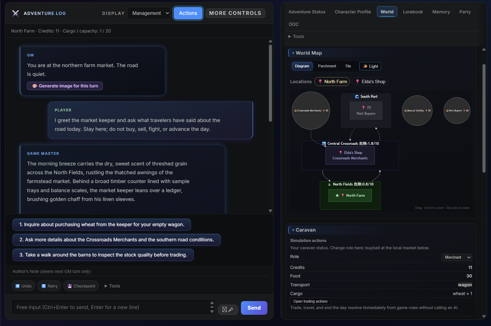
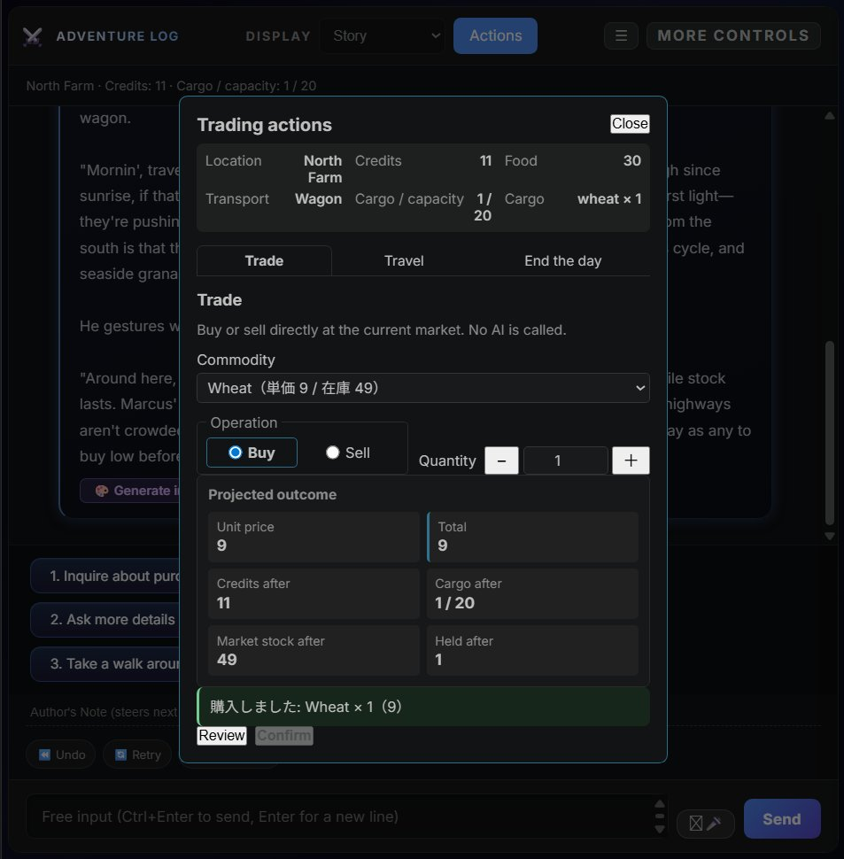
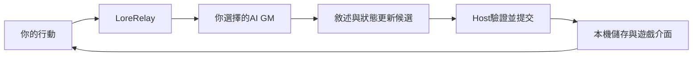

<h1 align="center">LoreRelay</h1>
<p align="center"><strong>Bring your AI. Keep your world.</strong></p>

<p align="center"><a href="README.md">日本語</a> · <a href="README_en.md">English</a> · <a href="README_zh-CN.md">简体中文</a> · <a href="README_zh-TW.md">繁體中文</a></p>

<p align="center">
  <a href="LICENSE"></a>
  <a href="https://github.com/GGF1sh/LoreRelay/actions/workflows/ci.yml"></a>
  <a href="docs/VERSION_TRUTH.md"></a>
</p>

**你來遊玩，AI擔任遊戲主持人，世界保存在你手中。**

LoreRelay是一款在VS Code中執行的角色扮演／持久世界RPG擴充套件。從角色對話，到隊伍冒險、交易與據點經營，你可以連接受支援的官方AI用戶端作為GM，直接從遊戲介面傳送行動。

**AI Connection V2**已完成Codex、Grok和Antigravity的真實服務GM驗證。Claude與DeepSeek也已實作連接功能，但尚未驗證真實服務。使用額度和計費方式因連接而異。

[開始遊玩](#how-to-play) · [連接AI](#ai-connections) · [查看介面](#screenshots) · [安裝](#setup)

### 從對話，到地圖與交易

<p align="center"><a href="docs/assets/public-launch-v1.85.3/management-map.png"></a></p>

<p align="center"><sub>1.85.3真實介面：AI對話、世界示意圖與交易集中展示。</sub></p>

**[▶ 觀看75秒實演](docs/PUBLIC_LAUNCH_MEDIA.md)** — 真實GM回覆 → 確認並購買 → 重新開啟面板。合成測試世界的實際錄影，已縮短等待時間。

| 在地圖上尋找目的地 | 確認價格後交易 |
| :---: | :---: |
| <a href="docs/assets/screenshot-world-map.png"></a> | <a href="docs/assets/public-launch-v1.85.3/trade-committed.jpg"></a> |

地圖為早期功能截圖；交易畫面為1.85.3購買完成後的結果。點擊圖片可開啟原圖。

<a id="onboarding"></a>

## 選擇你的玩法

| 玩法 | 內容 |
| --- | --- |
| **Parlor：從對話開始** | 一對一角色扮演，可匯入SillyTavern角色卡與世界書。 |
| **In-World：成為世界中的居民** | 結合世界背景與角色交流。 |
| **Campaign：冒險與世界變化** | 同伴、探索、任務、資源與交易，使用你啟用的遊戲系統。 |

介面可選擇**故事、管理、演出**，分別突出文字、狀態或背景與立繪。這些是顯示設定，不會改變玩法或世界規則。沒有圖片也能遊玩。

世界推進方式是另一項設定。以**安定生活、變化的世界、艱難經營**為起點，可分別調整經濟、食物需求、衝突與關係進展。NOAI支援無需呼叫模型的世界處理，以及交易、市場移動和結束一天。它不取代生成開放式故事的GM。

<a id="ai-connections"></a>

## 讓你正在使用的AI擔任GM

可選擇受支援的訂閱用戶端、按量計費API或本機LLM。**訂閱額度不等於免費或無限使用。** 可用模型與額度取決於帳戶及官方用戶端。

| 服務 | LoreRelay的GM連接方式 | 額度／計費 | 真實服務驗證 |
| --- | --- | --- | --- |
| **ChatGPT / Codex** | 官方Codex App Server | ChatGPT帳戶的Codex額度 | 已驗證 |
| **Grok** | Grok Build / ACP | 官方用戶端的帳戶額度 | 已驗證 |
| **Gemini / Antigravity** | Antigravity CLI | 官方用戶端的帳戶額度 | 已驗證 |
| **Claude** | Claude Code | 受支援的Claude訂閱驗證 | 已實作，未驗證 |
| **DeepSeek** | OpenAI相容API | API金鑰，按量計費 | 已實作，未驗證 |

以上為**2026-09-08、1.85.2版本**的驗證快照。已驗證的三家服務分別在隔離的真實Host／Webview中完成了Campaign與純對話各三個回合，以及停止操作。並非對所有模型、環境的保證。[測試模型、用戶端版本與連接步驟](docs/AI_CONNECTIONS.md)

原有的**VS Code LM、Ollama、KoboldCPP、OpenRouter及剪貼簿／手動連接**仍可使用。VS Code LM只能使用VS Code模型API公開的模型。此功能不會把一般網頁聊天訂閱轉換成API金鑰。[原有Bridge設定](GM_BRIDGE_PRESETS.md)

### AI提出候選，LoreRelay驗證並儲存


```mermaid
flowchart LR
    Human["你的行動"] --> Host["LoreRelay"]
    Host --> AI["你選擇的AI GM"]
    AI --> Candidate["敘述與狀態更新候選"]
    Candidate --> Accept["Host驗證並提交"]
    Accept --> Local["本機儲存與遊戲介面"]
    Local --> Human
```

AI Connection V2不會要求AI直接編輯遊戲的權威狀態檔案。Host透過現有Accepted Turn流程驗證候選，儲存已確認的結果。串流輸出中的文字尚未確定。

首次連接會展示傳送內容。GM上下文可能包含輸入、對話歷史及必要的非公開世界設定。**不會自動切換到API計費、自動更換模型或自動重送。** 連接就緒與實際模型回覆成功也會分別顯示。

<a id="how-to-play"></a>

## 開始第一場冒險

1. **準備擴充套件。** 若要體驗新連接，請使用[下方的原始碼啟動步驟](#setup)，並開啟專用遊玩資料夾。
2. **選擇AI。** 在命令選擇區執行 `LoreRelay: AI Connections`（日文介面為 `LoreRelay: AI接続`）。Codex／Claude Code選擇「GMとして使う」（作為GM）；Google／Grok選擇「Antigravity CLI — GM」／「Grok Build — GM」。完成官方登入、確認傳送內容並選擇模型。可取得模型清單的連接提供選擇器，需要時也可手動輸入ID。
3. **開啟遊戲。** 執行 `LoreRelay: Open Game UI`，在Start Hub回答建立問題，或使用既有角色／世界。已有存檔可以選擇繼續。
4. **採取一個行動。** 傳送選項或自由輸入，確認GM敘述與已提交的結果。啟用Commerce後，可從共用行動入口進入交易、市場移動和結束一天。

想先試示範，可使用Start Hub的示範群組或 `LoreRelay: Load Scenario Pack`。**顯示情境開篇，不代表後續回合所需的AI連接已經就緒。**

| 內建情境 | 起點 |
| --- | --- |
| `harbor-mist` | 港口謎案 |
| `lost-catacombs` | 地城探索與地圖 |
| `scrapbound-settlement` | 末世回收、據點與交易 |
| `neon-rain` / `trade-routes` | 賽博龐克／交易世界 |
| `debug-sandbox` | 開發與驗證 |

<a id="screenshots"></a>

## 更多場景與玩法

地圖UI、物流、場景圖、同伴、世界書和戰鬥截圖為較早的功能展示，版面配置可能與目前介面不同。點擊圖片可放大。

| 在明亮介面中閱讀 | 在深色介面中閱讀 |
| :---: | :---: |
| <a href="docs/assets/readme-light-v1.85.2.png"></a> | <a href="docs/assets/readme-story-v1.85.2.png"></a> |

1.85.2真實介面，展示同一段已儲存的合成測試對話。切換主題不會改變對話內容。

### 讓生成的地圖成為冒險舞台

從區域配置透過ComfyUI生成地圖背景：綠色平原、森林與道路。在遊戲中疊加地點、貿易路線與未探索區域，尋找下一站。

<p align="center"><a href="docs/assets/worldmap-showcase-fixture/world_map.png"></a></p>

<p align="center"><sub>內建生成範例。地圖插畫與遊戲疊加的地點、迷霧、路線是不同圖層。</sub></p>

| 尋找目的地 | 查看地點資訊 |
| :---: | :---: |
| <a href="docs/assets/screenshot-world-map.png"></a> | <a href="docs/assets/screenshot-world-map-detail.png"></a> |

### 在市場交易，用路線連接據點

從一次買賣到跨區域物流：購買前查看價格、庫存、資金和載貨量，再透過物流網路觀察市場、聚落與設施之間的聯繫。

<p align="center"><a href="docs/assets/public-launch-v1.85.3/trade-committed.jpg"></a></p>

<p align="center"><sub>1.85.3實際購買結果：資金20→11，小麥0→1。</sub></p>

<p align="center"><a href="docs/assets/screenshot-logistics.png"></a></p>

<p align="center"><sub>透過網路圖查看據點之間的聯繫。較早的功能截圖，展示目前狀態預覽。</sub></p>

### 把敘述變成畫面，讓同伴參與對話

為冒險日誌添加場景圖，調整同伴發言頻率與關係，並透過世界書整理角色與背景。圖片生成需要另行設定ComfyUI等工具。

<p align="center"><a href="docs/assets/screenshot-comfyui.png"></a></p>

<p align="center"><sub>把故事抵達的風景留成圖片。較早的場景圖片連接範例。</sub></p>

| 同伴對話與關係 | 人物與世界設定 |
| :---: | :---: |
| <a href="docs/assets/screenshot-party-director.png"></a> | <a href="docs/assets/screenshot-lorebook.png"></a> |

- **建立世界：** World Forge、經濟、勢力、NPC關係、聚落、領地、公會和載具據點，按需啟用。
- **留下故事：** 對話歷史、記憶、世界書、編年史、檢查點與Markdown／HTML重播匯出。
- **增添氛圍：** ComfyUI場景圖和地圖、立繪、BGM／音效、TTS、VLM視覺記憶。外部工具與模型需另行設定。
- **一起遊玩：** 透過區域網路Remote Play參與或旁觀，無需以公開到網際網路為前提。

<p align="center"><a href="docs/assets/hero-ui.jpg"></a></p>

<p align="center"><sub>表現冒險氛圍的插畫，並非實際操作介面。 <a href="docs/assets/README.md">Image provenance</a></sub></p>

<a id="combat"></a>

<p align="center"><a href="docs/assets/screenshot-battle-view.png"></a></p>

戰鬥模擬器與Battle View屬於**實驗性功能**。目前透過命令啟動；尚未提供GM根據故事自動發起戰鬥的流程，也未提供單一角色的直接操控UI。[功能狀態](docs/FEATURE_MATRIX.md) · [戰鬥設計與限制](docs/COMBAT_SYSTEM_DESIGN.md)

### 讓AI遊玩或調查問題

面向人類玩家的GM連接之外，還提供Player操作委託、隔離的真實Extension Host QA和明確啟動的操作錄製。Player僅支援**交易、市場移動和結束一天**。QA內部資訊與Player公開資訊使用不同會話。自動檢查不等於Human Play。[Player Lab、QA與紀錄](docs/AI_CONNECTION_V2_PLAYER_LAB.md)

<a id="setup"></a>

## 安裝

**原始碼版本與發行VSIX版本不同。** 2026-09-08確認的原始碼為1.85.2，最新GitHub Release為v1.71.0。僅安裝舊Release無法使用AI Connection V2。[下載](https://github.com/GGF1sh/LoreRelay/releases) · [版本權威紀錄](docs/VERSION_TRUTH.md)

### 從目前原始碼啟動

準備VS Code **1.93以上**、Node.js／npm和Git。

```sh
git clone https://github.com/GGF1sh/LoreRelay.git
cd LoreRelay
npm ci
npm run compile
```

在VS Code開啟此資料夾並按 **F5**。在啟動的Extension Development Host中開啟遊玩資料夾。需要VSIX時執行 `npx @vscode/vsce package`，再使用VS Code的「從VSIX安裝」。

AI Connection V2需要所選官方用戶端與專用登入，或DeepSeek API金鑰。原有指令碼連接、骰子、地圖等功能按需準備Python／`TextAdventureGMSkill`。`textAdventure.skillPath`應填寫技能中 `scripts/comfyui_generate.py` 的絕對路徑。

如需集中設定原有技能連接，把 `TextAdventureGMSkill` 放在儲存庫旁；Windows執行 `.\scripts\setup.ps1`，macOS／Linux執行 `bash scripts/setup.sh`。此安裝流程會安裝相依套件、編譯並執行測試。ComfyUI與VLM均為選用。

## 文件與參與開發

| 目的 | 文件 |
| --- | --- |
| 新GM連接、登入與額度 | [AI Connections](docs/AI_CONNECTIONS.md) |
| 匯入角色與世界設定 | [SillyTavern相容](SILLYTAVERN_COMPAT.md) |
| 圖片、地圖與語音 | [ComfyUI](COMFYUI_WORKFLOWS.md) · [Cartography](docs/CARTOGRAPHY_COMFYUI.md) · [TTS](docs/TTS_QUICKSTART.md) |
| 原有本機／API／手動GM | [Bridge設定](GM_BRIDGE_PRESETS.md) · [舊Antigravity流程](ANTIGRAVITY_GUIDE.md) |
| 目前狀態與更新 | [功能表](docs/FEATURE_MATRIX.md) · [CHANGELOG](CHANGELOG.md) · [Roadmap](AI_ROADMAP.md) |
| 開發與相關測試 | [開發流程](docs/AI_WORKFLOW.md) · [Test Console](docs/TEST_CONSOLE.md) |

`npm run test:console` 或 `LoreRelay_Test_Console.bat` 可開啟根據修改檔案選擇相關測試的面板，無需每次小修改都重複整套測試。

LoreRelay是實驗性開源專案。有限的AI連接測試情境不代表任意世界的品質或平衡保證。**Human Play尚未進行，也未被自動化取代。**

[回報問題或提出建議](https://github.com/GGF1sh/LoreRelay/issues) · [MIT License](LICENSE) · [支持開發 ☕](https://ko-fi.com/promptpalette)
