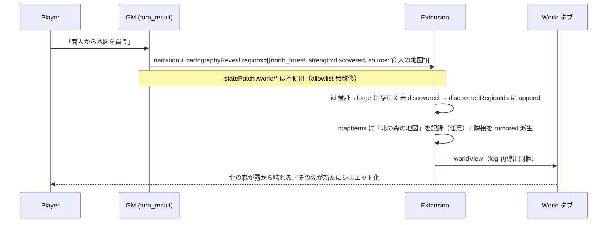
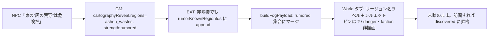
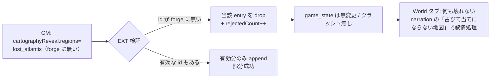
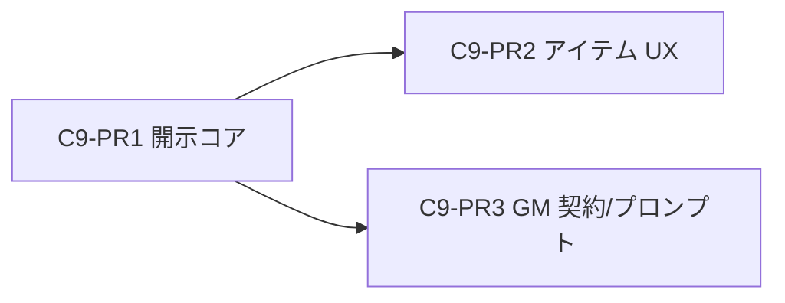

# Cartography C9 — 設計ドキュメント（地図/伝聞アイテム & 遠隔 FoW 開示）

> **保存先:** `docs/CARTOGRAPHY_C9_DESIGN.md`
> **命名:** Cartography **C9**（Roadmap Phase 9 = Agentic GM とは別トラック。`docs/PHASE_NAMING.md` 参照）
> **前提:** C8（`docs/CARTOGRAPHY_PHASE8_DESIGN.md`）完了分（v1.15.2）を変更しない。  
> **実装:** v1.16.0（Grok）— PR1+2+3 統合リリース。設計: Claude（本 doc）。
> **不変条件:** C8 §「引き継ぐ不変条件 1–6」を全節で遵守。C9 で変える点だけ §5 で明示。

---

## 1. Executive Summary（200字以内）

C9 は「足で踏むと霧が晴れる」世界に **情報による先行開示** を足す。商人の地図・NPC の噂・入手した文書で、未踏の遠隔リージョンが先に判る。開示は GM が narration と一体で行う **専用の検証済みチャネル**（`turn_result.cartographyReveal`）に限定し、`/world` allowlist は無改修のまま拡張は唯一の書き手であり続ける。地図は「強い開示＝discovered」、噂は「弱い開示＝rumored」の2段階。プレイヤーの「地図を広げる」操作は状態を直接変えず insertChatText で GM を促す（Persist-Before-Narrate 尊重）。

---

## 2. Player Journeys（3本）

### J1. 商人から「北の森の地図」を得て未知が discovered になる（強い開示）



- 期待感: 「行ったことはないが地図で知っている」土地が地図に現れる。探索前に世界の骨格が見える CRPG 的満足。

### J2. NPC の噂だけで遠隔リージョン名が rumored になる（弱い開示・中身は未踏）



- 期待感: 「名前と存在は知ったが、中身はまだ闇の中」。隣接していない遠隔リージョンでも噂で rumored 化できる（C8 の隣接派生では表現できなかった）。

### J3. 誤った古い地図（存在しない regionId）を渡されたときの UX



- 期待感: GM の幻覚 id・古地図フレーバーで内部状態が壊れない。「地図が示す土地は見つからなかった」を UX として成立させる（サイレント drop + 任意のデバッグログ）。

---

## 3. Feature Spec

### 3.1 地図/伝聞アイテム

#### 種別テンプレ（`MapItemDef`）

| kind | 例 | 既定 strength | 消費 | 備考 |
|------|-----|--------------|------|------|
| `map` | 「北の森の古地図」 | `discovered` | 任意（`consumable`） | 明示的な地図。強い開示 |
| `rumor` | 「酒場の噂話メモ」 | `rumored` | 通常 false（参照物） | 弱い開示。中身は不明 |
| `informant` | 「商人からの情報」 | `rumored`\|`discovered` | false | NPC 由来。強度はシナリオ定義 |

- **定義（静的）:** シナリオパック / `world_forge` に **任意** の `mapItems: MapItemDef[]` を足す（無ければ従来通り動作）。lorebook でも `keys` マッチで補える（既存 `lorebookMatcher` 流用は Open Q C9-Q4）。

```ts
// worldForgeCore.ts に追加（すべて任意フィールド。後方互換）
export interface MapItemDef {
    id: string;                                  // isValidEventId 準拠
    name: string;                                // 表示名（i18n はシナリオ側）
    kind: 'map' | 'rumor' | 'informant';
    revealsRegionIds: string[];                  // 開示対象リージョン
    strength?: 'discovered' | 'rumored';         // 既定は kind から導出
    consumable?: boolean;                        // 使い捨て地図なら true
    description?: string;
}
```

#### 所持（ランタイム）と「使う」フロー

- **状態直変更をしない:** World タブの「地図を広げる」ボタンは `currentLocationId` も `discoveredRegionIds` も直接書かない（**不変条件4** を C9 でも維持）。押下 → 既存 `insertChatText` で入力欄に `「<地図名>を広げて見る。」` を差し込むだけ。確定・narration・開示は GM 権限（Persist-Before-Narrate）。
- **即開示 vs ターン待ち:** 状態を変える機構は **常に GM の `cartographyReveal`**。プレイヤー操作は「GM に開示を促す入力」に過ぎない。よって「即開示」＝ GM が同一ターンの narration で reveal を返すケース、「ターン待ち」＝プレイヤーが unfold 文を挿入し次ターンで GM が reveal を返すケース。どちらも同じチャネルを通る。
- **所持の把握:** 「使う」UI を出すため、拡張が保持アイテムを知る必要がある。GM は `cartographyReveal.grantItems` で付与 → 拡張が `game_state.world.mapItems` に append（§4）。`GameStatus.inventory: string[]` は表示用のまま流用（フル RPG インベントリは **Non-Goal**）。

### 3.2 遠隔 FoW 開示（Q1 A/B 比較 — **必須**）

#### 案の比較

| 案 | 開示機構 | allowlist | 遠隔開示 | GM 幻覚耐性 | 実装コスト | 判定 |
|----|----------|-----------|----------|-------------|-----------|------|
| **A** | 拡張派生のみ（訪問＋隣接） | 無改修 | ❌ 訪問/隣接しか晴れない | ◎（決定論） | 最小（C8 のまま） | ❌ 却下 |
| **B** | `/world/discoveredRegionIds`(append-only) を allowlist 追加。GM が直接 patch | **拡張（不変条件3のスコープ拡大）** | ✅ | △（patch 値検証を allowlist 側に実装） | 中 | ❌ 却下 |
| **D（採用）** | 新 `turn_result.cartographyReveal` 検証済みチャネル。**拡張が唯一の書き手**のまま、検証後に `discoveredRegionIds` / `rumorKnownRegionIds` へ導出反映 | **無改修** | ✅ | ◎（検証・件数上限が拡張に集約） | 中 | ✅ **採用** |
| C | narration キーワード解析 | — | ✅ | ✕（誤検知） | — | Non-Goal 継続 |

#### 採用案 = **D**（B の精神を活かした第三案）

- **なぜ A 却下:** 地図アイテムの中核体験（未踏の遠隔地が先に判る）を状態として表現できない。UI ヒントだけでは「地図を持っているのに地図が変わらない」矛盾が残る。J1/J2 が成立しない。
- **なぜ B 却下:** `/world` allowlist の拡張は **不変条件3** のスコープを恒久的に広げる。append-only の強制・重複拒否・件数上限・id 検証をすべて `statePatch.ts` の allowlist 経路（`isSafeWorldPatchValue`）に実装する必要があり、「GM が霧を直接いじれない」原則（C8 GM Contract）が崩れる。GM/Referee の任意 patch 面が増える。
- **なぜ D 採用:**
  - `/world` allowlist は **一切変更しない**（`WORLD_SUBPATH_ALLOWLIST` 無改修 → 不変条件3を文字通り保存）。GM は依然 `discoveredRegionIds` を patch できない。
  - 「開示」は raw な state write ではなく **意味を持つ操作**として別チャネルに分離。検証（id 実在・件数上限・重複 no-op・強度）を拡張の1箇所に集約。
  - 拡張が唯一の書き手であり続ける（C8「GM は要約、拡張が導出」原則の延長）。
  - Agentic Referee 経由でも、拡張が `processTurnResult` で **再検証** するため Referee 素通りでも安全（§8 リスク参照）。

#### 検証ルール（拡張 `processTurnResult` 内、reveal 適用時）

| ガード | 挙動 |
|--------|------|
| id 実在 | `forge.geography.regions` に無い regionId は drop（J3）。`rejectedCount` を集計 |
| 件数上限 | `MAX_REVEAL_REGIONS_PER_TURN = 3` を超える分は drop（全マップ一括開示を防止） |
| 重複 no-op | 既に discovered な region への `discovered` 開示は no-op。rumorKnown への `rumored` も同様 |
| 強度昇格のみ | `rumored` 済み → `discovered` 開示は昇格 OK。逆（discovered→rumored 降格）は **不可**（不変条件: GM は霧を戻せない） |
| id 形式 | `isValidEventId(regionId)` |

#### マージ・優先順位（訪問派生 × GM 明示追記）

- `discoveredRegionIds` = **訪問派生 ∪ 地図の強い開示**（union / dedup）。既存 `applyFogOnLocationVisit` と同じ append セマンティクス。
- 実効 `rumored` = `deriveRumoredRegionIds(discovered)` **∪ `rumorKnownRegionIds`** − `discovered`（§4 で `buildFogPayload` を1行拡張）。
- 可視性解決は既存 `getRegionFogVisibility`（discovered → rumored → unknown の順）で **変更不要**。discovered が常に勝つ。
- rumorKnown な region が後で discovered 化したら `rumorKnownRegionIds` から prune（クリーンアップ、任意）。

### 3.3 UI（World タブ / インベントリ連携）

| 要素 | 配置 | 挙動 |
|------|------|------|
| 「所持地図」リスト | World タブ内・既存ロケーション詳細パネルの下に折り畳みセクション | `game_state.world.mapItems` を列挙。各行に `[📜 広げて見る]` |
| 「広げて見る」ボタン | 各地図アイテム行 | `insertChatText('<地図名>を広げて見る。')` を postMessage。送信はしない（C8 挿入パターン流用） |
| reveal 直後の演出 | Parchment/Tile/Mermaid 共通 | worldView 再 push で対象リージョンが霧→シルエット/通常へ。C8 のフェード演出を再利用（新規演出なし） |
| rumor-known リージョン | 3モード共通 | 既存 rumored と同一表現（シルエット＋名前、ピン `?`、danger/faction 非描画）。**新規描画分岐を作らない** |
| J3 の破綻回避 | — | 無効 id は worldView に現れない（拡張で drop 済）。UI 側は常に valid な fog 集合のみ受信 |

- **3モードで新しい描画状態を増やさない。** 遠隔開示の結果は既存の discovered / rumored 表現に **合流** するだけ（C8 の3状態モデルを踏襲）。学習コスト増ゼロ。

---

## 4. Data Model Delta

### `game_state.world`（追加は最小・すべて任意で後方互換）

```ts
export interface GameStateWorld {
    currentLocationId?: string;
    visitedLocationIds?: string[];        // 既存
    discoveredRegionIds?: string[];       // 既存・再利用。訪問派生 + 地図の強い開示（union）
    knownFactionIds?: string[];           // 既存（C9 不変）
    regions?: Record<string, { controllingFaction?: string | null; dangerLevel?: number }>;
    worldTurnAtLastSync?: number;
    lastGeneratedImage?: string;
    lastGeneratedLocationId?: string;
    lastAutoImageGmTurn?: number;
    // ── C9 追加 ──
    rumorKnownRegionIds?: string[];       // 弱い遠隔開示（噂）。非隣接でも可。rumored にマージ・非 discovered
    mapItems?: HeldMapItem[];             // 「使う」UI 用の所持地図（任意。無ければ従来通り）
    mapItemsConsumed?: string[];          // 使い捨て地図の消費済み id（任意）
}

export interface HeldMapItem {
    id: string;
    name: string;
    kind: 'map' | 'rumor' | 'informant';
    consumable?: boolean;
    // revealsRegionIds は静的 MapItemDef 側を正とし、ここには保持しない（重複防止）
}
```

- **`rumorKnownRegionIds` を discovered と別立てにする理由:** 噂は「名前を知った」だけで discovered（ピン・danger 可視）にはしたくない。derived-rumored（隣接）は非永続で足りるが、**非隣接の遠隔噂は adjacency から導出不能** → 永続 set が必要。
- **後方互換:** 3フィールドとも未定義で従来動作。`normalizeFogWorldState` は現状ロジック維持（新フィールドの seeding 不要）。

### `worldView`（拡張→Webview・派生・非永続）

```ts
interface WorldViewFogFields {
    fog: {
        discoveredRegionIds: string[];
        rumoredRegionIds: string[];   // derived(discovered) ∪ rumorKnownRegionIds − discovered
        visitedLocationIds: string[];
    };
}
```

- `buildFogPayload` を1点だけ変更: `rumoredRegionIds = union(deriveRumored(discovered), world.rumorKnownRegionIds).filter(!discovered)`。
- **Remote Play 情報漏れ対策（§ 必須要件6）:**
  - 地図で discovered 化した region → 実際にプレイヤーが知っている情報なので locationName 送出は正当（既存 `maskCartographyPinsForFog` が discovered を通す）。
  - rumor-known region → 既存 rumored と同じく locationName を `?`／`''` にマスク（**追加のマスク実装不要**。rumored 集合に合流させる設計の副産物）。
  - `mapItems` / `mapItemsConsumed` は **worldView に含めるが中立情報のみ**（地図名・kind）。開示対象 regionId の生リストは worldView に載せない（spectator に未踏地の内部 id を漏らさない）。「使う」UI は名前ベースで十分。

### `turn_result`（新チャネル・型追加）

```ts
// types/TurnResult.ts に追加
export interface CartographyReveal {
    regions?: { regionId: string; strength?: 'discovered' | 'rumored'; source?: string }[];
    grantItems?: { id: string; name: string; kind?: 'map' | 'rumor' | 'informant'; consumable?: boolean }[];
}
export interface TurnResult {
    // ...既存...
    cartographyReveal?: CartographyReveal;   // 任意。無ければ従来通り
}
```

### `world_state.json` / `world_forge.json`

- `world_state.json`: **変更なし**（FoW/開示は `game_state.world` に閉じる。C8 同様）。
- `world_forge.json`: 任意の `mapItems: MapItemDef[]` を **追加可能にするだけ**（無くても動作）。既存シナリオは無改修。

---

## 5. GM Contract

### 5.1 `statePatch` `/world` allowlist — **before/after 変更なし**

| パス | C8 | C9 |
|------|----|----|
| `/world/currentLocationId` | ✅ | ✅（不変） |
| `/world/regions/{id}/dangerLevel` | ✅ | ✅（不変） |
| `/world/regions/{id}/controllingFaction` | ✅ | ✅（不変） |
| `/world/discoveredRegionIds` | ❌ | ❌（**据え置き**。開示は `cartographyReveal` 経由） |
| `/world/rumorKnownRegionIds` | — | ❌（同上・拡張が唯一の書き手） |
| `/world/mapItems` | — | ❌（拡張が `grantItems` から導出） |
| `/world`（一括） | ❌ | ❌ |

**allowlist を拡張しない理由（要件4）:** 遠隔開示は raw state write ではなく検証を要する意味的操作。`/world` allowlist に足すと Q1-B の欠点（不変条件3のスコープ拡大・GM が霧を直接編集可能）を招く。代わりに `cartographyReveal` を独立チャネルにし、検証・件数上限・重複 no-op・強度昇格ルールを拡張の1箇所に集約する。→ **不変条件3を文字通り保存**。

### 5.2 GM が書いてよい新チャネル（`cartographyReveal`）

- `regions[]`: 開示するリージョン。`strength` 省略時は `rumored`（弱い側を既定 = 安全側）。1ターン最大3件。
- `grantItems[]`: プレイヤーに地図/情報アイテムを付与（任意）。拡張が `mapItems` に append。
- **narration との整合義務:** reveal は必ず narration と一体で（「商人が北の森の地図をくれた」）。narration だけで開示しない／開示だけで narration しない、は **拒否パターン**（下記）。

### 5.3 GM への指示テンプレ（プロンプト側・PR3）

```
When the player obtains a map, hears a specific rumor about a named distant region,
or receives location intel, you MAY reveal it via `cartographyReveal.regions`
(strength "discovered" for a real map, "rumored" for hearsay). Narrate it in the same
turn. Do NOT reveal regions the fiction has not justified. Max 3 regions per turn.
```

### 5.4 `fogInPrompt` との関係（PR3）

- 既定 OFF は C8 のまま。ON 時の1行は現状「未踏（＝非 discovered）リージョン名」列挙。
- C9 で **「地図で discovered だが未訪問」** の区別が生まれる → その region は既に discovered なので `listUnexploredRegionNames`（非 discovered 抽出）から自然に外れる。追加送信は **不要**。GM が「地図で既知だが未踏」を narration で扱いたい場合の補助 1行は **任意 Open Q**（C9-Q2、既定は送らない・トークン節約）。

### 5.5 拒否すべきパターン（不変条件・レビュー観点）

1. GM が `discoveredRegionIds` / `rumorKnownRegionIds` を **削除・降格・上書き**（append/昇格のみ許可）。
2. narration だけで内部状態を変える（`cartographyReveal` 無しの「地図を手に入れた」）。
3. `cartographyReveal` だけ返して narration しない（無言の霧晴らし）。
4. forge に無い regionId の開示（幻覚）→ 拡張が drop するが、レビューで GM プロンプトの id 提示方法を点検。
5. spectator に漏れる worldView フィールド（rumor-known の locationName / 開示対象生 id）。

---

## 6. Non-Goals（C9 でやらないこと）

1. **narration キーワード自動開示（Q1-C）** — 誤検知。開示は `cartographyReveal` 明示のみ。
2. **タイル単位の永続 FoW / 探索率%**（不変条件1）。
3. **クリック即移動・クリック即開示** — 「使う」は insertChatText 提案まで（不変条件4）。
4. **per-role 別 FoW**（spectator と player で違う霧）。単一 `game_state` を共有。
5. **フル RPG インベントリ**（重量・装備スロット・スタック数）。`mapItems` は開示用途の薄い registry のみ。
6. **ロケーション単位の部分開示** — C9 も Region 主（Location は既存 `visitedLocationIds` のまま）。
7. **`/world` allowlist 拡張**（Q1-B）。
8. sim イベントによる自動開示（不変条件5）。

---

## 7. PR Plan（独立マージ可能な DAG・実装者 Grok 向け）



| PR | タイトル | 変更ファイル（予想） | 依存 | テスト方針 |
|----|----------|----------------------|------|-----------|
| **C9-PR1** | 遠隔開示コア（`cartographyReveal` 検証チャネル） | `src/fogOfWarCore.ts`（`applyCartographyReveal` 追加・`buildFogPayload` に rumorKnown マージ）、`src/statePatch.ts`（`processTurnResult` で reveal 適用）、`src/types/TurnResult.ts`、`src/types/GameState.ts`、`src/validateGameState.ts` | なし | `fogOfWarCore` 単体: id 実在 drop（J3）、件数上限、重複 no-op、rumored→discovered 昇格のみ、rumorKnown マージ、後方互換（未定義フィールド）。決定論 |
| **C9-PR2** | 地図/伝聞アイテム UX | `src/worldForgeCore.ts`（`MapItemDef` 任意）、`src/fogOfWarCore.ts`（grantItems→`mapItems` 反映・consumable 処理）、`src/worldView.ts`（`mapItems` を中立情報で付与）、`webview/modules/85-world.js`（所持地図セクション＋「広げて見る」）、`src/webviewHandlers.ts`（insertChatText 流用・新規追加最小）、i18n | PR1 | 単体: grant→mapItems append、consumable 消費、worldView に生 regionId を漏らさない。webview smoke: 所持リスト描画・挿入文字列 |
| **C9-PR3** | GM 契約・プロンプト（gated） | `src/gmPromptBuilder.ts` / `gmPromptBuilderCore.ts`（reveal 指示テンプレ・任意の「地図で既知」補助行）、GM system prompt テンプレ、`package.json`（補助設定があれば） | PR1 | 単体: 指示行生成・トークン上限。Referee 経由の `cartographyReveal` passthrough 確認 |

- **最小構成 = C9-PR1**（GM が reveal を返せば霧が晴れる。UI は既存 rumored/discovered 表現に合流するので World タブ改修なしでも体験成立）。PR2 で「使う」操作、PR3 で GM 挙動の安定。
- **ゲート:** C9-PR1 の `cartographyReveal` 検証仕様は、実装前に ChatGPT の allowlist/セキュリティ/Referee 整合レビュー **PASS を必須**（ブリーフ §ゲート）。

---

## 8. Risks & Open Questions

### 解決済み（実装者が勝手に変えない）

- **Q1（機構）= D 採用**（§3.2）。A/B は却下。allowlist 無改修。
- **開示強度 = 2段階**（map→discovered / rumor→rumored）。強度省略時は rumored（安全側）。
- **降格禁止**（append/昇格のみ）。

### Open Questions（実装者は勝手に決めず PM/レビューへ）

- **C9-Q1（Referee passthrough）:** Agentic GM（Split-Role Referee）が `turn_result` を整形する際、未知フィールド `cartographyReveal` を保持するか破棄するか要確認。破棄されるなら Referee 側 schema に明示追加が必要。拡張の再検証は前提だが、そもそもチャネルが届くかを PR1 で検証すること。
- **C9-Q2（fogInPrompt 補助行）:** 「地図で discovered だが未訪問」の region を GM に別途1行で知らせるか。既定は送らない（トークン節約）。ON にするなら `visitedLocationIds` から「未訪問 discovered region」を導出し ≈1行・上限付き。
- **C9-Q3（consumable セマンティクス）:** 使い捨て地図は「1回 reveal で消費」か「1回 unfold で消費」か。推奨: reveal 成功時に `mapItemsConsumed` へ移し UI から除外。ただし再参照ニーズ（永久地図）とのトグルはシナリオ定義 `consumable` に委ねる。
- **C9-Q4（アイテム定義ソース）:** `MapItemDef` を world_forge に持つか、既存 lorebook（`LorebookEntry.keys`）を流用して inventory 文字列マッチで解決するか。推奨: world_forge の構造化 `mapItems`（robust）。lorebook 流用は fuzzy なため任意の補助に留める。
- **C9-Q5（rumorKnown の prune）:** discovered 昇格時に `rumorKnownRegionIds` から除去するか放置するか（可視性は discovered が勝つので機能的には無害）。推奨: 昇格時 prune（state の肥大化防止）。
- **C9-Q6（複数プレイスルー/セーブ移行）:** 既存セーブに `rumorKnownRegionIds`/`mapItems` は無い → 未定義扱いで従来動作。migration 不要と判断（要 `validateGameState` の任意フィールド許容確認）。

### リスク

| リスク | 影響 | 緩和 |
|--------|------|------|
| GM が毎ターン3件ずつ開示し実質全マップ露出 | 探索感の希薄化 | 件数上限＋narration 整合義務＋レビューで GM プロンプト調整。将来「累計上限」も検討（今回は per-turn のみ） |
| Referee が新フィールドを落とす | 開示が届かない | C9-Q1 で PR1 中に実測。落ちるなら Referee schema 追加を PR1 スコープに含める |
| spectator への未踏地 id 漏れ | Remote Play メタ知識 | rumor-known を既存 rumored マスク経路に合流＋worldView から開示対象生 id を排除 |
| GM 幻覚 regionId | 状態破損 | 拡張で id 実在検証・drop（J3）。crash 不可 |

---

## 付録: C8 → C9 の1段落まとめ

C8 は「自分の足で霧を晴らす」決定論的 FoW を確立した。C9 はそこに **情報の非対称性**（地図・噂で先に知る）を足すが、機構は C8 の原則を破らない: 拡張が唯一の書き手、`/world` allowlist 無改修、rumored は既存表現に合流、クリックは提案まで。新規は「検証済み reveal チャネル1本」と「弱い遠隔噂の永続 set 1つ」だけで、探索の骨格（Region グラフ FoW・軽量・非永続導出）は C8 のまま据え置く。
