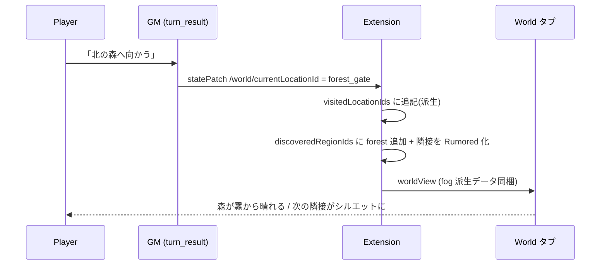
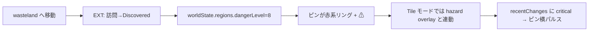

# Cartography C8 — 設計ドキュメント（探索感の強化 / Fog of War & Living Map）

> **命名:** Cartography **C8**（Roadmap Phase 8 = Quest Board とは別。`docs/PHASE_NAMING.md` 参照）  
> **実装レビュー:** **PASS**（Gemini, 2026-07-02, v1.15.2）— `docs/CARTOGRAPHY_C8_REVIEW_GEMINI.md`

> 対象読者: 実装者（Grok / Cursor）、レビュア（Keisuke）
> 前提: Phase 7 完了分は変更しない。実装コードは書かない（interface / 疑似コードのみ）。
> 不変条件（タイル非永続 / GM 要約1行 / `/world` allowlist / 既存フィールド優先 / Remote Play / 後方互換）を全節で遵守。

---

## 1. Executive Summary（200字以内）

Phase 8 は地図を「静的な絵」から「自分の足跡で開いていく世界」に変える。未訪問リージョンは霧で覆われ、訪れる／隣接が判明するたびに晴れる（Fog of War）。ピンはクリックで詳細と行動テンプレを出し、チャットへ差し込める。危険度・派閥・事件は色とバッジで即座に地図へ反映。**タイルは非永続のまま、GM が読むのは要約1行まで、既存 `visitedLocationIds` を再利用**し、壊れにくく軽量に探索感だけを底上げする。

---

## 2. Player Journeys（3本）

### J1. 初回デモ（harbor-mist）で地図を初めて開く

```mermaid
flowchart LR
    A[World タブを開く] --> B{FoW 初期化}
    B --> C[現在地リージョンのみ Discovered]
    C --> D[隣接リージョンは Rumored\nシルエット表示]
    D --> E[それ以外は Unknown\n霧で塗り潰し]
    E --> F[@ ピンが現在地に脈動]
```

- 期待感: 「地図の大半が霧 = まだ見ぬ世界がある」。最初の1画面で探索余地が可視化される。

### J2. 3ターン後、隣接リージョンが FoW から露出する



- 期待感: 自分の移動が地図を「押し広げた」実感。晴れる瞬間に軽いフェード演出。

### J3. 危険地域に入り danger マーカーが変わる



- 期待感: 「ここは危ない」が言語化される前に色で伝わる。危険の記憶が地図に残る。

---

## 3. Feature Spec

### 3.1 Fog of War

#### 粒度: ハイブリッド（Region 主 / Location 従、Tile は継承のみ）

| レイヤ | 状態を持つ単位 | 保存 | 理由 |
|--------|----------------|------|------|
| Region | `discovered` / `rumored` / `unknown` | 永続（派生元） | 地図の主構造。少数（≤20）でトークン・容量が軽い |
| Location | `visited` / `known` / `unknown` | 既存 `visitedLocationIds` を再利用 | ピン単位の解像度。既存フィールド活用（不変条件4） |
| Tile | 状態を**持たない** | 非永続 | 64×64 マスクの永続化は不変条件1違反。Region FoW を**表示時に継承**（暗転オーバーレイ）するだけ |

**3状態の定義**

- `unknown`（未知）: 霧で塗り潰し。ピン・ラベル非表示。GM 要約からも除外。
- `rumored`（既知・未踏）: Discovered リージョンの `connectedTo` 隣接。シルエット＋リージョン名のみ。ロケーションピンは伏せ字（`?`）。「行けることは分かるが中身は不明」。
- `discovered`（探索済）: 通常表示。ピン・危険度・派閥・hazard すべて可視。

#### 発見ルール（トリガーと責務）

| トリガー | 誰が処理 | 効果 | 備考 |
|----------|----------|------|------|
| ロケーション訪問（`currentLocationId` 変化） | **拡張（派生）** | 当該 location を `visited`、その region を `discovered`、隣接 region を `rumored` へ昇格 | GM は `currentLocationId` を書くだけ。FoW 更新は拡張が `processTurnResult` 内で自動導出 |
| 隣接露出 | 拡張（派生） | `discovered` の `connectedTo` を `rumored` に（既に discovered なら据え置き） | Voronoi/座標には依存しない。グラフのみ |
| GM narration による明示開示 | （Phase 8 では**保留**） | 遠隔リージョンの先行開示 | 下記 Open Question Q1。デフォルトは拡張派生のみ |
| シミュレーションイベント | しない | 未探索リージョンの事件は**地図に出さない** | FoW はプレイヤー知覚。sim 真実で霧を勝手に晴らさない（メタ知識防止） |

> **重要な設計判断:** `visitedLocationIds` は現状スキーマ・型に存在するが、**どこからも自動更新されておらず**、`statePatch` の `/world` allowlist にも入っていない（GM は書けない）。Phase 8 では **allowlist を広げず**、拡張が `currentLocationId` の変化を検知して `visitedLocationIds` / `discoveredRegionIds` を派生させる。これにより不変条件3（allowlist 据え置き）と「GM は要約、拡張が導出」原則を同時に満たす。

#### 保存スキーマ: `game_state.world`（`world_state.json` ではない）

- **理由:** FoW は「このプレイスルーでプレイヤーが何を見たか」= プレイ進行データ。既に `visitedLocationIds` が `game_state.world` にあり、そこに `discoveredRegionIds` を足すのが自然。
- `world_state.json` は**シミュレーションの真実**（danger/faction/events）で、sim が上書き・再生成する。ここに FoW を置くと sim tick でプレイヤー知覚が壊れる。役割が違う。
- Remote Play では `game_state.json` がプレイスルーの単一ソース → spectator/player 共に同じ FoW を見る（追加の同期不要）。

#### UI 表現（モード別）

| モード | unknown | rumored | discovered |
|--------|---------|---------|------------|
| Parchment | 半透明の暗幕 overlay（`div` 絶対配置、リージョン中心＋radius を円/矩形でマスク） | 暗幕を薄く＋リージョン名ラベルのみ、ピンは `?` グリフ | 通常のピン＋ラベル |
| Tile | 該当リージョン所有タイルを暗転（`ownerRows` 相当をクライアントで持たないため、**リージョン中心＋radius から距離判定**で暗転。タイル配列は改変しない） | 暗転を弱め、リージョンラベルのみ描画 | 通常描画＋hazard/road |
| Mermaid | ノードを `classDef fog`（グレーアウト＋点線）で表示、ラベルを `???` に | ノードは名前表示・淡色、エッジ点線 | 通常ノード |

- Parchment/Tile の暗幕は**表示専用オーバーレイ**。基盤の PNG・タイル配列・ピン座標は一切変更しない（Phase 7 の決定論を保持）。
- Mermaid は `generateWorldMap` にFoW集合を渡し、ノード分類を切り替える（後述 PR2）。

#### GM プロンプトに渡す文言テンプレ（具体例1つ、既定は送らない）

デフォルトは **UI のみ**（トークン節約）。設定 `cartography.fogInPrompt=true` の時だけ `[World]` セクション末尾に**1行**追加:

```
Unexplored (player has not been): Ashen Wastes, Sunless Deep. Do not narrate their interiors as known facts.
```

- 上限: 未探索リージョン名を**最大5件**、超過は `…and N more`。総長 ~120字（≈40 tokens）。
- discovered/rumored の区別は送らない（GM は「未踏かどうか」だけ知れば十分）。

---

### 3.2 Pin & Location Interaction

#### クリック状態マシン

```
        ┌────────────────────────────────────────────┐
        ▼                                            │
    [idle] ──hover──> [hover] ──click──> [selected] ─┘(再click/外側click→idle)
        │                                  │
        └── fog=unknown/rumored ──> [disabled]（ヒットのみ、詳細不可）
```

| 状態 | 見た目 | 操作 |
|------|--------|------|
| idle | 通常ピン（📍 / ⌂） | ホバー可 |
| hover | 拡大＋ツールチップ（名前・type・危険度） | — |
| selected | ハイライトリング＋詳細パネル展開 | 行動テンプレ挿入ボタン表示 |
| disabled | `?`（rumored）/ 非表示（unknown） | rumored はホバーで「未踏」ツールチップのみ |

- クリックは**移動を実行しない**。詳細表示＋「チャット入力へ行動文を挿入」の提案に留める（`currentLocationId` 更新は GM の権限＝Persist-Before-Narrate を尊重）。
- `@`（現在地）: `currentLocationId` に一致するピン。常に discovered、脈動アニメ、クリックで「現在地」パネル（留まる/周辺行動テンプレ）。
- `⌂`（他ロケーション）: discovered の非現在地。クリックで移動テンプレ挿入。

#### 各モードのワイヤー

```
Parchment（selected 時）
┌───────────────────────────────┐
│  [羊皮紙 PNG + 暗幕 + pins]     │
│        ⌂(selected → リング)    │
│  ┌─ Location Detail ─────────┐ │
│  │ 🏰 Forest Gate            │ │
│  │ type: fort · danger 4/10  │ │
│  │ 派閥: Verdant Pact         │ │
│  │ [▶ ここへ向かう(挿入)]      │ │
│  │ [👁 詳しく調べる(挿入)]     │ │
│  └───────────────────────────┘ │
└───────────────────────────────┘

Tile（canvas 上 selected）: 同じ Detail パネルを canvas 下に HTML で表示（canvas 内描画しない）
Mermaid: ノードクリック → 同一 Detail パネルを再利用
```

- **3モードで詳細パネルを共通化**（1つの `renderLocationDetail(pin)` を各モードから呼ぶ）。挙動を揃えることで学習コスト最小（不変条件: 既存プレイヤーが迷わない）。

#### チャット入力への連携（挿入文字列例）

拡張へ `insertChatText` を postMessage → 入力欄に差し込む（送信はしない、プレイヤーが編集・確定）。

- 移動: `Forest Gate へ向かう。`
- 調査: `Forest Gate の周辺を詳しく調べる。`
- 現在地: `この場所（Harbor Mist）で周囲の様子をうかがう。`

> ロケール依存。文言は i18n キー（`webview.world.pinAction.move` 等）で管理。

#### タップ領域の最小サイズ（モバイル / Remote Play）

- ピン可視グリフは現状 ~1.15em だが、**透明ヒット領域を最小 44×44px** 確保（`::before` 拡張 or padding）。
- Tile canvas はピクセル判定 → タップ座標から最近傍ピンを**半径 22px 以内**でヒットテスト。
- 密集時（同一リージョン複数ロケ）は既存 `locationOffsetPercent` の分散に加え、selected 時にピンを前面 z-index へ。

---

### 3.3 Dynamic Map Feedback

| 入力 | ソース | 地図表現 | アニメ | モード連携 |
|------|--------|----------|--------|-----------|
| `dangerLevel` 0–3 | `world_state.regions.*.dangerLevel` | ピン/ラベル: 通常（緑〜無色） | なし | Tile: 通常 |
| `dangerLevel` 4–6 | 同上 | 琥珀リング | なし | — |
| `dangerLevel` 7–10 | 同上 | 赤リング＋`⚠`、リージョン暗色ティント | 進入時のみ1回フラッシュ | Tile: hazard overlay を強調 |
| `controllingFaction` 変化 | `world_state.regions.*.controllingFaction` | リージョンラベル脇に派閥アイコン（既存 `FACTION_TYPE_ICON`）、暗幕なしの薄色ティント（friendly=青 / hostile=赤 系） | 変化時に 400ms クロスフェード（`transition`）。**塗り替えアニメは軽量 CSS のみ**、PNG 再生成なし | Mermaid: ノード枠色 |
| `recentChanges`（`mapHighlight=true`） | `world_state.recentChanges` | 該当リージョンピンに脈動バッジ（🔥 / severity色） | `@keyframes pulse` 2–3回で自然減衰 | 全モード: `extractHighlightRegionIds` を流用 |
| `recentChanges`（severity=critical） | 同上 | ピン横に一時トースト風バッジ | フェードアウト | — |

- 既存 `extractHighlightRegionIds(activeChanges)` が既に worldView 経路にある → **これを FoW と併せてピン装飾に配線**するだけ。新規シミュ配管は増やさない。
- **未探索(unknown/rumored)リージョンの danger/faction/change は一切描画しない**（FoW がメタ知識を防ぐ）。

---

### 3.4 Auto Location Image（任意機能の gated 設計）

| 項目 | 設計 |
|------|------|
| 設定キー | `textAdventure.cartography.autoLocationImage`（boolean, default **false**） |
| 補助設定 | `cartography.autoLocationImageCooldownTurns`（default 3）、既存 ComfyUI 有効判定に依存 |
| トリガー | `processTurnResult` で `currentLocationId` が**変化**し、かつ ①機能ON ②ComfyUI 構成済 ③`lastGeneratedLocationId !== 新location`（重複防止・既存フィールド流用）④前回自動生成から cooldownTurns 経過 |
| キュー | 既存 `handleGenerateLocationImage(locationId)` を内部呼び出し。プロンプトは `buildLocationImagePromptCore`（danger/faction を worldState から反映済） |
| 失敗時 UX | **サイレント＋レイアウトフォールバック**（既存 Parchment/Tile 表示は維持）。トーストは出さない（探索の没入を切らない）。`locationImageGenEnd success:false` で `world-gen-image-btn` に控えめな失敗表示のみ |
| 重複・連打防止 | `lastGeneratedLocationId` と cooldown で二重キュー阻止。手動ボタンは常に優先で上書き可 |

- 既定 OFF なので既存プレイヤーの体験・GPU 負荷は不変。ON にした時だけ「移動＝自動で背景が変わる」CRPG 的没入。

---

## 4. Data Model Delta

### `game_state.world`（追加は1フィールドのみ）

```ts
export interface GameStateWorld {
    currentLocationId?: string;
    visitedLocationIds?: string[];      // 【既存・再利用】拡張が currentLocationId 変化時に自動追記
    knownFactionIds?: string[];         // 既存（本 Phase では不変）
    // 追加 ↓（Phase 8）
    discoveredRegionIds?: string[];     // discovered なリージョン。拡張が派生。rumored は導出計算(下記)
    regions?: Record<string, { controllingFaction?: string | null; dangerLevel?: number }>;
    worldTurnAtLastSync?: number;
    lastGeneratedImage?: string;
    lastGeneratedLocationId?: string;   // 既存・Auto Image 重複防止に流用
}
```

- **`rumored` は永続しない**: `discoveredRegionIds` ＋ `world_forge` の `connectedTo` から**毎回導出**（`discovered の隣接 − discovered = rumored`）。保存を増やさない。
- 後方互換: `discoveredRegionIds` 未定義の古い state は「`currentLocationId` の region のみ discovered」として初期化。座標/biome 無し forge でも FoW は grid ではなく **グラフ（connectedTo）ベース**なのでクラッシュしない（不変条件6）。

### `worldView`（拡張→Webview、派生・非永続）

```ts
// pushWorldViewToWebview が付与（保存しない）
interface WorldViewFogFields {
    fog: {
        discoveredRegionIds: string[];
        rumoredRegionIds: string[];        // 導出結果
        visitedLocationIds: string[];      // game_state.world から
    };
}
```

- Webview は `fog` を受け、Parchment 暗幕 / Tile 暗転 / Mermaid classDef の可視性を決める。**ピン座標・タイル配列は従来どおり全件送るが、描画側でマスク**（座標計算は決定論のまま、開示だけ制御）。
- 注意: unknown リージョンのロケーション**名**を worldView に含めるかは PR2 で選択。トークンではなく **spectator への情報漏れ**観点 → `rumored/unknown` の locationName は `null` 化してクライアントへ送る案を推奨（Open Q3）。

### `world_state.json` / `world_forge.json`

- **変更なし**。FoW は `game_state.world` に閉じる。danger/faction は既存 `world_state.regions.*` をそのまま利用。

### 既存 `visitedLocationIds` との関係（明示）

- Phase 8 の Location 単位 FoW = `visitedLocationIds` **そのもの**。新フィールドを作らない。
- これまで誰も書いていなかった同フィールドに、拡張が `currentLocationId` 変化時の追記責務を持たせて“生かす”（不変条件4の趣旨）。
- Region 単位のみ新規 `discoveredRegionIds` を追加（location からは region を一意に辿れるが、location 未マップの移動でも region を明示保持したいため独立フィールドが安全）。

---

## 5. GM Contract

### GM が `statePatch` で書いてよいパス（Phase 8 でも据え置き）

| パス | 型 | 可否 | 備考 |
|------|----|------|------|
| `/world/currentLocationId` | string(id) | ✅（既存） | これが FoW 更新の唯一のトリガー |
| `/world/regions/{id}/dangerLevel` | number 0–10 | ✅（既存） | ピン色に反映 |
| `/world/regions/{id}/controllingFaction` | string(id)\|null | ✅（既存） | 派閥ティントに反映 |
| `/world/visitedLocationIds` | — | ❌ | **拡張が派生**。allowlist に足さない |
| `/world/discoveredRegionIds` | — | ❌ | 同上。GM は霧を直接いじれない |
| `/world`（一括） | — | ❌（既存） | 拒否継続 |

- **allowlist 変更ゼロ**。`statePatch.ts` の `WORLD_SUBPATH_ALLOWLIST` は無改修（不変条件3）。

### GM が読む地図サマリー例（トークン目安）

`buildWorldForgePromptContext` の `[World]` は現状維持（現在地・danger 1行）。FoW は既定で**追加送信しない**。オプション ON 時のみ:

```
[World — Harbor Mist Coast]
Player location: Harbor Mist (Coast) — danger 2/10
Unexplored (player has not been): Ashen Wastes, Sunless Deep, Iron Marches   ← +1行 / ≈35 tokens
```

- 追加は最大1行・≈40 tokens。danger/faction の詳細列挙はしない。

### GM が読んではいけないデータ

- タイルグリッド（`tileOvermap.tileRows/roads/hazards`）— 従来どおり GM 非送信。
- FoW の内部状態（discovered/rumored 集合の全列挙）— 送るのは「未踏名の要約」だけ。
- ピクセル座標・レイアウト spec・Voronoi マスク。

---

## 6. Non-Goals（Phase 8 でやらないこと）

1. **タイル単位の永続 FoW / 探索率%**（64×64 マスク保存は不変条件1違反）。Tile は Region FoW の継承表示のみ。
2. **地図からの直接移動実行**（クリックで即 `currentLocationId` を書く）。挿入提案までに留め、確定は GM 経由。
3. **GM narration からの自動 FoW 開示（キーワード解析で霧を晴らす）**。誤検知リスク大。Phase 8 は `currentLocationId`＋隣接の決定論的開示のみ。
4. **PNG/羊皮紙の再生成による塗り替え**（派閥変化アニメは CSS overlay のみ）。ComfyUI パイプラインは無改修。
5. **Remote Play 用の per-role 別 FoW（spectator と player で違う霧）**。単一 `game_state` の FoW を共有。署名 URL は既存メディア方針に従うのみ。
6. **ミニマップ / 経路探索 / 移動コスト計算**などローグライク寄りの新規ゲームシステム。

---

## 7. PR Plan（実装者: Grok/Cursor 向け）

独立マージ可能な DAG 順。各 PR は単体テスト＋webview smoke で検証（E2E 非前提）。

| PR | タイトル | 変更ファイル（予想） | 依存 | テスト方針 |
|----|----------|----------------------|------|-----------|
| **PR1** | FoW コア: 訪問派生＋discovered/rumored 導出 | `src/fogOfWarCore.ts`(新)、`src/statePatch.ts`(processTurnResult で currentLocationId 変化検知→visited/discovered 追記)、`src/types/GameState.ts`、`src/validateGameState.ts` | なし | `fogOfWarCore` 単体: 訪問→discovered、隣接→rumored、connectedTo 欠落/後方互換、id 検証。決定論（同入力同出力） |
| **PR2** | worldView に fog 付与＋Webview 描画（Parchment/Tile/Mermaid） | `src/worldView.ts`、`webview/modules/85-world.js`、`86-tile-overmap.js`、`src/worldMapGenerator.ts`(classDef fog) | PR1 | `worldView` の fog フィールド生成の単体、webview smoke（`test_webview_world_modules.js` 拡張）: 暗幕/シルエット/ノード分類 |
| **PR3** | ピン インタラクション（詳細パネル＋チャット挿入＋44px ヒット） | `webview/modules/85-world.js`、`86-tile-overmap.js`、`src/webviewHandlers.ts`(insertChatText)、i18n | PR2 | webview smoke: idle/hover/selected/disabled 遷移、挿入文字列、rumored 非活性。ヒット領域寸法 |
| **PR4** | 動的フィードバック（danger 色 / faction ティント / recentChanges 脈動） | `webview/modules/85-world.js`、CSS、`src/worldView.ts`(highlight 配線) | PR2 | 単体: danger→色マッピング、未探索は非描画。smoke: パルス/ティント |
| **PR5**（任意） | Auto Location Image（gated） | `package.json`(設定)、`src/statePatch.ts` or 移動検知箇所、`src/webviewHandlers.ts` | PR1 | 単体: トリガー条件（ON/構成/重複/cooldown）判定。失敗サイレント |
| **PR6**（任意） | GM プロンプト FoW 1行（設定 gated） | `src/gmPromptBuilder.ts`、`gmPromptBuilderCore.ts`、`package.json` | PR1 | 単体: 未踏名要約の生成・最大5件・トークン上限 |

- **最小構成 = PR1+PR2**（霧が見えるだけでも体験は成立）。PR3/4 で操作感、PR5/6 は任意。

---

## 8. Risks & Open Questions

### Q1. GM narration による遠隔リージョンの先行開示を許すか

- **A. 拡張派生のみ（推奨）**: `currentLocationId`＋隣接だけで霧を晴らす。allowlist 無改修・誤検知ゼロ・実装最小。
- B. 追記専用パス `/world/discoveredRegionIds`(append-only) を allowlist に追加。GM が「地図を入手した」等を表現可。ただし allowlist 拡張＝不変条件3のスコープ拡大。
- C. narration キーワード解析。→ Non-Goal（誤検知）。
- **推奨: A。** B は **Cartography C9**（地図/伝聞アイテム）で検討 → `docs/CARTOGRAPHY_C9_BRIEF.md`

### Q2. Tile モードの FoW 暗転をどう判定するか（タイルに owner を持たせない制約下で）

- **A. リージョン中心＋radius の距離判定でクライアント暗転（推奨）**: `tileOvermapCore` の `regionTileCenter`/`radiusTiles` と同式をクライアントで再現。データ追加ゼロ、決定論維持。境界はぼやけるが FoW 用途には十分。
- B. `buildTileOvermap` が per-tile の regionIndex を worldView に追加送信。正確だが 64×64 の owner 配列送信＝ペイロード増（非永続ではあるが毎 sync 送出）。
- **推奨: A。**

### Q3. rumored/unknown のロケーション名を worldView に送るか（Remote Play 情報漏れ）

- **A. `rumored/unknown` の locationName を `null` 化して送る（推奨）**: spectator の DevTools からも未踏地名が漏れない。
- B. 全件送ってクライアントで隠す。実装楽だが漏れる。
- **推奨: A**（軽微なコストで安全側）。

### Q4. モード切替時の状態引き継ぎ

- FoW（discovered/rumored）は**モード共有**（同一 `game_state`）。
- ズーム/中心/selected は**モードごとにリセット許容**（現状 Mermaid のみ pan/zoom、Parchment/Tile は等倍）。統一 pan/zoom は Non-Goal。
- 推奨: FoW とselected ロケーションID のみ引き継ぎ、視点はリセット。

---

## 付録: 3モードの定位（competitor 比較は1段落）

Saga & Seeker の「踏破で世界が開く CRPG 感」、DF/CDDA の「タイル overmap の網羅的世界」は魅力だが、LoreRelay は**GM がテキストで駆動しトークン予算が厳しい**制約下にある。したがって DF 的な全タイル探索管理は採らず、**Region グラフ FoW（軽量・非永続導出）＋既存 `visitedLocationIds`** で「開いていく感覚」だけを借用する。Mermaid=関係理解 / Parchment=叙情的探索 / Tile=ローグライク感の3定位は Phase 8 でも有効で、FoW はこの3つに**共通の1レイヤ**として乗る。
