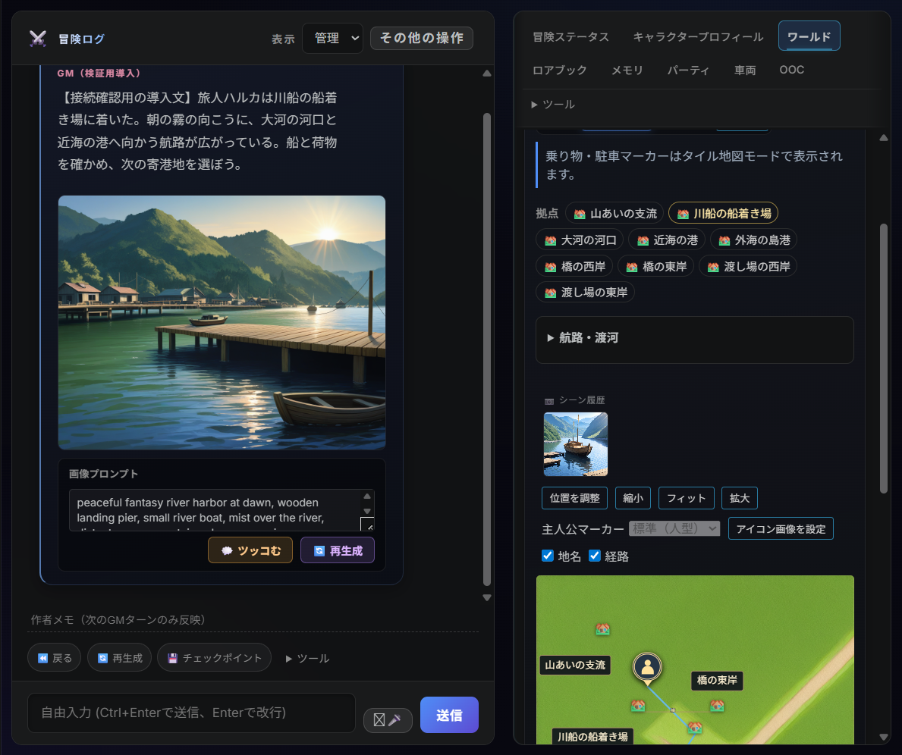

# LoreRelay + ComfyUI：実機で確認した使い方

2026-09-19、1.89.2 ソースの隔離した VS Code Extension Host で確認。一般のセーブ・モデルは変更せず、同じ航路デモ世界と主人公ハルカを使いました。画面の導入文は固定の検証用文章です。AI GMとの新規会話、人間の長時間プレイ、配布VSIXの確認とは分けて扱います。

## 何を作るかで入口と保存先が変わる

| 作るもの | 操作・保存先 | 採用と境界 |
| --- | --- | --- |
| 会話の情景 | ログの画像生成／再生成 → `output/` と対象エントリ | 元のエントリへ戻す。生成中に移動した場合、古い場所の画像を現在の背景へ採用しない |
| 現在地の候補 | ワールド → **シーン画像** → `output/`、`.text-adventure/location-images/` | ワールドの「シーン履歴」に最大4枚。同じ世界・場所の表示資料として保持。GM記憶には登録しない |
| 人物の立ち絵 | キャラクタープロフィール → 人物を選択 → **立ち絵生成** | `characters/<id>_portrait_*.png` と人物JSONの `portrait`。旧画像の整理は既存の人物採用処理による |
| 世界のイラスト地図 | ワールド → **イラスト地図** → ComfyUIと対応プロファイルを選択 | レイアウトPNGを生成後、`.lorerelay-map-assets/` へ取込。ワールドの「イラスト地図」で表示 |
| 外部AIによる場面・拠点・車両画像 | **この場面／拠点／車両を絵にする** → 資料を渡す → 完成画像を取込 | [場面](VISUAL_COMPOSER_V1.md)と[構造物](STRUCTURE_ART.md)の別経路。今回、外部AIでの新規生成は未実施 |

場所候補はUndo後も、同じ世界・同じ場所の候補として残します。自動的に背景やゲームの正本を巻き戻す材料には使いません。生成途中のUndo・世界切替・対象の編集／画像差し替えでは古い結果の採用を拒否し、生成ファイルは手動取込用に残します。キャラクター画像・地図はそれぞれ既存の専用採用処理を使います。

## 今回動いた構成

- ComfyUI `0.36.0`、`http://127.0.0.1:8188`、RTX 4070 SUPER 12GB、RAM 32GB。
- checkpoint: `IL\waiIllustriousSDXL_v170.safetensors`。
- 地図のControlNet: `diffusers_xl_canny_full.safetensors`。追加ダウンロードなし、LoRAなし。
- LoreRelay側のPythonは既存のPython 3.14、ComfyUI側はPython 3.12.10。別プロセスです。
- ComfyUIの既存起動設定には `--lowvram --reserve-vram 2 --cache-none --disable-dynamic-vram --use-sage-attention --fp16-vae` が含まれていました。この環境での結果であり、すべてのPCに同じ起動オプションを要求しません。

1. ComfyUIのUIとキューを確認し、画像生成設定のモデル候補から、サーバーが認識するcheckpoint名を選びます。ファイルの存在だけでは十分ではありません。
2. LoreRelayの **画像生成設定** でプロンプトモード `illustrious`、対応するSDXLプロファイル、用途テンプレートを選びます。「テンプレートのサイズに従う」を使います。
3. `textAdventure.skillPath` は空欄で同梱スクリプトを自動探索します。明示したカスタムパスは優先されます。古いパスが残っている場合は設定のUser／Workspace両方を確認してください。
4. `textAdventure.gmBridge.python` に起動できるPythonコマンドを指定します。既存のComfyUI環境を再構築する必要はありません。
5. 地図では `textAdventure.imageGen.controlNet` を上記の認識名に設定します。環境変数 `TA_CONTROL_NET` がある場合はそちらが優先されます。今回のHost実行ではこの環境変数を使いました。
6. 最初は自動画像生成を無効にして、一枚ずつ用途別に確認します。各画像が表示できた後で必要な自動生成を有効にしてください。

[設定例](examples/comfyui-v1.89.2/settings.example.json)、[普段用](examples/comfyui-v1.89.2/image_gen_config.daily.json)、[仕上げ候補用](examples/comfyui-v1.89.2/image_gen_config.finish.json)を用意しました。既存設定を上書きする前にコピーを残し、必要な項目だけ反映してください。Python名とモデル名は自分の認識名へ合わせます。

| 用途 | 用途テンプレート／実行プロファイル | 今回の設定 |
| --- | --- | --- |
| 普段の情景・場所 | `scene-sdxl-landscape`、`sdxl-illustrious-simple` | 1152×896、20 steps、CFG 5.5、Euler ancestral／normal |
| 仕上げ候補 | 同上 | 28 steps。構図・服装・場所との一致を見て選ぶ。高ステップだけで正確さは保証されない |
| 人物 | `portrait-sdxl`、`sdxl-illustrious-simple` | 896×1152、20 steps、CFG 5.5、Euler ancestral／normal |
| 地図 | `map-sdxl-direct`、実行時 `m1-cartography-sdxl-direct-guard` | 1024×1024、20 steps、CFG 5.5、DPM++ 2M／Karras、ControlNet 0.9 |

地図の「直接」は、Canny前処理ノードを通さずレイアウトをControlNetへ渡す意味です。ControlNet不要という意味ではありません。地図は専用ランナーの設定を使うため、情景のサンプラー設定と同じとは限りません。[ノード契約と対応範囲](../COMFYUI_WORKFLOWS.md)も確認してください。Flux・Qwen等はファイルを置くだけでこの経路に適合しません。

Illustriousで背景を描くときは、欲しい風景・視点・時間帯を具体的に書き、人物不要ならその指定も入れます。人物では外見・服装を人物プロフィールに書き、生成後に対象人物と一致しているか確認します。今回の結果を、恒常的なキャラクター同一性の保証とは扱いません。

## 実測と生成物

| 実行 | Hostから完了まで | 寸法 | サンプル中のGPU使用量最大 | サンプル中のシステムRAM使用量最大 |
| --- | ---: | --- | ---: | ---: |
| 最初の情景・20 steps | 41.7秒 | 1152×896 | 6.20 GiB | 28.38 GiB |
| 人物・20 steps | 18.2秒 | 896×1152 | 6.06 GiB | 31.60 GiB |
| 地図・20 steps | 31.7秒 | 1024×1024 | 9.08 GiB | 31.66 GiB |
| 場所・28 steps | 30.9秒 | 1152×896 | 6.20 GiB | 28.74 GiB |
| 場所・20 steps（モデル読み込み後） | 13.0秒 | 1152×896 | 6.19 GiB | 29.87 GiB |

1秒間隔のComfyUI `/system_stats` です。GPU・PC全体の使用量であり、このジョブだけの増分や厳密なピーク値ではありません。seed・モデル読み込み状態が異なるので、20／28 stepsの優劣を決める比較実験でもありません。ローカルLLMや動画生成との同時実行は未確認です。今回RAMの余裕は小さく、一枚ずつの実行を基準にしています。

[実際に投入したAPI workflow、seed、計測値、生成PNGのSHA-256](examples/comfyui-v1.89.2/measurements.json)を保存しました。workflowはComfyUIの履歴から取得したものです。地図を再現する場合は、同じフォルダの `world_map.layout.png` をComfyUIにアップロードしてから `map-final.workflow-api.json` を使います。モデル・実行環境により同じseedでも完全一致は保証されません。

最初の情景は修正前のスクリプト探索経路で生成され、以後の人物・場所は同梱スクリプトで確認しました。28 stepsの場所画像は正規化修正前の中間結果です。最終の場所保存・一覧表示は20 stepsの `location-daily-verified` で確認しています。

独立レビュー修正後も、同梱スクリプトで情景を再生成・採用しました（`scene-final`、20 steps、67.1秒）。ログでは約38.3秒までQUEUED、その後RUNNINGで、最初の表の速度比較には含めません。全体テストも並行していました。今回の掲載画面はこの最終情景と、保存済みの人物・地図・場所画像を表示しています。

実画面の「航路・渡河」で川船を選び、船着き場 → 大河の河口 → 船着き場を往復しました。主人公と川船の保存先は両方 `port → delta → port`、船体HPは100のまま。場所候補は河口では隠れ、船着き場へ戻ると再表示されました。Host再起動後の人物・地図・場所画像の読込も確認しています。

地図画像は生成・保存・表示の成功例です。この出力は河川・海岸の描き分けが不十分で、航路データの正確な地形表現の合格例ではありません。ゲームの地点・経路は重ねた操作レイヤーを参照します。完成地図として使う場合は画像を目視して、取込・位置合わせを行ってください。拠点の図面から完成絵を作る場合も、資料と一致しない雰囲気絵を正確な再現として採用しません。

## 失敗したとき

| 表示・症状 | 確認すること |
| --- | --- |
| 接続できない | ComfyUIの起動、URL・ポート、キュー。LoreRelayのテキストプレイは続けられる |
| checkpoint／ControlNetが不一致 | サーバーの認識名と設定を照合。サブフォルダ名も含める。ファイルを追加する前に既存モデルを確認 |
| 互換性チェックで停止 | 選んだ用途・モデル系列・workflowの組合せを確認。情景workflowを地図ランナーへ渡さない |
| 古いスクリプトが動く | `skillPath` の明示値、プレイフォルダ内の `.agents`／`.grok` を確認。空欄時の探索とカスタム指定は別 |
| 完了したが画像が採用されない | Outputの `LoreRelay: Image Gen`／`LoreRelay: Cartography` を確認。対象の編集・世界切替後なら拒否は正常。残ったPNGは適切な対象へ手動取込できる |
| 再試行・キャンセル | キューを確認してから再試行。LoreRelayのキャンセルは子プロセス・古い結果の採用を止める。ComfyUI側のGPUジョブ停止まで今回確認したわけではない |

手動取込、外部AIへの資料転送、GM/VLMによる認識、人物採用、場所候補、地図採用は別経路です。一枚生成できたことを、これら全経路の検証済みという意味に広げません。[今回の接続レビュー](ai-tasks/CONNECTION-COMFY-README-20260919.md)にコード検証と未確認範囲をまとめています。
