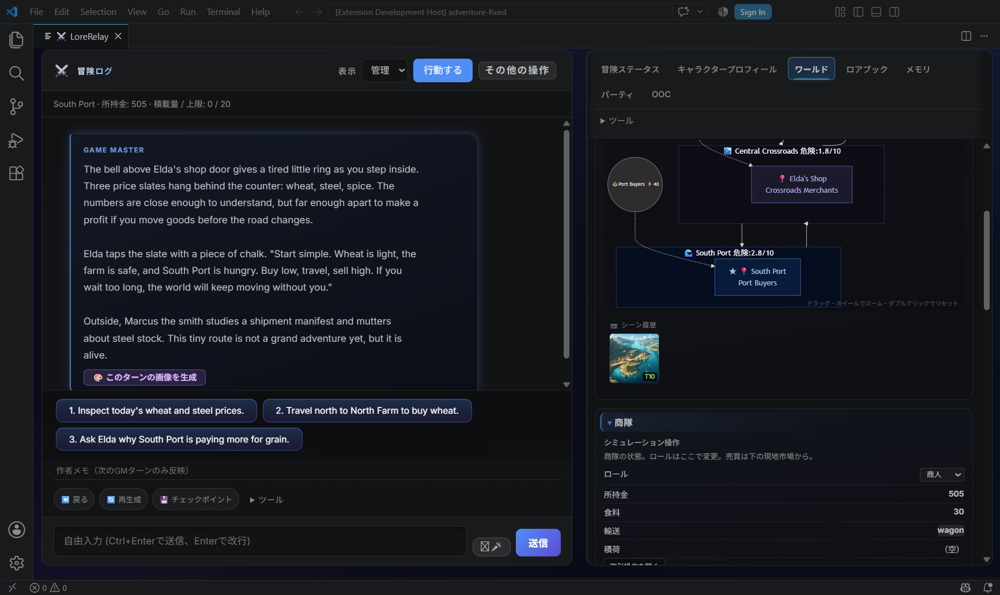

# 1.89.3：ハルカの交易を実画面で確認

2026-09-20（JST）の**AIによる実機プレイ**です。VS Codeの専用Extension HostをAIが操作しました。人間のHuman Play、配布VSIXの検証とは区別します。

同梱 `trade-routes` を通常のStart Hubから読み込み、プレイヤー操作の主人公ハルカを作成しました。導入文とNPCの台詞は同梱の固定データです。Grok Buildはモデル一覧で`grok-4.6`を確認・選択しましたが、専用プロファイルが再ログインを要求したため、**新しいGM応答・実送信prompt・Accepted Turnは0件**です。

## 同じ冒険で通った流れ

| 操作 | 保存結果・画面 |
| --- | --- |
| Eldaの店で開始 | 500 credits、食料30、空の荷車、ハルカはプレイヤー操作 |
| 小麦1を購入 | 11 credits支払い、残高489、積荷1、市場在庫12→11 |
| South Portへ移動 | 地図・Action Hubの現在地が南港。日数・食料の固定消費なし |
| 小麦1を売却 | 16 credits受取り、残高505、積荷0、南港在庫8→9 |
| Eldaの店へ帰還・日送り | 世界ターン10→11。市場相場が変化し、依頼を受注して進行中へ |
| チェックポイント保存・Host再起動 | 残高505、食料30、進行中の依頼を保持。現在地表示も保存後に一致 |
| 南港へ再訪 | 南港に保存した同じ画像が再表示。最終の専用セーブは南港、世界ターン11 |

価格は初期状態と世界進行によって変わります。今回はNPCとの新規実会話、依頼の条件達成・報酬、次のGM応答までは確認できませんでした。

AI操作の実画面。左側は同梱導入文で、GMとの新規会話ではありません。右側の図解と現在地、残高505はこの交易冒険の実状態です。

Eldaの店へ帰還した後の実画面。取引操作の残高と、日送り10→11の確定前確認を表示しています。

## 南港の画像を残す

**ワールド → シーン画像** からComfyUIに1枚要求し、南港の **シーン履歴** へ保存しました。Eldaの店では非表示となり、Host再起動後の南港への再訪で同じPNGが読み込まれました。ゲーム内の施設・報酬・GM記憶は画像から増やしません。

ComfyUI生成の水辺のイラストです。実際の建物配置や地形の正確な再現を確認した例ではありません。

- RTX 4070 SUPER 12GB、既存checkpoint `IL\waiIllustriousSDXL_v170.safetensors`。モデル追加なし。
- `scene-sdxl-landscape`／`sdxl-illustrious-simple`、1152×896、20 steps、CFG 5.5、Euler ancestral／normal、seed **789830866**。
- ComfyUI履歴上の実行は**39.081秒**。Hostの待ち時間・画面表示までを含む総時間ではありません。今回GPU使用量の再計測はせず、[#147の実測と用途別設定](COMFYUI_LOCAL_PLAYCHECK.md)を参照します。
- [実際のprompt](examples/gameplay-v1.89.3/south-port.prompt.txt) · [API workflow](examples/gameplay-v1.89.3/south-port.workflow-api.json) · [LoreRelay設定](examples/gameplay-v1.89.3/image_gen_config.json) · [seed・SHA-256・出力サイズ](examples/gameplay-v1.89.3/generation.json)

場所候補、ログの情景、人物、地図、拠点資料は入口と採用先が異なります。今回の追加生成はこの南港1枚です。#147の人物・地図・航行を同じ交易冒険の実績へ混ぜていません。

## 開始導線と確認の限界

別の空workspaceではStart Hub → 世界作成 → プレビュー → 採用を操作し、6地域・3勢力・8NPC・密度1.5と有効ルールが保存されたことを照合しました。修正後は採用成功時に「主人公を作る」が現れ、プレイヤー操作の作成画面へ進めます。この生成世界は交易デモとは別です。

実機観測は準備・修正・再起動を挟みました。修正後の交易開始〜最初のチェックポイントは約7分22秒で、30〜60分連続したGMとの冒険が通ったとは主張しません。初回GM入力からエラー観測までの監視区間は6.154秒（UI監視・保存待ちを含む）で、生成は始まらず実GMターンは0。長期の約束・記憶、Undo中の遅延GM応答、依頼完了・報酬は未確認です。

最終実行コード `e0bd2babb5234503a2f40bb57117746c049e4ef1`（tree `cdd104633b10c67aae6055707eb27f4835417f5e`）は全体400/400、Combat736/736成功（167.1秒）。途中の全体成功後に実プレイでcheckpoint更新の不良が見つかったため、実行コードを修正して最終treeで再実行しました。文書・画像だけの後続変更で全体テストは繰り返しません。

[最初の手順](FIRST_SESSION.md) · [交易を一往復する](LIVING_WORLD_QUICKSTART.md) · [5件の修正と独立レビュー](ai-tasks/GAMEPLAY-COHERENCE-20260919.md)
