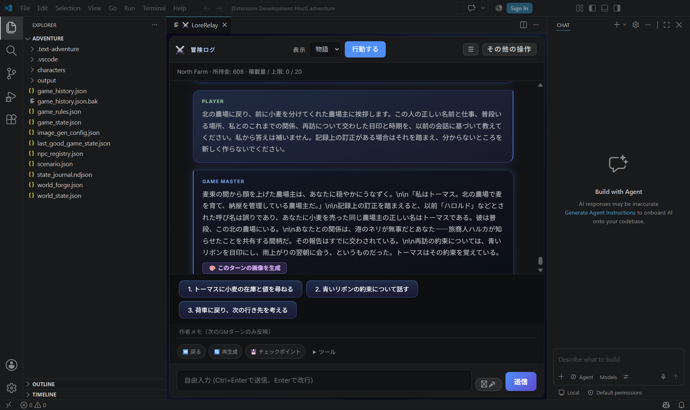
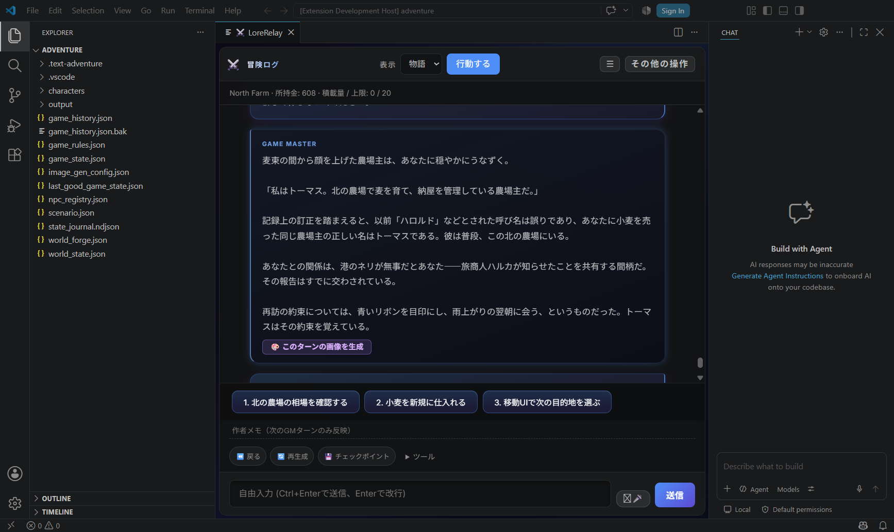
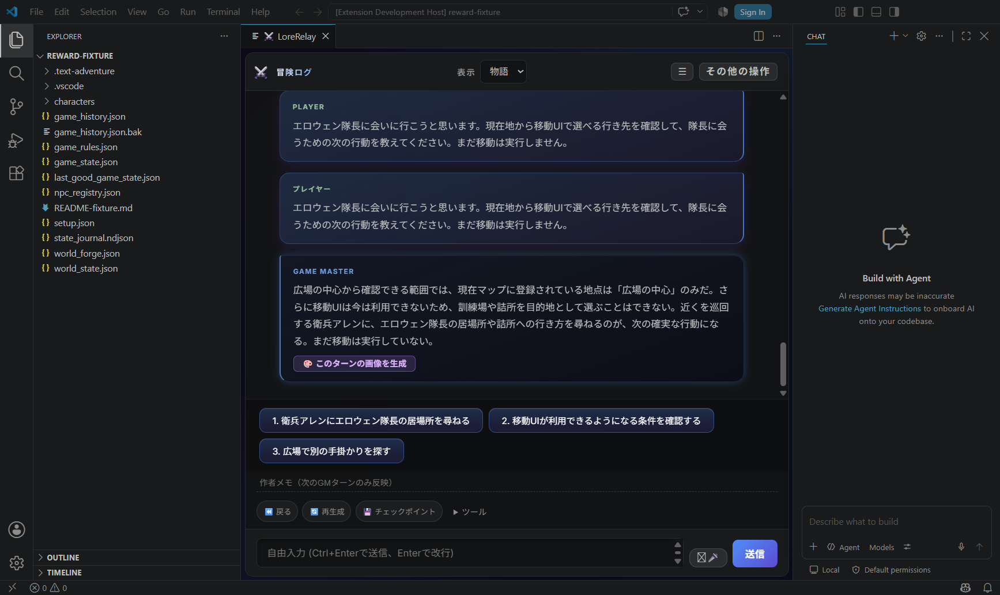

# GMの地理・過去取引・段落表示（1.89.6候補）

2026-09-20 JST。PR #150の `ad55cc4a19288520491ab86e0d070798878f3444`（1.89.5）を基準に、既に観測された3点を修正した。**AIによる実機プレイ**であり、ユーザー本人のHuman Playではない。ハルカの主冒険とCaptain Elowenの検証fixtureは、それぞれ前回の最終セーブから専用コピーを作り、別世界として確認した。

[Draft PR #151](https://github.com/GGF1sh/LoreRelay/pull/151) ／ [版別のDrive引渡し](https://drive.google.com/drive/folders/1BAwhwpXfOwTB7xL1dust4ca6YFhKK0XY)。最終HEAD、検証済み実行SHAとの差分、起動先はDriveの「00_最初に読む」と引渡しJSONで固定する。#150をbaseとするstacked PRで、mainへの統合・配布はしていない。

## 再現と修正

| 対象 | 基準版／中間版での結果 | 修正と実機確認 |
| --- | --- | --- |
| 未確認の移動先 | #150ではfixtureに定義のない訓練場・詰所への移動を提案。今回の基準版も「そこに表示されていれば選べる」と案内したが、実際はCommerce OFFで、現在公開されている地点は広場の中心だけだった。 | 公開済み地点のID・名前と、既存`previewMarketTravel`の実判定をGMへ供給。修正版は訓練場・詰所を選択可能な行き先として扱わず、移動UIが使えないことを説明し、衛兵へ隊長の居場所を尋ねる案へ変わった。 |
| 過去取引の説明 | 同じ質問に、保存済みの「North Farmで小麦10・支払90」のイベントがあるのに「数量・支払額を確定できる取引記録が残っていない」と回答した。 | 既存のplayer由来UI取引イベントを最大5件供給。修正版は「小麦10単位・90cr」と回答し、現在残高608cr・積荷なしも一致。新しい取引や二重の支払いは発生していない。 |
| literal `\n` | 保存されたGM本文の`\n\n`がそのまま画面へ出ていた。 | GMの段落に限り表示時に補正。実DOMでは段落改行になり、保存本文のSHA-256は修正前後で同一。コード・Windowsパスを含む本文、他role、単独escape、Copyは原文を保持する。 |
| 移動の費用・時間 | 中間版は正しい行き先を答えたが、「移動実行後に所要時間・食料消費が確定」と説明した。 | 現行市場移動の契約`elapsedWorldTurns=0, fixedCosts=[]`と所在地のみの更新であることを追加。選択・実行後に旅程計算が行われるとも約束しない。経路評価や航行機能とは区別する。 |

地点はFoWの公開範囲と最大8件の表示枠に従う。表示されない地点を「世界に存在しない」と断定せず、物語上の施設・地域名をUIの目的地へ自動昇格させない。NPCの所在が未確認なら未確認として扱う。地理・施設・NPCを新規登録する処理や、行動の採用権限は変更していない。

**創作の自由と、ゲーム上の事実を確定する権限は分ける。** GMが水車小屋の風景を描いたり、人物の噂を語ったりすることを禁止する修正ではない。既存の移動UIについて答える際には実際の候補を使い、過去の取引については確認できる保存記録を参照する。誤描写を完全に防ぐのではなく、Undo・訂正・GMへの指示でプレイヤーが立て直せる設計を維持する。このPRで回復機能の契約は変更しておらず、訂正→次ターン→再起動→Undoを一巡する追加の実機プレイは未実施である。

限定した読取レビューでは、明示訂正を優先する既存context、作者メモからGM指示への送信、本文編集から履歴保存、Undoによる元履歴の復元に変更がないことを確認した。Copy・本文編集・Undoは保存原文を使い、表示補正の結果を保存し直さない。実LLMが訂正と新しいgroundingを同時に受けた場合の挙動までは、この読取確認の保証範囲に含めない。

取引情報も**完全な台帳ではない**。自由入力経由の全GM取引が既存イベントに記録されるわけではなく、古いイベントは保持上限から落ち得る。欠落は「不明」であって「未実行」ではない。GMのtradeOps要求や曖昧な描写を、支払い済みのレシートとして扱う変更はしていない。現在残高は現在のcommerce正本、確認できる過去の金額は保存イベントを根拠にする。

## 実画面と証拠

*AI操作の実Extension Host画面。同じハルカの冒険を専用コピーで表示。元本文の書換えや会話の合成ではない。*

*別の検証fixture。主冒険の地理や体験とは混同しない。ComfyUI生成画像ではない。*

代表例は [基準版の取引回答](assets/gm-grounding-v1.89.6/history-baseline/reply.txt)、[修正版の実送信prompt](assets/gm-grounding-v1.89.6/history-fixed/prompt.txt)、[取引回答](assets/gm-grounding-v1.89.6/history-fixed/reply.txt)、[地理の実送信prompt](assets/gm-grounding-v1.89.6/world-fixed/prompt.txt)、[段落の原文・DOM比較](assets/gm-grounding-v1.89.6/paragraph-evidence.json)。Inspectorで再構築したcontextではなく、実際の送信本文を保存した。

## 検証と制限

GMは既存認証の **Codex App Server / gpt-5.6-terra / medium**、クライアント報告値0.153.4。開発担当は **gpt-6-astra / ultra**。Grok再認証や新しいAPI契約は行っていない。

実GMは**6応答・6 Accepted**、全6件で実送信promptと採用レシートのhashが一致。内訳は基準版2件、`1e7c48de18079712014f2e60dca29c2e8de15c08`で3件、移動契約を明示した最終実行SHA `a92d8da25d94e1c38f41411969078496810a49c7`で1件。全6件を最終コード上で再試験した意味ではない。最終回答は「この移動UIは地点のみを更新」「旅程や食料消費を計算するものではない」と説明した。[実送信prompt](assets/gm-grounding-v1.89.6/routes-final/prompt.txt)と[実応答](assets/gm-grounding-v1.89.6/routes-final/reply.txt)を参照。

**Risk tier: Medium**（表示補正単体はLow）。変更は読取・bounded prompt構成・表示のみ。save schema、正本書込、取引実行、移動・採用契約は変更なし。Test Consoleの計画は`requiresFullSuite:false`。compile、prompt core／実production receipt／budget／purity／Context Inspector、Webview bundleと実GM本文の表示回帰をfocused検証した。旅程説明の追加修正後はcompileとcore／production receiptを再確認した。同じ実行コードへのfull suiteは行っていない。

短時間のHost切替では、旧writer leaseが残った状態で一度、GM送信前の待機が発生した。129.45秒で実UIから中止し、間隔を空けて再起動した。送信・実GM応答・Acceptedには数えない。既知の再起動時の制限として残し、本修正で解消したとは報告しない。

地理の文脈を明示する修正であり、あらゆるGM出力の正しさを保証するバリデータではない。完全な過去取引台帳、物品納品条件の自動検査、現金報酬、Chroma固有の品質、ユーザー本人のHuman Playは未確認。地図画像のA/B生成は別作業であり、今回は行っていない。

Version decision: **patch、1.89.5→1.89.6**。配布版の更新とは別で、タグ・Release・VSIX公開は行わない。Before planning verification, follow `docs/DEVELOPMENT_VERIFICATION_POLICY.md`. Do not escalate beyond its risk tier without a concrete reason.
