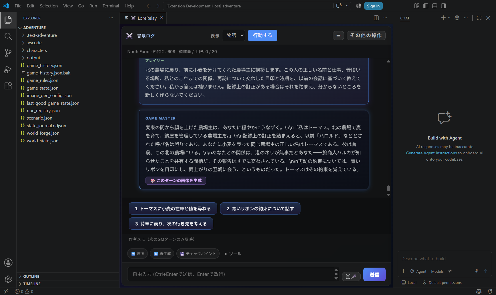
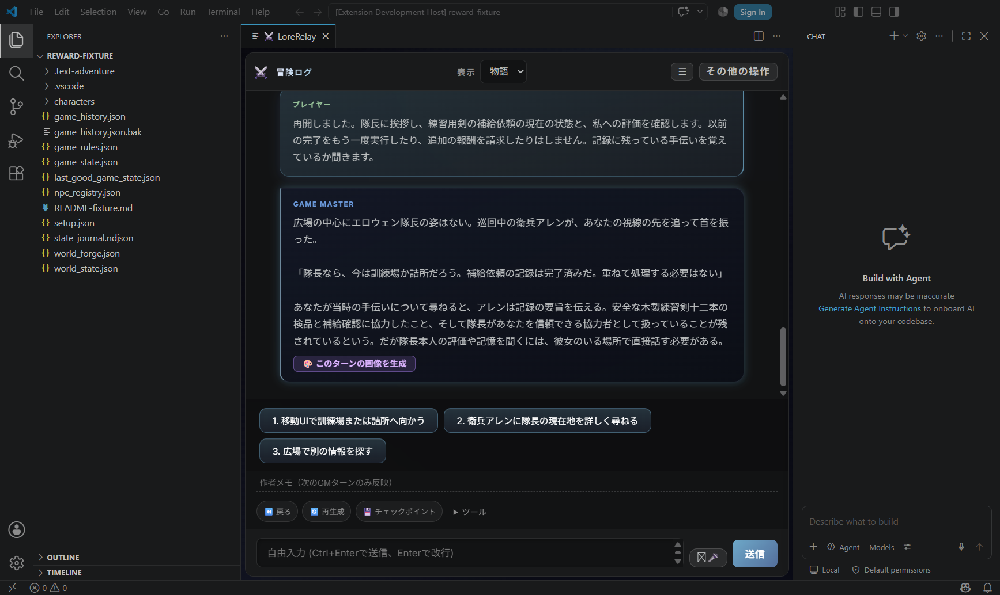

# 人物の訂正・長期再会と依頼報酬の実機確認（1.89.5候補）

2026-09-20 JST。**AIによる実機プレイ**であり、ユーザー本人のHuman Playではない。PR #149 の `045229e9efd6f2706005fd6e49ec1ae4272733e1`（1.89.4）からの差分。最終実行コードは `209dc478f5cbda573db181752eb108261a1e2620`。この後のREADME・証拠追加では実行コードを変更していない。

[Draft PR #150](https://github.com/GGF1sh/LoreRelay/pull/150)／[版・PR別のDrive証拠](https://drive.google.com/drive/folders/1yvXNL2TnW1JfhEXUjaIsY8VV7HkE8xoV)。最終HEADはDriveの`00_最初に読む.md`とPRで確認できる。CIはmain/master対象のため、このstacked branchでは発火しない。

主冒険は前回のハルカ／`trade-routes`を専用コピーで継続し、**実GM 31応答・31 Accepted**。別の既存報酬fixtureでは **5応答・5 Accepted**。36件すべてで保存した実送信promptのSHA-256と採用レシートが一致した。GMは既存認証の `codex-app-server / gpt-5.6-terra / medium`、クライアント報告値 `0.153.4`。開発担当は `gpt-6-astra / ultra`。Grokへの再ログインや別APIへの切替は行っていない。

## 再会で分かったこと

| 操作 | 実際の結果と修正 |
| --- | --- |
| 北の農場主について尋ねる（主冒険1） | GMは古い誤回答「ハロルド」を再使用し、目印・時期を回答できなかった。古い索引が現在の履歴や訂正を置き換え得ることもコードで確認。所有する可変資料を読み直し、現在の履歴検索をバックエンド検索と併用するよう修正した。 |
| 一度だけ明示的に訂正（2） | プレイヤーが「同じ農場主はトーマス、別人・親族ではない」「青いリボン」「雨上がりの翌朝」を訂正し、GMも応答で確認。会話上の人物のまま保持した。 |
| Elda、Marcus、Neri、Rodenとの会話、売買、移動、宿泊、Host再起動（3〜29） | Eldaの誤った呼称「Helda」を質問に含めても正本のEldaを維持。港のRodenも別の会話を挟んで再認識。小麦と鋼の取引・現在地は保存と次contextに反映した。 |
| 28ターン差で農場へ戻る（30） | **失敗**。回答を含まない事前固定の質問に対し、再びハロルド／目印・時期なし。実送信contextでは古い誤回答が上位に入り、訂正会話は検索枠の外だった。 |
| 修正して再起動し、同じ質問を再送（31、訂正から29ターン差） | **成功**。トーマス、農場主、North Farm、ハルカとの関係、青いリボン、雨上がりの翌朝を回答。古い発言の直後にある「次のプレイヤー入力＋GM回答」を同じ検索結果の文字数枠内へ添え、明示的訂正を実送信contextへ戻した。 |

主冒険は最初の送信から最終回答まで約38分（修正・再起動を含む）。UI送信から応答までの待ち時間合計は主冒険585.986秒、別fixture100.872秒。1は基準版、2〜26は `eacc950`、27〜30は `ed2299f`、31と報酬fixtureは `209dc47`。全31応答を最終コード上で実施したという意味ではない。途中の通常検索にも人物情報が再供給されており、「29ターン一度も情報を渡さずに覚えていた」という試験ではない。

実際の [訂正入力・応答](assets/npc-identity-v1.89.5/main-02-correction/reply.txt)、[28ターン差の失敗prompt](assets/npc-identity-v1.89.5/main-30-failed/prompt.txt)、[失敗応答](assets/npc-identity-v1.89.5/main-30-failed/reply.txt)、[修正後の実送信prompt](assets/npc-identity-v1.89.5/main-31-fixed/prompt.txt)、[成功応答](assets/npc-identity-v1.89.5/main-31-fixed/reply.txt)を保存した。正解を補ったのは2の一度で、30と31の入力は同一。

*AI操作の実Host画面。既存冒険の専用コピー。加工・合成した会話ではない。GMのJSONに含まれた文字列 `\\n` が画面にも残る既知の表示上の制限がある。今回はComfyUI画像を新規生成していない。*

## どの資料が人物を支えたか

| 資料 | 今回の実送信／検証範囲 |
| --- | --- |
| NPC registry | Elda・Marcusの正本名／IDを供給。農場主・Neri・RodenをGMの発言から自動登録していない。最終registryもElda・Marcusのみ。 |
| Memory Bank | 保存済み会話の質問とGM回答、必要な隣接会話を供給。今回の農場主の訂正と約束の根拠。検索順位を時系列とみなさない指示を追加。 |
| Lorebook | 主冒険には存在せず実プレイでの供給なし。編集・無効化した資料の古い索引を除外し、`lorebook.json`を`world_info.json`より優先するケースはfocused testで確認。 |
| Saga／Chronicle | 今回の農場主再認識の実送信根拠には含まれない。これらを介した長期記憶成功とは報告しない。 |
| Python／vector backend | 設定は既存のauto。ワークスペースにはChroma DB／index.jsonがなく、Chroma固有の長期検索品質を実証した試験ではない。現在資料による再検索・バックエンド回答IDの対応付けはfocused testで確認。 |

正本の人物名を会話上の最新名で上書きしない。質問中の名前、引用、最新のGM発言だけでは訂正とみなさず、矛盾時に親族や別名を創作しないようGMへ指示する。保存schema・NPC登録規則・採用権限は変更していない。

## 独立報酬のある既存経路

主冒険の売却代金とは分け、既存 `scripts/test_quest_generator.js` のCaptain Elowenのmaterial needと`debug-sandbox`の初期資料から、プレイ開始前に独立fixtureを用意した。既存 `generateQuestHooks` が生成する `quest_npc_captain_elowen_missing_supplies` を通常UIから受注。trade-routesへの報酬追加やプレイ途中のJSON編集は行っていない。

1. available → UI受注 → active。GMへ条件確認し、木製練習剣の検品と補給確認を会話で進めた。
2. 3応答目の実GMが `resolvedQuests` を返し、Accepted後はcompleted、**信頼50→60、対象need削除、完了記憶1件**となった。
3. 次のGM応答とHost再起動後の応答が完了済みを認識。信頼60・記憶1件を維持した。
4. 再起動後、実際に採用した同一candidateを既存mutation gate経由で再送。`alreadyAccepted / accepted:false`、比較した16ファイルに差分なし。この再送は独立したAPI契約確認であり、新しいGM応答やUI操作には数えない。

[実GMの完了応答](assets/npc-identity-v1.89.5/reward-03-complete/reply.txt)／[再起動後の応答](assets/npc-identity-v1.89.5/reward-05-restart/reply.txt)／[再送結果](assets/npc-identity-v1.89.5/replay-readback.json)。主冒険・報酬fixtureとも通常再起動前後の7 canonicalファイルは同一だった。

*AI操作・既存部品から作った検証用初期データ。ハルカの主冒険とは別。隊長本人との再会ではなく、GMが衛兵を通して完了・信頼を説明した場面。*

この独立報酬は**NPCの信頼**であり現金ではない。QuestHookの完了はGMの`resolvedQuests`を契機とする。木剣12本の所持数・運搬・納品先をゲーム側で自動検査した結果ではない。GMはその後もfixtureに定義されていない訓練場への移動を提案しており、物品納入全体の完成を意味しない。

## 修正と検証

主要変更は `src/memoryBank.ts`、`src/gmPromptBuilder.ts`、`src/gmPromptBuilderCore.ts`。所有する可変資料の再読込、最大2,000履歴チャンク内での検索、質問と回答のID対応／重複排除、文字数上限を維持した隣接会話、直近5件のcanonical completed quest供給を追加した。主冒険26でGMが完了済み依頼を「未記録」と説明したため、completed questを送信する修正を行い、27で再確認した。

**Risk tier: Medium**。読取・context構成に限定し、正本書込／採用／schema／認証／実行処理を変えていない。Test Consoleの計画は`requiresFullSuite:false`。具体的な検索併合・資料優先順位について独立レビューを1回行い、回答IDの欠落と旧fallbackによる上書きの2件を修正した。

compile、Memory Bank、prompt receipt、prompt budget、completed quest contextのfocused testsは変更段階ごとに成功。candidate purity／Context Inspectorの既存focused checksも初期変更時に成功。最終実行treeではcompile、`test_memory_bank.js`、`test_prompt_receipt_accepted_consumption.js`、`test_prompt_budget_shadow_integration.js`が成功。詳しい対象SHAは証拠の`test-results.json`に記録する。

**full suiteは未実行**。前回#149の399/400＋失敗1件の単体再実行成功は前回の記録のままで、今回の400/400とは扱わない。Mediumのユーザー本人によるsmoke checkも未実施。今回得たのはAI操作の実機証拠である。

Version decision: **patch、1.89.4→1.89.5**。既存互換の検索・GM context修正として採番。mainや配布VSIXが1.89.5になったことを意味しない。Draft PRまでとし、Ready化・merge・タグ・Release・VSIX公開は行わない。

## 残る制限

- 隣接会話の追加は直後の回答済み1往復に限る。離れた訂正を意味的にすべて発見する機能ではなく、検索順位・文字数・保持範囲次第で情報は落ち得る。
- 主冒険16では資産は正しいが、GMが過去の取引について不正確に説明した。長期RP全般の誤認が解消したとは言わない。
- 大規模アーカイブ、Chroma固有の検索品質、今回変更と無関係なUndo／世界切替境界、現金の独立報酬は実機未確認。
- Grok再認証、地図品質チューニング、今回のComfyUI新規生成は対象外。追加探索は自動で開始しない。

次の担当はユーザー指示待ち。Before planning verification, follow `docs/DEVELOPMENT_VERIFICATION_POLICY.md`. Do not escalate beyond its risk tier without a concrete reason.
