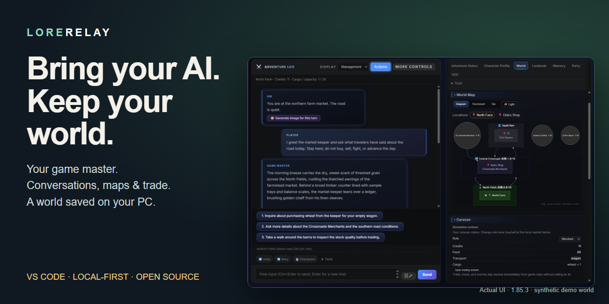

# LoreRelay — public launch media

**[Watch or download the 75-second demo (WebM, 2.1 MB)](assets/public-launch-v1.85.3/lorerelay-demo-75s.webm)**

日本語：実GM応答、取引の確認・購入、パネルを閉じて開き直す流れを収録。待ち時間の短縮と静止保持を含む編集版です。

English: A real GM reply, purchase review/confirmation, and closing/reopening the game panel. Waits are shortened and selected frames held. This is an edited screen recording, not continuous real-time footage.

简体中文：真实GM回复、交易确认与购买、关闭并重新打开面板。录像经过剪辑，包含缩短等待和静帧停留。

繁體中文：真實GM回覆、交易確認與購買、關閉並重新開啟面板。錄影經過剪輯，包含縮短等待和靜幀停留。

## Files

| File | Use |
| --- | --- |
| [Social Preview PNG](assets/public-launch-v1.85.3/social-preview.png) | 1280 × 640 repository sharing card; composed typography around a real screenshot |
| [75-second WebM](assets/public-launch-v1.85.3/lorerelay-demo-75s.webm) | 1920 × 1080, VP8, 2 fps, silent; download if the GitHub viewer does not play it |
| [Management / world screenshot](assets/public-launch-v1.85.3/management-map.png) | Current conversation, world diagram and caravan |
| [Completed purchase screenshot](assets/public-launch-v1.85.3/trade-committed.jpg) | Actual purchase result, replacing the earlier estimate-only image |

To set the repository sharing card: GitHub repository **Settings → General → Social preview → Edit → Upload an image**, then select the PNG. Committing this file alone does not configure GitHub's sharing image. The automated browser upload was refused by the local file-upload capability; registration remains pending.

## Capture and evidence

- Captured 2026-09-08, LoreRelay **1.85.3**, source `8e479d922ddf7990b0ab4a0334c59ed27fd87835`, real VS Code **1.136.1 Extension Development Host** on Windows.
- The existing isolated GM fixture harness was reused. No ordinary campaign, account screen, authentication data or internal trace is published.
- One actual Antigravity GM request, requested model `gemini-3.8-flash-high`, completed successfully through the Host. The model name is the request configuration, not an independent proof of backend model identity.
- First purchase: credits **20 → 11**, wheat cargo **0 → 1**, market stock **50 → 49**. Second purchase: **11 → 2**, **1 → 2**, **49 → 48**. Both used the real Action Hub's review and confirmation controls.
- Closing all editors removed the Webview (zero remaining panels). Reopening the game and Action Hub showed **2 credits / 2 wheat / stock 48**. This demonstrates **panel reopen**, not an OS restart or window reload.
- The later insufficient-credit preview is for another, unexecuted purchase; it is not a failure of either completed trade.
- A separate narrative Adventure Status field still displays the fixture's original “20 credits” while authoritative Commerce shows the updated funds. This presentation discrepancy was observed, not retouched or repaired in this media task.
- Video: 75 seconds / 150 frames. Real screen captures are fitted inside a captioned frame. Waits are shortened, some moments held, and the introduction/outro reuse the management screenshot. No UI text or result is fabricated. The captions disclose this editing throughout.

The README retains its full feature gallery, including generated map artwork and light/dark screens. Older map-detail, logistics, party, lorebook and battle showcases remain labeled as older captures; they have not been re-certified. Current management and executed trade are the first replacements in this gradual refresh.

This is fixture-based automated capture, **not Human Play**, a balance evaluation, or a guarantee for arbitrary campaigns.
