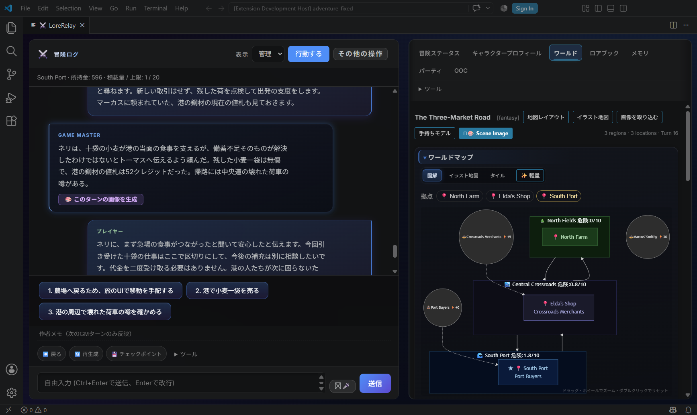

# 1.89.4候補：ハルカの実AI GMプレイ

2026-09-20 JST、同じ `trade-routes` のハルカを使った**AIによる実機プレイ**。人間のHuman Playではありません。[前回の1.89.3](GAMEPLAY_PLAYCHECK.md)から冒険を継続しました。

Grok Buildは再ログイン要求で実応答0件。許可された代替として、既存のChatGPT認証を使う **Codex App Server / client 0.153.4 / gpt-5.6-terra / medium** を使用しました。モデル名は実接続の報告値です。APIキーの新規作成・従量課金APIへの切替はありません。開発担当の `gpt-6-astra / ultra` とは別です。

## 実際に通ったこと

**実応答24件、Accepted Turn 23件**。23件すべて保存完了、実送信promptのSHA-256とHostのreceiptが一致しました。1.89.3で4件、修正途中を含む1.89.4で19件採用。Acceptedは保存成立の件数で、誤った描写まで正しいと認定するものではありません。

観測区間は00:55:17〜01:45:22 JST、約50分。修正・Host再起動・待機を含みます。入力からUI結果までの監視時間合計は約606秒（失敗・中止を含む）で、純粋なモデル生成時間ではありません。

| 操作 | 正本と次のGM認識 |
| --- | --- |
| 農場で小麦を追加1袋購入（turn5） | 415→406 credits、10→11袋。既存10袋はUIで購入済みであり、修正前のGM描写だけで得たものではない |
| 南港で10袋を売却・依頼完了（turn9） | 406→596 credits、11→1袋、依頼active→completed。次の応答も受領済みとして継続 |
| 再起動後の会話（turn11、22） | 現在地・資産・完了依頼を保持。2回目は正本7ファイルの再起動前後SHA-256が一致 |
| 移動直後のGM送信（turn15、20、23） | 保存済みの北農場／Eldaの店を実promptへ送信。古い画面キャッシュを使わない |
| 一晩休む（turn19） | `elapsedWorldTurns: 1`で世界16→17。以後の会話・移動では17を維持 |
| 約束を再確認（turn23） | 入力で答えを再提示せず、4ターン前の「青いリボン」「雨上がりの翌朝」を実promptから再供給し、再起動後の応答で認識 |

最終セーブは北農場、596 credits、小麦1袋、食料28、世界17、依頼完了です。190 creditsは**売却代金**であり、別枠のクエスト報酬ではありません。このシナリオの当該依頼には別の固定報酬がなく、評判機能も無効でした。完了後の会話で二重の代金・積荷変更はありません。

AIが操作した実Extension Host画面。1.89.4の修正途中、turn11の新しいGM応答と南港・596 credits・積荷1を表示しています。最終候補全体や人間による確認の証拠ではありません。

## 送信から採用までの証拠

以下のpromptはInspectorで再構築したものではなく、実クライアントへ渡した文字列です。各フォルダに入力、実応答、候補、採用結果、正本の前後比較があります。

- [turn5：購入の実prompt](examples/real-gm-v1.89.4/turn-05/prompt.txt) · [実応答](examples/real-gm-v1.89.4/turn-05/reply.txt) · [正本の前後](examples/real-gm-v1.89.4/turn-05/canonical-before-after.json) · [次の実prompt](examples/real-gm-v1.89.4/turn-05/next-actual-prompt.txt)
- [turn9：売却・依頼完了の実prompt](examples/real-gm-v1.89.4/turn-09/prompt.txt) · [正規化候補とreceipt](examples/real-gm-v1.89.4/turn-09/normalized-candidate.json) · [採用結果](examples/real-gm-v1.89.4/turn-09/submit-result.json) · [次の実prompt](examples/real-gm-v1.89.4/turn-09/next-actual-prompt.txt)
- [turn23：再起動後の約束の実prompt](examples/real-gm-v1.89.4/turn-23/prompt.txt) · [入力](examples/real-gm-v1.89.4/turn-23/input.txt) · [実応答](examples/real-gm-v1.89.4/turn-23/reply.txt)。ここでプレイを終了し、次のGM送信は行っていません。

前回の南港画像は再起動後にも同じPNGが読み込まれました。追加生成はせず、[既存のComfyUI設定・prompt・seed・workflow](GAMEPLAY_PLAYCHECK.md#南港の画像を残す)を再利用しています。画像からゲーム上の資産や人物記憶を増やしていません。

## 失敗と確認限界

- JSONを欠く実応答1件は不採用。資産・世界日付は変わらず、手動再送で採用されました。
- 最終コードの再起動直後、前Hostのwriter leaseにより1回の送信がtransport前で停止しました。待機表示を中止し、後の手動再送で復帰。ロックを削除・強制奪取していません。
- 農場主の名前はトーマス→ハルン→ハロルドと揺れました。検索入力と質問・回答の分断は修正しましたが、過去の誤った名乗りを含む履歴では最終応答でも名前が不安定です。turn19で入力に名前を明記して訂正した事実も記録しています。**人物の長期一貫性が完成したとは評価しません。** ネリや農場主は創作された会話上の人物で、NPC registryへの自動登録・関係値更新を実証したものでもありません。
- 約束の再供給は直近履歴内の4ターン差と再起動で確認。数百ターン・Sagaへの圧縮後・任意の古い約束を保証する試験ではありません。
- 別枠の依頼報酬、評判更新、Undo／世界切替中の遅延応答、他providerの同等プレイ、人間のHuman Playは未確認です。

## 変更と検証

[5件の再現・原因・修正](ai-tasks/REAL-GM-CAMPAIGN-20260920.md)。Version decisionは **patch：1.89.3→1.89.4**、正本更新へ命令を渡す変更を含むため全体RiskはHighです。公開API・save schema・設定キーの追加はありません。

最終実行SHA `d2f033f877caae40ff5b92b2bfd753b02511d3d6`、tree `ce0a44ae39895bd8b2ac5bb7859ca6b53bbdb691`。compileと変更箇所のfocused tests成功、独立レビュー1回と混在JSON形式の修正検証を実施しました。

このtreeの全体テストは**399/400、214.9秒**。`test_runtime_accepted_replay_guard.js` の同時競合ケースで両者がwriterConflictになり失敗し、その1件だけの再実行は成功。戦闘は736/736成功です。全体400/400成功には丸めず、同じtreeで全体を再実行していません。後続は文書・証拠のみ。Draft PRの最終HEADとCIはPR本文を参照してください。

検証用Hostは終了済み。既存セーブ・モデルを保持し、専用の続き用ランチャーは `C:\AI\LoreRelay-RealGM-Playcheck\Start-LoreRelay-1.89.4.cmd` です。タグ・Release・VSIX公開、PRのReady化・mergeは行いません。次の担当AIはユーザー指示待ちです。
