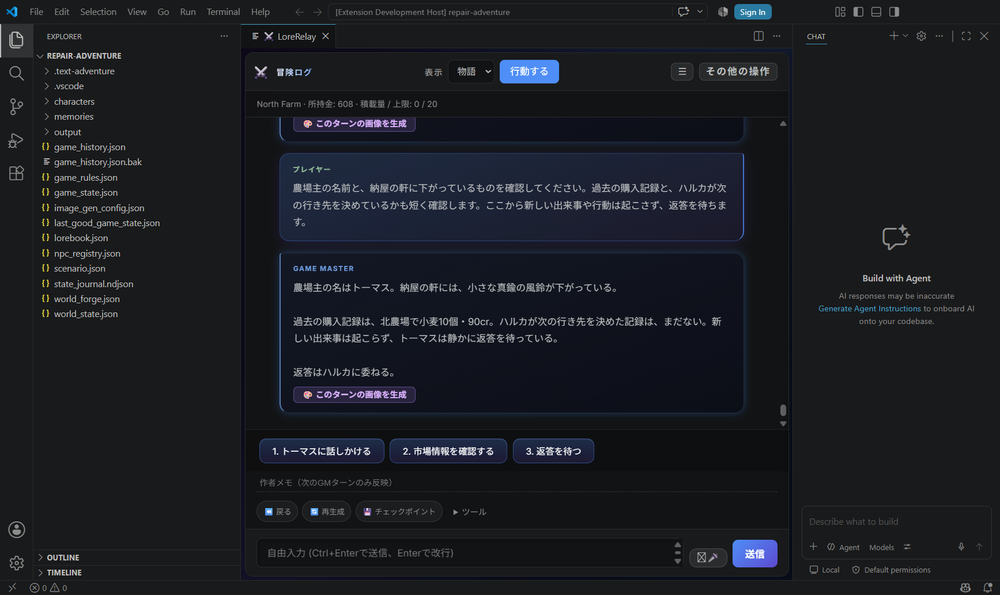
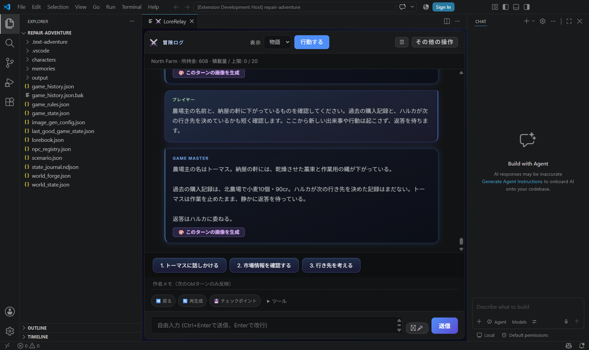

# 訂正・GM指示・再起動・Undoの実機確認（1.89.7）

AIが操作した実Extension Hostで、意図的な誤描写からの回復を確認しました。ユーザー本人のHuman Playではありません。**Undoで会話用スナップショットが正本の所持金・現在地等を消す不具合を修正**し、編集済み本文の検索と、キーワードなしのロアブック固定保存を直しました。

AIの創作を禁止したり、GMが語った人物名・場所を自動的に正本へ登録したりする変更はありません。会話中の訂正を毎回モデルが尊重する保証もありません。実際に残った失敗を下記に記録しています。

## 版と証拠

- 基準: [#151](https://github.com/GGF1sh/LoreRelay/pull/151)、1.89.6、`41273d1c02a113c1ea31bf9fdb2c0da5fcb6fc61`。
- 最終実行コード: `96a166ee4377eff55e5e1a31940cc2404a2056fb`、1.89.7（patch）。これ以降の変更は文書・証拠のみです。
- 実GM: Codex App Server / `gpt-5.6-terra` / medium / reported client `0.153.4`。開発担当は `gpt-6-astra` / ultra。別モデル・API課金へ切り替えていません。
- [実機集計・実送信promptの索引](assets/recovery-v1.89.7/play-summary.json)、[検証結果](assets/recovery-v1.89.7/checks.json)、[版ごとのDrive資料](https://drive.google.com/drive/folders/14QDjHmZfM96ojH76pwOmFjxt1TM20wuo)。Driveの「00_最初に読む」にFinal HEAD・起動先を記載しています。
- 14応答 / 14 Accepted。実送信promptと採用receiptのhashは14件とも一致。基準コード7応答、初回修正1応答、最終実行コード6応答です。14件すべてを最終コードで再実行した意味ではありません。

既存 `trade-routes` のハルカの冒険を専用フォルダへ複製しました。基準はNorth Farm、608cr、積荷なし、食料24、worldTurn 19、依頼completedです。今回は移動・取引・世界時間経過を実行していません。実AIへ試験目的の誤描写を依頼したもので、自然発生した誤りの発生率測定ではありません。

## 具体的に直した3件

| 重要度・再現操作 | 期待と実際 | 原因と最小修正 |
| --- | --- | --- |
| P1: この冒険で「戻る」を押す | 会話が戻っても正本は保持されるはずが、`game_state`から`commerce / world / director`等が消えた | `checkpointHandlers.ts`が表示用のGMスナップショットで保存全体を置換していた。現在の保存を基に会話・表示フィールドだけを戻す。読めない保存では中止。既存フルcheckpointの復元経路は維持 |
| P2: turn59本文を編集し「真鍮の風鈴」と訂正後、同じ物を質問 | 編集は保存済みだが、近い質問と回答が検索枠を占め、実送信promptから編集本文が落ちた | `memoryBank.ts`で関連性のある最新の編集履歴1件を既存枠内で優先。現在履歴から再解決し、除外・Undo後に消えた内容を復活させない。promptで編集時点の訂正優先を説明 |
| P3: ロアブックを常時固定、キーワードなしで保存 | 常時固定なので検索語なしでも使えるはずが、必須入力エラーで保存できなかった | `lorebookLoader.ts`の検証を修正。キーワード必須は有効な非固定エントリだけに適用 |

P1の独立レビューで、正本を保持したまま再生成すると購入等の入力を再送する危険と、画像説明が残る問題を指摘され、同じ修正範囲で対応しました。会話の画像説明も復元対象へ揃え、**キャンペーン等の構造化された保存では「再生成」を変更・送信前に停止**します。本文編集または操作前のフルcheckpointを案内します。実画面でガードを押した際、履歴・保存・epochは不変で、GM要求は0件でした。純粋な会話だけの保存の再生成経路は維持しています。

## 回復一巡で起きたこと

| 操作 | 実応答・保存で確認した結果 |
| --- | --- |
| 次の1応答だけ、農場主をハロルド、過去購入を12個120cr、未訪問の王都を既知、ハルカの意思を決定済みと誤描写させる | 4点とも誤描写。Narratorの文だけでは608cr・North Farm・NPC registry等の正本は変わらなかった |
| 自由入力でトーマス・10個90cr・未訪問・未決定に訂正 | 次応答、さらに次ターン、Host再起動後にも4点の訂正を確認 |
| 作者メモで「風待ちの一拍」を今回だけ指定 | 対象応答に出現。次ターンの有効な作者メモから消えた。過去の本文に残る文字列と有効な指示は区別 |
| GM本文を直接編集して「真鍮の風鈴」にする | 原文編集と履歴保存を確認。修正後は実送信promptへ届くが、モデルはなお古い「藁束・縄」を答えた例がある |
| 同じ風鈴の訂正を通常の会話でも明示 | 直後は正解したが、再起動後はまた縄へ戻った。一般的な訂正遵守の保証とはしない |
| 長期GM方針をロアブックへ固定 | キーワードなしで保存でき、再起動後も「ハルカの意思を勝手に決めず返答を委ねる」指示を供給・応答で確認 |
| 一時的な噂「月影の青い封蝋」を語らせ、UndoでそのGM本文を除去 | 修正後は現在の正本を保持。短縮後の履歴・次promptから噂が消え、後のGMは「記録なし」と回答 |
| プレイヤーが風鈴を長期設定として明示的にロアブックへ固定 | 直後とHost再起動後に同じ質問を行い、両方とも真鍮の風鈴と正しく回答。施設・所持品・NPC正本への自動登録はない |

AI操作の実画面。プレイヤーが明示したロアブック設定から風鈴を回答し、North Farm・608crとプレイヤーの決定権を保持。ComfyUI生成画像ではありません。

こちらは残る失敗例です。編集や自由入力による訂正があっても、再起動後のGMが縄を答えています。成功例へ丸めていません。

## プレイヤーが選べる寿命と戻し方

| 意図 | 既存UIでの方法 | 範囲・注意 |
| --- | --- | --- |
| 今だけ雰囲気を変える | 入力欄上の「作者メモ」 | 次のGMターンのみ。生成された文章そのものは会話履歴に残る |
| 発言・描写を直す | 自由入力で訂正、または本文編集→保存 | 検索・文字数制限とモデルの遵守率に依存。自動的に世界正本へ昇格しない |
| 長期方針・残したい設定 | ロアブックへ記述し常時固定 | 無効化・削除まで残す。今回、キーなし保存と再起動後の供給を確認 |
| 会話を戻す | 「戻る」・会話巻戻し | 現在の資産・現在地・依頼は保持。末尾のプレイヤー入力を残す既存仕様も維持。会話Undoはロアブックの編集を取り消さない |
| 取引・移動を含むゲーム全体を戻す | 操作前に作ったフルcheckpointを復元 | 会話Undoとは別。今回実GMプレイでフル復元は再実施せず、既存の完全snapshot focused testで確認 |

最初にUndoの不具合を踏んだ専用冒険はそのまま保存しています。修正確認は、記録済みのUndo直前ファイルを別フォルダへ複製して再開しました。JSONの値を書き換えてプレイを成立させたものではありません。前回の冒険・証拠・モデルを変更していません。

## 検証と統合前の確認

保存・復元のP1なのでRisk **High**。Test Consoleの自動計画はfull suite不要としましたが、実際の保存欠落を根拠にHighへ分類しました。

- 関連focused tests、compile、i18n・版整合・validate成功。最初のUndoテスト用stub不足はハーネス修正後に成功し、初回失敗ログも保存。
- 独立レビュー1回→再生成と画像説明の修正→関連検証。以後、実GM結果で追加した編集時点の優先文は実prompt receipt testで確認。
- 最終実行SHA `96a166e…` のfull suiteは **401/401成功**。戦闘16グループ736テストは736成功、0失敗。162.1秒。
- それ以前の `bbdd175…` のfull suiteは、実行コードが変わるため途中中止。完走・成功として数えません。
- #148〜本変更をmainと比較した接続部分の限定監査で、新しい阻害指摘はなし。送信前の交易保存、現在地取得、実promptとreceipt、Undo後の履歴短縮と正本参照を確認。統合後mainのCI・Live QAは未実施です。

残る制限は、モデルが訂正に従わない場合があること、compactの検索が2件・各900文字で長い編集の後半が切れ得ること、会話Undoがsimulationの過去状態まで戻さないことです。全モデル・Chroma固有の挙動・遅延応答競合・世界切替・新しい現金報酬や納品・ユーザー本人のHuman Playは今回未確認です。接続GMの`npcAgencyOps / relationshipOps / cartographyReveal`適用も今回の実証には含めません。

ComfyUIの地図品質調整は行っていません。収録画像は実Hostのスクリーンショットで、生成画像用seed・workflowは該当しません。収録promptは実際にGMへ送ったものです。

Draft PRまでで止め、Ready化・レビューresolve・マージ・タグ・Release・VSIX公開は行いません。次の担当はユーザー指示待ちです。
