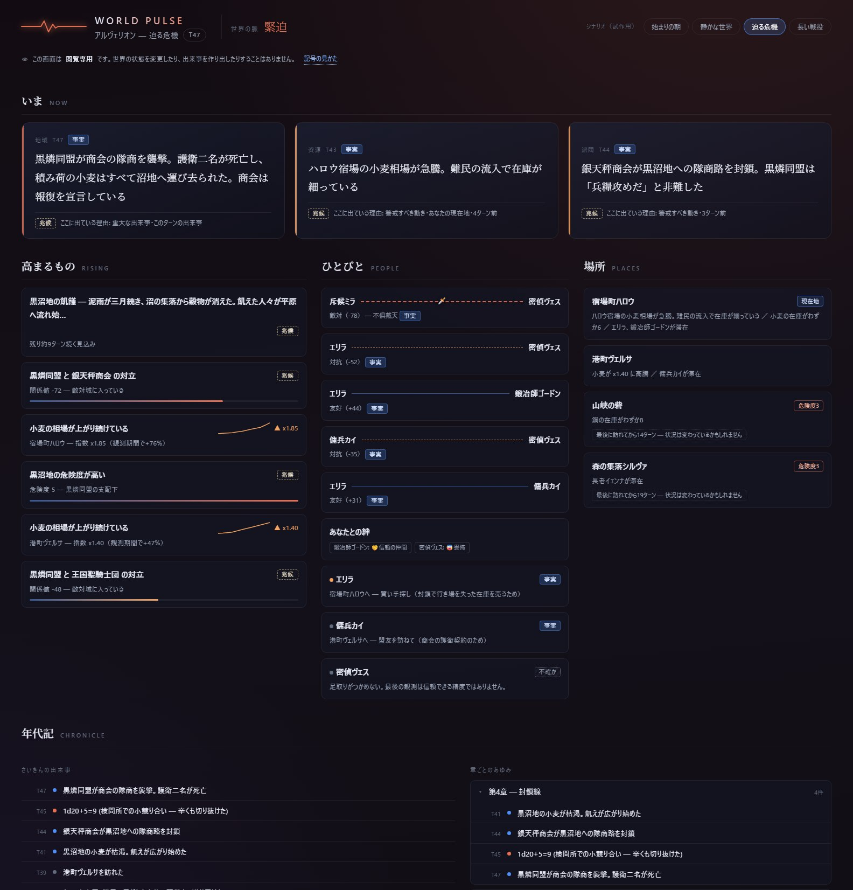
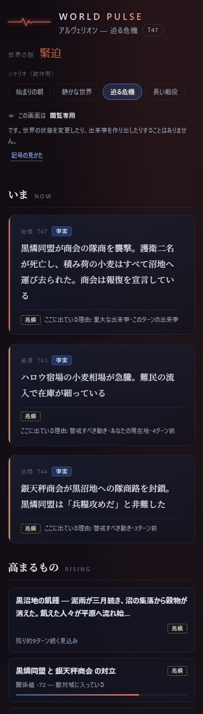

# WORLD-PULSE-001 — Living World Pulse: High-Fidelity UX Prototype

- **Branch:** `ux/WORLD-PULSE-001-high-fidelity-prototype` (from `origin/main` @ `c0418a8`)
- **Prototype:** [`docs/prototypes/world-pulse/`](../prototypes/world-pulse/)
- **Screenshots:** [`docs/assets/world-pulse-desktop.jpg`](../assets/world-pulse-desktop.jpg), [`docs/assets/world-pulse-narrow.jpg`](../assets/world-pulse-narrow.jpg)
- **Scope:** UX vision + interactive prototype only. No production code, no runtime logic, no protocol changes, no version bump.

World Pulse is a **player-facing, read-only interpretation layer** over LoreRelay's existing
authoritative world state. It answers one question — *"What is happening in my world right now?"* —
without becoming a debug dashboard, a database inspector, or a new simulation authority.

---

## 1. Repo Reality Audit

Audited at `origin/main` = `c0418a8552b8ab2d6247eff238e004d3ee944388`.

| Surface | Where it lives | What it actually contains |
|---|---|---|
| World Observatory (existing) | `src/worldObservatoryCore.ts`, `webview/modules/88-world-observatory.js` | Market sparklines (from `marketPriceHistory`, 24-point cap), a 12-row chronicle list, a ≤12-node NPC bonds ellipse graph, watch/advance tick controls. Utility-dense, management-panel feel; no ranking, no "what matters now". |
| World state | `src/worldStateCore.ts` (`WorldState`) | `worldTurn`, `factions` (power/morale/playerReputation/recentEvents), `regions` (dangerLevel/controllingFaction/activeEvents), `globalEvents` (type/severity/turnsRemaining), `recentChanges`, `questHooks`, `markets`, `marketPriceHistory`, `npcPositions`, `npcRelationships`, `npcFactionRelationships`, `npcFactionCohesion`, `npcMilestones`, `playerNpcMilestones`, `lastVisitTurnByLocation`, `marketSnapshotByLocation`. |
| Event log | `src/worldEventLogCore.ts` (`WorldChangeEvent`) | Structured events: category (faction/region/resource/npc/global/guild), severity (info/warning/critical), source (simulation/player/gm), optional faction/targetFaction/region/location/npcIds refs, ≤200-char message, `expiresAfterTurns`. **Live cap: 20 events FIFO** (`MAX_RECENT_CHANGES`). |
| Chronology | `src/chronicleCore.ts` | Deterministic chapter-grouped timeline from journal + world events. Kinds: quest/world/travel/combat/milestone/domain. Caps: 50 chapters / 500 events. Chapters break on scene change, elapsed-time jumps, or turn accumulation. |
| NPC registry | `src/npcRegistryCore.ts` | Per-NPC name, location, faction, disposition (playerTrust/Romance/Fear, mood), needs (typed, urgency), memories. |
| Relationships | `src/npcRelationshipCore.ts` | Pair affinity [-100,100] with published thresholds (ally ≥70, friend ≥30, rival ≤-30, enemy ≤-70), faction-pair relations, faction cohesion, one-shot milestones (sworn_allies/inseparable/bitter_enemies/estranged/reconciled) and player bonds (trusted_companion/romance/nemesis/feared/estrangement). |
| Whereabouts trust | `src/npcWhereaboutsTrustCore.ts` | Location precision degrades with playerTrust: exact ≥70, approximate, unknown ≤30. An existing, principled "uncertainty" mechanic. |
| Fog of war | `src/fogOfWarCore.ts` | Regions are discovered / rumored / unknown. |
| Webview contract | `src/worldView.ts` `type:'worldView'` message | Already broadcasts nearly all of the above to the webview (factionStates, regionStates, globalEvents, recentChanges, questHooks, markets, npcBonds, playerBonds, chronicle, marketPriceHistory, campaign kit payloads). **World Pulse needs almost no new plumbing.** |
| Visual direction (PLAY-UX-001, read-only) | `ux/PLAY-UX-001-cinematic-play-mode`, `webview/styles/97-visual-refresh.css`, `9a-cinematic-mode.css` | Dark glassy surfaces, RGB-variable accent system (default blue 79,142,247 with per-theme palettes), hairlines `rgba(255,255,255,0.07)`, Noto Serif JP reading column for narrative text, floating pill chrome. World Pulse inherits this grammar. |

**Two audit findings that shaped the whole design:**

1. **There are no time series for factions or relationships.** `factions[].power` and
   `npcRelationships` store *current values only*. Only `marketPriceHistory` keeps history
   (24 points). Therefore any "rising / falling" statement about factions or people is a
   *derived reading of the event stream*, not an observed trend — the UI must say so.
2. **`recentChanges` forgets after 20 events.** In a 100+ turn campaign, the live event window
   covers only the recent past. Long-term memory exists solely in the chronicle (500 events / 50
   chapters) and the one-shot milestone records. The 100-turn strategy (§6) is built on this.

---

## 2. Available Data Source Map

`existing source → available data → World Pulse presentation`

### AVAILABLE NOW (authoritative, already persisted & already sent to the webview)

| Source | Data | World Pulse presentation |
|---|---|---|
| `world_state.recentChanges` | ≤20 structured events w/ severity + entity refs | **NOW** cards (ranked), **PLACES** activity, recent lane of **CHRONICLE** |
| `world_state.globalEvents` | Ongoing events w/ severity + `turnsRemaining` | **RISING** "ongoing pressure" rows with a remaining-turns clock |
| `world_state.marketPriceHistory` | 24-point price index series per location/commodity | **RISING** sparkline rows (observed series) |
| `world_state.markets` | stock + priceIndex now | **PLACES** shortage/spike notes |
| `world_state.regions` | dangerLevel, controllingFaction | **RISING** danger rows, **PLACES** badges |
| `world_state.factions` | power, morale, playerReputation, recentEvents | drawer facts; faction naming via `world_forge` |
| `world_state.npcRelationships` + `npcMilestones` | pair affinity + one-shot milestones | **PEOPLE** relationship threads (line style = published thresholds; milestone icon on the thread) |
| `world_state.npcFactionRelationships` / `npcFactionCohesion` | faction-pair relation, internal cohesion | **RISING** conflict / internal-rift rows |
| `world_state.playerNpcMilestones` | player bonds | **PEOPLE** "あなたとの絆" row |
| `world_state.npcPositions` | destination, arrivesTurn, agenda, reason | **PEOPLE** movement rows ("エリラ → ハロウ、買い手探し") |
| `world_state.questHooks` | typed quests w/ status + faction link | relevance boost in NOW ranking; drawer facts |
| `world_state.lastVisitTurnByLocation` (+`marketSnapshotByLocation`) | staleness per location | **PLACES** "最後に訪れてから N ターン" badges |
| npc_registry (`disposition.playerTrust`, `mood`) | trust, mood | whereabouts precision (uncertainty chip), mood dots |
| chronicle (journal + events) | chapters of quest/travel/combat/world/milestone | **CHRONICLE** chapter folds + recent lane |

### DERIVABLE READ-ONLY (computed at render time; must be labeled 兆候 DERIVED)

| Derivation | Inputs | Rule (as prototyped) |
|---|---|---|
| World tension (calm/stirring/crisis) | recentChanges severities + globalEvents severities | any critical/major → crisis; ≥2 warnings/moderates → stirring; else calm |
| NOW importance ranking | recentChanges, playerLocation, playerNpcMilestones, questHooks | `severity(1/2/3) × recencyDecay × relevanceBoost(location +0.6, bonded NPC +0.5, quest faction +0.3)`, threshold 1.4, max 3 cards |
| Market trend framing ("上がり続けている") | marketPriceHistory | window delta ≥ 12% |
| Faction "対立が高まっている" | npcFactionRelationships | value ≤ -40 (critical ≤ -70) |
| Faction "内部に亀裂" | npcFactionCohesion | value ≤ 40 |
| Relationship words (盟友/友好/対抗/敵対) | npcRelationships | production thresholds from `npcRelationshipCore.ts` |
| Location hotspot ranking | events+markets+NPC presence per location | weighted sum |
| Information aging | worldTurn − event.worldTurn | fade at >12 turns; staleness badges |

### FUTURE / NOT AVAILABLE (deliberately absent from the prototype)

- **Faction power / affinity history** — no time series is persisted; a real trend line would
  require a new (small, capped) history field like `marketPriceHistory`. Until then the UI only
  says "対立域に入っている" (state), never "対立が3ターンで悪化" (trend).
- **Causality between events** — no "A caused B" links exist; the drawer explicitly marks this
  as 不確か and points the player at the chronicle.
- **Rumor/information layer** (`docs/INFORMATION_RUMOR_SYSTEM_IDEA.md` is idea-stage). Fog's
  discovered/rumored region states exist, but no rumor items.
- **Arc summaries** — the prototype's pinned "major arcs" are hand-authored sample data standing
  in for a future capped `majorArcs` store (see §6 / slice 6). Nothing in the repo generates them today.

---

## 3. Information Architecture

Five bands, strictly ordered by *how soon the player needs it*, with sharply decreasing visual
weight. This is the anti-"wall of cards" mechanism: each band has its own layout idiom, its own
cap, and its own type scale.

```
WORLD PULSE ─ header: pulse-line + tension word (静穏/ざわめき/緊迫), turn chip
│  read-only banner + provenance legend (事実/兆候/不確か)
├─ いま NOW          1–3 cards max. Serif statements, hero scale. Threshold-gated:
│                    a quiet world shows an intentional "the world is quiet" state.
├─ 高まるもの RISING  ≤6 compact rows: price sparklines, faction conflict/cohesion
│                    meters, region danger, ongoing global events with clocks.
├─ ひとびと PEOPLE    relationship threads (the line IS the relationship: weight/
│                    style/color from published thresholds, milestone icon at the
│                    midpoint), player bonds, movements + uncertain whereabouts.
├─ 場所 PLACES       ≤6 location rows: latest event, market note, who is there,
│                    danger + 現在地 + staleness badges.
└─ 年代記 CHRONICLE  pinned major arcs → recent lane (10 rows, aged items fade) →
                     chapter folds (4 newest; older N chapters behind one fold).
```

**Relationship visualization decision.** The Observatory already has a node graph; World Pulse
deliberately does not. At ≤12 NPCs a radial graph is legible but answers "who exists?", not
"what changed / why does it matter?". The prototype uses **relationship threads**: one row per
noteworthy pair, where the connecting line's weight/style/color *is* the relationship
(solid heavy blue = ally … dashed red = enemy) and the one-shot milestone (🗡️ 不倶戴天, 🕊️ 和解)
sits on the thread. Threads rank by |affinity| + milestone presence, cap at 6, and each opens a
"why this matters" drawer. Comprehension over spectacle; scales linearly instead of quadratically.

---

## 4. Interaction Model

- **One gesture: "show your work."** Every card is a button. Clicking opens the **根拠 (evidence)
  drawer** listing the underlying records, each tagged 事実 / 兆候 / 不確か, with raw ids and field
  names in the meta line (e.g. `npcFactionRelationships["black_phosphor_pact|silver_scale_guild"] = -72`).
  The drawer footer restates the read-only contract. Desktop: right panel; narrow: bottom sheet.
- **Scenario switching** (prototype device): header tabs, `role=tablist`, ←/→ keys.
- **Chronicle folds**: newest chapter open, next 3 collapsed `<details>`, everything older behind
  a single "古いN章を表示（M件）" button.
- **Keyboard**: skip-link → NOW; all cards tabbable buttons; arrow keys in the tablist; Esc closes
  the drawer; focus returns to the triggering card. Verified in-browser.
- **Selective motion**: exactly three animated things — the header pulse line (its period/color is
  the tension state), pressure-meter fills on first paint, drawer slide-in. Nothing else moves;
  the page is meant to be lived in for hours.

---

## 5. Authority Boundaries

World Pulse is presentation only. The prototype encodes the rule, not just states it:

1. **No writes.** `prototype.js` contains no state mutation path; its only outputs are DOM nodes.
   The production slice keeps the same shape: a pure `deriveWorldPulse(worldViewMsg) → viewModel`
   function, unit-testable, with no postMessage back except UI navigation.
2. **Three-value provenance vocabulary**, visually distinct everywhere:
   - **事実 (OBSERVED FACT)** — solid blue chip: a record the simulation/GM/player produced.
   - **兆候 (DERIVED SIGNAL)** — dashed gold chip: a reading this screen computed (rankings,
     trends, "conflict rising"). Every derived statement in the drawer names its rule.
   - **不確か (UNCERTAIN)** — dotted/hatched chip: missing observations (low-trust whereabouts,
     stale locations, unrecorded fields). Empty states use it too: absence of data is displayed
     as absence, never papered over.
3. **No fake certainty.** The NOW card explains *why it was ranked* ("重大な出来事・このターンの
   出来事"); the relationship drawer explicitly says the *cause* of an affinity is not recorded;
   staleness badges say "状況は変わっているかもしれません".
4. **AI is not in the loop.** All derivations are deterministic threshold rules over persisted
   state — no LLM summarization anywhere in this surface, so it can never silently become a
   second narrator. (If LLM-written recaps are ever added, they would need a fourth provenance
   value and must cite event ids; out of scope here.)
5. Existing Observatory watch/advance tick controls are **not** part of World Pulse — ticking
   advances the world (per `OBSERVER_TICK_CONTRACT`) and therefore belongs to a management
   surface, not a read-only pulse view.

---

## 6. 100-Turn Scaling Strategy

Exercised live by the 長い戦役 scenario (T128, 3 arcs, 17 chapters, ~200 chronicle events —
filler chapters expanded deterministically at load from a seeded PRNG so the JSON stays small;
every generated event is `ChronicleEvent`-shaped).

- **Summarization hierarchy (4 levels):** raw event → chapter (existing `chronicleCore`
  grouping) → arc (pinned strip) → the NOW/RISING "present" bands. The player reads top-down;
  each level is capped, so total on-screen items stay ~constant regardless of campaign length.
- **Aging/fading:** events older than 12 turns render dimmed (`aged`); PLACES adds explicit
  staleness badges from `lastVisitTurnByLocation`; NOW's recency decay makes old drama
  structurally unable to outrank fresh events. `recentChanges`' own FIFO-20 + `expiresAfterTurns`
  pruning already bound the "present" upstream.
- **Pinned major arcs:** war/peace-scale storylines stay visible as gold pins with turn ranges
  and event counts even after their chapters fold away — the campaign's spine at a glance.
  (Requires the small `majorArcs` store from slice 6; hand-authored in sample data.)
- **Recent vs historical separation:** two chronicle lanes. "さいきんの出来事" is a strict
  10-row window; history lives in chapter folds, 4 visible, the rest behind one explicit
  click — never infinite scroll, and a returning player lands on NOW, not on a backlog.
- **Return-after-absence:** staleness badges + arc pins + the NOW band together answer
  "what did I miss?" without replaying hundreds of rows.

Caps inherited from production keep the math honest: 20 live events, 500 chronicle events,
50 chapters, 24 price points, 30×20 price series, ≤10 named-NPC relationship materialization.

---

## 7. Accessibility & Responsive Decisions

- **Keyboard:** skip-link, tablist arrow-key pattern w/ roving tabindex, all cards native
  `<button>`, Esc-close + focus-return on the drawer, `:focus-visible` rings.
- **Reduced motion:** `@media (prefers-reduced-motion: reduce)` stops the pulse animation
  (steady lamp), meter transitions, drawer slide, and smooth scrolling. Tension remains readable
  through color + the tension word, which is also in an `aria-live=polite` region.
- **Not color-only:** severity is accent-bar + chip text; provenance chips differ in border
  style (solid/dashed/dotted+hatch) as well as color; bond lines differ in weight and dash.
- **Long Japanese text:** `overflow-wrap:anywhere` on all message surfaces; the crisis scenario
  includes a 200-char event message (the field cap) to prove wrapping; badges wrap instead of
  `nowrap` (fixed a real 400px overflow found during verification).
- **Responsive:** desktop ~1440–1600 = hero + 3 columns + 2 chronicle lanes; ≤1100 = 2 columns;
  ≤760 = single column, drawer becomes a bottom sheet; ≤420 single-column NOW. Verified no
  horizontal scroll at 400px (`scrollWidth === clientWidth`).
- **Empty/partial/quiet:** 始まりの朝 scenario renders every section's empty state with 不確か
  chips; quiet world renders a deliberate "世界は静かです" card ("静けさも情報です"); missing
  whereabouts render as uncertainty, not blanks.

## 8. Screenshots

| Desktop (~1560px), 迫る危機 scenario | Narrow (400px), same scenario |
|---|---|
|  |  |

## 9. Prototype Run Instructions

```bash
cd docs/prototypes/world-pulse
python -m http.server 8765        # any static server works (fetch() needs http://)
# open http://localhost:8765
```

- Scenario tabs (top right): 始まりの朝 (empty/partial) / 静かな世界 (quiet) / 迫る危機
  (building crisis) / 長い戦役 (T128 long campaign).
- Click any card for the evidence drawer; Esc closes. ←/→ move between scenario tabs.
- Files: `index.html` (structure), `styles.css` (visual system), `prototype.js`
  (derivation + rendering, heavily commented), `sample-data.json` (4 scenarios in
  production-mirroring shapes).

## 10. Recommended Implementation Slices

Small, independently landable, in order. Slices 1–4 need **zero host/protocol changes** — the
`worldView` broadcast already carries the data.

| # | Slice | Contents | Size |
|---|---|---|---|
| 1 | `worldPulseCore.ts` (pure) | Port derivations: tension, NOW ranking, rising rules, thread selection, place ranking, aging. Pure functions + unit tests mirroring §2 rules. No UI. | S |
| 2 | Webview shell + NOW + provenance | New `89e-world-pulse.js` + `98-world-pulse.css` (bundle-order contract like PLAY-UX-001), gameRules flag `enableWorldPulse`, header/tension/read-only banner, NOW band + evidence drawer, i18n keys ×4 locales. Renders from the existing `worldView` message. | M |
| 3 | RISING + PLACES | Sparkline rows (reuse Observatory's series math), conflict/cohesion/danger rows, place rows + staleness badges. | S–M |
| 4 | PEOPLE threads | Threads from `npcBonds`/`playerBonds` payloads + whereabouts uncertainty via existing trust precision rules. | S |
| 5 | CHRONICLE lanes | Recent window + chapter folds over the existing chronicle payload; aging styles. | S |
| 6 | Major arcs store (only new data) | Capped `world_state.majorArcs` (≤8; id/title/fromTurn/toTurn/summary/eventCount) written by explicit GM/player action or a deterministic chapter-boundary heuristic — **never by LLM fiat**; then the pinned strip. Needs a small design gate. | M |
| 7 | Polish gate | Reduced-motion & keyboard audit, narrow-width pass, long-text fuzz (200-char messages), screenshot refresh. | S |

---

**Verification performed:** prototype served locally and driven in-browser — all 4 scenarios
render; drawer open/Esc-close with focus return; tablist arrow-keys; chapter fold expands
13 hidden chapters (195 rows); no horizontal overflow at 400px; console clean.

## Final Verdict

**WORLD_PULSE_001_PROTOTYPE_READY_FOR_IMPLEMENTATION**
