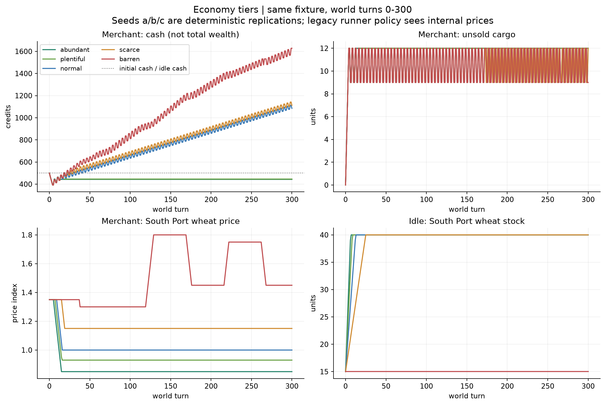
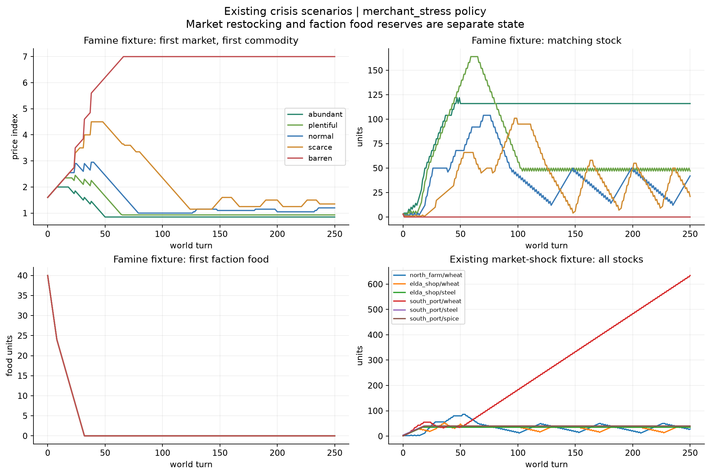
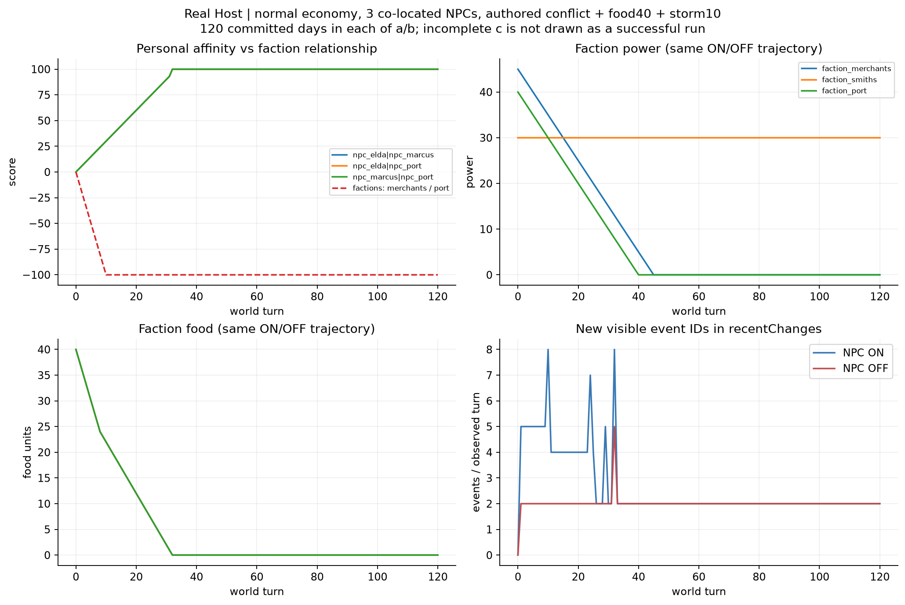
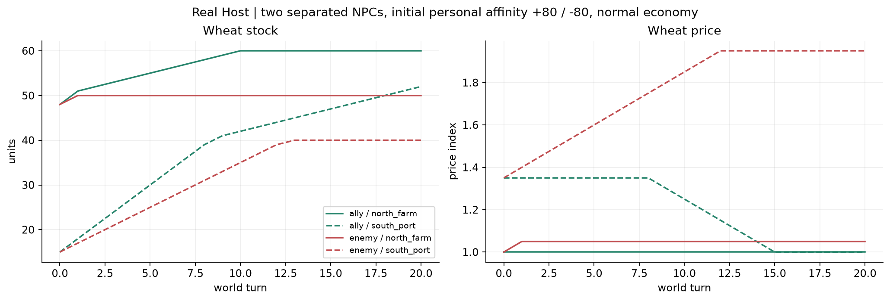

# NOAI世界のバランス評価：望む遊び味を選べるか

評価日：2026-09-06。固定したmain：`89f109a236660f110fdee375bb4d6368465f4390`。
ゲームの数値・仕様は変更していない。追加は既存runnerの任意の読取り記録と、この報告・証跡のみ。

## 結論と遊び味ごとの評価

**穏やかな暮らしは成立する。ただし「経済を豊かにする」だけでは世界全体を平穏にできない。**
事件を起こさないfixtureでは、世界を進めても300ターン、所持金・在庫とも破綻しなかった。これは望まれた平穏として評価する。
一方、危機を含む世界では、勢力の食料と市場の食料在庫が別々に動き、敵対関係は戦力が尽きても続く。
現在の設定は「市場の豊かさ」と「シミュレーション全体の停止」を選べるが、その中間の「生活は進むが危機対応は任意」を細かく指定しにくい。

| 遊び味 | 現在可能な設定・世界条件 | 効かない／別の意味の設定 | 足りない調整手段・評価の限界 |
| --- | --- | --- | --- |
| 穏やかな生活・観察 | `enableEmergentSimulation=false`で世界進行停止。進行を残す場合は、敵対・枯渇要因を持たない世界＋abundant/plentiful。NPC機能は好みで選択 | abundantだけでは勢力food消費・紛争を止めない。NPC OFFも紛争を止めない。`backgroundSimulation=false`でも明示の日送りは動く | 全停止では日送り自体が使えない。経済を動かしたまま危機の発生・再発だけを抑える一括設定は確認できない。無事件を不具合にはしない |
| 変化のある世界 | シミュレーション＋Commerce、必要ならNPC registry/agency/relationshipsをON。市場ごとの商品・supplyBias、著者が定義するresourceFlowsや関係を利用 | biome名の変更だけでは継続的な生産・消費・イベントの違いは生まれなかった。NPC個人の親密度と勢力間関係は別 | 関係は変わり市場にも波及するが、今回の同席fixtureでは上限に集中。変化の速度・持続・回復を選ぶ手段が弱い |
| 手強い生存・経営 | scarce/barrenで補充低下・価格上昇。初期在庫、商品別難度、危機を含む世界定義で不足は作れる | barrenを選ぶだけでプレイヤーの生存が難しくなるとは限らない。移動・日送りの固定消費はなし。旧runnerではむしろ交易cashが増えた | 回復手段のない枯渇と、対処できる困難を区別する必要。生存全般の完成度はCommerce限定fixtureから判定できない |

これは有限のQA fixtureでの評価であり、任意のユーザー世界の保証ではない。Human Playは未実施・未代替。

## 方法と証拠の境界

通常campaign・既存dirty checkoutを触らず、専用worktreeの一時fixtureを使用。実HostはVS Code 1.136.1、専用workspace/user-data/extensions、既存Live QA IPC経由。

| 計測 | 実行・範囲 | 判定できること |
| --- | --- | --- |
| 既存NOAI full | 15シナリオ成功。determinismの比較用再実行を含み16 run | 既存不変条件、長期core経済の挙動 |
| 経済比較 | 5段階×3 seed×放置/移動交易＝30 run | 同じ初期世界で最初の300世界ターンを比較 |
| biome比較 | 登録15種類×normal・放置・seed a・300世界ターン | biome以外を固定した継続tickへの影響 |
| 疑いの延長 | 豊富2条件の交易停滞、normal/barrenの飢饉、敵対勢力の戦力ゼロ後＝5 run | 最初の1000世界ターンで停滞・蓄積が続くか |
| 実Host NPC ON/OFF | normal、各a/bは120日ずつcommitted。cは途中のunknownで停止 | 本番Shared Game Action Serviceの日送りとNPC進行 |
| 実Host短期 | simulation OFF、別市場の盟友／敵対（20日ずつ） | 全停止の意味、個人関係が本当に市場へ及ぼす効果 |
| 既存実Host lifecycle | 取引・移動・日送り、readonly preview、duplicate receipt、checkpoint、reload等が成功 | 代表操作の本番経路照合。長期runner全体の本番同等性は意味しない |

core runは計66件。全件で既存不変条件を通過したが、それは遊び味の合格判定ではない。

- seedは`balance-a/b/c`。`observe_only`と`merchant_route`、基礎world tickはここでは乱数を使わず、3 seedの300ターン系列は一致した。**3つの独立したランダム生成世界ではない。** 飢饉・市場ショックの既存seedは各scenario JSONに保存。
- `merchant_route`は移動等の決定と日送りが別。600決定から最初の世界ターン300到達時までを採用し、600世界ターンと呼ばない。延長版は2000決定から最初の1000世界ターンを採用。
- 記録は世界ターンごとの最初の観測、最大1001フレーム。複数step/chunkの既存ケースでは全中間状態が記録されるとは限らない。今回の比較matrixは1step。
- 旧runnerは`runBulkWorldSimulation`＋市場回復＋`applyTradeOp`。本番の日送りはLiving WorldのNPC・関係・resourceFlows等も通る。旧runnerでNPC関係の正常性を主張しない。
- 旧runnerの交易方針は内部の市場価格を参照する。公開情報だけで行う公平なPlayer Agent試験ではない。移動先・商品の最適な発見、主観的な面白さは未評価。
- 放置時に旧telemetryがCommerce無効を0 creditsと表示し得るため、今回はfixtureの実際のgame stateを読む。0への財産喪失として扱っていない。
- cashは所持金。売れ残りcargoも併記し、cash差を純利益や総資産差とは呼ばない。

## 観測した事実

### 1. 経済設定は市場には効くが、世界全体の平穏スイッチではない

[worldSimCommerceCore](../../src/worldSimCommerceCore.ts)の実装値：

| 設定 | 毎tick補充 | 食料危機の価格加算 | 好況時の材料stock加算／価格減算 | 価格上限 | 十分な在庫時の価格基準 |
| --- | ---: | ---: | ---: | ---: | ---: |
| abundant | 4 | .15 | 5 / .20 | 2 | .85 |
| plentiful | 3 | .25 | 4 / .15 | 3 | .93 |
| normal | 2 | .35 | 3 / .10 | 4 | 1 |
| scarce | 1 | .50 | 2 / .07 | 5.5 | 1.15 |
| barren | 0 | .70 | 1 / .04 | 7 | 1.30 |

カテゴリー別・商品別のtierとresource modifiersも既存設定にある。これは初期の勢力food量や戦争頻度を直接変えるものではない。
設定UIの接続は[70-game-rules.js](../../webview/modules/70-game-rules.js)、保存・既定値は[gameRulesCore](../../src/gameRulesCore.ts)。イベント除外の既存設定はDomain/Guild等の別イベント系にも存在するが、今回の基礎紛争・food tickを止める一般的フィルターとしては使われていない。

| 設定 | world 300の交易cash（初期500） | cargo残数 | buy / sell / travel | 放置cash | 放置で強制介入・欠品 |
| --- | ---: | ---: | --- | ---: | --- |
| abundant | 443 | 12 | 6 / 2 / 4 | 500 | 観測なし |
| plentiful | 446 | 12 | 7 / 3 / 6 | 500 | 観測なし |
| normal | 1085 | 12 | 78 / 74 / 148 | 500 | 観測なし |
| scarce | 1112 | 12 | 78 / 74 / 148 | 500 | 観測なし |
| barren | 1628 | 9 | 77 / 74 / 149 | 500 | 観測なし |

すべての交易ケースで日送り300。30ケースとも300ターンまでの行動拒否0。matrixはfoodフィールド・敵対勢力を持たず、simulationイベント0。この静けさを「イベント不足」の不具合には分類しない。初期在庫があるbarren放置は補充しないまま保持され、枯渇しなかった。normal放置の地域危険度は北1・中央2・南3から、300ターン終了時すべて0となり、支配勢力は変わらなかった。

abundant/plentifulの交易停止は[noaiSoakRunnerCore](../../src/noaiSoakRunnerCore.ts)の売却下限`priceIndex >= 1`とcargo充填目標の組合せによる。価格基準.85/.93に戻ると売らず、cargo12のまま1000世界ターンでもcash443/446、売買件数不変だった。ゲーム側の売却拒否や豊かな世界の欠点とは判定しない。

normal/scarce/barrenでは同じ北→中央→南の交易が多くを占める。移動する理由は商品構成と市場の`supplyBias`にもある。ただし今回の比較は一種類の方針だけで、他の遊び方に比べて最適・支配的だという証明ではない。

### 2. バイオームは15種類すべてを照合した

登録値：forest / desert / mountain / sea / coast / city / plains / swamp / wasteland / ruins / dungeon / underground / snow / volcanic / other。

regionのbiomeだけを置換し、region type、危険度、勢力、商品、在庫、接続、設定は固定。300ターンの観測系列は15種類すべて同一だった（比較時のSHA-256：`47f21405e79bb30962b13c011f27accb63a2662af36d33f3152ae039fb4b8ad9`）。

[worldForgeGeneratorCore](../../src/worldForgeGeneratorCore.ts)では、biomeは初期生成のhazard選択・配置にも使われる。従って「単なる表示文字列」と断言するのも誤り。継続的な生産・消費は明示された市場・resourceFlows等で、危険度tickは勢力type/power・activeEventsで決まる。biome自体を使った継続tickの生産倍率や固有イベント抽選は今回の本番経路では確認できなかった。

地図描画・レイアウトは[cartographyLayoutCore](../../src/cartographyLayoutCore.ts)、[tileOvermapCore](../../src/tileOvermapCore.ts)等を参照。新規生成した15世界の初期hazard分布を比較した実験ではないため、生成時の違いの強さは未計測。

### 3. 市場は回復しても、勢力のfoodは回復していない

既存飢饉ケースでは3勢力のfoodが世界ターン24/32/38でゼロになり、資源イベントはそれぞれ一度、計3件。全経済tierで同じ時刻だった。normalとbarrenの1000ターン延長でもfoodは0のまま。

[emergentSimulator](../../src/emergentSimulator.ts)の基礎tickは、foodが数値なら毎tick`max(1, round(food*.06))`減らし、ゼロへの遷移で危機を発生させる。この消費ループには自然補充がない。市場wheatとは別勘定であり、売買して市場を潤してもこの経路では勢力foodに入らない。

既存market-shockは初期stock1〜4から、250ターン終了時に6商品すべてstock28以上へ回復し、価格は約1〜1.05。ターン終了の観測点で欠品はなかった。一方、barren飢饉のnorth_farm/wheatはターン1〜1000まで連続欠品、価格7で934ターン。無補充という設定どおりで、数値不変条件違反ではないが、回復手段のない世界なら「対処できる困難」にならない。

既存market-shockの回復時刻（交易を続けているため、初回到達後ずっと維持したという意味ではない）：

| 市場／商品 | targetStockへの初回到達 | 価格指数1.05以下への初回到達 |
| --- | ---: | ---: |
| 北／wheat | 26 | 55 |
| 中央／wheat | 30 | 51 |
| 中央／steel | 17 | 37 |
| 南／wheat | 13 | 45 |
| 南／steel | 18 | 29 |
| 南／spice | 19 | 35 |

normal飢饉のストレス交易延長ではsouth_port/wheatが1000ターンで2824、cash8022。旧runnerの売却・補充経路での蓄積であり、本番Hostの無限利益を立証してはいない。既存market-shockでも同在庫は250ターンで634。純粋な自然増殖と区別し、売却を含む流入と市場の吸収能力の問題候補とする。

### 4. NPC・勢力は動くが、関係と紛争は飽和・固定化しやすい条件がある

実Hostの対照fixture：normal、food40×3勢力、10ターンのmajor storm、同席NPC3人、merchantsとportを相互敵対に追加。元fixtureのalliesは残す。したがって同盟と敵対が重複する人工ストレス条件であり、morale100を自然な戦時一般の結果と解釈しない。

- ON/OFFともa/bは120日committed。foodは32日目に0、stormは10日目に消える。勢力power・foodの系列はON/OFFで同じ。
- ONでは個人3ペアが32日目に100、merchants/portの勢力関係が10日目に−100。その後120日まで上限・下限に留まる。個人の親密さと所属勢力の敵対は両立する設計。
- OFFでは関係mapは作られず、勢力の食料消費・紛争は継続。NPC OFFを世界平穏の設定とは呼べない。
- 別のcore 1000ターンfixtureではalliesを取り除いて相互敵対のみを残した。両勢力powerは45ターン目に0、その後も1000ターンまで毎tick2件の新しい紛争イベント。回復・和平・支配地域の移転は起きなかった。イベントIDは毎回新規なので「重複ID禁止」テストは通る。

関係の計算元は[npcRelationshipCore](../../src/npcRelationshipCore.ts)。同席・共通危機・そのtickの紛争で更新し、値をclampする。今回の値の集中は有限上限に収まる挙動であり、NaNや無限増大ではない。変化を楽しむ観点では、同じ場所で長く暮らすだけで関係が似通うことが調整候補となる。

本番での市場波及も別に確認した。別市場の2人を初期個人関係+80/−80で比較し、各20日committed。盟友では北wheat stock60、南52。敵対では北50・価格1.05、南40・価格1.95。無効な設定ではない。[npcBondEffectsCore](../../src/npcBondEffectsCore.ts)では別市場の盟友が共通商品を+1し上限60、敵対が所在地の商品の価格を+.05し上限4とする。勢力の動的関係値から直接、地理的な通行禁止・宣戦・和平になることは今回確認していない。

### 5. 操作経路の成功と未完了を分ける

既存実Host lifecycleは成功。取引で20→11 credits、移動と日送りでworldTurn1、本番保存を確認した。別途simulation OFFではend_dayのpreviewが拒否され、前後のinspectionは同一だった。これは全停止の確認で、シミュレーションを動かし続ける穏やかな生活の代用ではない。

長期Host計測には次の未完了がある：

| ケース | 結果 | 扱い |
| --- | --- | --- |
| NPC OFF、a/b | 各120日committed | 完走 |
| NPC OFF、c | 35回目のexecuteでunknown。ログの操作件数から特定、失敗時snapshotは未保存 | 当該fixture停止。失敗日の世界状態・commit有無は未確認。a/bで穴埋めしない |
| NPC ON、a/b | 各120日committed | 完走 |
| NPC ON、c | 26日committed、27回目executeが`outcome_unknown`。直後のinspectionもworldTurn26 | 120日成功ではない。再試行しない。snapshotとreceiptを保存 |

最初のHost起動には接続timeoutもあり、その回はゲーム操作未開始。CLI引数不足で起動前に終了した一回もある。これらは成功回数に数えない。unknownの根本原因は未確定で、今回修正していない。
以前からの**Webview取引 `outcome_unknown` は別の既知経路問題**。今回Webview取引を再実行・修復しておらず、API lifecycleの成功で解決済みとはしない。

## 原因の仮説と改善案（未実装）

P1は操作結果の信頼性を損なう優先問題、P2は望む遊び味を阻害する条件付き候補、P3は説明・分析上の改善。以下は不変条件違反とは区別した優先順位。

| ID / 優先 | 再現条件・seed・時刻 | 影響と原因の仮説 | 改善案の種類 |
| --- | --- | --- | --- |
| B1 / P1 | 実Host NPC ON、replication c、27回目の日送り。OFF cもunknown | 操作の確定結果が得られず、長期本番評価を中断。食料や戦争のバランス問題と同一視しない。根本原因未確定 | **仕様／不具合調査**：request・gate・handleの内部診断を既存ログで追い、保存結果に応じたreceiptを保証。今回修正なし |
| B2 / P2 | market_famine、`noai-famine-250-seed`、food0が24/32/38〜1000。tierを変えても同じ | 市場補充と勢力食料が分離。安定した生活を選んだつもりでも危機表示が残る | **設定変更**：穏やかな世界には枯渇要因を持ち込まない。**仕様追加**：望む場合だけ、勢力foodへ既存生産・供給を接続し、消費停止／回復手段を説明する。単なる市場補充増量では解消しない |
| B3 / P2 | `balance_long_conflict`、balance-a、power0となる45〜1000 | 戦力尽きた敵対関係でも毎tick2件発生、静かな世界への自然回復なし。静的enemiesが継続原因 | **設定変更**：平穏世界では敵対を設定しない。**仕様追加**：休戦・終息・再発間隔を選択可能に。静かな世界へ新事件を強制追加しない |
| B4 / P2 | barren famine、既存seed、北wheat欠品1〜1000、上限7で934ターン | 無補充は意図どおりだが救済手段がないfixtureは回復不能 | **設定変更**：回復を望む資源だけscarce/normal等へ。**数値調整**：補充・上限の微調整。**仕様追加**：採集・生産等への接続は別設計で、まず既存手段の有無を世界作成時に明示 |
| B5 / P2候補 | normal famine、既存seed、1000、南wheat2824（旧runner） | 売却で市場在庫が積み上がる。実Hostで同じ交易利益や蓄積になるかは未確認 | **数値／仕様候補**：既存resourceFlowsの消費先、買取量・在庫目標超過時の扱いを本番で照合してから調整。蓄積を即バグとは断言しない |
| B6 / P2（変化を望む場合） | 実Host ON a/b、個人関係100@32、勢力−100@10、その後120まで | 同席加算・継続紛争・clampで飽和。穏やかな関係の安定を望む人には欠点でない | **数値調整**：増分・閾値。**仕様追加**：上限への漸近、変化の速さの選択。関係悪化や事件を一律追加しない |
| B7 / P3 | abundant/plentiful、balance-a/b/c、300・延長a1000 | テスト方針の売却下限が豊かな経済と不整合。ゲーム売却不能とは未確認 | **計測方針**：将来runnerの売却判断を実際の売買quoteと仕入れ原価で比較。ゲームの価格を1以上へ引き上げてテストに合わせない |
| B8 / P3 | biome15種、balance-a、300系列一致 | 既存世界のbiome名だけで生産等が変わるという期待とのずれ | **設定・説明**：生成時hazard／表示と、継続生産定義を区別。**仕様追加候補**：望む世界だけbiomeに既存resourceFlowsを対応付ける。今回は実装しない |

おすすめの優先順は、操作結果の信頼性B1を別修復で確認し、次に「平穏にしたい時に何を止めればよいか」を説明すること。危機・成長・回復の結び付けを考える際も、平穏な生活を選んだ人へ一律の難化を課さない。

## 成果物・再現・検証

- [圧縮観測データ](noai-balance-v1/observations.json.gz)：66 core runと8件の保存済みHostケース。失敗したOFF cはログのみで、この8件に含めない。
- [manifest](noai-balance-v1/manifest.json)、[集計値](noai-balance-v1/metrics.json)、[描画スクリプト](noai-balance-v1/plot.py)。グラフはPNGとSVGの両方。
- [再現手順](noai-balance-v1/README.md)、同梱の限定fixture生成・観測スクリプト。新しいシミュレーター・QA endpointは追加していない。
- `--observe-balance`は既存runnerのopt-inであり、設定・方針へ観測値を戻さない。通常実行ではbalance.jsonを生成しない。ON/OFFの最終canonical hash一致を既存focused testで検証。
- リスク区分：Low（fixtureの読取り記録・報告）。最終実行treeのTest Consoleはfocused 4/4、compileを含め5 checks成功、unknown files 0。全体suiteの反復・Human Play代替は行わない。fingerprint：`a9a164c3baec6f9f93ab668aaf35ac76907a74fa7d74b78f86b7dbcfc3a4c704`（この検証後の差分は報告本文のみ）。CI結果はPRの検証記録に記載。

未確認：任意の生成世界、Combat／Story GM／全生存システム、通常campaignでの長期Human Play、失敗したHost cの120日完走、Webview取引の修復、公開情報だけの交易戦略、biome生成分布の統計。本報告からこれらの成功やバランス保証を推論しない。
