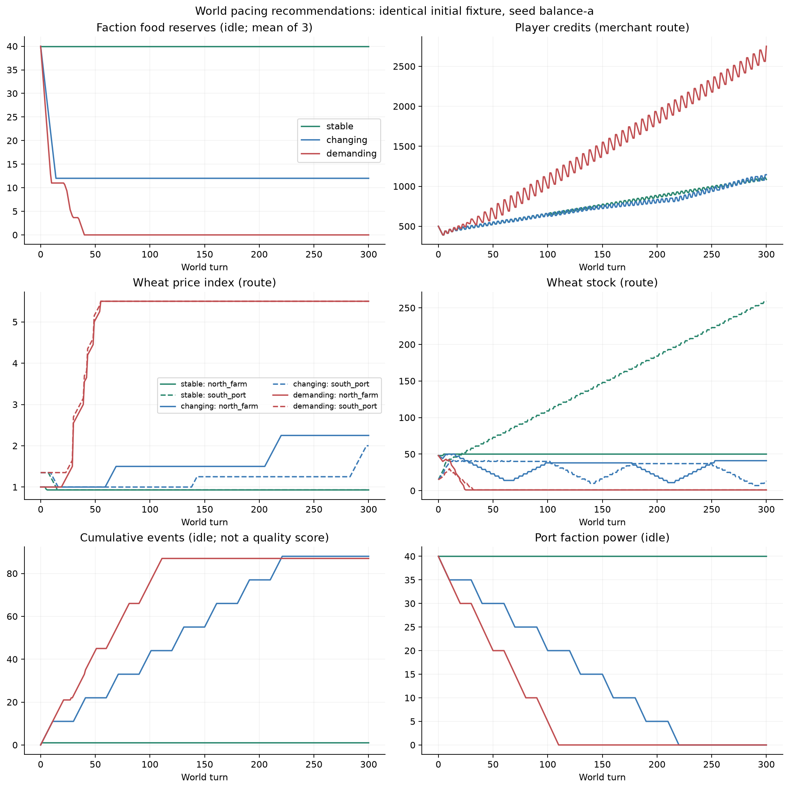
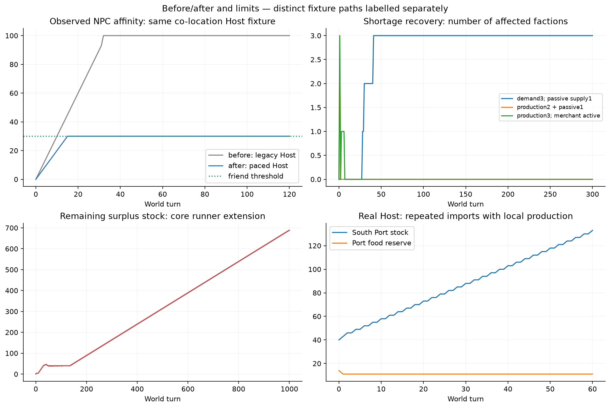

# NOAI世界の改善と再評価

2026-09-06。High Risk。実装・ローカル検証済み。公開、PR、CI、mergeは今回分の公開承認待ち。

開始時mainは `89f109a236660f110fdee375bb4d6368465f4390`。前回の評価コミット `a22ad88094b33bdca9426f2effdef19f7e59b489` を保持し、同じ専用worktreeの `feat/NOAI-WORLD-PACING-V1` で実装した。通常campaign、元のdirty checkout、完了済みUI worktreeは変更していない。

## 変更したこと

| 観測した問題 | 修復・改善 | 改善後の証拠 |
| --- | --- | --- |
| Webview取引が確認後に `outcome_unknown` | 外側の更新認可がCommerce serviceの認可世代を更新していた。取引・市場移動・日送りのpreview/executeは、既存serviceが認可・確認・排他を一貫して所有する | 実Webviewで取引確定、credits 20→11。全6メッセージを通すルーター回帰テスト |
| 実Hostで断続的に確認を失う | 起動時の `requestGitTimeline` / `requestChronicle` が更新用認可を取得していた。実装がread-onlyであることを確認して読取りルートへ移した | 診断ログで両要求の直後に `confirmation_not_found; handles=0` を再現。previewとexecuteの間に両要求を挟む回帰テストと、修復後の実Host 180操作が成功 |
| 豊かな経済で旧runnerの交易が止まる | 価格指数1以上という売却条件を削除。実quoteと購入額の加重平均原価で判断する | plentifulでも300世界ターンの交易が継続。経済側の価格は引き上げていない |
| 備蓄が多いほど消費し、市場供給と無関係に枯れる | 明示した市場・staple商品から備蓄へ移し、固定日次需要を消費。市場から移した分は減算する | 複数勢力の数量保存、供給断、供給再開、売却支援を検証。実Hostで4単位売却→翌日2消費・2備蓄 |
| 相互敵対を二重処理し、戦力0でも消耗戦が続く | 正規化ペアを一日一度処理。活動・休止・戦力不足・設定停止を分離 | 相互敵対、休止、再開、停止、戦力0を検証。0戦力による勝者の永久成長は止まる |
| 同席だけで全員が最大親密度になる | 同席の上限を友人30に。既存の共同行動による進展と関係の市場効果は維持 | 実Host 120ターンで3ペアとも30。以前は32ターンで100。意味ある出来事による70以上への進展もテスト |

内部診断はHostログだけに出す。Player receiptへ内部witness、エラーstack、確認tokenを追加していない。部分保存・不明結果の分類と、重複操作の抑止を維持した。診断時の失敗操作は再送していない。[再現ログ](noai-world-pacing-v1/reproduced-confirmation-loss.log)には関連する行だけを保存した。

## 採用した調整値と使い方

ゲームルールの「世界の進み方」から選ぶ。表示プリセットの「物語・管理・演出」とは独立している。

| おすすめ | 経済 | 食料需要倍率 | 紛争 | 活動 / 休止（世界ターン） | 個人関係 |
| --- | --- | --- | --- | --- | --- |
| 安定した暮らし | plentiful | 0 | 停止 | 10 / 20（停止中は消耗なし） | slow |
| 変化のある世界（新規の初期候補） | normal | 1 | 有効 | 10 / 20 | standard |
| 手強い経営 | scarce | 1.5 | 有効 | 20 / 10 | standard |

関連値をまとめて選ぶ入口であり、AI利用方針や未有効の機能は切り替えない。経済5段階、食料0〜3倍、紛争の有効/停止と期間1〜100、関係stopped/slow/standard/fastを個別変更できる。候補と一致しない値や既存の資源別経済上書きがあれば「カスタム」。次の世界ターンから適用し、在庫・所持金・関係値をリセットしない。

通常の同席はslow +1、standard +2、fast +3で30まで。既存の共有危機による寄与は、それぞれ0.5/1/1.5倍。stoppedでは個人関係の進行を止め、既存値とその市場効果を維持する。個人関係停止は勢力関係停止ではない。

食料需要は `ceil(dailyDemand × foodDemandMultiplier)`。0倍は消費停止。需要を備蓄量に比例させず、倍率の違いを説明できる形にした。紛争10/20は休止を活動より長く、20/10は対処が必要な期間を長く取る初期値であり、事件数の多さを目標に調整したものではない。戦力不足の紛争は再軍備があるまで停止し、勝手に友好化・戦力回復しない。

### World Forgeの供給定義

各勢力に、既存の市場と商品のIDを対応付ける。名前から食料を推測しない。対象商品の既存roleを `staple` と明示する。

```json
{
  "foodSupply": {
    "marketLocationId": "north_farm",
    "commodityId": "wheat",
    "dailyDemand": 2,
    "reserveTarget": 14
  }
}
```

これは `world_forge.json` の対象factionへ追加するブロック。commerce側に対象market・commodityが存在し、市場の商品一覧に含まれる必要がある。1商品単位を1備蓄単位として扱う。前日までに確定した市場在庫を移し、当日の需要を消費した後、既存の生産・輸送・市場回復を適用する。備蓄目標14・需要2なら、通常の消費後備蓄は12になる。

共有市場では当日需要を全勢力について先に確保し、その後に余裕分を備蓄へ移す。足りない場合の順序は勢力ID順で再現可能にしている。公平な配給制度を追加したものではない。既存の食料需要定義を同じ人口に二重で置かないよう、World Forge作者が需要を対応付ける。

供給未設定・不整合は「未接続」として消費を保留する。自動生成世界へ新しい市場や供給網を勝手に作らない。Commerce定義のない世界でおすすめを選んでも食料経営機能そのものは生まれない。同梱trade-routesでは既存3市場とwheatへ接続し、商品roleを明示した。新しい保存基盤・操作API・移行処理は追加していない。

新しい公開 `worldPacing` DTOには発見済み地域の状態と、公開済み供給先名だけを出す。供給元がhiddenなら未確認とし、紛争相手が未公開ならそのペアを出さない。世界ターンを進める前の未計測状態も未確認であり、成功した供給と混同しない。

## 長期実測

既存NOAI runnerを使用した。おすすめ3種類×放置/移動交易×3 seedで18ケース、個別上書き6ケース、供給改善4ケース、疑いが残った不足と在庫蓄積を各1000世界ターンへ延長した2ケース、計30ケース。すべて既存不変条件を通過した。3 seedは決定論的fixtureの反復ラベルであり、ランダム生成世界3種類ではない。

基本fixtureは初期credits500、各勢力の食料40、3市場、需要2/備蓄目標14、相互敵対1ペア。他条件を固定した。移動交易は600行動判断から先頭300世界ターンを比較した。runnerには原価の読取り記録と、既存生産/市場処理への接続を加えたが、完全なHostやNPC関係処理を代替するものではない。

| 設定 | 放置の不足日数 / 300 | 交易の不足日数 / 300 | 交易後credits | 消費後備蓄の状態 |
| --- | ---: | ---: | ---: | --- |
| 安定 | 0 | 0 | 1085 | 40を維持 |
| 変化 | 0 | 0 | 1145 | 12で維持 |
| 手強い | 273 | 271 | 2751 | 供給不足で0付近 |

不足日数は「少なくとも一勢力が不足した世界ターン」。初期状態の0ターンは不足に数えていない。どの設定でも放置時のplayer creditsは500のまま。収益の大きさは難易度の合格点として扱わない。



- **安定**：このfixtureでは強制介入なしで備蓄・戦力を維持できた。平穏を不具合とはしていない。個別の世界に元から存在する危険まで無効にする設定ではない。
- **変化**：供給と需要がつながり、紛争が活動・休止を経て有限に進む。敵対は保持される。個別上書きで活動2/休止8にも変更できた。
- **手強さ**：需要3に対して自然回復1なので、放置では持続的な供給不足になる。1000ターンでも不足973日、最大市場在庫50で、数量増殖ではなく供給差だった。需要倍率0.3への個別変更では不足0日になった。
- **供給改善**：空の備蓄・市場から既存生産2＋自然回復1を与えると、放置は2ターン目から不足解消。ただし買い出しを続ける交易側では追加需要に足りない。生産3へ増やした条件では交易も7ターン目以降は不足がなく、300ターンまで維持された。開始時の不足や回復待ちは成功へ書き換えていない。



図のNPC関係比較は実Host同士。備蓄・物価・イベントの長期比較はcore runner、余剰輸入の短期照合は実Hostとして別々に描いている。前回の全評価は [NOAI-WORLD-BALANCE-EVALUATION-V1](NOAI-WORLD-BALANCE-EVALUATION-V1.md) を参照。

## 残った問題・限界

| 優先度 | 再現条件 | 観測と扱い |
| --- | --- | --- |
| P2・追加設計候補 | `pacing_stock_long_merchant_route`, balance-a, 1000世界ターン。各市場の生産3、勢力需要3、継続的な輸入 | 南市場在庫が688へ増加。実Hostでも60ターンで40→133。食料需要は吸収しているが、生産に加えて輸入した余剰は残る。数量保存違反ではない。一律上限・買取制限は今回導入しない |
| P2・バランス観察 | `pacing_demanding_a_merchant_route`, 300世界ターン | 不足が長く、価格上限5.5付近、交易収益も高い。利益の高さを「手強くない/良い」の単独判定にしない。地域の供給改善と物流判断のHuman Play確認が必要 |
| 設定上の限界 | Commerceや供給対応が未定義の世界 | 食料需要の設定だけでは接続されない。未接続として表示・保留する。新しい市場生成、配給の公平性、領地間の自動的な需要調整は対象外 |
| 検証範囲 | 合成fixture、Windows実Host、既存core runner | 任意のユーザー世界のバランス保証ではない。QA内部情報を使った分析であり、公平なPlayer Agent試験やHuman Playではない |

## 検証結果

- Test Consoleで関連検証を選定。初回は41項目中38成功、3失敗。追加ローカライズのキー不足と単体TypeScriptコンパイルのJSON依存設定を修復し、対象検査が成功。
- focused：World pacing 13/13、Commerceの認可/重複/stale/busy/部分保存/不明結果/期限、NOAI runner、ゲームルール、ローカライズ、bundle、validationが成功。部分保存と不明結果は既存本番保存関数への故障注入によるテスト。実Hostで故障注入を行ったという意味ではない。
- High Riskのadversarial verification：不正な供給ID、非有限在庫、数量保存、停止/再開、hidden供給・相手、診断失敗、読取り要求の割込み、保存失敗を検証。別AIによる同一証拠の再確認はしていない。
- 実Host：売却による不足回復、新しいworld stateのcheckpoint完全復元、reopen、reload後の設定復元、確認失効が成功。修復後の取引/移動/日送り180操作はすべてcommitted。
- 実Webview：取引確定、3候補の保存、カスタム上書き、ゲーム状態不変、狭幅の描画を確認。Codeウィンドウ1600/900/560pxで確認し、最狭では実際の設定パネル幅は約158px。スクリーンショットで発見した横はみ出しを修復。ライト/高コントラストの再観察はしていない。
- **最終実行コードでfull suiteを1回実行：350/350成功。内訳にCombat 736/736を含む。実行158.1秒。**
- 公開PR、exact-head CI、merge、post-merge main CI：未実施。今回分の公開承認後に進める。
- Human Play：未実施・未代替。

数値の長期計測後に、認可ルーティング・イベントの表示文言・不正参照の防御・設定欄を修復した。数値条件の同じ長期計測を、それだけの理由で全反復してはいない。最終ルーター修復は実Hostとfocused tests、最終実行コード全体は上記full suiteで確認した。

証拠：[設定の画面](noai-world-pacing-v1/settings-900.png)、[狭幅](noai-world-pacing-v1/settings-560.png)、[DOM](noai-world-pacing-v1/settings-dom.json)、[数値表](noai-world-pacing-v1/metrics.json)、[圧縮時系列](noai-world-pacing-v1/observations.json.gz)、[manifest](noai-world-pacing-v1/manifest.json)、[再現手順](noai-world-pacing-v1/reproduce/README.md)。
