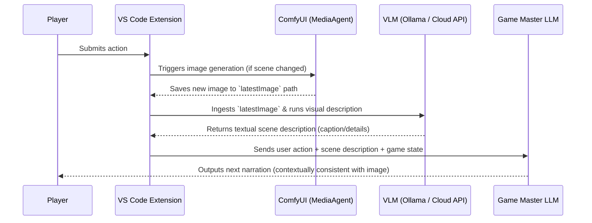

# Phase 4A VLM Integration Design

This document details the architecture and design for integrating Vision-Language Models (VLMs) into the LoreRelay text adventure game pipeline. The goal is to allow the GM (Game Master) to "see" and reference the latest generated image (e.g., from ComfyUI) to maintain visual consistency and narrate the scene with greater accuracy.

---

## 1. Core Workflow & Trigger Timing

The VLM analysis is designed as an asynchronous, optional step in the game loop.



### Call Timing
1. **On Image Generation/Change:** VLM is only invoked when `latestImage` changes or is newly generated.
2. **Every Turn (Optional / Cached):** The VLM does not need to analyze the same image repeatedly. The output text (caption/description) is cached inside the game state (e.g., `game_state.json` under `latestImageDescription` or similar metadata) to avoid redundant VLM calls.
3. **Trigger Threshold:** When a player makes an action that changes the scene (e.g., entering a new location, spawning a monster) and a new image is produced.

---

## 2. gmPromptBuilder.buildVisionContext Extension

To supply the GM with visual context without overflowing the context window with raw image bytes (since the GM model might be a text-only model or we want to save token cost on the main prompt), we compile the visual context into text.

### Implementation Details:
In `src/gmPromptBuilder.ts`, we add a method `buildVisionContext(state: GameState): string`:
- Reads `state.latestImage` (the absolute path to the latest generated image on the local filesystem).
- If a description is already cached in `state.latestImageDescription`, it immediately uses it.
- If not, it invokes the VLM provider interface to describe the image, stores it back in `state.latestImageDescription`, and appends the description to the prompt.

```typescript
export function buildVisionContext(state: GameState): string {
  if (!state.latestImage) {
    return "";
  }
  
  const desc = state.latestImageDescription || "An image representing the current scene.";
  return `
[Visual Context (Current Scene Image)]
The game has generated a visual representation of the current situation. Here is the description of what is depicted in the image:
"${desc}"
Please ensure your next narration aligns with these visual elements (e.g., characters present, background details, mood, colors, and lighting).
`;
}
```

---

## 3. Ollama Vision (Local) vs. Cloud API Configuration Toggle

To accommodate both high-performance local rigs and lighter setups, LoreRelay supports a hybrid VLM provider model:

### Configuration Options (`package.json` Settings):
```json
{
  "textAdventure.vlm.provider": {
    "type": "string",
    "enum": ["disabled", "ollama", "openai", "gemini"],
    "default": "disabled",
    "description": "Select the VLM provider to analyze generated images."
  },
  "textAdventure.vlm.model": {
    "type": "string",
    "default": "llava",
    "description": "VLM Model name (e.g., 'llava' or 'bakllava' for Ollama, 'gpt-4o-mini' for OpenAI, 'gemini-1.5-flash' for Gemini)."
  },
  "textAdventure.vlm.endpoint": {
    "type": "string",
    "default": "http://localhost:11434",
    "description": "Endpoint URL for the VLM provider (used for Ollama or custom local endpoints)."
  }
}
```

### Local VLM (Ollama):
- **Model:** `llava`, `bakllava`, or `moondream`.
- **Payload:** Send base64-encoded image directly to `http://localhost:11434/api/generate` with a system prompt asking for a detailed scene summary: `"Describe what is happening in this image for a fantasy text-adventure GM. Focus on main subjects, environment, mood, and any active details."`

### Cloud VLM (Gemini / OpenAI):
- **Model:** `gemini-1.5-flash` or `gpt-4o-mini`.
- **Payload:** Authenticate via user-provided API keys and send standard multimodal payloads.

---

## 4. Privacy, Cost, and Latency Considerations

| Aspect | Local VLM (Ollama / LLaVA) | Cloud VLM (Gemini / OpenAI) |
| :--- | :--- | :--- |
| **Privacy** | 100% Private. Images and descriptions never leave the local machine. | Images are uploaded to external APIs. |
| **Cost** | Free (GPU electricity only). | Pay-per-token/API call. Very cheap with models like `gemini-1.5-flash`. |
| **Latency** | 2-8 seconds depending on hardware (GPU VRAM / CPU fallback). | 1-3 seconds depending on internet speed and API response time. |
| **Setup Complexity** | High (Requires installing Ollama and downloading large vision model files). | Low (Requires only a valid API key). |

### Recommendations for MVP:
- Default `textAdventure.vlm.provider` to `"disabled"`.
- Support `"ollama"` as the primary target for local-first enthusiasts.
- Offer `"gemini"` as a highly performant and cost-effective fallback.
- Perform VLM description generation in the background (asynchronously) while the game UI waits for the GM prompt to build, displaying a subtle indicator: `"Analyzing scene image..."`.
